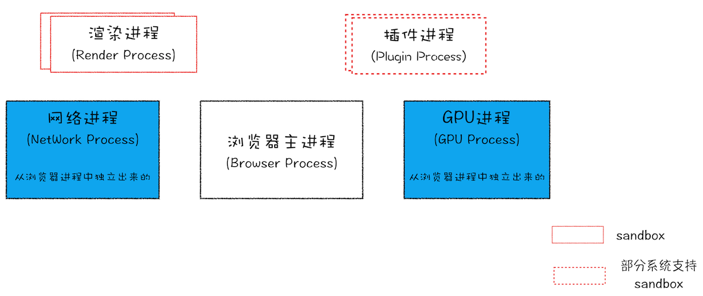
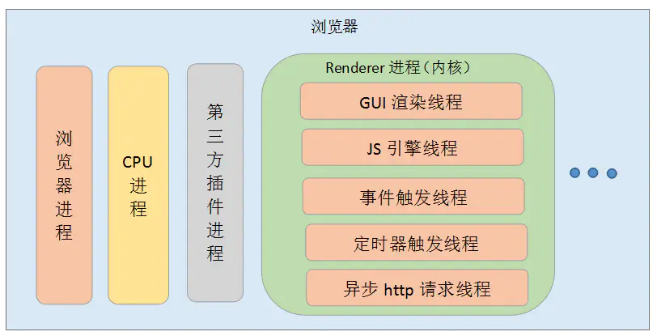
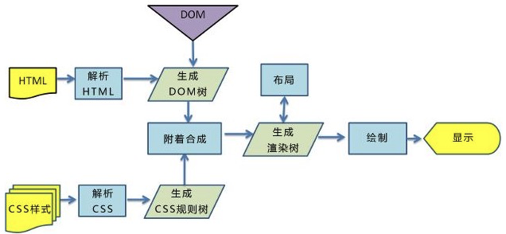
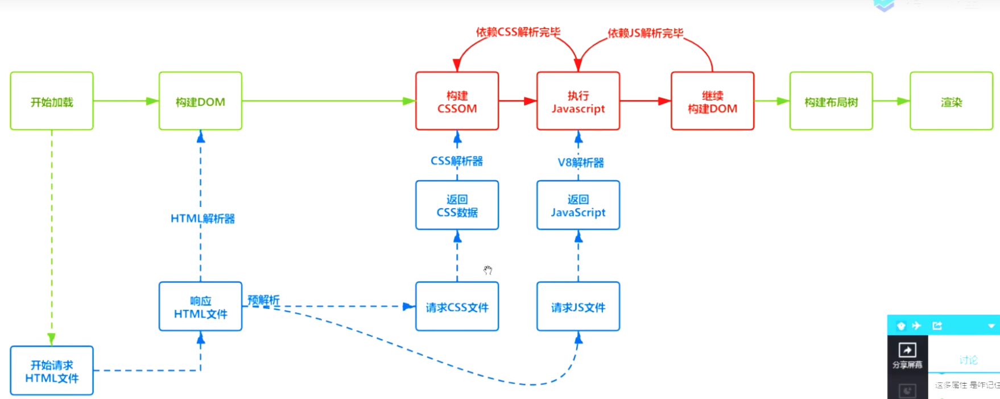
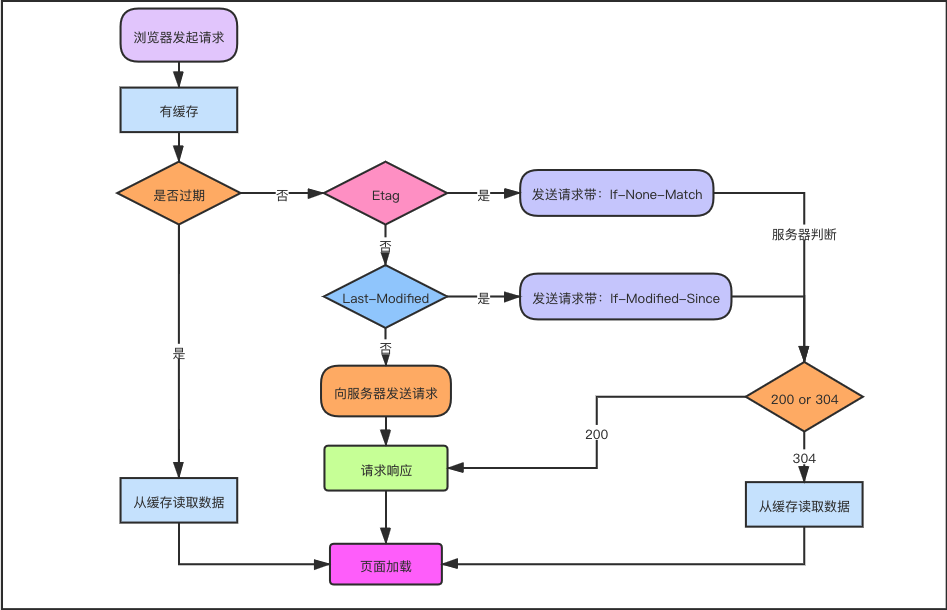

## 浏览器安全

随着互联网的高速发展，信息安全问题已经成为企业最为关注的焦点之一，而前端又是引发企业安全问题的高危据点。在移动互联网时代，前端人员除了传统的 XSS、CSRF 等安全问题之外，又时常遭遇网络劫持、非法调用 Hybrid API 等新型安全问题。当然，浏览器自身也在不断在进化和发展，不断引入 CSP、Same-Site Cookies 等新技术来增强安全性，但是仍存在很多潜在的威胁，这需要前端技术人员不断进行“查漏补缺”。

### 有哪些可能引起前端安全的问题

 `1、跨站脚本 (Cross-Site Scripting, XSS)`: ⼀种代码注⼊⽅式, 为了与 CSS 区分所以被称作 XSS。早期常⻅于⽹络论坛, 起因是⽹站没有对⽤户的输⼊进⾏严格的限制, 使得攻击者可以将脚本上传到帖⼦让其他⼈浏览到有恶意脚本的⻚⾯, 其注⼊⽅式很简单包括但不限于 JavaScript / CSS / Flash 等

`2、跨站点请求伪造（Cross-Site Request Forgeries，CSRF）`: 指攻击者通过设置好的陷阱，强制对已完成认证的⽤户进⾏⾮预期的个⼈信息或设定信息等某些状态更新，属于被动攻击

`3、存储数据问题`
很多开发者为了方便，把一些个人信息不经加密直接存到本地或者cookie，这样是非常不安全的，黑客们可以很容易就拿到用户的信息，所有在放到cookie中的信息或者localStorage里的信息要进行加密，加密可以`己定义一些加密方法`者网上寻找一些`加密的插件`

`4、第三方依赖安全隐患`
现如今的项目开发，很多都喜欢用别人写好的框架，为了方便快捷，很快的就搭建起项目，自己写的代码不到20%，过多的用第三方依赖或者插件，一方面会影响性能问题，另一方面第三方的依赖或者插件存在很多安全性问题，也会存在这样那样的漏洞，所以使用起来得谨慎。

最好是利用一些自动化的工具进行扫描过后再用，比如NSP(Node Security Platform)，Snyk等等。

`5、iframe安全隐患问题`
有时候前端页面为了显示别人的网站或者一些组件的时候，就用iframe来引入进来，比如嵌入一些广告等等。但是有些iframe安全性我们无法去评估测试，有时候会携带一些第三方的插件啊，或者嵌入了一下不安全的脚本啊，这些都是值得我们去考虑的

`6、SQL 注入`攻击者通过向 Web 应用程序提交恶意 SQL 语句，从而在数据库中执行未授权的操作，如删除、修改数据。

`7、文件上传漏洞`攻击者通过向 Web 应用程序上传包含恶意代码的文件，从而实现攻击目的，如窃取用户数据、执行恶意代码等。

  - 检查文件类型：验证文件类型可以防止上传恶意脚本文件等文件类型，建议使用白名单验证方式，只允许上传指定的文件类型。
  - 检查文件大小：限制上传文件大小可以防止攻击者上传过大的文件来消耗服务器资源或存储空间。

`8、点击劫持`攻击者利用一个透明的或者半透明的覆盖层来欺骗用户点击某个区域，从而实现攻击目的。前端开发人员可以使用 X-Frame-Options、Content-Security-Policy 等技术来防范点击劫持。

`9、URL 操作`攻击者可能会利用一些 URL 操作实现攻击目的，如在 URL 中添加恶意代码、篡改 URL 等。前端开发人员可以使用正则表达式和 URL 解析器来防范 URL 操作攻击。

### 什么是 XSS 攻击？

**概念**

XSS 攻击指的是`跨站脚本攻击`(Cross Site Scripting)，恶意攻击者往 Web 页面里插入恶意可执行脚本代码，当用户浏览该网页之时，嵌入其中的脚本代码会被执行，从而可以达到攻击者`盗取用户信息`的目的。

`XSS 的本质：`是因为网站没有对恶意代码进行过滤，与正常的代码混合在一起了，浏览器没有办法分辨哪些脚本是可信的，从而导致了恶意代码的执行。

**攻击目的**

- 窃取cookie信息，通过document.cookie()窃取
- 修改DOM，伪造页面，欺骗用户，获取账号密码等私密信息;
- 在页面内生成浮窗广告，影响用户体验
- 恶意的JS会监听用户行为，比如addEventListener('keydown')，窃取用户信息

**攻击类型**

XSS根据攻击方式和攻击目标可以分为`存储型`、`反射型`和 `DOM 型`

- `存储型`：存储型XSS攻击是一种`持久性攻击`
  - 攻击者通过提交表单等操作将将恶意代码提交到目标网站的数据库中。
  - ⽤户打开⽬标⽹站时，⽹站服务端将恶意代码从数据库取出，拼接到HTML中返回给浏览器。
  - 用户浏览器接收到响应后解析执行，混在其中的恶意代码也被执行。

  这种攻击常用于⽤户保存数据的⽹站功能，如论坛发帖、评论、⽤户私信、上传恶意文件等。因为是存储在数据库中，所以只要访问了这个页面的访客，都有可能执行这段恶意脚本，如果⽹站访问量很⼤的话，就会导致⼤量⽤户都受到攻击。所以说存储型XSS攻击的危害会更大一些。

- `反射型`：反射型XSS攻击是一种`非持久性攻击`

  - 攻击者构造出包含恶意代码的 URL，比如在地址后面传入一个参数或者一个script脚本
  - 用户打开带有恶意代码的 URL 时，服务端会解析出请求参数，拼接到 HTML 中返回给浏览器解析执行

  此类攻击一般出现在网站的搜索栏、跳转等操作。由于需要用户主动打开恶意的 URL 才能生效，攻击者往往会结合一些手段诱导用户点击。`它和存储型 XSS 的区别:` 存储型 XSS 的恶意代码存在数据库⾥，反射型 XSS 的恶意代码存在 URL ⾥。

  ```js
  http://www.example.com/search?q=<script>alert('XSS')</script>
  ```

- `DOM 型`：是一种`非持久性攻击`

  - 攻击者通过表单、URL 参数或其他用户输入方式，将恶意脚本注入到页面中的DOM元素中，并被浏览器执行
  - 它不需要服务器端的解析响应，而是通过浏览器端的DOM解析

  ```text
  // 可被攻击的 DOM 元素 
  <div id="target"></div>

  https://example.com/page?name=<script>
    document.getElementById('target').innerHTML = ''
  </script>
  ```
  
  DOM 型 XSS 跟前两种 XSS 的区别：DOM 型 XSS 攻击中，取出和执⾏恶意代码由浏览器端完成，属于前端JavaScript ⾃身的安全漏洞，⽽其他两种 XSS 都属于服务端的安全漏洞。

  **XSS 有哪些注入的方法**

  - 在 `HTML` 中内嵌的文本中，恶意内容以 `script` 标签形成注入。
  - 在标签的 `href`、`src` 等属性中，包含 `javascript:` 等可执行代码。
  - 在 `onload`、`onerror`、`onclick` 等事件中，注入不受控制代码。
  - 在内联的 JavaScript 中，拼接的数据突破了原本的限制（字符串，变量，方法名等）。
  - 在标签属性中，恶意内容包含引号，从而突破属性值的限制，注入其他属性或者标签。
  - 在 style 属性和标签中，包含类似 background-image:url("javascript:..."); 的代码（新版本浏览器已经可以防范）。
  - 在 style 属性和标签中，包含类似 expression(...) 的 CSS 表达式代码（新版本浏览器已经可以防范）。

  总之，如果开发者没有将用户输入的文本进行合适的过滤，就贸然插入到 HTML 中，这很容易造成注入漏洞。攻击者可以利用漏洞，构造出恶意的代码指令，进而利用恶意代码危害数据安全。

### 如何防御 XSS 攻击？

[美团文章](https://juejin.cn/post/6844903685122703367#heading-13)

关于XSS的防御是非常复杂的，值得幸运的是现代浏览器、前端框架/库已经帮我们做了相当大的一部分工作。像React和Vue内部都有做防范XSS攻击的操作。

**存储型XSS和反射型XSS预防**

`不靠谱方法`

1. 前端过滤输入，然后提交到后端: 一旦攻击者绕过前端过滤，直接构造请求，就可以提交恶意代码了。

  - 编码绕过：攻击者可以使用各种编码方式，如URL编码、HTML编码、JavaScript编码等，来绕过前端过滤。
  - 标签绕过：攻击者可以使用各种标签，如`<iframe>`、`<script>`等，来绕过前端过滤。
  - 事件绕过：攻击者可以使用各种事件，如`onclick`、`onload`等，来绕过前端过滤。
  - 属性绕过：攻击者可以使用各种属性，如`style`、`src`等，来绕过前端过滤

2. 后端在写入数据库前，对输入进行过滤：会引入很大的不确定性和乱码问题。我们并不确定内容要输出到哪里，当 `5 &lt; 7` 作为 HTML 拼接页面时，可以正常显示。当 `5 &lt; 7` 通过 Ajax 返回，然后赋值给 JavaScript 的变量时，前端得到的字符串就是转义后的字符。这个内容不能直接用于 Vue 等模板的展示。在防范 XSS 攻击时应避免此类方法。当然，对于明确的输入类型，例如数字、URL、电话号码、邮件地址等等内容，进行输入过滤还是必要的。

`正确方法`

既然输入过滤并非完全可靠，我们就要通过`防止浏览器执行恶意代码`来防范 XSS。这部分分为两类：

- 防止 HTML 中出现注入。
- 防止 JavaScript 执行时，执行恶意代码

存储型和反射型 XSS 都是在服务端取出恶意代码后，插入到响应 HTML 里的，攻击者刻意编写的数据被内嵌到代码中，被浏览器所执行。

预防这两种漏洞，有两种常见做法

1. `纯前端渲染：`JavaScript 通过 Ajax 加载业务数据，把代码和数据分隔开。在很多内部管理系统中，采用纯前端渲染是非常合适的。但对于性能要求高，或有 SEO 需求的页面，我们仍然要面对拼接 HTML 的问题。
2. `输出转义 HTML：`如果拼接 HTML 是必要的，可以使用成熟的转义库如：`xss-filters`，对 HTML 模板各处插入点进行充分的转义。对于 HTML 转义通常只有一个规则，就是把`·& < > " ' /`这几个字符转义掉，确实能起到一定的 XSS 防护作用，但并不完善

**DOM型XSS预防**

这个本质上，实际上就是网站前端JavaScript代码本身不够严谨，把不可信的数据当作代码执行了。

- 在使用 `.innerHTML`、`.outerHTML`、`document.write()` 时要特别小心，避免把不可信的数据作为 HTML 插到页面上，应尽量使用 `.textContent`、`.setAttribute()` 等。
- 如果用 Vue/React 技术栈，注意使用 `v-html`/`dangerouslySetInnerHTML`功能，就在前端`render`阶段避免`innerHTML`、`outerHTML`的 XSS隐患。
- DOM 中的内联事件监听器，如 `location`、`onclick`、`onerror`、`onload`、`onmouseover` 等，`<a>` 标签的 `href` 属性，JavaScript 的 `eval()`、`setTimeout()`、`setInterval()` 等，都能把字符串作为代码运行。避免不可信的数据拼接到字符串中传递给这些 API

```html
<!-- 内联事件监听器中包含恶意代码 -->


<!-- 链接内包含恶意代码 -->
<a href="UNTRUSTED">1</a>

<script>
// setTimeout()/setInterval() 中调用恶意代码
setTimeout("UNTRUSTED")
setInterval("UNTRUSTED")

// location 调用恶意代码
location.href = 'UNTRUSTED'

// eval() 中调用恶意代码
eval("UNTRUSTED")
</script>
```

**其他预防**

虽然在渲染页面和执行 JavaScript 时，通过谨慎的转义可以防止 XSS 的发生，但完全依靠开发的谨慎仍然是不够的。以下介绍一些通用的方案，可以降低 XSS 带来的风险和后果。

- `使用 CSP` ，CSP 的本质是建立一个白名单，告诉浏览器哪些外部资源可以加载和执行，从而防止恶意代码的注入攻击。我们只需要配置规则，如何拦截由浏览器自己来实现。通常有两种方式来开启 CSP

```js
1. 设置 HTTP Header 中的 Content-Security-Policy
//设值default-src "self"只允许加载本站资源
//设值child-src "none" 允许加载任何来源框架
//设值img-src https://*只允许加载https协议图片
2.设置 meta 标签的方式 <meta http-equiv="Content-Security-Policy">
```

- `cookie设置 - HttpOnly` (设置这个属性之后cookie无法通过js去document.cookie读取)，攻击者完成 XSS 注入后也无法窃取此 Cookie
- `验证码`：防止脚本冒充用户提交危险操作
- `主动检测和发现` 可使用 XSS 攻击字符串和自动扫描工具寻找潜在的 XSS 漏洞。

### 如何检测XSS漏洞

- 浏览器自带的 XSS Auditor

现代浏览器一般都内置了 XSS Auditor 功能，可以自动检测页面中的恶意脚本并阻止其执行。如果浏览器检测到页面中存在恶意脚本，会显示一个警告框提示用户。

- 使用 XSS 攻击检测工具

有很多开源的 XSS 攻击检测工具可用于自动检测 XSS 攻击，如 OWASP ZAP、Burp Suite 等。这些工具可以模拟攻击，并检测是否存在 XSS 漏洞。一般来说，这些工具需要手动配置，以针对特定应用程序进行测试，并生成报告以指导修复漏洞

- 使用自动化测试工具

自动化测试工具可以模拟用户输入和操作，从而检测是否存在 XSS 漏洞。一些自动化测试工具也可以自动扫描和检测 XSS 漏洞，如 Selenium、PhantomJS 等。

- 使用 Web 应用防火墙（WAF）

Web 应用防火墙是一种在 Web 服务器和应用程序之间的网络安全设备，可用于监控和过滤 HTTP 流量，并检测和防御 XSS 攻击。WAF 可以检测恶意脚本并拦截其执行。

### 什么是 CSRF 攻击？

**概念**

CSRF 攻击指的是`跨站请求伪造攻击`，攻击者诱导受害者进入第三方网站，在第三方网站中，向被攻击网站发送跨站请求。利用受害者在被攻击网站已经获取的注册凭证，绕过后台的用户验证，达到冒充用户对被攻击的网站执行某项操作的目的。

CSRF 攻击的`本质`是利用 cookie 会在同源请求中携带发送给服务器的特点，以此来实现用户的冒充

**攻击步骤**

- 用户登录`a.com`，并保留了登录凭证（Cookie）。
- 攻击者通过电子邮件、社交媒体等方式引诱用户访问了恶意网站`b.com`
- 恶意网站向用户登录的网站发送了一个请求如：`a.com/act=xx`，由于同源请求会携带cookie
- 用户登录的网站接收到请求后，对请求进行验证，并确认是用户的凭证，误以为是用户自己发送的请求，会执行`act=xx`
- 攻击完成，攻击者在用户不知情的情况下，冒充用户，让用户登录的网站执行了自己定义的操作。这些请求可能包括转账、删除帐户等敏感操作


**攻击类型**

常见的 CSRF 攻击有三种：

- GET 类型的 CSRF 攻击，比如在网站中的一个 img 标签里构建一个请求，当用户打开这个网站的时候就会自动加载 img 发起提交。在受害者访问含有这个img的页面后，浏览器会自动向`http://bank.example/withdraw?account=xiaoming&amount=10000&for=hacker`发出一次HTTP请求。`bank.example`就会收到包含受害者登录信息的一次跨域请求。

  ```html
    
  ```

- POST 类型的 CSRF 攻击，比如构建一个隐藏的表单，当用户进入页面时，自动提交这个表单，相当于模拟用户完成了一次POST操作。

```html
 <form action="http://bank.example/withdraw" method=POST>
    <input type="hidden" name="account" value="xiaoming" />
    <input type="hidden" name="amount" value="10000" />
    <input type="hidden" name="for" value="hacker" />
</form>
<script> document.forms[0].submit(); </script> 
```

- 链接类型的 CSRF 攻击，比如在 a 标签的 href 属性里构建一个请求，然后诱导用户去点击。比起其他两种用户打开页面就中招的情况，这种需要用户点击链接才会触发。这种类型通常是在论坛中发布的图片中嵌入恶意链接，或者以广告的形式诱导用户中招

```html
  <a href="http://test.com/csrf/withdraw.php?amount=1000&for=hacker" taget="_blank">
  重磅消息！！
  <a/>
```

### 如何防御 CSRF 攻击？

[美团文章](https://juejin.cn/post/6844903689702866952#heading-9)

CSRF通常从第三方网站发起，被攻击的网站无法防止攻击发生，只能通过增强自己网站针对CSRF的防护能力来提升安全性。我们知道CSRF的特点：

  - CSRF（通常）发生在第三方域名。
  - CSRF攻击者不能获取到Cookie等信息，只是使用。

针对这两点，我们可以专门制定防护策略，如下：

- 阻止不明外域的访问: `同源检测`、`Samesite Cookie`
- 提交时要求附加本域才能获取的信息: `CSRF Token`

**(1) 同源检测**

在服务器端检查请求头中的 `origin` / `Referer` 字段，确保请求来自同源或者来自于合法的来源

- `origin`

origin字段内包含请求的域名（不包含path及query），如果Origin存在，那么直接使用Origin中的字段确认来源域名就可以，但是Origin在以下两种情况下并不存在：

  1. IE11同源策略： IE 11 不会在跨站CORS请求上添加Origin标头，Referer头将仍然是唯一的标识。最根本原因是因为IE 11对同源的定义和其他浏览器有不同
  2. 302重定向： 在302重定向之后Origin不包含在重定向的请求中，因为Origin可能会被认为是其他来源的敏感信息。对于302重定向的情况来说都是定向到新的服务器上的URL，因此浏览器不想将Origin泄漏到新的服务器上。

- `Referer`

在部分情况下，攻击者可以隐藏，甚至修改自己请求的Referer

```html
  
```

如果 `Origin` 和 `Referer` 都不存在，建议直接进行阻止，特别是如果您没有使用随机CSRF Token（参考下方）作为第二次检查。

另外，CSRF大多数情况下来自第三方域名，但并不能排除本域发起。如果攻击者有权限在本域发布评论（含链接、图片等，统称UGC），那么它可以直接在本域发起攻击，这种情况下同源策略无法达到防护的作用。

综上所述：同源验证是一个相对简单的防范方法，能够防范绝大多数的CSRF攻击。但这并不是万无一失的，对于安全性要求较高，或者有较多用户输入内容的网站，我们就要对关键的接口做额外的防护措施。

**(2) 设置Samesite**

服务器端设置响应头的 `Set-Cookie` 字段来指定 `SameSite` 的值，可以限制 `Cookie` 在跨域请求中的发送。这样即使攻击者成功构造了一个跨域请求，由于 `SameSite` 的限制，浏览器不会发送与该站点关联的 `Cookie`，从而阻止了攻击。

  - Samesite=`Strict`： 浏览器在任何跨域请求中都不会携带`Cookie`，新标签重新打开也不携带，所以说CSRF攻击基本没有机会。但是跳转子域名或者是新标签重新打开刚登陆的网站，之前的Cookie都不会存在。尤其是有登录的网站，那么我们新打开一个标签进入，或者跳转到子域名的网站，都需要重新登录。对于用户来讲，可能体验不会很好。
  - Samesite=`Lax`默认值： 其他网站通过页面跳转过来的时候可以使用Cookie，可以保障外域连接打开页面时用户的登录状态。但其安全性也比较低
  - SameSite=`None`：Cookie 可以随着跨域请求发送。这个设置用于允许在跨域上下文中使用 Cookie，并且需要同时配合 Secure 属性，即只能在通过 HTTPS 连接发送请求时发送。

  另外一个问题是Samesite的兼容性不是很好，现阶段除了从新版Chrome和Firefox支持以外，Safari以及iOS Safari都还不支持，现阶段看来暂时还不能普及。总之，Samesite Cookie是一个可能替代同源验证的方案，但目前还并不成熟，其应用场景有待观望。

  ```js
  Set-Cookie: foo=1; Samesite=Strict
  Set-Cookie: bar=2; Samesite=Lax
  Set-Cookie: baz=3
  ```

**(3) CSRF Token**

CSRF攻击之所以能够成功，是因为服务器误把攻击者发送的请求当成了用户自己的请求。那么我们可以要求所有的用户请求都携带一个CSRF攻击者无法获取到的Token。服务器通过校验请求是否携带正确的Token，来把正常的请求和攻击的请求区分开，也可以防范CSRF的攻击。

 1. 用户登录成功的时候，服务器需要给这个用户生成一个Token，该Token通过加密算法对数据进行加密，一般Token都包括随机字符串和时间戳的组合，存在服务器的Session中
 2. 前端每次发送请求的时候携带上token，服务器需要判断Token的有效性，验证过程是先解密Token，对比加密字符串以及时间戳，如果加密字符串一致且时间未过期，那么这个Token就是有效的。

**(4) 限制敏感操作**

对于一些敏感的操作，如修改密码、转账等，需要用户经过额外的身份验证，如输入密码或提供验证码等。

### CSRF与 XSS 区别

通常来说 CSRF 是由 XSS 实现的，CSRF 时常也被称为 XSRF（CSRF 实现的方式还可以是直接通过命令行发起请求等）。
本质上讲，XSS 是代码注入问题，CSRF 是 HTTP 问题。 XSS 是内容没有过滤导致浏览器将攻击者的输入当代码执行。CSRF 则是因为浏览器在发送 HTTP 请求时候自动带上 cookie，而一般网站的 session 都存在 cookie里面(Token验证可以避免)。

### 什么是中间人攻击？如何防范？

中间⼈攻击: 是指攻击者将自己插入到浏览器和服务器之间，客户端、服务端之间的信息都会经过中间人，中间人可以获取和篡改两者的信息

**攻击过程**

1. 攻击者拦截通信双方的通信流量，篡改通信内容或截获敏感信息。
2. 攻击者伪造一个与目标通信方通信的假身份。
3. 目标通信方误以为与合法通信方通信，向攻击者提供了机密信息。
4. 攻击者可以利用这些机密信息来盗取账户信息、进行欺诈等不法行为。

**防范**

1. 使用加密协议：使用加密通信协议如HTTPS，可以加密数据的传输，使攻击者无法轻易获取通信内容。
2. 使用加密算法对敏感数据进行加密: HTTPS 虽然可以防止数据在网络传输过程中被劫持，但是在发送 HTTPS 之前，数据还是可以从谷歌插件中泄露出去。因为谷歌插件可以捕获 Network 中的所有请求，所以如果某些插件中有恶意的代码还是可以获取到用户信息的

### 什么是点击劫持攻击？如何防范？

点击劫持是一种视觉欺骗的攻击手段。攻击者将需要攻击的网站通过 `iframe` 嵌套的方式嵌入自己的网页中，并将 iframe 设置为透明，在页面中透出一个按钮诱导用户点击。当用户点击按钮时，实际上是在点击被嵌套的网站上的按钮，从而达到攻击的目的。

**防范**

- 在HTTP头中加入 `X-FRAME-OPTIONS` 属性，此属性控制页面是否可被嵌入 iframe 中

  - DENY：不能被所有网站嵌套或加载；
  - SAMEORIGIN：只能被同域网站嵌套或加载；
  - ALLOW-FROM URL：可以被指定网站嵌套或加载。

### 网络劫持有哪几种，如何防范？

`DNS劫持:` (输⼊京东被强制跳转到淘宝这就属于dns劫持)

攻击者可以通过劫持 DNS 响应，将用户重定向到不安全的站点。当用户在浏览器中输入 URL 时，浏览器会发送 DNS 查询请求，以获取该域名的 IP 地址。攻击者可以拦截这些请求，并返回他们自己的 IP 地址，将用户重定向到不安全的站点

- 采用 DNSSEC：DNSSEC 可以确保 DNS 查询和响应的安全，防止 DNS 劫持攻击。DNSSEC 通过数字签名和公钥加密技术，防止 DNS 响应被篡改。

`HTTP劫持:` (访问⾕歌但是⼀直有贪玩蓝⽉的⼴告)

攻击者可以通过中间人攻击或恶意软件，在用户与 Web 服务器之间插入自己的代理，从而篡改原始的网络流量。

- DNS劫持由于涉嫌违法，已经被监管起来，现在很少会有DNS劫持，⽽http劫持依然⾮常盛⾏，最有效的办法就是全站HTTPS，将HTTP加密，这使得运营商⽆法获取明⽂，就⽆法劫持你的响应内容。
- 使用二次验证：使用二次验证可以增强账户的安全性，防止黑客通过窃取账户信息来劫持用户的网络流量。例如，通过短信验证码或身份验证器应用程序等方式来验证用户身份

### 加密技术有哪些

1. 对称加密：采用对称密码编码技术，加/解密使用相同密钥进行，效率较高。常见对称加密有DES、3DES、Blowfish、IDEA、RC4、RC5、RC6和AES等，这里选用AES实现。对称加密的优点是速度快、加密效率高，缺点是密钥管理困难。
2. 非对称加密：使用公钥和私钥对数据进行加密和解密。常见的非对称加密算法包括 RSA、DSA、ECC 等。非对称加密的优点是密钥管理方便、加密强度高，缺点是加密速度慢。
3. 哈希加密：将数据转换为固定长度的哈希值，不可逆。常见的哈希加密算法包括 MD5、SHA-1、SHA-256 等。哈希加密的优点是加密速度快、不可逆，缺点是可能存在哈希碰撞。基于哈希算法的特性，其适用于该场景：被保护数据仅仅用作比较验证且不需要还原成明文形式。
4. 消息摘要：消息摘要是将数据转换为固定长度的摘要，具有不可逆、完整性验证等特点。常见的消息摘要算法包括 HMAC、SHA-1、SHA-256 等。消息摘要的优点是安全性高、数据完整性可验证，缺点是无法恢复原始数据。

在实际应用中，常见的加密方式是混合使用多种加密算法。例如，在 HTTPS 协议中，会采用对称加密和非对称加密相结合的方式进行数据加密。前端加密的目的是为了保护数据在传输过程中的安全性，但是要注意加密算法的选择、密钥管理、加密强度等问题，以免加密失效或者被攻击者破解。

## 进程与线程

### 进程与线程的概念

浏览器进程和线程是浏览器中用于执行和管理任务的核心。

**进程**

进程就是程序运行的实例，操作系统会为进程创建独立的内存，用来存放运行所需的代码和数据。浏览器通常是多进程的，每个标签页通常会运行在独立的进程中，每个进程拥有自己的内存空间和系统资源。这样做的好处是可以提高浏览器的稳定性和安全性，因为即使一个进程崩溃，其他进程仍然可以正常工作。虽然每个进程只能访问系统分配给自己的资源，但可以通弄过 `IPC` 机制进行进程间通信。

进程所占用的资源会在其关闭后由操作系统回收，即使进程中存在某个线程产生的内存泄露，当进程退出时相关的内存资源也会被回收。线程之间可以共享所属进程的数据。

**线程**

线程是进程中的执行单元，负责执行具体的任务，每个进程至少有一个主线程及可能的若干子线程，这些线程由所需的进程进行启动和管理。在浏览器中，由于多个线程可以共享同一个进程所分配的资源，所以多线程的并行处理能有效提高程序的运行效率。

早期浏览器都是单进程的，只要一个线程崩溃就会导致整个进程崩溃。后来Chrome推出了多进程浏览器，一个浏览器只有一个主进程，负责菜单栏，标题栏等页面显示，文件访问，前进后退以及子进程管理。除主进程外还有GPU进程，插件进程，网络进程，渲染进程。

**Chrome浏览器的架构图**

最新的 Chrome 浏览器包括：1 个浏览器主进程、1 个 GPU 进程、1 个网络进程、多个渲染进程、多个插件进程



- **浏览器进程**：管理浏览器窗口、菜单栏、书签栏等浏览器的主要界面元素，并处理用户的输入、子进程管理，同时提供存储等功能。
- **GPU 进程**：负责处理页面中与 GPU 相关的任务，如硬件加速、图形渲染等。使用 GPU 进程可以加速图形操作，提高页面的渲染性能。
- **网络进程**：负责处理网络请求和响应，包括 DNS 解析、建立连接、发送和接收数据等。之前是作为一个模块运行在浏览器进程里面的，后来独立出来，成为一个单独的进程。
- **渲染进程**：渲染进程也称为浏览器内核，核心任务是将 HTML、CSS 和 JavaScript 转换为网页，默认情况下，Chrome 会为每个 Tab 标签创建一个渲染进程。
- **插件进程**：用于加载和运行浏览器插件，如 Flash 插件、PDF 阅读器等，因插件易崩溃，所以需要通过插件进程来隔离，以保证插件进程崩溃不会对浏览器和页面造成影响。

所以，打开一个网页，最少需要四个进程：1 个网络进程、1 个浏览器进程、1 个 GPU 进程以及 1 个渲染进程。如果打开的页面有运行插件的话，还需要再加上 1 个插件进程

### 浏览器渲染进程的线程有哪些

浏览器的渲染进程的主要线程：



**（1）GUI渲染线程**

负责渲染浏览器页面，解析HTML、CSS，构建DOM树、构建CSSOM树、构建渲染树、布局和绘制页面

**（2）JS引擎线程（主线程）**

JS引擎线程也称为JS内核，负责解析Javascript脚本，运行代码；JS引擎线程一直等待着任务队列中任务的到来，然后加以处理，一个Tab页中无论什么时候都只有一个JS引擎线程在运行JS程序；常见的 JavaScript 引擎有 `V8（Chrome）`、`SpiderMonkey（Firefox）` 和 `JavaScriptCore（Safari）`等。

`注意`：GUI渲染线程和JS引擎线程是互斥的，当JS引擎线程执行时，GUI渲染线程会被挂起。这是因为JavaScript是可操纵DOM的，如果在修改这些元素属性同时渲染界面（即JS线程和UI线程同时运行），那么渲染线程前后获得的元素数据就可能不一致了。所以如果JS执行的时间过长，会导致页面渲染加载阻塞。

**（3）事件触发线程**

事件触发线程属于浏览器而不是JS引擎，用来控制事件循环；当JS引擎执行代码块如 `setTimeOut` 时（也可是来自浏览器内核的其他线程,如鼠标点击、AJAX异步请求等），会将对应任务添加到事件触发线程中；当对应的事件符合触发条件被触发时，该线程会把事件添加到待处理队列的队尾，等待JS引擎的处理；

注意：由于JS的单线程关系，所以这些待处理队列中的事件都得排队等待JS引擎处理（当JS引擎空闲时才会去执行）；

**（4）定时器触发线程**

即 `setInterval` 与 `setTimeout` 所在线程；浏览器定时计数器并不是由JS引擎计数的，因为JS引擎是单线程的，如果处于阻塞线程状态就会影响记计时的准确性；因此使用定时器触发来计时定时器，计时完毕后，添加到事件队列中，等待JS引擎空闲后执行，所以定时器中的任务在设定的时间点不一定能够准时执行，定时器只是在指定时间点将任务添加到事件队列中；

注意：W3C在HTML标准中规定，定时器的定时时间不能小于4ms，如果是小于4ms，则默认为4ms。

**（5）异步http请求线程**

应该被隔离到了网络进程中。用于检测XMLHttpRequest请求，当请求状态改变时，将设置的回调函数添加到消息队列中等待执行。

**（6）合成线程**

将图层合成位图，并将其绘制到内存或者GPU中

**（7）IO线程**

负责处理文件读写、数据库操作、IPC等

### 进程之间的通信方式（了解）

**（1）管道通信**

管道是一种半双工的通信方式，用于在父子进程或兄弟进程之间传递数据。其中一个进程作为写入端，将数据写入管道；另一个进程作为读取端，从管道中读取数据。管道的数据传输是有序的，但只能在具有亲缘关系的进程之间使用。

**（2）消息队列通信**

消息队列是一种在进程之间传递数据的方式，通过将数据放入队列中，其他进程可以从队列中读取数据。消息队列可以实现进程间的异步通信，并且不需要亲缘关系。

**（3）信号量通信**

信号量用于实现进程之间的同步和互斥操作。它可以用来表示资源的可用性或控制进程的访问顺序。通过对信号量进行 P（等待）和 V（发信号）操作，进程可以协调共享资源的访问。

**（4）信号通信**

信号（Signals ）是Unix系统中使用的最古老的进程间通信的方法之一。操作系统通过信号来通知进程系统中发生了某种预先规定好的事件（一组事件中的一个），它也是用户进程之间通信和同步的一种原始机制。

**（5）共享内存通信**

共享内存是一种高效的进程通信方式，它允许多个进程共享同一块内存区域。进程可以直接读写共享内存，避免了数据复制的开销。为了保证数据的一致性和互斥访问，通常需要配合信号量等同步机制使用。

**（6）套接字通信**

：套接字是一种网络编程中常用的通信方式，它可以在不同主机上的进程之间进行通信。套接字提供了一种基于网络的进程间通信机制，可以通过 IP 地址和端口号进行标识。

### 浏览器内多个标签页之间的通信?

- 使用共享存储：浏览器提供了一些共享存储机制，如LocalStorage、SessionStorage和IndexedDB。通过将数据存储在这些共享存储中，不同标签页可以读取和写入这些数据，实现数据的共享和通信。

- 使用Broadcast Channel API：Broadcast Channel API 是 HTML5 中提供的一种通信机制，它可以在不同标签页之间进行消息广播。通过创建一个 Broadcast Channel，不同标签页可以通过该通道发送和接收消息，实现标签页之间的实时通信。

- 使用Web Sockets：Web Sockets 是一种全双工通信协议，可以在浏览器和服务器之间建立持久的连接。通过建立一个 WebSocket 连接，不同标签页可以通过该连接发送和接收消息，实现实时通信和数据共享。

- 使用SharedWorker：SharedWorker 是一个可以被多个浏览器上下文共享的后台线程，不同标签页可以通过 SharedWorker 进行通信。通过与 SharedWorker 建立连接，不同标签页可以通过该连接发送和接收消息，实现标签页之间的通信和协作。

- 使用postMessage API：postMessage 是一种跨窗口通信的机制，通过它可以在不同的浏览器上下文之间发送消息。不同标签页可以使用 postMessage 方法发送消息，并通过监听 message 事件接收消息，实现标签页之间的通信和数据传递。

需要注意的是，由于安全限制，不同标签页之间的通信通常受到同源策略的限制。这意味着只有在相同的协议、域名和端口下的标签页之间才能进行通信。如果需要在不同源的标签页之间进行通信，可以通过使用消息中转服务器或者跨域通信技术（如CORS）来实现。

### 对Service Worker的理解

Service Worker 是运行在浏览器背后的**独立线程**，一般可以用来实现缓存功能。使用 Service Worker的话，传输协议必须为 **HTTPS**。因为 Service Worker 中涉及到请求拦截，所以必须使用 HTTPS 协议来保障安全。

Service Worker 实现缓存功能一般分为三个步骤：首先需要先注册 Service Worker，然后监听到 `install` 事件以后就可以缓存需要的文件，那么在下次用户访问的时候就可以通过拦截请求的方式查询是否存在缓存，存在缓存的话就可以直接读取缓存文件，否则就去请求数据。以下是这个步骤的实现：

```js
// index.js
if (navigator.serviceWorker) {
  navigator.serviceWorker
    .register('sw.js')
    .then(function(registration) {
      console.log('service worker 注册成功')
    })
    .catch(function(err) {
      console.log('servcie worker 注册失败')
    })
}
// sw.js
// 监听 `install` 事件，回调中缓存所需文件
self.addEventListener('install', e => {
  e.waitUntil(
    caches.open('my-cache').then(function(cache) {
      return cache.addAll(['./index.html', './index.js'])
    })
  )
})
// 拦截所有请求事件
// 如果缓存中已经有请求的数据就直接用缓存，否则去请求数据
self.addEventListener('fetch', e => {
  e.respondWith(
    caches.match(e.request).then(function(response) {
      if (response) {
        return response
      }
      console.log('fetch source')
    })
  )
})
```

打开页面，可以在开发者工具中的 `Application` 看到 Service Worker 已经启动了：


在 Cache 中也可以发现所需的文件已被缓存：


## 浏览器组成

### 对浏览器的理解

浏览器的主要功能是将用户选择的 web 资源呈现出来，资源的格式通常是 HTML，也包括 PDF、image 及其他格式。用户用 URI 来指定所请求资源的位置。

- shell 是指浏览器的外壳：例如菜单，工具栏等。主要是提供给用户界面操作，参数设置等等。它是调用内核来实现各种功能的。
- 内核是浏览器的核心。内核是基于标记语言显示内容的程序或模块。

### 对浏览器内核的理解

浏览器内核主要分成两部分：

- `渲染引擎`的职责就是渲染，即在浏览器窗口中显示所请求的内容。默认情况下，渲染引擎可以显示 html、xml 文档及图片，它也可以借助插件显示其他类型数据，例如使用 PDF 阅读器插件，可以显示 PDF 格式。
- `JS 引擎`：解析和执行 javascript 来实现网页的动态效果。

最开始渲染引擎和 JS 引擎并没有区分的很明确，后来 JS 引擎越来越独立，内核就倾向于只指渲染引擎。

### 常见的浏览器内核比较

- **Trident：** 这种浏览器内核是 `IE 浏览器用的内核`，因为在早期 IE 占有大量的市场份额，所以这种内核比较流行，以前有很多网页也是根据这个内核的标准来编写的，但是实际上这个内核对真正的网页标准支持不是很好。但是由于 IE 的高市场占有率，微软也很长时间没有更新 Trident 内核，就导致了 Trident 内核和 W3C 标准脱节。还有就是 Trident 内核的大量 Bug 等安全问题没有得到解决
- **Gecko：** 这是`Firefox 采用的内核`，这个内核的优点就是功能强大、丰富，可以支持很多复杂网页效果和浏览器扩展接口，但是代价是也显而易见就是要消耗很多的资源，比如内存。
- **Presto：** `Opera 曾经采用的就是 Presto 内核`，Presto 内核被称为公认的浏览网页速度最快的内核，这得益于它在开发时的天生优势，在处理 JS 脚本等脚本语言时，会比其他的内核快3倍左右，缺点就是为了达到很快的速度而丢掉了一部分网页兼容性。
- **Webkit：** `Webkit 是 Safari 采用的内核`，它的优点就是网页浏览速度较快，虽然不及 Presto 但是也胜于 Gecko 和 Trident，缺点是对于网页代码的容错性不高，也就是说对网页代码的兼容性较低，会使一些编写不标准的网页无法正确显示。
- **Blink：** 谷歌在 Chromium Blog 上发表博客，称将与苹果的开源浏览器核心 Webkit 分道扬镳，在 Chromium 项目中研发 Blink 渲染引擎（即浏览器核心），内置于 Chrome 浏览器之中。其实 `Blink 引擎就是 Webkit 的一个分支`，Blink 引擎现在是`谷歌公司与 Opera Software`共同研发，上面提到过的，Opera 弃用了自己的 Presto 内核，加入 Google 阵营，跟随谷歌一起研发 Blink。

### 常见浏览器所用内核

- IE：Trident
- Firefox：Gecko
- Safari: Webkit
- Chrome/opera/edge：Blink

## 浏览器渲染原理

### 输入一个 URL 到浏览器完成渲染的过程

**发起url请求阶段**

- **`URL解析`**

浏览器对输入内容进行解析，判断用户输入的是正确的 `URL` 还是搜索内容，如果是搜索内容会先合成 `URL`再进行加载

- **`构建请求行`**

浏览器进程首先会构建请求行信息，来指定请求的方法、资源路径和HTTP协议的版本，然后通过进程间通信IPC将 `URL请求` 发送给网络进程。

- **`查找本地缓存`**

网络进程获取到 `URL` 之后，会先去本地缓存(强缓存和协商缓存)，如果命中缓存，则直接将缓存资源返回给渲染进程进行渲染，否则进入网络请求阶段。

**网络请求阶段**

- **`DNS解析`**

`DNS` 解析是将域名转换为对应的 `IP` 地址的过程。DNS 解析方案是 先查缓存，再递归解析

- 搜索浏览器自带的DNS缓存
- 查询操作系统缓存和 /etc/hosts本地文件
- 查询路由器中的DNS缓存
- 向根服务器发送递归查找，从 根域名服务器 > 顶级域名服务器 > 权威域名(主域名)服务器 > 本地域名服务器 依次递归查找
- 解析得到的结果保存到缓存，以备下一次使用

- **`网络模型`**

在通过DNS解析到目标服务器IP地址后，就可以建立网络连接进行资源的访问。在这个过程中涉及到网络架构模型，国际标准化组织提出了一些网络架构的模型，OSI、TCP/IP。

OSI是七层架构，包括应用层，表示层，会话层，传输层，网络层，数据链路层，物理层。TCP/IP简化到了四层，应用层，传输层，网络层，数据链路层。同样每一层慢了对性能都有影响。

- **`建立TCP连接`**

http有个机制，同一个域名同时最多只能建立 `2-8个TCP` 连接，如果超过这个数量的连接必须要进入排队等待状态。否则通过TCP三次握手与服务器建立连接，然后进行数据传输。

- **`发起HTTP请求`**

当TCP链接建立好以后，便可通过 `HTTP` 等协议进行前后端的通信。如果是 `HTTPS` 还需要建立 `TLS` 连接。浏览器首先会向服务器发送请求行、请求头、请求体信息，告诉服务器一些浏览器的相关信息，比如请求域名、Cookie等信息。但在实际的应用中，并非浏览器与确定 `IP` 地址的服务器之间直接通信，往往会在中间加入反向代理服务器。

- **`反向代理服务器`**

反向代理服务器根据客户的请求，从后端服务器上获取资源后提供给客户端，反向代理通过会做下面一些事，比如负载均衡，安全防火墙，加密及SSL加速，数据压缩，解决跨域，静态资源缓存。

- **`服务器处理请求`**

服务器收到经过反向代理服务器处理的请求后，进行验证处理，后台会以一个HTTP响应数据包（响应行、响应头、响应体）的形式发送给浏览器，解说此次请求。

**`断开TCP连接`**

数据传输完成后，若非长连接，TCP通过四次挥手来断开连接。持久连接可复用信道(keep-alive/webSocker)，减少请求握手、挥手过程

**准备渲染进程阶段**

- 网络进程将获取的数据进行解析，根据响应头中的Content-type来判断响应数据的类型，如果是字节流类型，就将该请求交给下载管理器去下载，如果是text/html类型，就通知浏览器进程获取到的是HTML，准备渲染进程。

- 渲染进程准备好之后，浏览器会发出提交文档的消息给渲染进程，渲染进程收到消息后，会和网络进程建立数据传输的管道，文档数据传输完成后，渲染进程会返回确认提交的消息给浏览器进程。

- 浏览器收到确认提交的消息后，会更新浏览器的页面状态，包括了安全状态，地址栏的URL，前进后退的历史状态，并更新web页面为空白。

**页面渲染阶段**

见下面

`哪些阶段可以优化？`

1. 优化DNS查询：DNS预解析
2. 优化TCP连接：可以通过请求头keep-alive来优化。
3. 优化HTTP响应报文：通过CDN和Gzip压缩。

### 浏览器渲染过程/关键渲染路径

浏览器收到数据后，浏览器就会进行html文件的下载，解析HTML的头部代码，下载头部代码中的样式资源文件或脚本资源文件。

**构建DOM树**

解析HTML构建DOM树。DOM树的构建是逐行进行的，先构建document节点，然后逐级往下构建。在HTML解析过程中如果遇到script标签，就会暂停HTML标签的解析，去解析和执行JS，JS代码全部执行完成之后，才会继续解析html。这是因为JS代码执行的过程可能会修改DOM树，所以DOM树的生成必须暂停，这就是JS会阻塞html解析的原因。

**构建CSSOM树**

构建CSSOM并不需要等待所有DOM都构建完毕。而是在解析HTML构建DOM时，若遇见`style`、`link`、`行内样式`等CSS样式会立刻构建CSSOM。即DOM 和 CSSOM 是并行构建的，因为下载和解析CSS是在预解析线程中进行的，所以CSS并不会阻塞html的解析

不过进入下一个构建渲染树阶段必须要等待CSSOM构建完毕后才能进行。因为CSS的每个属性都可以改变CSSOM，所以会存在这样一个问题：假设前面几个字节的CSS将字体大小设置为16px，后面又将字体大小设置为14px，那么如果不把整个CSSOM构建完整，最终得到的CSSOM其实是不准确的。所以必须等CSSOM构建完毕才能进入到下一个阶段，哪怕DOM已经构建完，它也得等CSSOM，然后才能进入下一个阶段。所以，CSSOM 会阻塞渲染，只有当 CSSOM 构建完毕后才会进入下一个阶段构建渲染树。

CSS的加载速度与构建CSSOM的速度将直接影响首屏渲染速度。因为浏览器的渲染需要 render tree， render tree 需要 CSSOM 树才行，所以样式表的加载是会阻塞页面的渲染的，如果有一个外部的样式表处于下载中，那么即使 HTML 已经下载完毕，也会等待外部样式表下载并解析完毕才会开始构建 render tree。所以CSS 放头部，可以提高页面的性能。早构建早渲染。

**构建渲染(render)树**

通过遍历DOM树和CSSOM规则树，构造渲染树，渲染树包含了所有需要渲染的元素以及其样式信息。设置了`display： none` 的元素不会出现在渲染树上，伪元素会出现在渲染树上。

**布局(layout)**

浏览器会跟渲染树的每个节点都具有位置和尺寸信息，会进行布局计算，确定每个节点在页面中的准确位置

**绘制（paint）**

浏览器使用计算好的布局信息将渲染树中的元素绘制到屏幕上。这个过程涉及将元素转换为像素并进行填充、描边、渐变等绘制操作。这一过程包含栅格化和合成。



### JS 和 CSS 如何阻塞文档解析



**JS**

JavaScript 的加载、解析与执行会阻塞文档的解析。也就是说，在构建 DOM 树时，HTML 解析器若遇到了 不带 defer 或 async 属性的 script 标签时，那么它会暂停文档的解析，将控制权移交给 JavaScript 引擎，等 JavaScript 引擎运行完毕，渲染线程再继续解析文档。因为浏览器并不知道JS的执行是否会改变当前页面的DOM结构，如果JS代码中含有DOM修改的代码，那之前的解析就没有意义了，所以浏览器会先解析执行完JS，在继续解析DOM。

为了避免JavaScript阻塞DOM解析和提高页面的渲染性能，常见的做法是将JavaScript代码放在页面底部或使用异步加载的方式，例如将`<script>`标签添加 `async`或 `defer` 属性，以使JavaScript在页面加载和渲染完成后再执行。这样可以确保页面的内容能够尽早显示给用户，并提高用户体验。

**CSS**

正常情况下: 样式表不会改变 DOM 树，CSS 不会阻塞 DOM 的解析，但会阻塞 DOM 渲染，因为生成渲染树需要CSSOM构建完成。所以CSS 放头部，可以早构建早渲染，提高页面的性能。

另外情况： JavaScript 脚本执行时可能请求样式信息，所以如果浏览器尚未完成 CSSOM 和构建，而我们却想在此时运行脚本，那么浏览器将延迟 JavaScript 脚本执行和文档的解析，直至其完成 CSSOM 的下载和构建。也就是说，在这种情况下，浏览器会先下载和构建 CSSOM，然后再执行 JavaScript，最后再继续文档的解析。

### defer 和 sync 的作用

defer 和 async 属性都是异步去加载外部的 JS 脚本文件，它们都不会阻塞DOM的解析，其区别如下：


**执行时机不同**

- `defer`脚本会被异步加载，但会延迟执行。在页面完全解析和渲染完成后再执行。
- `async`脚本会异步加载，并且在加载完成后立即执行。如果在脚本加载完之前，文档的还没有解析结束，那么脚本执行会阻塞后续DOM的解析

**多个执行顺序**

- 多个带有 defer 属性的脚本会按照它们在文档中的顺序依次执行。这意味着后面的脚本可以依赖前面的脚本执行结果。
- 多个带有 async 属性的脚本的加载和执行顺序是不确定的，它们之间是并行执行的

根据使用场景的不同，如果脚本之间存在依赖关系，并且需要在文档解析完成后执行，可以使用 defer。如果脚本之间没有依赖关系，且可以在加载完成后立即执行，可以使用 async

### 回流与重绘是什么

回流（reflow）和重绘（repaint）是关键渲染路径的两个重要概念

`重绘`：当 render tree 中的一些元素需要更新属性，而这些属性只是影响元素的外观，而不会影响布局的，比如 背景色、边框等外观属性发生改变时，这个过程叫做重绘（repaint）

`回流`：渲染树（render tree）中一部分（或全部）因为元素的尺寸、布局、显示/隐藏等改变而需要重新构建，这个过程称作回流（reflow）。页面第一次加载的时候，至少发生一次回流。

在回流的时候，浏览器会使 render tree 中受到影响的部分失效，并重新构造这部分渲染树，完成回流后，浏览器会重新绘制受影响的部分到屏幕中，该过程成为重绘。因此回流必将引起重绘，而重绘不一定会引起回流。
Reflow 的成本比 Repaint 高得多的多。DOM Tree 里的每个结点都会有 reflow 方法，一个结点的 reflow 很有可能导致子结点，甚至父点以及同级结点的 reflow。

**浏览器的优化机制**

`渲染队列`：由于每次回流与重绘都会造成额外的计算消耗，因此大多数浏览器都会将回流、重绘的操作放入到队列里，当队列中的操作到了一定的数量或者到了一定的时间间隔，浏览器就会对队列进行批处理。但是！当你获取布局信息的操作的时候，会强制队列刷新，比如当你访问以下属性或者使用以下方法：

```js
offsetTop、offsetLeft、offsetWidth、offsetHeight
scrollTop、scrollLeft、scrollWidth、scrollHeight
clientTop、clientLeft、clientWidth、clientHeight
getComputedStyle()
getBoundingClientRect
```

以上属性和方法都需要返回最新的布局信息，因此浏览器不得不清空队列，触发回流重绘来返回正确的值。因此，我们在修改样式的时候，最好避免重复使用上面列出的属性，他们都会刷新渲染队列。如果要使用它们，最好将值缓存起来。

**减少回流和重绘**

由于回流与重绘代价比较昂贵，因此最好就是可以减少它的发生次数

- `样式集中改变`: 虽然现在大部分浏览器有渲染队列优化，不排除有些浏览器以及老版本的浏览器效率仍然低下。避免对多个样式属性进行逐个修改，而是将多个修改合并为一次操作。例如，可以使用 CSS 类名来一次性添加或移除多个样式属性，而不是通过直接修改元素的样式属性来逐个操作。
- `缓存布局信息`：在需要多次读取元素的布局属性（如宽度、高度）时，将这些属性值缓存起来，避免多次访问导致多次回流。这样可以减少对布局引擎的访问次数。
- `使用离线 DOM`：在对 DOM 进行复杂操作之前，将需要修改的 DOM 元素从文档中分离，进行操作后再重新插入文档。这样可以避免频繁的回流和重绘。或者创建一个文档片段`documentFragment`，在它上面应用所有DOM操作，最后再把它添加到文档中
- `使用 CSS3 动画和过渡`：利用 CSS3 的动画和过渡功能，而非使用 JavaScript 来修改样式。CSS3 动画和过渡在硬件加速的支持下，可以减少回流和重绘的次数，提高性能。
- `使用虚拟化列表`：对于大量数据的列表或表格，可以采用虚拟化技术，只渲染可见区域内的部分内容，而不是渲染整个列表。这样可以减少回流和重绘的数量，提高性能。
- 可以把动画效果应用到position属性为absolute或fixed的元素上，这样对其他元素影响较小
- 使用 CSS3 中的 transform 和 opacity 属性来实现动画效果，它们不会触发回流和重绘操作。
- 可以使用visibility:hidden代替dispaly:none 后者会造成重排，visibility:hidden会造成重绘。
- 使用 requestAnimationFrame 替代 setTimeout 或 setInterval 来执行动画之类的视觉变化，避免轻易造成丢帧导致卡顿。

### 如何优化关键渲染路径？

优化关键渲染路径就是指最大限度缩短构建DOM至绘制的总时间，让用户最快的看到首次渲染的内容。为尽快完成首次渲染，我们需要最大限度减小以下三种可变因素：

（1）关键资源的数量。

关键资源是可能阻止网页首次渲染的资源。这些资源越少，浏览器的工作量就越小，对 CPU 以及其他资源的占用也就越少。

（2）关键路径长度。

同样，关键路径长度受所有关键资源与其字节大小之间依赖关系图的影响：某些资源只能在上一资源处理完毕之后才能开始下载，并且资源越大，下载所需的往返次数就越多。

（3）关键字节的数量。

最后，浏览器需要下载的关键字节越少，处理内容并让其出现在屏幕上的速度就越快。要减少字节数，我们可以减少资源数（将它们删除或设为非关键资源），此外还要压缩和优化各项资源，确保最大限度减小传送大小。

优化关键渲染路径的常规步骤如下：

（1）对关键路径进行分析和特性描述：资源数、字节数、长度。

（2）最大限度减少关键资源的数量：删除它们，延迟它们的下载，将它们标记为异步等。

（3）优化关键字节数以缩短下载时间（往返次数）。

（4）优化其余关键资源的加载顺序：您需要尽早下载所有关键资产，以缩短关键路径长度

### 什么是文档的预解析（了解）

文档的预解析（也称为预处理）是浏览器对HTML文档进行解析的一项优化技术，它的目的是在文档完全加载之前提前解析文档，以便在加载完成后更快地构建DOM树和渲染页面。

预解析的过程会分析HTML文档的结构，并且在构建DOM树之前预处理一些标记和元素，例如`<link>、、<script>`等资源文件的引用、表单元素等。在这个过程中，浏览器会提前加载并缓存这些资源文件，同时识别和存储表单元素和相关的属性等信息。

通过预解析，浏览器可以更快地构建DOM树和渲染页面，提升页面加载的性能和用户体验。但是，预解析过程也会带来一些问题，例如当使用JavaScript动态生成页面内容时，浏览器可能无法正确预测文档的结构，从而导致页面展示不正常。因此，在实际开发中，需要注意文档结构的兼容性和代码的执行顺序，以避免可能出现的问题。

## 浏览器缓存

### 一次js请求有哪些地方会缓存处理

- `DNS缓存`：最近的DNS查询结果存储在本地计算机，因为不需要每次查询时都去查询DNS服务器，所以可以减少网络延迟和提高性能。
- `CDN缓存`：如果网站使用了CDN（内容分发网络）服务，它通过在全球范围内部署服务器来缓存静态资源，以减少这些资源的加载时间和服务器负载。CDN缓存的工作方式是，当用户请求一个静态资源时，CDN会检查其缓存中是否已经存在该资源的副本，如果存在，则直接将其返回给用户，从而加快用户的访问速度。如果CDN缓存中没有该资源的副本，则CDN会从源服务器上获取该资源，并将其缓存起来，以便下一次用户请求时能够更快地响应
- `浏览器缓存`：浏览器会在内存或磁盘中缓存静态资源，如果静态资源已被缓存，则浏览器将直接从缓存中获取文件，而不会请求服务器，以便在用户再次请求同一网页时可以更快地加载文件。
- `代理服务器缓存`：代理服务器位于客户端和服务器之间，可以缓存静态资源文件以提高性能和减少网络流量。
- `服务器缓存`：服务器可以将静态资源文件缓存在内存中，从而减少对磁盘的读写操作，提高资源访问速度。服务器缓存可以采用文件系统缓存、内存缓存等方式，具体实现方式取决于服务器的架构和配置。

### 对浏览器缓存/HTTP缓存机制的理解

**概念**

浏览器缓存是指浏览器将已访问过的静态资源（如图片、CSS、JavaScript文件等）保存在本地磁盘中，以便在下次访问同一资源时，可以直接从本地加载，而不需要再向服务器发起请求。从而减少了服务器的负担、提高网站的加载速度和用户体验。

HTTP缓存机制有两种类型：强缓存和协商缓存。这两种缓存机制都是由HTTP响应头控制的。

**浏览器缓存的全过程：**

强缓存和协商缓存的区别



很多网站的资源后面都加了版本号，这样做的目的是：每次升级了 JS 或 CSS 文件后，为了防止浏览器进行缓存，强制改变版本号，客户端浏览器就会重新下载新的 JS 或 CSS 文件 ，以保证用户能够及时获得网站的最新更新。

### 强缓存和协商缓存的区别

强缓存和协商缓存发生在发起URL请求阶段，在这个阶段构建请求行之后会查找缓存。

- 浏览器进行资源请求时，会判断 `response headers` 是否命中强缓存，如果命中，直接从本地读取缓存，不会向服务器发送请求，
- 当强缓存没有命中时，会发送请求到服务端，判断协商缓存是否命中，如果命中，服务器将请求返回，不会返回资源，告诉浏览器从本地读取缓存。如过不命中，服务器直接返回资源
- 它们的区别只在于协商缓存会向服务器发送一次请求，进行验证。在实际的缓存机制中，强缓存策略和协商缓存策略是一起合作使用的。

**强缓存**

强缓存策略可以通过两种方式来设置，分别是 http 头信息中的 `Expires` 属性和`Cache-Control` 属性。一般来说只需要设置其中一种方式就可以实现强缓存策略，当两种方式一起使用时，`Cache-Control` 的优先级要高于 `Expires`。

（1）`Expires` 是 `http1.0` 中的方式，服务器通过在响应头中添加 `Expires` 属性，来指定资源的过期时间。在过期时间以内，该缓存资源可以被使用。但这个时间是服务器的时间，如果客户端的时间和服务器端的时间不一致，因为用户可以对客户端时间进行修改，这样就可能会影响缓存命中的结果。

（2）因为 `Expires` 的一些缺点，在 `HTTP 1.1` 中提出了一个新的头部属性就是 `Cache-Control` 属性，通过设置`max-age`最大有效期属性，与当前时间和上一次返回 200 时的时间差进行比较，如果没有超过 `cache-control` 设置的 `max-age`，则`没有过期`

`Cache-Control`它提供了对资源的缓存的更精确的控制：

- `public`：设置了该字段值的资源表示可以被任何对象（包括：发送请求的客户端、代理服务器等等）缓存。这个字段值不常用，一般还是使用max-age=来精确控制；
- `private`：设置了该字段值的资源只能被用户浏览器缓存，不允许任何代理服务器缓存。在实际开发当中，对于一些含有用户信息的HTML，通常都要设置这个字段值，避免代理服务器(CDN)缓存；
- `no-cache`：设置了该字段需要先和服务端确认返回的资源是否发生了变化，如果资源未发生变化，则直接使用缓存好的资源；
- `no-store`：设置了该字段表示禁止任何缓存，每次都会向服务端发起新的请求，拉取最新的资源；
- `max-age=`：设置缓存的最大有效期，单位为秒；
- `s-maxage=`：优先级高于max-age=，仅适用于共享缓存(CDN)，优先级高于max-age或者Expires头；
- `max-stale[=]`：设置了该字段表明客户端愿意接收已经过期的资源，但是不能超过给定的时间限制。

`no-cache和no-store很容易混淆：`

- no-cache 是指先要和服务器确认是否有资源更新，在进行判断。也就是说没有强缓存，但是会有协商缓存；
- no-store 是指不使用任何缓存，每次请求都直接从服务器获取资源。

**协商缓存**

协商缓存也可以通过两种方式来设置，分别是 http 头信息中的 `Etag`和 `Last-Modified` 属性。当 `Last-Modified` 和 `Etag` 属性同时出现的时候，`Etag`的优先级更高。

（1）`Last-Modified` : 指出资源最后一次修改的时间，当浏览器下一次发起请求时，会在请求头中添加一个 `If-Modified-Since` 的属性，属性值为上一次资源返回时的 `Last-Modified`的值。服务器会通过这个属性来和资源的最后一次的修改时间来进行比较，以此来判断资源是否做了修改。如果资源没有修改，那么返回 304 状态，让客户端使用本地的缓存。如果资源已经被修改了，则返回修改后的资源。

`缺点`:就是 Last-Modified 标注的最后修改时间只能精确到秒级，如果某些文件在1秒钟以内，被修改多次的话，那么文件已将改变了但是 Last-Modified 却没有改变，这样会造成缓存命中的不准确。

（2）因为`Last-Modified` 的这种可能发生的不准确性，http 中提供了另外一种方式，那就是 `Etag` 属性。服务器在返回资源的时候，在头信息中添加了`Etag`属性，这个属性是资源生成的唯一标识符，当资源发生改变的时候，这个值也会发生改变。在下一次资源请求时，浏览器会在请求头中添加一个`If-None-Match`属性，这个属性的值就是上次返回的资源的`Etag` 的值。服务接收到请求后会根据这个值来和资源当前的 `Etag`的值来进行比较，以此来判断资源是否发生改变，是否需要返回资源。

上面已经说到了，命中协商缓存的条件有两个：

- `max-age=xxx` 过期了
- 值为`no-cache`

### 常用改的缓存策略

1、我们经常说的强缓存和协商缓存，那么想一想在项目上，什么文件用强缓存？什么文件用协商缓存呢？那么我这里就来说一说。

　　就拿前端SPA部署来说，打包过后的文件为 index.html、css、js、img 文件等，

（1）index.html 应该不缓存，或者是设置 no-cache 的强缓存（即资源被缓存，但立即失效，下次请求会验证资源是否过期）+ 协商缓存，保证 index.html 每次都从服务器获取最新的；

（2）js、css、img 等文件会在打包后生成对应的 hash 标识，所以这些文件可以设置一个比较长的缓存时间，比如1年；

2、那么 index.html 为什么不该缓存呢？

　　因为他是应用的入口，只有加载它之后才会加载它引用的资源文件，如 css、js、img 等，所有要保证 index.html 不被缓存，这样你才能保证本地资源版本跟服务器一致。

　　至于css、img、js等资源文件如果重新打包，那么他们的文件名也会根据内容发生变化（contentHash），都是不同的文件了也就不担心缓存带来的副作用了。

　　也就是说 index.html，切记不要设置强缓存！！！其他资源采用强缓存 + 协商缓存。

3、为什么是强缓存 + 协商缓存呢？

　　有这么一句话：“协商缓存需要配合强缓存使用”。

　　因为我们经常看到的协商缓存中，除了Last-Modified这个header，还有强缓存的相关header，因为如果不启用强缓存的话，协商缓存根本没有意义。

　　其实很好理解的哈，如果不开启强缓存，本地都没任何缓存，还“协商”个P啊，只能服务器读取了

二、缓存能起到什么作用？以及怎么做？
（1）降低带宽压力

（2）降低服务器处理压力

（3）加快页面渲染

　　既然知道了为什么做，那么这个当然是越快越好，最好都缓存起来才好

能做强制缓存就强制缓存
不能做强制缓存就做协商缓存
无缓存的情况下，看看服务端能对高频文件做缓存吗
　　但是事情往往没有这么简单，我们一般是 html 不缓存，资源强缓存（js、css，通过 hash 名来更新文件），接口的话一般不会做强缓存，配置啥的可以考虑一下协商缓存。逻辑处理之类的必须要准确数据，也就不会做缓存

　　所以说我们的结论是：

　　index.html 这个是入口文件，我们最好是做立即失效的强缓存 + 协商缓存，这样就可以保证资源更新，每次都请求到最新的

　　资源之类的，比如打包后生成的 js、css、img 那些，可以使用强缓存，比如你们是半个月一发版，那设置一个月即可。因为他们是在 index.html 中去加载的，而如果文件变化的话，其 contenthash 值也会变化，就会变成不同的文件（所以这里加协商缓存也没啥作用，因为文件链接都变了），故不会有缓存的副作用

　　而一些资源可能变，也可能不变的，比如放在 static 或 public 目录下的资源，因为它们是不参与 webpack 打包的，而是直接 copy，所以不会存在 contenthash 那些，故这类资源最好使用强缓存+协商缓存

三、实际场景应用缓存策略
1、频繁变动的资源：设置强缓存但让其立即失效，即 Cache-Control: no-cache，然后再配合协商缓存

　　对于频繁变动的资源，首先需要使用 Cache-Control: no-cache 使浏览器每次都请求服务器，然后配合 ETag 或者 Last-Modified 来验证资源是否有效。这样的做法虽然不能节省请求数量，但是能显著减少响应数据大小。

2、不常变化的资源：设置强缓存 Cache-Control: max-age=31536000

　　通常在处理这类资源时，给它们的 Cache-Control 配置一个很大的 max-age=31536000 (一年)，这样浏览器之后请求相同的 URL 会命中强制缓存。而为了解决更新的问题，就需要在文件名(或者路径)中添加 hash， 版本号等动态字符，之后更改动态字符，从而达到更改引用 URL 的目的，让之前的强制缓存失效 (其实并未立即失效，只是不再使用了而已)。 在线提供的类库 (如 jquery-3.3.1.min.js, lodash.min.js 等) 均采用这个模式

四、用户行为对浏览器缓存的影响
　　所谓用户行为对浏览器缓存的影响，指的就是用户在浏览器如何操作时，会触发怎样的缓存策略。主要有 3 种：

1、打开网页，地址栏输入地址： 查找 disk cache 中是否有匹配。如有则使用；如没有则发送网络请求。

2、普通刷新 (F5)：因为 TAB 并没有关闭，因此 memory cache 是可用的，会被优先使用(如果匹配的话)。其次才是 disk cache。

3、强制刷新 (Ctrl + F5)：浏览器不使用缓存，因此发送的请求头部均带有 Cache-control: no-cache(为了兼容，还带了 Pragma: no-cache)，服务器直接返回 200 和最新内容

### 如何配置缓存策略

**前端配置**

前端配置缓存只能设置html文件的缓存，对网页中的图片，js文件等其他静态资源无法配置，需要在nginx等服务器站点配置。

html页面设置缓存是在`<head>`标签中嵌入`<meta>`标签，如下：

```html
//禁用缓存如下：
<meta http-equiv="pragma" content="no-cache">
// 仅有IE浏览器才识别的标签，不一定会在请求字段加上Pragma，但的确会让当前页面每次都发新请求
<meta http-equiv="cache-control" content="no-cache">
// 其他主流浏览器识别的标签
<meta http-equiv="expires" content="0">
// 仅有IE浏览器才识别的标签，该方式仅仅作为知会IE缓存时间的标记，你并不能在请求或响应报文中找到Expires字段


//设置缓存如下：
<meta http-equiv="Cache-Control" content="max-age=7200" />
// 其他主流浏览器识别的标签
<meta http-equiv="Expires" content="Mon, 20 Aug 2018 23:00:00 GMT" />
// 仅有IE浏览器才识别的标签

```

**nginx配置示例**

静态资源的缓存一般是在web服务器上配置的，常用的web服务器有：nginx、apache。这里列举下nginx的配置示例，具体location匹配正则规则，请按照自己项目需要进行匹配。

```shell
# 示例1：强缓存时效为30s，30s后默认使用协商缓存，此时缓存时效优先级 > max-age
location / {
    add_header Cache-Control max-age=60;
    root   html;
    index  index.html index.htm;
    expires 30s;
}
```

### 刷新按钮、F5、Ctrl+F5和地址栏回车区别

**地址栏回车**

浏览器地址栏回车，或者点击跳转按钮，前进，后退，新开窗口，这些行为，会让 `Expires`，`max-age`生效，也就是说，这几种操作下，浏览器会判断过期时间，再考虑要不要发起请求，当然 Last-Modified 和 Etag 也有效。（先走的是强缓存）

**刷新按钮和 F5**

会忽略掉`Expires`，`max-age`的限制，直接发起请求，`Last-Modified`和`Etag`在这种情况下是有效的。(先走的是协商缓存)

**Ctrl+F5（强制刷新）**

CTRL+F5是强制请求，所有缓存文件都不使用，全部重新请求下载，因此Expires，max-age，Last-Modified 和 Etag全部失效。

### 浏览器缓存的位置有哪些？

资源缓存的位置一共有 4 种，按优先级从高到低分别是：

- `Service Worker` 是运行在浏览器背后的独立线程，一般可以用来实现缓存功能。使用 Service Worker的话，传输协议必须为 HTTPS。因为 Service Worker 中涉及到请求拦截，所以必须使用 HTTPS 协议来保障安全。Service Worker 的缓存与浏览器其他内建的缓存机制不同，它可以让我们自由控制缓存哪些文件、如何匹配缓存、如何读取缓存，并且缓存是持续性的。与传统的缓存不同，Service Worker 缓存可以在离线状态下继续提供资源，增强了离线应用的能力。
- `Memory Cache：` 内存缓存，它的效率最快，但是内存缓存虽然读取高效，可是缓存持续性很短，会随着进程的释放而释放。一旦我们关闭 Tab 页面，内存中的缓存也就被释放了。
- `Disk Cache：`  磁盘缓存一般存储在本地硬盘上，容量较大，但是读取速度较慢。磁盘缓存的内容一般在一定时间内不会被清空，即使浏览器关闭或者重启，也不会丢失。比之 `Memory Cache` 胜在容量和存储时效性上。 在所有浏览器缓存中，Disk Cache 覆盖面基本是最大的

- `Push Cache:` HTTP/2 中的内容，是HTTP2 在 server push 阶段存在的缓存，当以上三种缓存都没有命中时，它才会被使用，优先级最低，但是是一种趋势。同时，其缓存时间也很短，只针在统一会话（Session）中存在，一旦会话结束就被释放。其具有以下特点
  - 所有的资源都能被推送，可以推送 `no-cache` 和 `no-store` 的资源
  - 时间较短，在Chrome浏览器中只有5分钟左右，同时它也并非严格执行HTTP头中的缓存指令，连接一旦被关闭，就会被释放
  - 多页面可以使用相同的HTTP/2连接，也就是可以使用同一个Push Cache。这主要还是依赖浏览器的实现而定，出于对性能的考虑，有的浏览器会对相同域名但不同的tab标签使用同一个HTTP连接。
  - Push Cache 中的缓存只能被使用一次
  - 浏览器可以拒绝接受已经存在的资源推送
  - 你可以给其他域名推送资源

## 浏览器本地存储

### Cookie、LocalStorage、SessionStorage

**相同点**

- 都是浏览器存储数据的方式

**不同点**

- 存储大小：大小都受限于浏览器，Cookie 不超过4KB，SessionStorage 和 LocalStorage 大约是5M左右
- 过期时间：
  - Cookie可以设置过期时间，如果没有设置过期时间，默认是在浏览器关闭后删除
  - SessionStorage数据只在用户会话期间存在，关闭当前页面窗口就会销毁
  - LocalStorage没有过期时间，除非用户手动删除
- 请求携带：cookie 数据会在http请求是携带在请求头中，因此Cookie可以被服务器端读取。SessionStorage和LocalStorage不会携带
- 数据共享：SessionStorage 他不能在所有同源窗⼝中共享，是会话级别的储存⽅式, 但是在某些特定场景下新开的页面会复制之前页面的sessionStorage, 比如window.open("同源页面")这种方式新开的页面会复制之前的sessionStorage。cookie 和 LocalStorage 存储的数据可以同源的情况下进行访问

**使用场景**

- `Cookie`可以被用来保存一些较小的数据，比如用户的偏好设置、登陆状态等。最常见的使用场景就是Cookie和session结合使用，我们将sessionId存储到Cookie中，每次发请求都会携带这个sessionId，这样服务端就知道是谁发起的请求，从而响应相应的信息。
- 由于`SessionStorage`具有时效性，所以可以用来存储一些网站的游客登录的信息，还有临时的浏览记录的信息。当关闭网站之后，这些信息也就随之消除了。
- 在网站中的用户浏览信息也会存储在`LocalStorage`中，还有网站的一些不常变动的个人信息等也可以存储在本地的LocalStorage中

上面几种方式都是存储少量数据的时候的存储方式，当需要在本地存储大量数据的时候，我们可以使用浏览器的 indexDB 这是浏览器提供的一种本地的数据库存储机制。

### Cookie有哪些字段，作用分别是什么

**Cookie由以下字段组成：**

- **Name**：cookie的名称
- **Value**：cookie的值，对于认证cookie，value值包括web服务器所提供的访问令牌；
- **Size**： cookie的大小
- **Path**：可以访问此cookie的页面路径。 比如domain是abc.com，path是`/test`，那么只有`/test`路径下的页面可以读取此cookie。
- **Secure**： 指定是否使用HTTPS安全协议发送Cookie。使用HTTPS安全协议，可以保护Cookie在浏览器和Web服务器间的传输过程中不被窃取和篡改。该方法也可用于Web站点的身份鉴别，即在HTTPS的连接建立阶段，浏览器会检查Web网站的SSL证书的有效性。但是基于兼容性的原因（比如有些网站使用自签署的证书）在检测到SSL证书无效时，浏览器并不会立即终止用户的连接请求，而是显示安全风险信息，用户仍可以选择继续访问该站点。
- **Domain**：可以访问该cookie的域名，Cookie 机制并未遵循严格的同源策略，允许一个子域可以设置或获取其父域的 Cookie。当需要实现单点登录方案时，Cookie 的上述特性非常有用，然而也增加了 Cookie受攻击的危险，比如攻击者可以借此发动会话定置攻击。因而，浏览器禁止在 Domain 属性中设置.org、.com 等通用顶级域名、以及在国家及地区顶级域下注册的二级域名，以减小攻击发生的范围。
- **HTTP**： 该字段包含`HTTPOnly` 属性 ，该属性用来设置cookie能否通过脚本来访问，默认为空，即可以通过脚本访问。在客户端是不能通过js代码去设置一个httpOnly类型的cookie的，这种类型的cookie只能通过服务端来设置。该属性用于防止客户端脚本通过`document.cookie`属性访问Cookie，有助于保护Cookie不被跨站脚本攻击窃取或篡改。但是，HTTPOnly的应用仍存在局限性，一些浏览器可以阻止客户端脚本对Cookie的读操作，但允许写操作；此外大多数浏览器仍允许通过XMLHTTP对象读取HTTP响应中的Set-Cookie头。
- **Expires/Max-size** ： 此cookie的超时时间。若设置其值为一个时间，那么当到达此时间后，此cookie失效。不设置的话默认值是Session，意思是cookie会和session一起失效。当浏览器关闭(不是浏览器标签页，而是整个浏览器) 后，此cookie失效。

**总结：**

服务器端可以使用 Set-Cookie 的响应头部来配置 cookie 信息。一条cookie 包括了5个属性值 expires、domain、path、secure、HttpOnly。其中 expires 指定了 cookie 失效的时间，domain 是域名、path是路径，domain 和 path 一起限制了 cookie 能够被哪些 url 访问。secure 规定了 cookie 只能在确保安全的情况下传输，HttpOnly 规定了这个 cookie 只能被服务器访问，不能使用 js 脚本访问。

### 前端储存的⽅式有哪些？

- cookies： 在HTML5标准前本地储存的主要⽅式，优点是兼容性好，请求头⾃带cookie⽅便，缺点是⼤⼩只有4k，⾃动请求头加⼊cookie浪费流量，每个domain限制20个cookie，使⽤起来麻烦，需要⾃⾏封装；
- localStorage：HTML5加⼊的以键值对(Key-Value)为标准的⽅式，优点是操作⽅便，永久性储存（除⾮⼿动删除），⼤⼩为5M，兼容IE8+ ；
- sessionStorage：与localStorage基本类似，区别是sessionStorage当⻚⾯关闭后会被清理，⽽且与cookie、localStorage不同，他不能在所有同源窗⼝中共享，是会话级别的储存⽅式；
- Web SQL：2010年被W3C废弃的本地数据库数据存储⽅案，但是主流浏览器（⽕狐除外）都已经有了相关的实现，web sql类似于SQLite，是真正意义上的关系型数据库，⽤sql进⾏操作，当我们⽤JavaScript时要进⾏转换，较为繁琐；
- IndexedDB： 是被正式纳⼊HTML5标准的数据库储存⽅案，它是NoSQL数据库，⽤键值对进⾏储存，可以进⾏快速读取操作，⾮常适合web场景，同时⽤JavaScript进⾏操作会⾮常便。

### IndexedDB有哪些特点？---了解即可

IndexedDB 具有以下特点：

- **键值对储存**：IndexedDB 内部采用对象仓库（object store）存放数据。所有类型的数据都可以直接存入，包括 JavaScript 对象。对象仓库中，数据以"键值对"的形式保存，每一个数据记录都有对应的主键，主键是独一无二的，不能有重复，否则会抛出一个错误。
- **异步**：IndexedDB 操作时不会锁死浏览器，用户依然可以进行其他操作，这与 LocalStorage 形成对比，后者的操作是同步的。异步设计是为了防止大量数据的读写，拖慢网页的表现。
- **支持事务**：IndexedDB 支持事务（transaction），这意味着一系列操作步骤之中，只要有一步失败，整个事务就都取消，数据库回滚到事务发生之前的状态，不存在只改写一部分数据的情况。
- **同源限制：** IndexedDB 受到同源限制，每一个数据库对应创建它的域名。网页只能访问自身域名下的数据库，而不能访问跨域的数据库。
- **储存空间大**：IndexedDB 的储存空间比 LocalStorage 大得多，一般来说不少于 250MB，甚至没有上限。
- **支持二进制储存**：IndexedDB 不仅可以储存字符串，还可以储存二进制数据（ArrayBuffer 对象和 Blob 对象）。

## 浏览器同源策略

### 什么是同源策略

同源策略（Same-Origin Policy）是浏览器安全机制的一部分，用于限制不同源（Origin）之间的网页间的交互。同源指的是：**协议**、**端口号**、**域名**必须一致。

同源策略的目的是`保护用户的信息安全和隐私`，防止恶意网站获取用户的敏感数据或执行未经授权的操作。它只是对 js 脚本的一种限制，并不是对浏览器的限制，对于一般的 img、或者 script 脚本请求都不会有跨域的限制，这是因为这些操作都不会通过响应结果来进行可能出现安全问题的操作。

**同源政策主要限制了三个方面：**

- 本地数据共享限制：阻止在不同源之间共享 Cookie、LocalStorage 和 IndexDB 等客户端存储
- 跨域资源共享限制：限制了通过 XMLHttpRequest 或 Fetch API 等方式发起跨域请求。要跨域请求其他源的资源，服务器必须通过设置适当的 CORS 响应头来允许跨域请求。
- DOM 访问限制：阻止网页中的 JavaScript 访问来自不同源的 DOM 元素。这意味着使用 JavaScript 无法直接访问或操作其他源的页面内容，如读取其他源的网页内容、修改其他源的 DOM、触发其他源的事件等。

同源策略在浏览器中执行，但不适用于服务器端，服务器可以自由发送跨域响应。如果需要实现不同源之间的安全交互，可以使用一些机制，如 CORS、JSONP、代理等来绕过同源策略。

### jsonp的原理

利用script标签的src属性，具有跨域请求资源的能力，请求服务器

- 客户端在浏览器中创建一个 script 标签，将需要获取的数据包装成一个函数调用，例如：

```js
function handleResponse(data) {
  console.log(data);
}

var script = document.createElement("script");
script.src = "http://example.com/data?callback=handleResponse";
document.body.appendChild(script);

```

- 服务端接收到请求后，将需要返回的数据作为参数传入前端定义的回调函数中，并将结果使用文本形式返回，例如：

```js
handleResponse({"name": "张三", "age": 20})
```

- 前端定义的回调函数 handleResponse 在页面中预先定义，以便 script 标签加载完成后可以直接调用该函数。
- 当 script 标签加载完成后，浏览器会自动执行其中的内容，此时 handleResponse 函数就会被调用，并将服务端返回的数据作为参数传入其中。
- 最终，前端通过 handleResponse 函数中的参数获取到了服务端返回的数据，从而完成了跨域请求。
- 只能使用get请求，需要后台配合

### 如何解决跨越问题

**最常用的**

- 开发环境配置`dev-server`，vue渲染服务和接口代理服务都是webpack-dev-server同一个，所以页面与代理接口之间不再跨域。
- `CORS`：需要在服务器端在响应头中设置`Access-Control-Allow-Origin`属性，可以是`单个源`或使用通配符 `*` 表示允许任意源访问资源。来告诉浏览器哪些来源可以访问资源。浏览器在接收到该响应后，才会允许客户端访问该资源。
- `nginx 反向代理`：请求的资源先发送到 nginx 服务器，再由 nginx 服务器转发到目标服务器，实现跨域请求。实质和CORS跨域原理一样，通过配置文件设置请求响应头`Access-Control-Allow-Origin`字段

**其他的**

- `JSONP`：利用 script 标签可以跨域的特性，将需要获取的数据包装成一个函数调用，并作为 script 标签的 src 属性发送到目标网站上，从而实现跨域请求。 仅支持get方法，可能会遭受XSS攻击
- `postMessage`：H5 新增的 API，允许在不同的 window 或 iframe 之间进行跨域通信，用于解决不同窗口之间数据共享和传递的问题。
- `WebSocket`：与HTTP协议不同，WebSocket协议没有同源策略的限制，因此它可以在跨域访问时自由传递数据，不需要进行额外的设置。
- `node中间件代理:` node中间件实现跨域代理，原理大致与nginx相同，都是通过启一个代理服务器，实现数据的转发。
- document.domain + iframe跨域
- location.hash + iframe跨域
- window.name + iframe跨域
- 浏览器开启跨域（终极方案）

### CORS 是什么

CORS（Cross-Origin Resource Sharing）是一种机制，允许服务器在响应中设置特定的 HTTP 头部，从而允许来自其他源的浏览器请求访问其资源。

以下是常见的 CORS 相关的响应头字段：

- Access-Control-Allow-Origin：
该字段指定了允许访问资源的源（Origin），可以是单个源或使用通配符 * 表示允许任意源访问资源。例如，设置为 Access-Control-Allow-Origin: <https://example.com> 表示只允许 <https://example.com> 源访问资源。

- Access-Control-Allow-Methods：
该字段指定了允许的请求方法（HTTP 方法），用于实际请求的跨域访问。例如，设置为 Access-Control-Allow-Methods: GET, POST, PUT 表示允许跨域的 GET、POST 和 PUT 请求。

- Access-Control-Allow-Headers：
该字段指定了允许的请求头（HTTP 头），用于实际请求的跨域访问。例如，设置为 Access-Control-Allow-Headers: Content-Type, Authorization 表示允许跨域请求包含 Content-Type 和 Authorization 请求头。

- Access-Control-Allow-Credentials：
该字段指定了是否允许跨域请求携带凭据（如 Cookie、HTTP 认证信息等）。如果服务器要求携带凭据，该字段需要设置为 true，并且请求头中的 withCredentials 属性也需要设置为 true。

- Access-Control-Max-Age：
该字段指定了预检请求的缓存时间（秒），在此时间段内，浏览器无需发送预检请求，可以直接发送实际请求

### 正向代理和反向代理的区别---了解即可

- **正向代理：**

客户端想获得一个服务器的数据，但是因为种种原因无法直接获取。于是客户端设置了一个代理服务器，并且指定目标服务器，之后代理服务器向目标服务器转交请求并将获得的内容发送给客户端。这样本质上起到了对真实服务器隐藏真实客户端的目的。实现正向代理需要修改客户端，比如修改浏览器配置。

- **反向代理：**

服务器为了能够将工作负载分不到多个服务器来提高网站性能 (负载均衡)等目的，当其受到请求后，会首先根据转发规则来确定请求应该被转发到哪个服务器上，然后将请求转发到对应的真实服务器上。这样本质上起到了对客户端隐藏真实服务器的作用。

一般使用反向代理后，需要通过修改 DNS 让域名解析到代理服务器 IP，这时浏览器无法察觉到真正服务器的存在，当然也就不需要修改配置了。

两者区别如图示：


正向代理和反向代理的结构是一样的，都是 client-proxy-server 的结构，它们主要的区别就在于中间这个 proxy 是哪一方设置的。在正向代理中，proxy 是 client 设置的，用来隐藏 client；而在反向代理中，proxy 是 server 设置的，用来隐藏 server。

### Nginx的概念及其工作原理---了解即可（或者不需要看）

Nginx 是一款轻量级的 Web 服务器，也可以用于反向代理、负载平衡和 HTTP 缓存等。Nginx 使用异步事件驱动的方法来处理请求，是一款面向性能设计的 HTTP 服务器。

传统的 Web 服务器如 Apache 是 process-based 模型的，而 Nginx 是基于event-driven模型的。正是这个主要的区别带给了 Nginx 在性能上的优势。

Nginx 架构的最顶层是一个 master process，这个 master process 用于产生其他的 worker process，这一点和Apache 非常像，但是 Nginx 的 worker process 可以同时处理大量的HTTP请求，而每个 Apache process 只能处理一个。

## 浏览器事件机制

### 事件是什么？事件模型？

事件是用户操作网页时发生的交互动作，比如 click/move， 事件除了用户触发的动作外，还可以是文档加载，窗口滚动和大小调整。事件被封装成一个 event 对象，包含了该事件发生时的所有相关信息（ event 的属性）以及可以对事件进行的操作（ event 的方法）。

事件是用户操作网页时发生的交互动作或者网页本身的一些操作，现代浏览器一共有三种事件模型：

**DOM0 级事件模型：**

DOM0 级事件模型是最早的事件模型，基于 HTML 元素的属性来注册和处理事件。例如，可以使用 `onclick` 属性来注册元素的点击事件处理程序。但是，DOM0 级事件模型只支持一种事件处理程序，不能同时注册多个事件处理程序。这种模型不会传播，所以没有事件流的概念

**DOM2 级事件模型：**

DOM2 级事件模型引入了更灵活和强大的事件处理机制。它使用 `addEventListener` 方法来注册事件处理程序，支持同时注册多个事件处理程序，并且可以通过 `removeEventListener` 方法移除事件处理程序。DOM2 级事件模型还引入了事件流（event flow）的概念，事件流包括捕获阶段（capture phase）、目标阶段（target phase）和冒泡阶段（bubble phase），可以通过第三个参数来指定事件处理程序在哪个阶段被调用。

**DOM3 级事件模型：**

DOM3 级事件模型是对 DOM2 级事件模型的扩展，引入了更多的事件类型和事件处理相关的特性。DOM3 级事件模型增加了更多的事件类型，如滚动事件、键盘事件、鼠标滚轮事件等。它还引入了更精确的事件处理程序注册方式，可以指定事件处理程序的执行顺序和优先级。

这些事件模型都是基于浏览器的文档对象模型（DOM）规范定义的，用于描述和处理浏览器中的事件。开发人员可以根据需要选择适合的事件模型来注册和处理事件。在现代的 Web 开发中，通常使用 DOM2 级或 DOM3 级事件模型来处理事件。

**IE 事件模型**

在该事件模型中，一次事件共有两个过程，事件处理阶段和事件冒泡阶段。事件处理阶段会首先执行目标元素绑定的监听事件。然后是事件冒泡阶段，冒泡指的是事件从目标元素冒泡到 document，依次检查经过的节点是否绑定了事件监听函数，如果有则执行。这种模型通过attachEvent 来添加监听函数，可以添加多个监听函数，会按顺序依次执行。

### 事件传播/事件流的过程

事件传播有三个阶段：

- 捕获阶段–事件从 window 开始，然后向下到每个元素，直到到达目标元素事件或event.target。
- 目标阶段–事件已达到目标元素。
- 冒泡阶段–事件从目标元素冒泡，然后上升到每个元素，直到到达 window。

`addEventListener`方法可以给同一个元素注册多个事件，具有第三个可选参数`useCapture`，其默认值为`false`，事件将在冒泡阶段中发生，如果为true，则事件将在捕获阶段中发生。

```js
// 阻止事件冒泡：
// 标准写法：Event.stopPropagation()
// IE兼容写法：window.event.cancelBubble = true 
 
// 阻止事件默认行为：
// 标准写法：Event.preventDefault()
// IE兼容写法：window.event.returnValue = false
```

### 对事件委托的理解

**概念**

`事件委托`本质上是利用了`浏览器事件冒泡的机制`。因为事件在冒泡过程中会上传到父节点，并且父节点可以通过事件对象获取到 目标节点，因此可以把子节点的监听函数定义在父节点上，由父节点的监听函数统一处理多个子元素的事件，这种方式称为事件代理。

- 可以大量节省内存占用，减少事件注册，比如在`table`上代理所有`td`的`click`事件就非常棒
- 实现事件的动态绑定,当新增子对象时无需再次对其绑定

**局限性**

比如 focus、blur 之类的事件没有事件冒泡机制，所以无法实现事件委托；mousemove、mouseout 这样的事件，虽然有事件冒泡，但是只能不断通过位置去计算定位，对性能消耗高，因此也是不适合于事件委托的。

### 事件循环机制

**定义**

事件循环（Event Loop）机制是 JavaScript 运行时环境中用于处理异步操作和事件的机制，是由事件触发线程来控制的。由于 JavaScript 引擎是单线程的，一次只能执行一个任务，如果执行一些耗时任务，就会阻塞主线程其他任务的执行，所以将任务分为同步任务和异步任务，通过事件循环机制来管理和调度任务的执行顺序。（我理解的主线程一般指的的JS引擎线程和GUI渲染线程）

`同步任务`： 按照代码的顺序依次执行的任务。在执行同步任务时，主线程会阻塞，直到当前任务执行完毕才会执行下一个任务。

`异步任务`： 异步任务是在主线程执行时，不会阻塞后续代码执行的任务。JS引擎在执行异步任务时，会将异步任务添加到事件触发线程中，当对应的事件符合触发条件时（比如定时器计时结束，网络请求完成、事件触发等），事件触发线程就会把事件回调添加到任务队列的队尾，等待JS引擎空闲时处理。

`任务队列（Task Queue）`： 队列即是任务队列，是一种先进先出的数据结构，在队尾添加新元素，从队头移除元素

`宏任务和微任务`: 异步任务按照任务的重要性和优先级高低，将任务划分为宏任务和微任务，微任务的优先级高于宏任务。这种设计是为了给紧急任务一个插队的机会，否则新入队的任务永远被放在队尾。这样微任务中所做的状态修改，在下一轮事件循环中也能得到同步。例如需要立即更新 UI 或响应用户交互的操作，提高程序的响应性和用户体验。

事件循环由宏任务和在执行宏任务期间产生的所有微任务组成。完成当下的宏任务后，会立刻执行所有在此期间入队的微任务。

  - 微任务包括： `promise` 的回调`then/catch/finaly/resolve/reject`、node 中的 `process.nextTick` 、对 Dom 变化监听的 `MutationObserver`。
  - 宏任务包括： `script` 脚本的执行、`setTimeout` ，`setInterval` ，`setImmediate` 一类的定时事件，还有如 I/O 操作(文件读写、网络请求等)、UI 渲染等、页面交互事件回调：例如点击事件、输入事件、requestAnimationFrame等。

`执行栈也称为调用栈`，是 JavaScript 中用于管理函数调用和执行上下文的一种数据结构。执行栈采用后进先出（LIFO）的原则，用于记录当前正在执行的函数和代码的执行顺序。每当执行一个函数时，会将该函数的执行上下文（包括函数参数、局部变量、返回地址等信息）压入执行栈的顶部，成为当前的执行上下文。当函数执行完毕后，对应的执行上下文会从执行栈中弹出，恢复上一个执行上下文的执行。

```js
function foo() {
  console.log('Hello, foo!');
}
function bar() {
  console.log('Hello, bar!');
  foo();
}
function baz() {
  console.log('Hello, baz!');
  bar();
}
baz();
// 在上述示例中，首先执行 baz() 函数，将 baz 函数的执行上下文压入执行栈。
// 然后，在 baz 函数内部调用 bar() 函数，将 bar 函数的执行上下文压入执行栈。
// 接着，在 bar 函数内部调用 foo() 函数，将 foo 函数的执行上下文压入执行栈。
// 当 foo 函数执行完成后，对应的执行上下文从执行栈中弹出。
// 然后继续执行 bar 函数的剩余代码，完成后对应的执行上下文也从执行栈中弹出。
// 最后，继续执行 baz 函数的剩余代码，完成整个过程。
```

**执行流程**


- 首先，执行第一个宏任务：理解为全局Script脚本，将不同函数的执行上下文压入执行栈中来保证代码的有序执行，将产生的的宏任务和微任务进入各自的队列中。
- 当前执行栈中的任务执行完毕后，再把当前的微任务队列清空。完成一次事件循环。
- 完成一次事件循环，然后 GUI 渲染线程接管渲染，渲染完毕后，JS 引擎线程继续接管
- 接着再取出一个宏任务，同样把在此期间产生的微任务入队。再把当前的微任务队列清空。以此往复。
- 宏任务队列只有一个，而每一个宏任务都有一个自己的微任务队列，每轮循环都是由一个宏任务 + 多个微任务组成。

```js
Promise.resolve().then(()=>{
  console.log('第一个回调函数：微任务1')  
  setTimeout(()=>{
    console.log('第三个回调函数：宏任务2')
  },0)
})
setTimeout(()=>{
  console.log('第二个回调函数：宏任务1')
  Promise.resolve().then(()=>{
    console.log('第四个回调函数：微任务2')   
  })
},0)
// 第一个回调函数：微任务1
// 第二个回调函数：宏任务1
// 第四个回调函数：微任务2
// 第三个回调函数：宏任务2
```

### 定时器不准的原因

大家一定注意过一个事情，那就是JS中的定时器经常不准（其实所有语言都这样），这个问题也跟上面的任务队列有关

- 定时器的时间，并不是函数执行的时间，而是将任务添加到队列中的时间
- 也就是说，除非队列完全是空的，否则定时器的时间到了，它仅仅是开始排队罢了，而且定时器还是个宏任务，需要优先微任务的执行
- 那么，队列有可能永远是空的吗？显然不可能，就算没有你的任务，浏览器也有很多它的工作——渲染、重排、清理内存什么的

所以结论就是，因为有其他任务在排队，定时器永远不可能完全准时。另外，setTimeout 0ms 也不是立刻执行，它有一个默认最小时间，为4ms。

### Node 中的 Event Loop 和浏览器中的有什么区别？process.nextTick 执行顺序？

Node 中的 Event Loop 和浏览器中的是完全不相同的东西。

Node 的 Event Loop 分为 6 个阶段，它们会按照**顺序**反复运行。每当进入某一个阶段的时候，都会从对应的回调队列中取出函数去执行。当队列为空或者执行的回调函数数量到达系统设定的阈值，就会进入下一阶段。


（1）**Timers（计时器阶段）** ：初次进入事件循环，会从计时器阶段开始。此阶段会判断是否存在过期的计时器回调（包含 setTimeout 和 setInterval），如果存在则会执行所有过期的计时器回调，执行完毕后，如果回调中触发了相应的微任务，会接着执行所有微任务，执行完微任务后再进入 Pending callbacks 阶段。

（2）**Pending callbacks**：执行推迟到下一个循环迭代的I / O回调（系统调用相关的回调）。

（3）**Idle/Prepare**：仅供内部使用。

（4）**Poll（轮询阶段）** ：

- 当回调队列不为空时：会执行回调，若回调中触发了相应的微任务，这里的微任务执行时机和其他地方有所不同，不会等到所有回调执行完毕后才执行，而是针对每一个回调执行完毕后，就执行相应微任务。执行完所有的回调后，变为下面的情况。
- 当回调队列为空时（没有回调或所有回调执行完毕）：但如果存在有计时器（setTimeout、setInterval和setImmediate）没有执行，会结束轮询阶段，进入 Check 阶段。否则会阻塞并等待任何正在执行的I/O操作完成，并马上执行相应的回调，直到所有回调执行完毕。

（5）**Check（查询阶段）** ：会检查是否存在 setImmediate 相关的回调，如果存在则执行所有回调，执行完毕后，如果回调中触发了相应的微任务，会接着执行所有微任务，执行完微任务后再进入 Close callbacks 阶段。

（6）**Close callbacks**：执行一些关闭回调，比如socket.on('close', ...)等。

下面来看一个例子，首先在有些情况下，定时器的执行顺序其实是**随机**的

```js
setTimeout(() => {
    console.log('setTimeout')
}, 0)
setImmediate(() => {
    console.log('setImmediate')
})
```

对于以上代码来说，`setTimeout` 可能执行在前，也可能执行在后

- 首先 `setTimeout(fn, 0) === setTimeout(fn, 1)`，这是由源码决定的
- 进入事件循环也是需要成本的，如果在准备时候花费了大于 1ms 的时间，那么在 timer 阶段就会直接执行 `setTimeout` 回调
- 那么如果准备时间花费小于 1ms，那么就是 `setImmediate` 回调先执行了

当然在某些情况下，他们的执行顺序一定是固定的，比如以下代码：

```js
const fs = require('fs')
fs.readFile(__filename, () => {
    setTimeout(() => {
        console.log('timeout');
    }, 0)
    setImmediate(() => {
        console.log('immediate')
    })
})
```

在上述代码中，`setImmediate` 永远**先执行**。因为两个代码写在 IO 回调中，IO 回调是在 poll 阶段执行，当回调执行完毕后队列为空，发现存在 `setImmediate` 回调，所以就直接跳转到 check 阶段去执行回调了。

上面都是 macrotask 的执行情况，对于 microtask 来说，它会在以上每个阶段完成前**清空** microtask 队列，下图中的 Tick 就代表了 microtask


```js
setTimeout(() => {
  console.log('timer21')
}, 0)
Promise.resolve().then(function() {
  console.log('promise1')
})
```

对于以上代码来说，其实和浏览器中的输出是一样的，microtask 永远执行在 macrotask 前面。

最后来看 Node 中的 `process.nextTick`，这个函数其实是独立于 Event Loop 之外的，它有一个自己的队列，当每个阶段完成后，如果存在 nextTick 队列，就会**清空队列中的所有回调函数**，并且优先于其他 microtask 执行。

```js
setTimeout(() => {
 console.log('timer1')
 Promise.resolve().then(function() {
   console.log('promise1')
 })
}, 0)
process.nextTick(() => {
//  console.log('nextTick')
 process.nextTick(() => {
   console.log('nextTick')
   process.nextTick(() => {
     console.log('nextTick')
     process.nextTick(() => {
       console.log('nextTick')
     })
   })
 })
})
```

对于以上代码，永远都是先把 nextTick 全部打印出来。

## 浏览器垃圾回收机制

### 浏览器的垃圾回收机制

**垃圾回收的概念**

JavaScript代码运行时，需要分配内存空间来储存变量和对象。当变量不在参与运行时，就需要系统收回被占用的内存空间。垃圾回收机制主要是为了回收不再使用的内存空间，以提高程序性能

**回收机制**

- Javascript 具有自动垃圾回收机制，会定期对那些不再使用的变量、对象所占用的内存进行释放
- JavaScript中存在两种变量：局部变量和全局变量。全局变量的生命周期会持续要页面卸载；而局部变量声明在函数中，它的生命周期从函数执行开始，直到函数执行结束，在这个过程中，局部变量会在堆或栈中存储它们的值，当函数执行结束后，这些局部变量不再被使用，它们所占有的空间就会被释放。
- 不过，当局部变量被内部函数引用时，也就是就是闭包的情况，在函数执行结束后，此时局部变量依然在被使用，所以不会回收。

**垃圾回收的方式**

浏览器通常使用的垃圾回收方法有三种：`标记清除`，`引用计数`、`分代回收`

**`1）标记清除`**

这是浏览器最常用的垃圾回收机制。在标记阶段，垃圾回收器会遍历所有的对象，并将所有被引用的对象标记为“存活”。在清除阶段，垃圾回收器每隔一段时间就会清除未被标记的对象，释放相应的内存空间。

 `优点：`实现比较简单，回收效率高，`适用于大型程序`。打标记也无非打与不打两种情况，这使得一位二进制位（0和1）就可以为其标记。

 `缺点：`需要每隔一段时间进行一次，那在应用程序（JS脚本）运行过程中线程就必须要暂停去执行一段时间的清除

**`2）引用计数`**

这种垃圾回收机制通过计算每个对象被引用的次数来判断其是否需要回收。如果一个对象没有被引用，则可以被认为是垃圾，可以被回收。`适用于小型应用`

`优点:`引用计数在引用值为 0 时，也就是在变成垃圾的那一刻就会被回收，所以它回收比较及时。而标记清除算法需要每隔一段时间进行一次

`缺点:`首先它需要一个计数器，而此计数器需要占很大的位置，因为我们也不知道被引用数量的上限，还有就是无法解决循环引用无法回收的问题，这也是最严重的

例如：`obj1`和`obj2`通过属性进行相互引用，两个对象的引用次数都是2。当使用循环计数时，由于函数执行完后，两个对象都离开作用域，函数执行结束，`obj1`和`obj2`还将会继续存在，因此它们的引用次数永远不会是0，就会引起循环引用。

```js
function fun() {
    let obj1 = {};
    let obj2 = {};
    obj1.a = obj2; // obj1 引用 obj2
    obj2.a = obj1; // obj2 引用 obj1
}

// 这种情况下，就要手动释放变量占用的内存：
 obj1.a =  null
 obj2.a =  null
```

**`3) 分代回收`**

主要将内存分为新生代和老生代，新生代内存`存储的为存活时间较短的对象`，老生代内存 `存储的为存活时间较长或常驻内存的对象`,通过Scavenge算法进行垃圾回收新生代，老生代采用Mark-Sweep和Mark-Compact相结合的方式进行垃圾回收

`优点`是能够高效地处理不同生命周期的对象，适用于大型程序。

`缺点`是需要额外的空间来管理不同代的对象，而且需要复杂的垃圾回收策略。

**减少垃圾回收**

虽然浏览器可以进行垃圾自动回收，但是当代码比较复杂时，垃圾回收所带来的代价比较大，所以应该尽量减少垃圾回收。

- `减少对象的创建和销毁`：对象的创建和销毁是垃圾回收的主要对象，因此减少对象的创建和销毁可以有效地减少垃圾回收的频率。可以采用对象池等技术来避免对象的频繁创建和销毁。
- `使用对象池`：对象池是一种缓存对象的技术，可以重复使用已经创建的对象，避免了对象频繁的创建和销毁，从而减少垃圾回收的频率。可以通过实现自己的对象池或使用现有的对象池库来实现。
- `避免循环引用`：循环引用会导致对象无法被垃圾回收，因此需要注意避免循环引用的情况。可以使用弱引用或手动解除循环引用来避免这种情况。
- `避免全局变量`：全局变量会一直存在于内存中，直到浏览器关闭。因此，使用全局变量会增加垃圾回收的压力。可以将全局变量封装在模块或函数中，以限制其作用域和生命周期。
- `避免过多的字符串拼接`：字符串拼接会生成大量的临时字符串，这些字符串需要被垃圾回收。可以使用数组或模板字符串等技术来避免过多的字符串拼接。
- `对数组进行优化`：在清空一个数组时，最简单的方法就是给其赋值为`[ ]`，但是与此同时会创建一个新的空对象，可以将数组的长度设置为0，以此来达到清空数组的目的。
- `对object进行优化` 对象尽量复用，对于不再使用的对象，就将其设置为null，尽快被回收。
- `对函数进行优化` 在循环中的函数表达式，如果可以复用，尽量放在函数的外面。

### 哪些情况会导致内存泄漏

内存泄漏是指一块被分配的内存既不能使用，也不能回收，直到浏览器进程结束

- `弱引用`: 在ES6中为我们新增了两个有效的数据结构WeakMap和WeakSet，就是为了解决内存泄漏的问题而诞生的。其表示弱引用，它的键名所引用的对象均是弱引用，弱引用是指垃圾回收的过程中不会将键名对该对象的引用考虑进去，只要所引用的对象没有其他的引用了，垃圾回收机制就会释放该对象所占用的内存。这也就意味着我们不需要关心WeakMap中键名对其他对象的引用，也不需要手动地进行引用清除
- `控制台日志`
- `意外的全局变量`：由于使用未声明的变量，而意外的创建了一个全局变量，而使这个变量一直留在内存中无法被回收。
- `被遗忘的计时器或回调函数`：设置了 setInterval 定时器，而忘记取消它，如果循环函数有对外部变量的引用的话，那么这个变量会被一直留在内存中，而无法被回收。
- `脱离 DOM 的引用`：获取一个 DOM 元素的引用，而后面这个元素被删除，由于一直保留了对这个元素的引用，所以它也无法被回收。
- `闭包`：不合理的使用闭包，从而导致某些变量一直被留在内存当中。
