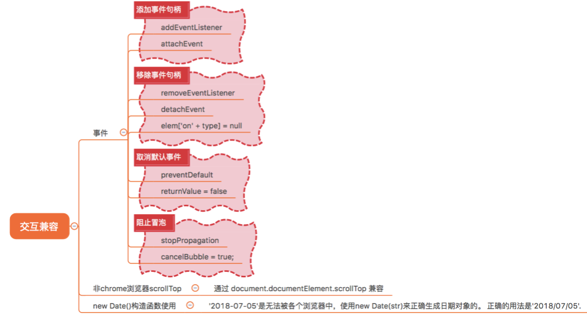

# 兼容性问题

[参考文章](https://juejin.cn/post/6844903633708908557)
[参考文章](https://juejin.cn/post/6972937716660961317?searchId=2024042813515083DC177818430195D890)
[参考文章](https://juejin.cn/post/7067808335034220574?searchId=2024042813515083DC177818430195D890#heading-5)

## 为什么会出现兼容性问题

- 同一浏览器，版本越老，存在 bug 越多，相对于版本越新的浏览器，对新属性和标签、新特性支持越少。
- 不同浏览器，内核不同，标准不同，实现方式也有差异，最终呈现出来在大众面前的效果也是会有差异

浏览器的兼容性无非还是`样式兼容性（css）`，`交互兼容性（javascript）`两个方面。

我们在开发的时候会明确项目要兼容哪些浏览器的最低版本，我之前的项目要求兼容IE8.0以上的版本，Chrome 48以上，FireFox 44以上。有了这些最基本的要求，在开发中就是要考虑到CSS样式和JavaScript的在这些浏览器的兼容性了

## CSS兼容性

### Normalize.css重置样式

不同的浏览器默认样式存在差异，可以通过 `Normalize.css` 抹平差异，也可以定制自己的 `reset.css`，全局重置样式

### 属性的前缀

在CSS3还没有成为真正的标准时，浏览器厂商就开始支持这些属性的使用了。CSS3样式语法还存在波动时，浏览器厂商提供了针对浏览器的前缀，直到现在还是有部分的属性需要加上浏览器前缀。在开发过程中我们一般通过IDE开发插件、css 预处理器以及前端自动化构建工程帮我们处理。

| 内核    | 主要浏览器     | 前缀    |
| ------- | -------------- | ------- |
| Trident | IE浏览器       | -ms     |
| Gecko   | Firefox        | -moz    |
| Presto  | Opera          | -o      |
| Webkit  | Chrome和Safari | -webkit |

在vue项目中使用`postcss`插件来处理css兼容性问题

- `postcss-loader`：是一个 webpack loader，用于在 webpack 构建过程中运行 PostCSS。它将 CSS 文件传递给 PostCSS 处理，然后将处理后的 CSS 插入到构建后的文件中。通常配合 webpack 和其他 PostCSS 插件一起使用，例如 postcss-preset-env。

- `postcss`： 是一个 CSS 处理工具，用于在构建过程中对 CSS 进行转换和优化。它可以通过插件系统扩展，实现自定义的 CSS 处理功能，例如添加前缀、压缩、转换变量等。

- `postcss-preset-env`： 是一个 PostCSS 插件集合，它可以根据最新的 CSS 规范，帮助你使用未来的 CSS 特性，同时确保兼容性。它类似于 Babel 的 preset，可以根据配置自动转换 CSS 代码，添加所需的浏览器前缀，并根据目标浏览器环境进行特性转换和 polyfill。

这些插件通常配合 Vue、React 或其他前端框架一起使用，用于处理项目中的 CSS 样式，提供以下主要功能：

- 支持最新的 CSS 特性：通过 postcss-preset-env，可以使用最新的 CSS 特性，而不用担心浏览器兼容性问题，因为它会根据目标浏览器环境自动进行特性转换和添加前缀。优化和压缩 CSS：通过其他 PostCSS 插件，可以对 CSS 进行优化、压缩和转换，以提高性能和减少文件大小。

- 自定义 CSS 处理流程：PostCSS 提供了丰富的插件系统，可以根据项目需求自定义 CSS 处理流程，实现特定的 CSS 转换和增强功能。
在 Vue 项目中使用这些插件，可以通过 webpack 的配置，在构建过程中对 CSS 进行预处理和后处理，从而优化和增强项目的 CSS 样式。

**如何控制兼容性**

我们可以在 `package.json` 文件中添加 `browserslist` 来控制样式的兼容性做到什么程度。

```json
{
  // 其他省略
  "browserslist": ["ie >= 8"]
}
```

想要知道更多的 browserslist 配置，查看browserslist 文档

以上为了测试兼容性所以设置兼容浏览器 ie8 以上。

实际开发中我们一般不考虑旧版本浏览器了，所以我们可以这样设置：

```json
{
  // 其他省略
  "browserslist": ["last 2 version", "> 1%", "not dead"]
}
```

### 条件注释hack

在 HTML 中，可以使用条件注释来针对不同版本的 Internet Explorer 执行特定的代码或加载特定的样式表。

```html
<!--[if IE 8]>
  <link rel="stylesheet" type="text/css" href="ie-specific.css">
<![endif]-->
```

### 属性 Hack

根据浏览器支持的属性值进行应用样式。

```css
/* IE 6-9 */
.selector {
  /* IE 6-9 支持的属性 */
  *background-color: green;
}

/* IE 7 */
.selector {
  _background-color: purple;
}

/* IE 6 */
.selector {
  _height: 100px;
}
```

### 其他兼容性问题

1. IE9 及以下版本不能 flex 和 Grid 布局，并且IE10-11也不完全兼容

解决方法：针对旧版本浏览器，可以使用 Flexbox 和 Grid 布局的 Polyfills 或回退方案，或者考虑使用传统的布局方法来实现类似效果。

2. IE8 及以下浏览器不能使用 opacity

解决方法：使用 Microsoft 提供的 Alpha 图片滤镜来实现元素的透明效果。这个滤镜在 CSS 中可以通过 filter 属性来应用。

```css
.element {
  /* 设置透明度为 50% */
  filter: alpha(opacity=50);
}
```

## JS兼容性

### babel处理ES6语法

主要用于将 ES6 语法编写的代码转换为向后兼容的 JavaScript 语法，以便能够运行在当前和旧版本的浏览器或其他环境中

### 特性检测

使用特性检测来确定浏览器是否支持某些功能或 API。可以通过检测全局对象、属性、方法或事件是否存在来执行不同的代码路径。例如：

```js
if (window.localStorage) {
  // 浏览器支持 localStorage
  localStorage.setItem('key', 'value');
} else {
  // 浏览器不支持 localStorage
  // 可以使用其他方案来存储数据
}
```

### JavaScript Hack

在 JavaScript 中，也可以通过特性检测或 User Agent（用户代理）字符串来判断浏览器类型和版本，从而执行不同的代码路径。

```js
if (navigator.userAgent.indexOf('MSIE') !== -1) {
  // Internet Explorer 特定代码
} else {
  // 其他浏览器通用代码
}
```

### Polyfills（垫片）

使用 Polyfills 来填充浏览器缺失的功能或 API。Polyfills 是一种 JavaScript 代码片段，用于在不支持某些新特性的浏览器中模拟实现这些特性。可以根据需要选择性地引入或加载 Polyfills。

### 其他兼容性问题



- 标准的事件绑定函数为addEventListener，IE8及以下不支持，使用attachEvent
- 事件冒泡和事件默认行为：IE8及以下不支持`stopPropagation`和`preventDefault`

```js
// 阻止事件冒泡：
标准写法：Event.stopPropagation()
IE兼容写法：window.event.cancelBubble = true 
 
阻止事件默认行为：
标准写法：Event.preventDefault()
IE兼容写法：window.event.returnValue = false
```

- 现代浏览器可以直接使用形参e接受事件对象，ie8用window.event,兼容性写法 e = e || window.event
- 获取元素：`document.querySelector()`和`document.querySelectorAll（）`IE8及以下不支持
- 获取浏览器可视区大小：`window.innerWidth/innerHeight` IE8以下不支持，使用`document.body.clientWidth/clientHeight`
- 获取浏览器顶部滚动出去的距离：`window.pageYOffset` IE8以下不支持，使用`document.documentElement.scrollTop`
- 移动端点击事件有300ms延迟的问题，下载引入fastClick
- innerText早期火狐不能用，用textContent
- 获取自定义属性getAttribute（）或则dataSet.id 火狐只能使用第一个

事件兼容的问题，我们通常需要会封装一个适配器的方法，过滤事件句柄绑定、移除、冒泡阻止以及默认事件行为处理

```js
 var  helper = {}
 //绑定事件
 helper.on = function(target, type, handler) {
  if(target.addEventListener) {
   target.addEventListener(type, handler, false);
  } else {
   target.attachEvent("on" + type,
    function(event) {
     return handler.call(target, event);
       }, false);
  }
 }
 //取消事件监听
 helper.remove = function(target, type, handler) {
  if(target.removeEventListener) {
   target.removeEventListener(type, handler);
  } else {
   target.detachEvent("on" + type,
      function(event) {
    return handler.call(target, event);
   }, true);
     }
 }
```

## browserslist的作用

browserslist 是一个用于指定目标浏览器和 Node.js 版本的配置工具，主要用于在前端开发中确定项目的兼容性需求。它可以帮助开发者确定哪些浏览器和环境需要支持，以便在构建过程中自动优化和转换代码，确保项目在目标环境中的兼容性。

具体来说，browserslist 可以用于以下几个方面：

- 自动添加浏览器前缀：
browserslist 可以作为 PostCSS、Autoprefixer 等工具的配置输入，根据配置的目标浏览器列表自动添加 CSS 属性的前缀，以确保在目标浏览器中正确显示样式。
- JavaScript 转译和代码优化：
一些 JavaScript 工具，如 Babel，也可以使用 browserslist 配置来确定需要转译和支持的浏览器版本，从而优化输出的代码，确保在目标浏览器中的兼容性。
- 工具的配置：
browserslist 的配置可以用于许多前端工具，如 webpack、Rollup 等构建工具的配置中，帮助开发者根据项目需求自动优化输出的代码，减少手动配置的工作量。
- 查询工具：
除了用于构建工具的配置外，browserslist 还可以作为一个查询工具，帮助开发者快速查找哪些浏览器版本需要支持，以便制定兼容性策略和方案。
browserslist 的配置通常以一个字符串形式指定，可以包含各种浏览器的名称和版本范围，也可以通过 .browserslistrc 文件或 browserslist 字段在项目的 package.json 文件中进行配置。例如：

```shell
last 2 versions
> 1%
IE 11
```

上述配置表示项目需要支持最近两个版本的主流浏览器、全球使用率超过1%的浏览器，以及 Internet Explorer 11。

总之，browserslist 是一个非常有用的工具，可以帮助开发者在前端项目中根据需求自动化处理浏览器兼容性问题，提高开发效率和代码质量。

## IE浏览器历史版本

Internet Explorer（IE）是微软开发的一系列网页浏览器，曾长期作为 Windows 系统的默认浏览器。以下是 Internet Explorer 的主要历史版本：

1. Internet Explorer 1.0（1995年8月）：
第一个版本，发布于1995年，作为 Windows 95 操作系统的一部分。
2. Internet Explorer 2.0（1995年11月）：
针对 Windows 95 和 Windows NT 发布，支持帧和表格布局等功能。
3. Internet Explorer 3.0（1996年8月）：
第一个实现 CSS（层叠样式表）的版本，引入了多种新功能和改进。
4. Internet Explorer 4.0（1997年9月）：
引入了 Active Desktop、支持 DHTML（动态 HTML）等新特性。
5. Internet Explorer 5.0（1999年3月）：
提供了更好的 CSS 支持和性能改进，成为当时领先的浏览器版本。
6. Internet Explorer 6.0（2001年8月）：
长期作为 Windows XP 的默认浏览器，影响了当时的网页开发标准。
7. Internet Explorer 7.0（2006年10月）：
引入了标签页功能、改进了安全性和用户界面。
8. Internet Explorer 8.0（2009年3月）：
提供了更好的标准支持和安全性，是 Windows 7 默认的浏览器版本。
9. Internet Explorer 9.0（2011年3月）：
支持 HTML5 和 CSS3 标准，改进了性能和用户体验。
10. Internet Explorer 10.0（2012年10月）：
集成于 Windows 8 中，支持更多的 HTML5 和 CSS3 特性。
11. Internet Explorer 11.0（2013年10月）：
最后一个版本，支持更多现代 Web 标准，是 Windows 10 中的默认浏览器。

请注意，随着时间的推移和浏览器市场的变化，Internet Explorer 的使用率逐渐下降，并且微软已经于2022年6月15日宣布终止对 Internet Explorer 11 的支持。推荐用户使用 Edge 浏览器或其他现代浏览器来访问 Web。

## 测试和调试工具

问题：开发完成后，需要在多个浏览器和设备上进行测试和调试，以确保页面的兼容性和稳定性。
解决方法：使用跨浏览器测试工具（如 `BrowserStack`、CrossBrowserTesting）或浏览器开发者工具进行调试，及时发现和解决兼容性问题。

## 常见的CSS样式和JS的兼容性问题

常见的浏览器 CSS 样式和 JavaScript 兼容性问题是前端开发中需要重点关注和解决的挑战。以下是一些常见的问题及其解决方法：

### 浏览器 CSS 样式兼容性问题

- 盒模型（Box Model）：
问题：不同浏览器对盒模型的解释存在差异，导致元素的尺寸计算不一致。
解决方法：使用 CSS Reset 或 Normalize.css 来统一不同浏览器的默认样式，确保盒模型的一致性。
- Flexbox 布局：
问题：旧版本的浏览器（如 IE 10 及以下版本）对 Flexbox 布局支持不完整。
解决方法：使用 Autoprefixer 自动添加浏览器前缀，或者考虑使用 Flexbox 布局的 Polyfills 来模拟支持。
- Grid 布局：
问题：一些浏览器对 CSS Grid 布局的支持不完整。
解决方法：对于不支持 Grid 布局的浏览器，可以提供回退方案或使用 Polyfills。
- CSS 动画和过渡：
问题：不同浏览器对 CSS3 动画和过渡的支持程度不同。
解决方法：使用 Autoprefixer 自动添加浏览器前缀，并针对不支持 CSS 动画和过渡的浏览器提供替代方案。
- 字体渲染：
问题：不同操作系统和浏览器对字体渲染方式存在差异。
解决方法：使用 Web Fonts，同时设置合适的字体回退策略。

### 浏览器 JavaScript 兼容性问题

- ES6+ 特性支持：
问题：旧版本的浏览器不支持 ES6+ 的新特性（如箭头函数、模板字符串等）。
解决方法：使用 Babel 将 ES6+ 代码转译为 ES5，或者使用 Polyfills 来填充缺失的功能。
- DOM 操作和事件处理：
问题：不同浏览器对 DOM 操作和事件处理的实现存在差异。
解决方法：使用现代化的事件绑定方式（如 addEventListener），避免使用过时的全局事件处理方法。
- 异步编程：
问题：旧版本的浏览器不支持 Promise、async/await 等异步编程特性。
解决方法：使用 Promise 的 Polyfills 或类库（如 Bluebird），或者使用 async/await 的 Babel 转译插件。
- Ajax 请求：
问题：IE 8 及以下版本对 XMLHttpRequest 的支持有限。
解决方法：考虑使用 Fetch API 或封装兼容性处理的 Ajax 库（如 Axios）。
- User Agent 检测：
问题：依赖 User Agent 字符串进行浏览器检测可能不准确。
解决方法：优先使用特性检测（feature detection）来判断浏览器支持的功能，而不是仅依赖于 User Agent。

以上解决方法中，特性检测、Polyfills、Autoprefixer 等是前端开发中常用的技术手段，可以帮助解决大部分浏览器兼容性问题。在开发过程中，还应当结合跨浏览器测试和调试，确保项目在不同浏览器和设备上都能正常运行和展示。
