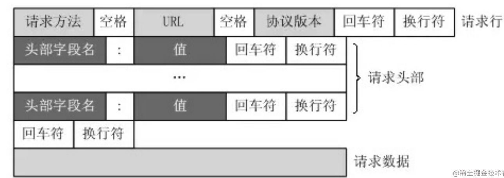
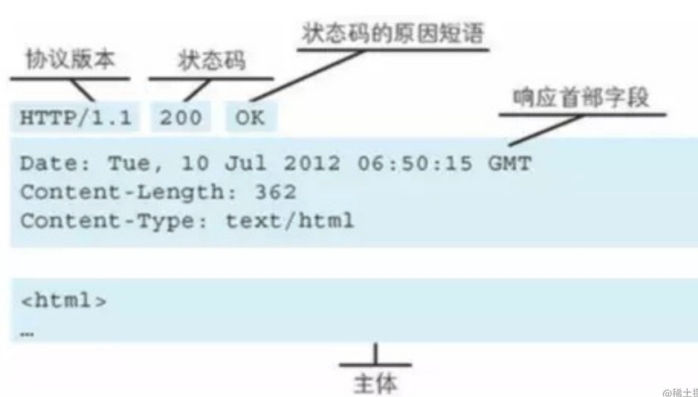
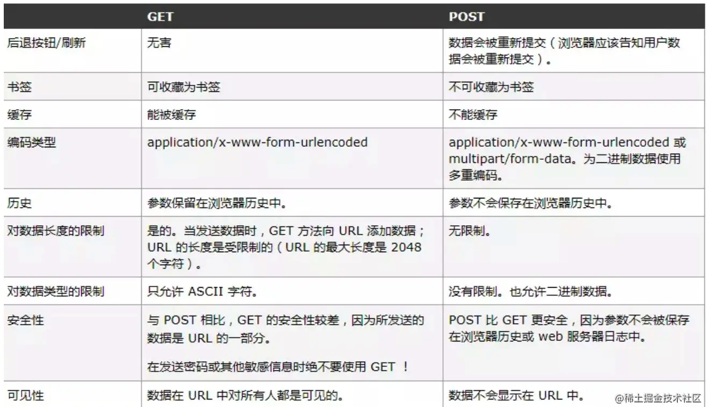
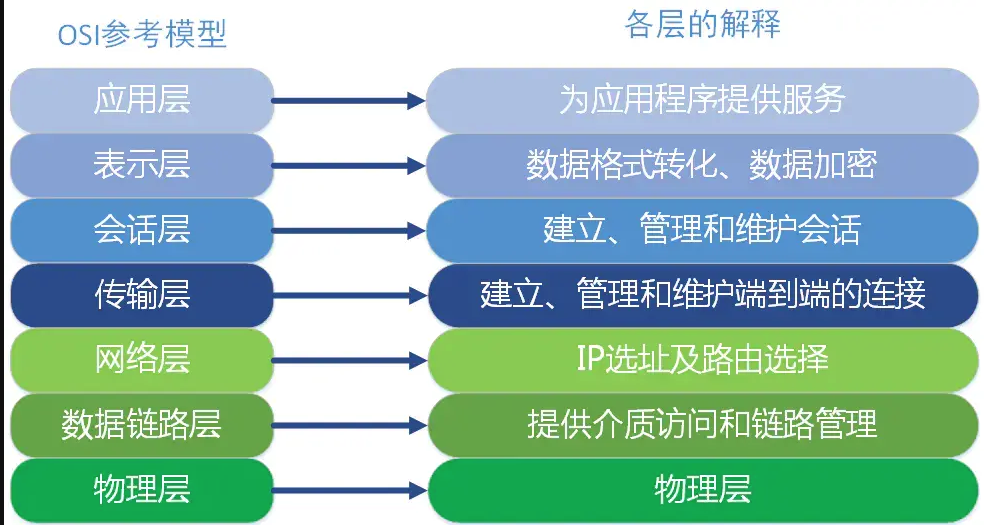
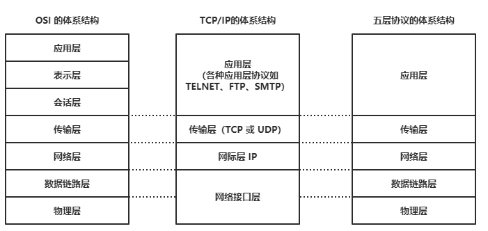
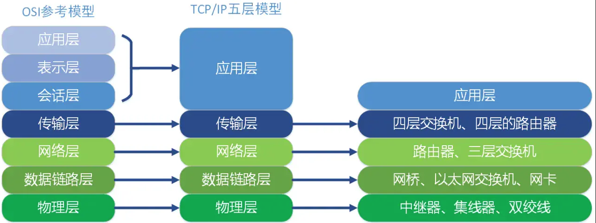
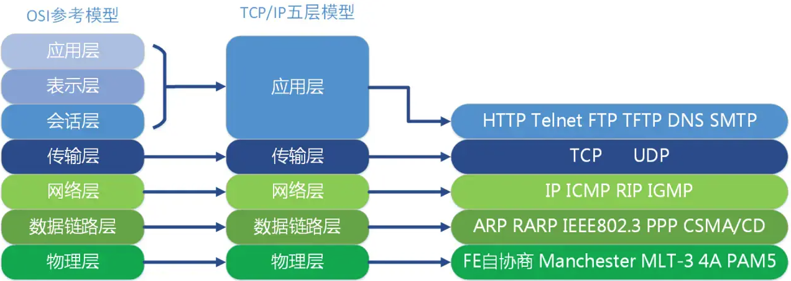
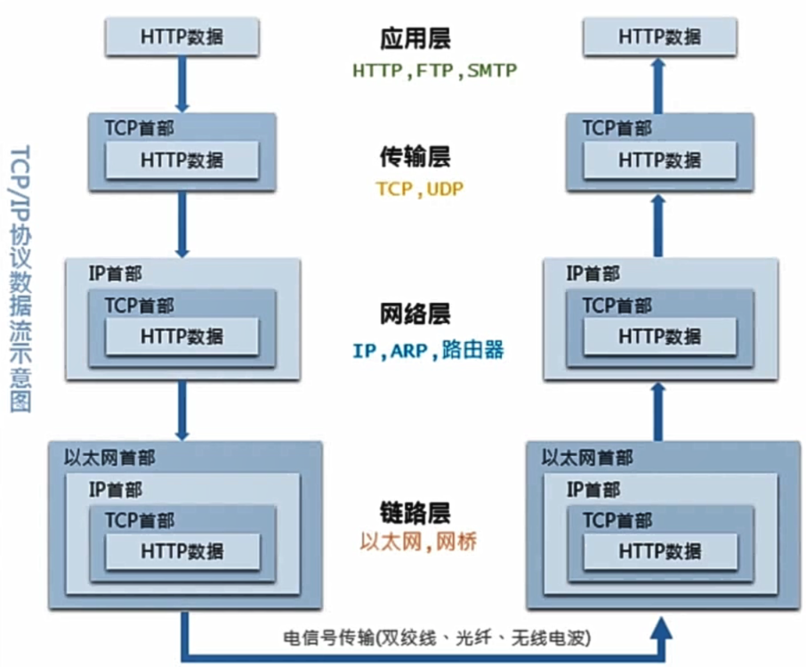

## 一、HTTP协议

### 1. http协议的理解

**概念**

HTTP协议是用于传输超文本（即HTML）的应用层协议，默认使用 80 端口，是因特网上应用最为广泛的一种网络传输协议。HTTP协议规定了客户端和服务器之间的通信格式，包括请求和响应的格式。它使用 TCP 作为传输层协议，保证了数据传输的可靠性。

**HTTP协议优点/特点：**

- `简单快速：`客户向服务器请求服务时，只需传送请求方法和路径。由于 HTTP 协议简单，使得 HTTP 服务器的程序规模小，因而通信速度很快。
- `灵活：`HTTP 允许传输任意类型的数据对象。正在传输的类型由 Content-Type 加以标记。
- `无连接：`无连接就是限制每次连接只处理一个请求。服务器处理完客户的请求，并收到客户的应答后，即断开连接，采用这种方式可以节省传输时间。
- `无状态：`HTTP协议是无状态协议，即服务器不会记录每个客户端的请求情况，这样可以提高服务器的效率。

**HTTP协议缺点**：

- `无状态：` 缺少状态意味着如果后续处理需要前面的信息，则它必须重传，这样可能会导致每次连接传送的数据量增大
- `明文传输：` 协议中的报文使用的是文本形式，这就直接暴露给外界，不安全。

### 2. HTTP请求和响应报文组成

**请求报文**

- `请求行`：请求⽅法、URL、HTTP协议版本字段。它们⽤空格分隔。例如，GET /index.html HTTP/1.1。
- `请求头`：由关键字/值对组成，每⾏⼀对

    ```text
    User-Agent：产⽣请求的浏览器类型。
    Accept：客户端可识别的内容类型列表。
    Content-Type：发送端发送的实体数据的数据类型。 
    Cookie： 
    Host：请求的主机名，允许多个域名同处⼀个IP地址，即虚拟主机。
    比如Content-Type：text/html（application/json）表示发送的是html类型。
    .....
    ```

- `空行`： 请求头之后是一个空行，通知服务器以下不再有请求头
- `请求体`：包括请求的数据，如表单数据、JSON数据等，GET没有请求体


**响应报文**

- `响应⾏/状态行`：包括HTTP版本、状态码和状态消息
- `响应头`：包括如服务器的类型、响应的内容类型等。
- `响应体`：包括响应的数据，如HTML页面、JSON数据等。



### 3. HTTP请求方法

- `GET`: 向服务器获取数据；
- `POST`：将实体提交到指定的资源，通常会造成服务器资源的修改；
- `PUT`：上传文件，更新数据；
- `DELETE`：删除服务器上的对象；
- `HEAD`：获取报文首部，与GET相比，不返回报文主体部分；
- `OPTIONS`：询问支持的请求方法，用来跨域请求；
- `CONNECT`：要求在与代理服务器通信时建立隧道，使用隧道进行TCP通信；
- `TRACE`: 回显服务器收到的请求，主要⽤于测试或诊断。

### 4. GET和POST的请求的区别

- **请求参数传递方式**：GET请求通过URL传递请求参数，而POST请求通过请求体（request body）传递请求参数。
- **请求参数大小限制**：get请求参数的大小有一定限制（通常为2kb-8kb），具体取决于浏览器和服务器对URL长度的限制。而POST请求则没有明确的大小限制，但是通常也会受到服务器的限制
- **安全性**：由于GET请求的请求参数在URL中可见，因此不太适合传递敏感信息，例如密码等。而POST请求的请求参数在请求体中，因此相对安全一些，但是如果没有进行HTTPS加密，则依然有被窃听和篡改的风险。
- **应用场景：** GET请求通常被设计为幂等性的操作，即多次重复请求对资源不会产生副作用，而POST请求则通常被设计为非幂等性的操作，即多次重复请求可能会对资源产生影响，比如注册用户这一类的操作。
- **是否缓存：** 因为两者应用场景不同，GET请求会被浏览器主动缓存，而POST不会，除非手动设置。
- **参数类型：** GET只能发送ASCII字符，而POST可以发送任意类型的数据。
- **发送的报文格式：** get请求没有请求体，post有请求体，必须设置请求头


### 5. POST和PUT请求的区别

- PUT请求是向服务器端发送数据，从而修改数据的内容，但是不会增加数据的种类等，也就是说无论进行多少次PUT操作，其结果并没有不同。（可以理解为是`更新数据`）
- POST请求是向服务器端发送数据，该请求会改变数据的种类等资源，它会创建新的内容。（可以理解为是`创建数据`）

### 6. HTTP 1.0 和 HTTP 1.1 的区别

HTTP 1.1(1997年)相对于HTTP 1.0(1996年)来说更加高效、灵活和安全，直到现在还是最流行的版本

- **连接方面:** `HTTP 1.0` 默认使用短连接，每次请求都需要建立一个新的`TCP连接`。以早期的通信情况来说，因为都是些容量很小的文本传输，所以即使这样也没有多大问题。但是随着 HTTP 的大量普及，文档中包含大量富文本(图片、视频等资源)的情况多了起来，每次的请求都会造成无谓的TCP 连接建立和断开，增加通信的开销。

    所以`http1.1`默认使用持久连接，即TCP连接默认不关闭，可以被多个请求复用。`持久连接的好处`在于减少了 TCP 连接的重复建立和断开所造成的额外开销，减轻了服务器端的负载。另外，减少开销的那部分时间，使 HTTP 请求和响应能够更早的结束，这样Web 页面的显示速度也就相应提高了。

     客户端和服务器发现对方一段时间没有活动，就可以主动关闭连接。不过，规范的做法是，客户端在最后一个请求时，发送 Connection: close，明确要求服务器关闭 TCP 连接。目前，对于同一个域名，大多数浏览器允许同时建立`6个持久连接`

     `长连接的缺点`
     虽然 HTTP 1.1 版允许复用 TCP 连接，但是同一个 TCP 连接里面，所有的数据通信是按次序进行的。服务器只有处理完一个回应，才会进行下一个回应。要是前面的回应特别慢，后面就会有许多请求排队等着。这称为`队头堵塞`(Head-of-line blocking)。为了避免这个问题，只有两种方法:一是减少请求数、二是同时多开持久连接

    这导致了很多的网页优化技巧，比如合并脚本和样式表、将图片嵌入 CSS 代码、域名分片(domain sharding)等等。如果 HTTP 协议设计得更好一些，这些额外的工作是可以避免的。

- **缓存方面：** HTTP 1.0 强缓存使用 `Expires` 标头来指定资源的过期时间，协商缓存使用`Last-Modified`标记最后一次资源文件修改的时间。HTTP 1.1 强缓存使用 `Cache-Control` 标头来控制缓存的行为，如 max-age、no-cache、no-store。协商缓存使用`Etag`给资源文件进行唯一标识
- **管道化**（HTTP Pipelining）：HTTP/1.1支持管道化（HTTP Pipelining），即客户端可以在一个TCP连接上同时发送多个请求，这样可以更好地利用网络带宽和资源，提高性能。但是同一个 TCP 连接里面，所有的数据通信是按次序进行的。服务器只有处理完一个回应，才会进行下一个回应。要是前面的回应特别慢，后面就会有许多请求排队等着。这称为队头堵塞(Head-of-line blocking)
- **新增host 字段:** 用来指定服务器的域名。`http1.0` 中认为每台服务器都绑定一个唯一的 `IP` 地址，因此，请求消息中的 URL 并没有传递主机名（hostname）。但随着虚拟主机技术的发展，在一台物理服务器上可以存在多个虚拟主机，并且它们共享一个IP地址。因此有了 host 字段，这样就可以将请求发往到同一台服务器上的不同网站。
- **带宽优化**，在 `http1.0`中，存在一些浪费带宽的现象，例如客户端只是需要某个对象的一部分，而服务器却将整个对象送过来了，并且不支持断点续传功能。`http1.1` 则在请求头引入了 `range` 头域，它允许只请求资源的某个部分，即返回码是 `206（Partial Content`），这样就方便了开发者自由的选择以便于充分利用带宽和连接。
- **请求方法:** `http1.1`新增了很多请求方法，如 `PUT`、`HEAD`、`OPTIONS` 等。
- **状态码：** `HTTP 1.0`只定义了`16种状态码`。`HTTP 1.1` 中新加入了大量的状态码，光是错误响应状态码就新增了`24`种。

### 7. HTTP 1.1 和 HTTP/2(2015年) 的区别

- **二进制协议**：HTTP/1.1版的头信息和数据体使用文本格式传输，HTTP/2使用二进制格式对请求和响应数据进行编码和解码，相比于HTTP/1.1中的文本格式，更加紧凑和高效，可以减少网络传输的数据量和传输时间

- **多路复用：** 多路复用是指在同一个TCP连接上，客户端可以同时发送多个请求，并且服务器也可以同时响应多个请求。多路复用使用了HTTP/2协议的二进制分帧机制，将一个HTTP请求拆分成多个二进制帧，可以将多个请求和响应混合在一个TCP连接中传输。多路复用的优点是可以减少网络延迟和连接数，提高网络效率，这样就避免了`队头堵塞`。

    举例来说，在一个 TCP 连接里面，服务器同时收到了 A 请求和 B 请求，于是先回应 A 请求，结果发现处理过程非常耗时，于是就发送 A 请求已经处理好的部分， 接着回应B请求，完成后，再发送 A 请求剩下的部分。这样双向的、实时的通信，就叫做多工(Multiplexing)

- **头信息压缩：** HTTP 协议不带有状态，每次请求都必须附上所有信息。所以，请求的很多字段都是重复的，比如 Cookie 和 User Agent，一模一样的内容，每次请求都必须附带，这会浪费很多带宽，也影响速度。

    HTTP/2 对这一点做了优化，引入了头信息压缩机制(header compression)。一方面，头信息使用 gzip 或 compress 压缩后再发送;另一方面，客户端和服务器同时维护一张头信息表，所有字段都会存入这个表，生成一个索引号，以后就不发送同样字段了，只发送索引号，这样就提高速度了。
- **服务器推送：** HTTP/2 允许服务器未经请求，主动向客户端发送资源，这叫做服务器推送(server push)。

    常见场景是客户端请求一个网页，这个网页里面包含很多静态资源。正常情况下，客户端必须收到网页后，解析 HTML源码，发现有静态资源，再发出静态资源请求。其实，服务器可以预期到客户端请求网页后，很可能会再请求静态资源，所以就主动把这些静态资源随着 网页一起发给客户端了。
    这里需要注意的是 http2 下服务器主动推送的是静态资源，和 WebSocket 以及使用 SSE 等方式向客户端发送即时数据的推送是不同的。
- **数据流：** `HTTP/2` 的数据包是不按顺序发送的，同一个连接里面连续的数据包，可能属于不同的回应。因此，必须要对数据包做标记，指出它属干哪个回应。`HTTP/2` 将每个请求或回应的所有数据包，称为一个数据流(stream)。每个数据流都有一个独一无二的编号。数据包发送的时候，都必须标记数据流 ID，用来区分它属干哪个数据流。另外还规定，客户端发出的数据流，ID 一律为奇数，服务器发出的，ID 为偶数。

    数据流发送到一半的时候，客户端和服务器都可以发送信号(RST STREAM帧)，取消这个数据流。1.1 版取消数据流的唯一方法，就是关闭 TCP 连接。这就是说，HTTP/2 可以取消某一次请求，同时保证 TCP 连接还打开着，可以被其他请求使用。客户端还可以指定数据流的优先级。优先级越高，服务器就会越早回应。

### 9. 常见的HTTP请求头和响应头

**HTTP Request Header 常见的请求头：**

- Accept:浏览器能够处理的内容类型
- Accept-Charset:浏览器能够显示的字符集
- Accept-Encoding：浏览器能够处理的压缩编码
- Accept-Language：浏览器当前设置的语言
- Connection：浏览器与服务器之间连接的类型
- Cookie：当前页面设置的任何Cookie
- Host：发出请求的页面所在的域
- Referer：发出请求的页面的URL
- User-Agent：浏览器的用户代理字符串

**HTTP Responses Header 常见的响应头：**

- Date：表示消息发送的时间，时间的描述格式由rfc822定义
- server:服务器名称
- Connection：浏览器与服务器之间连接的类型
- Cache-Control：控制HTTP缓存
- content-type:表示后面的文档属于什么MIME类型

### 10. 常见的Content-Type

- `application/x-www-form-urlencoded`：浏览器的原生 form 表单，如果不设置 enctype 属性，那么最终就会以 application/x-www-form-urlencoded 方式提交数据。该种方式提交的数据放在 body 里面，数据按照 key1=val1&key2=val2 的方式进行编码，key 和 val 都进行了 URL转码。
- `multipart/form-data`：该种方式也是一个常见的 POST 提交方式，通常表单上传文件时使用该种方式。
- `application/json`：服务器消息主体是序列化后的 JSON 字符串。
- `text/xml`：该种方式主要用来提交 XML 格式的数据。

### 11. OPTIONS请求方法及使用场景

OPTIONS是除了GET和POST之外的其中一种 HTTP请求方法。

OPTIONS方法是用于请求获得由`Request-URI`标识的资源在请求/响应的通信过程中可以使用的功能选项。通过这个方法，客户端可以**在采取具体资源请求之前，决定对该资源采取何种必要措施，或者了解服务器的性能**。该请求方法的响应不能缓存。

OPTIONS请求方法的**主要用途**有两个：

- 获取服务器支持的所有HTTP请求方法；
- 用来检查访问权限。例如：在进行 CORS 跨域资源共享时，对于复杂请求，就是使用 OPTIONS 方法发送嗅探请求，以判断是否有对指定资源的访问权限。

### 12. HTTP状态码304是多好还是少好

304是http请求命中协商缓存的时候，服务器返回的状态码，让客户端使用本地的缓存。所以状态码304不应该认为是一种错误。

但是搜索引擎蜘蛛会更加青睐内容源更新频繁的网站。通过特定时间内对网站抓取返回的状态码来调节对该网站的抓取频次。若网站在一定时间内一直处于304的状态，那么蜘蛛可能会降低对网站的抓取次数。相反，若网站变化的频率非常之快，每次抓取都能获取新内容，那么日积月累，的回访率也会提高。

**产生较多304状态码的原因：**

- 页面更新周期长或不更新
- 纯静态页面或强制生成静态html

**304状态码出现过多会造成以下问题：**

- 网站快照停止；
- 收录减少；
- 权重下降。  

### 13. GET方法URL长度限制的原因

实际上HTTP协议规范并没有对get方法请求的url长度进行限制，这个限制是特定的浏览器及服务器对它的限制。

IE对URL长度的限制是2083字节(2K+35)。由于IE浏览器对URL长度的允许值是最小的，所以开发过程中，只要URL不超过2083字节，那么在所有浏览器中工作都不会有问题。

```
GET的长度值 = URL（2083）- （你的Domain+Path）-2（2是get请求中?=两个字符的长度）
```

下面看一下主流浏览器对get方法中url的长度限制范围：

- Microsoft Internet Explorer (Browser)：IE浏览器对URL的最大限制为2083个字符，如果超过这个数字，提交按钮没有任何反应。
- Firefox (Browser)：对于Firefox浏览器URL的长度限制为 65,536 个字符。
- Safari (Browser)：URL最大长度限制为 80,000 个字符。
- Opera (Browser)：URL最大长度限制为 190,000 个字符。
- Google (chrome)：URL最大长度限制为 8182 个字符。

主流的服务器对get方法中url的长度限制范围：

- Apache (Server)：能接受最大url长度为8192个字符。
- Microsoft Internet Information Server(IIS)：能接受最大url的长度为16384个字符。

根据上面的数据，可以知道，get方法中的URL长度最长不超过2083个字符，这样所有的浏览器和服务器都可能正常工作。

### 15. 对keep-alive的理解

HTTP1.0 中默认是在每次请求/应答，客户端和服务器都要新建一个连接，完成之后立即断开连接，这就是**短连接**。当使用Keep-Alive模式时，Keep-Alive功能使客户端到服务器端的连接持续有效，当出现对服务器的后继请求时，Keep-Alive功能避免了建立或者重新建立连接，这就是**长连接**。其使用方法如下：

- HTTP1.0版本是默认没有Keep-alive的（也就是默认会发送keep-alive），所以要想连接得到保持，必须手动配置发送`Connection: keep-alive`字段。若想断开keep-alive连接，需发送`Connection:close`字段；
- HTTP1.1规定了默认保持长连接，数据传输完成了保持TCP连接不断开，等待在同域名下继续用这个通道传输数据。如果需要关闭，需要客户端发送`Connection：close`首部字段。

Keep-Alive的**建立过程**：

- 客户端向服务器在发送请求报文同时在首部添加发送Connection字段
- 服务器收到请求并处理 Connection字段
- 服务器回送Connection:Keep-Alive字段给客户端
- 客户端接收到Connection字段
- Keep-Alive连接建立成功

**服务端自动断开过程（也就是没有keep-alive）** ：

- 客户端向服务器只是发送内容报文（不包含Connection字段）
- 服务器收到请求并处理
- 服务器返回客户端请求的资源并关闭连接
- 客户端接收资源，发现没有Connection字段，断开连接

**客户端请求断开连接过程**：

- 客户端向服务器发送Connection:close字段
- 服务器收到请求并处理connection字段
- 服务器回送响应资源并断开连接
- 客户端接收资源并断开连接

开启Keep-Alive的**优点：**

- 较少的CPU和内存的使⽤（由于同时打开的连接的减少了）；
- 允许请求和应答的HTTP管线化；
- 降低拥塞控制 （TCP连接减少了）；
- 减少了后续请求的延迟（⽆需再进⾏握⼿）；
- 报告错误⽆需关闭TCP连；

开启Keep-Alive的**缺点**：

- 长时间的Tcp连接容易导致系统资源无效占用，浪费系统资源。

### 16. 页面有多张图片，HTTP如何请求的

- 在`HTTP 1`下，浏览器对一个域名下最大TCP连接数为6，所以会请求多次。可以用**多域名部署**解决。这样可以提高同时请求的数目，加快页面图片的获取速度。
- 在`HTTP 2`下，可以一瞬间加载出来很多资源，因为，HTTP2支持多路复用，可以在一个TCP连接中发送多个HTTP请求。

### 17. HTTP2的头部压缩算法是怎样的

HTTP2的头部压缩是HPACK算法。在客户端和服务器两端建立“字典”，用索引号表示重复的字符串，采用哈夫曼编码来压缩整数和字符串，可以达到50%~90%的高压缩率。

具体来说:

- 在客户端和服务器端使用“首部表”来跟踪和存储之前发送的键值对，对于相同的数据，不再通过每次请求和响应发送；
- 首部表在HTTP/2的连接存续期内始终存在，由客户端和服务器共同渐进地更新；
- 每个新的首部键值对要么被追加到当前表的末尾，要么替换表中之前的值。

例如下图中的两个请求， 请求一发送了所有的头部字段，第二个请求则只需要发送差异数据，这样可以减少冗余数据，降低开销。


### 18. 说一下HTTP 3.0（2022年6月）

HTTP/3基于UDP协议实现了类似于TCP的多路复用数据流、传输可靠性等功能，这套功能被称为QUIC协议。


0. 流量控制、传输可靠性功能：QUIC在UDP的基础上增加了一层来保证数据传输可靠性，它提供了数据包重传、拥塞控制、以及其他一些TCP中的特性。
0. 集成TLS加密功能：目前QUIC使用TLS1.3，减少了握手所花费的RTT数。
0. 多路复用：同一物理连接上可以有多个独立的逻辑数据流，实现了数据流的单独传输，解决了TCP的队头阻塞问题。


0. 快速握手：由于基于UDP，可以实现使用0 ~ 1个RTT来建立连接。

### 19. URL有哪些组成部分

以下面的URL为例：**<http://www.aspxfans.com:8080/news/index.asp?boardID=5&ID=24618&page=1#name>**

从上面的URL可以看出，一个完整的URL包括以下几部分：

- **协议部分**：该URL的协议部分为“http：”，这代表网页使用的是HTTP协议。在Internet中可以使用多种协议，如HTTP，FTP等等本例中使用的是HTTP协议。在"HTTP"后面的“//”为分隔符；
- **域名部分**：该URL的域名部分为“[www.aspxfans.com](www.aspxfans.com)”。一个URL中，也可以使用IP地址作为域名使用
- **端口部分**：跟在域名后面的是端口，域名和端口之间使用“:”作为分隔符。端口不是一个URL必须的部分，如果省略端口部分，将采用默认端口（HTTP协议默认端口是80，HTTPS协议默认端口是443）；
- **虚拟目录部分**：从域名后的第一个“/”开始到最后一个“/”为止，是虚拟目录部分。虚拟目录也不是一个URL必须的部分。本例中的虚拟目录是“/news/”；
- **文件名部分**：从域名后的最后一个“/”开始到“？”为止，是文件名部分，如果没有“?”,则是从域名后的最后一个“/”开始到“#”为止，是文件部分，如果没有“？”和“#”，那么从域名后的最后一个“/”开始到结束，都是文件名部分。本例中的文件名是“index.asp”。文件名部分也不是一个URL必须的部分，如果省略该部分，则使用默认的文件名；
- **锚部分**：从“#”开始到最后，都是锚部分。本例中的锚部分是“name”。锚部分也不是一个URL必须的部分；
- **参数部分**：从“？”开始到“#”为止之间的部分为参数部分，又称搜索部分、查询部分。本例中的参数部分为“boardID=5&ID=24618&page=1”。参数可以允许有多个参数，参数与参数之间用“&”作为分隔符。

### 20. 与缓存相关的HTTP请求头有哪些

强缓存：

- Expires
- Cache-Control

协商缓存：

- Etag、If-None-Match
- Last-Modified、If-Modified-Since

### 21. HTTP状态码

状态码的类别：

| **类别** | **原因**                        | **描述**                   |
| -------- | ------------------------------- | -------------------------- |
| 1xx      | Informational(信息性状态码)     | 接受的请求正在处理         |
| 2xx      | Success(成功状态码)             | 请求正常处理完毕           |
| 3xx      | Redirection(重定向状态码)       | 需要进行附加操作一完成请求 |
| 4xx      | Client Error (客户端错误状态码) | 服务器无法处理请求         |
| 5xx      | Server Error(服务器错误状态码)  | 服务器处理请求出错         |

**2XX (Success 成功状态码)**

- `200 OK`: 表示客户端发来的请求被服务器端正常处理了。
- `204 No Content`: 无内容。服务器成功处理，但未返回内容。一般用在只是客户端向服务器发送信息，而服务器不用向客户端返回什么信息的情况
- `206 Partial Content`: 服务器已经完成了部分GET请求（客户端进行了范围请求）。响应报文中包含Content-Range指定范围的实体内容

**3XX (Redirection 重定向状态码)**

3XX 响应结果表明浏览器需要执行某些特殊的处理以正确处理请求。

- `301 Moved Permanently`: `永久重定向`，表示请求的资源已经永久的搬到了其他位置。301状态码的作用是告诉搜索引擎和浏览器，该资源已经永久转移到新的URL地址，搜索引擎和浏览器在收到301响应后，会更新它们的索引和缓存，使之指向新的URL地址。可以保证用户可以访问到正确的资源。

`使用场景：`

1. 当我们想换个域名，旧的域名不再使用时，用户访问旧域名时用301就重定向到新的域名。其实也是告诉搜索引擎收录的域名需要对新的域名进行收录。
2. 在搜索引擎的搜索结果中出现了不带www的域名，而带www的域名却没有收录，这个时候可以用301重定向来告诉搜索引擎我们目标的域名是哪一个。

- `302 Found`: `临时重定向`，表示请求的资源临时搬到了其他位置。如果服务器发现请求的资源已经暂时移动到了一个新的位置，那么服务器就会返回一个HTTP状态码为`302`的响应，并在响应头中加入`Location`字段，指明新的资源位置的`URL`地址。此时，客户端会自动重定向到新的URL地址。而对于搜索引擎来说，302状态码表示请求的资源只是暂时移动到了新的位置，因此搜索引擎会继续使用原始URL地址来获取资源。

`使用场景：`

1. 当我们在做活动时，登录到首页自动重定向，进入活动页面。
2. 未登陆的用户访问用户中心重定向到登录页面。
3. 访问404页面重新定向到首页。

- `303 See Othe`: 临时重定向，应使用GET定向获取请求资源。303功能与302一样，区别只是303明确客户端应该使用GET访问
- `307 Temporary Redirect`：临时重定向，和302有着相同含义。POST不会变成GET
- `304 Not Modified`：表示客户端发送附带条件的请求（GET方法请求报文中的IF…）时，条件不满足。返回304时，不包含任何响应主体。虽然304被划分在3XX，但和重定向一毛钱关系都没有

**4XX (Client Error 客户端错误状态码)**

- `400 Bad Request`: 该状态码表示请求报文中存在语法错误。当错误发生时，需修改请求的内容后再次发送请求。
- `401 Unauthorized`: 该状态码表示发送的请求需要有通过 HTTP 认证(BASIC 认证、DIGEST 认证)的认证信息。若之前已进行过一次请求，则表示用户认证失败
- `403 Forbidden`该状态码表明请求资源的访问被服务器拒绝了，服务器端没有必要给出详细理由，但是可以在响应报文实体的主体中进行说明。
- `404 Not Found`: 请求资源不存在。比如，输入了错误的url
- `405 Method Not Allowed`: 该状态码表示客户端请求的方法虽然能被服务器识别，但是服务器禁止使用该方法

**5XX (Server Error 服务器错误状态码)**

- `500 Internal Server Error`: 该状态码表明服务器端在执行请求时发生了错误。也有可能是 Web 应用存在的 bug 或某些临时的故障。
- `502 Bad Gateway`: 该状态码表明扮演网关或代理角色的服务器，从上游服务器中接收到的响应是无效的。
- `503 Service Unavailable`: 该状态码表明服务器暂时处于超负载或正在进行停机维护，现在无法处理请求`使用场景：`服务器停机维护时，主动用503响应请求；nginx 设置限速，超过限速，会返回503。
- `504 Gateway Timeout`: 该状态码表示网关或者代理的服务器无法在规定的时间内获得想要的响应。他是HTTP 1.1中新加入的。`使用场景`：代码执行时间超时，或者发生了死循环。

## 二、HTTPS协议

### 8. HTTP和HTTPS协议的区别

- HTTP协议是超文本传输协议，信息是`明文传输`的，HTTPS在HTTP的基础上增加了`SSL/TLS`加密层，使得传输的数据在传输过程中被加密，从而保证了数据的`安全性`
- 使用不同的连接方式，端口也不同，HTTP协议端口是`80`，HTTPS协议端口是`443`
- HTTPS协议需要申请`CA证书`验证服务器的身份，费用较高；而HTTP协议不需要
- HTTPS比HTTP更耗费服务器资源和网络带宽，因为它需要进行加密和解密的过程。

### 1. 什么是HTTPS协议？

超文本传输安全协议（Hypertext Transfer Protocol Secure，简称：HTTPS）是一种通过计算机网络进行安全通信的传输协议。HTTPS经由HTTP进行通信，利用SSL/TLS来加密数据包。HTTPS的主要目的是提供对网站服务器的身份认证，保护交换数据的隐私与完整性。


HTTP协议采用**明文传输**信息，存在**信息窃听**、**信息篡改**和**信息劫持**的风险，而协议TLS/SSL具有**身份验证**、**信息加密**和**完整性校验**的功能，可以避免此类问题发生。

安全层的主要职责就是**对发起的HTTP请求的数据进行加密操作** 和 **对接收到的HTTP的内容进行解密操作**。

### 2. TLS/SSL的工作原理

**TLS/SSL**全称**安全传输层协议**（Transport Layer Security）, 是介于TCP和HTTP之间的一层安全协议，不影响原有的TCP协议和HTTP协议，所以使用HTTPS基本上不需要对HTTP页面进行太多的改造。

TLS/SSL的功能实现主要依赖三类基本算法：**散列函数hash**、**对称加密**、**非对称加密**。这三类算法的作用如下：

- 基于散列函数验证信息的完整性
- 对称加密算法采用协商的秘钥对数据加密
- 非对称加密实现身份认证和秘钥协商


**散列函数hash**

常见的散列函数有MD5、SHA1、SHA256。该函数的特点是单向不可逆，对输入数据非常敏感，输出的长度固定，任何数据的修改都会改变散列函数的结果，可以用于防止信息篡改并验证数据的完整性。

`特点：` 在信息传输过程中，散列函数不能三都实现信息防篡改，由于传输是明文传输，中间人可以修改信息后重新计算信息的摘要，所以需要对传输的信息和信息摘要进行加密。

**对称加密**

对称加密的方法是，双方使用同一个秘钥对数据进行加密和解密。但是对称加密的存在一个问题，就是如何保证秘钥传输的安全性，因为秘钥还是会通过网络传输的，一旦秘钥被其他人获取到，那么整个加密过程就毫无作用了。 这就要用到非对称加密的方法。

常见的对称加密算法有AES-CBC、DES、3DES、AES-GCM等。相同的秘钥可以用于信息的加密和解密。掌握秘钥才能获取信息，防止信息窃听，其通讯方式是一对一。

`特点：`对称加密的优势就是信息传输使用一对一，需要共享相同的密码，密码的安全是保证信息安全的基础，服务器和N个客户端通信，需要维持N个密码记录且不能修改密码。

**非对称加密**

非对称加密的方法是，我们拥有两个秘钥，一个是公钥，一个是私钥。公钥是公开的，私钥是保密的。用私钥加密的数据，只有对应的公钥才能解密，用公钥加密的数据，只有对应的私钥才能解密。我们可以将公钥公布出去，任何想和我们通信的客户， 都可以使用我们提供的公钥对数据进行加密，这样我们就可以使用私钥进行解密，这样就能保证数据的安全了。但是非对称加密有一个缺点就是加密的过程很慢，因此如果每次通信都使用非对称加密的方式的话，反而会造成等待时间过长的问题。

常见的非对称加密算法有RSA、ECC、DH等。秘钥成对出现，一般称为公钥（公开）和私钥（保密）。公钥加密的信息只有私钥可以解开，私钥加密的信息只能公钥解开，因此掌握公钥的不同客户端之间不能相互解密信息，只能和服务器进行加密通信，服务器可以实现一对多的的通信，客户端也可以用来验证掌握私钥的服务器的身份。

`特点：` 非对称加密的特点就是信息一对多，服务器只需要维持一个私钥就可以和多个客户端进行通信，但服务器发出的信息能够被所有的客户端解密，且该算法的计算复杂，加密的速度慢。

综合上述算法特点，TLS/SSL的工作方式就是客户端使用非对称加密与服务器进行通信，实现身份的验证并协商对称加密使用的秘钥。对称加密算法采用协商秘钥对信息以及信息摘要进行加密通信，不同节点之间采用的对称秘钥不同，从而保证信息只能通信双方获取。这样就解决了两个方法各自存在的问题。

### 3. 数字证书是什么？

现在的方法也不一定是安全的，因为没有办法确定得到的公钥就一定是安全的公钥。可能存在一个中间人，截取了对方发给我们的公钥，然后将他自己的公钥发送给我们，当我们使用他的公钥加密后发送的信息，就可以被他用自己的私钥解密。然后他伪装成我们以同样的方法向对方发送信息，这样我们的信息就被窃取了，然而自己还不知道。为了解决这样的问题，可以使用数字证书。

首先使用一种 Hash 算法来对公钥和其他信息进行加密，生成一个信息摘要，然后让有公信力的认证中心（简称 CA ）用它的私钥对消息摘要加密，形成签名。最后将原始的信息和签名合在一起，称为数字证书。当接收方收到数字证书的时候，先根据原始信息使用同样的 Hash 算法生成一个摘要，然后使用公证处的公钥来对数字证书中的摘要进行解密，最后将解密的摘要和生成的摘要进行对比，就能发现得到的信息是否被更改了。

这个方法最要的是认证中心的可靠性，一般浏览器里会内置一些顶层的认证中心的证书，相当于我们自动信任了他们，只有这样才能保证数据的安全。


### 4. HTTPS通信（握手）过程

0. 客户端向服务器发起请求，请求中包含使用的协议版本号、生成的一个随机数、以及客户端支持的加密方法。
0. 服务器端接收到请求后，确认双方使用的加密方法、并给出服务器的证书、以及一个服务器生成的随机数。
0. 客户端确认服务器证书有效后，生成一个新的随机数，并使用数字证书中的公钥，加密这个随机数，然后发给服 务器。并且还会提供一个前面所有内容的 hash 的值，用来供服务器检验。
0. 服务器使用自己的私钥，来解密客户端发送过来的随机数。并提供前面所有内容的 hash 值来供客户端检验。
0. 客户端和服务器端根据约定的加密方法使用前面的三个随机数，生成对话秘钥，以后的对话过程都使用这个秘钥来加密信息。

### 5. HTTPS的特点

HTTPS的**优点**如下：

- 使用HTTPS协议可以认证用户和服务器，确保数据发送到正确的客户端和服务器；
- 使用HTTPS协议可以进行加密传输、身份认证，通信更加安全，防止数据在传输过程中被窃取、修改，确保数据安全性；
- HTTPS是现行架构下最安全的解决方案，虽然不是绝对的安全，但是大幅增加了中间人攻击的成本；

HTTPS的**缺点**如下：

- HTTPS需要做服务器和客户端双方的加密个解密处理，耗费更多服务器资源，过程复杂；
- HTTPS协议握手阶段比较费时，增加页面的加载时间；
- SSL证书是收费的，功能越强大的证书费用越高；
- HTTPS连接服务器端资源占用高很多，支持访客稍多的网站需要投入更大的成本；
- SSL证书需要绑定IP，不能再同一个IP上绑定多个域名。

### 6. **HTTPS**是如何保证安全的？

先理解两个概念：

- 对称加密：即通信的双⽅都使⽤同⼀个秘钥进⾏加解密，对称加密虽然很简单性能也好，但是⽆法解决⾸次把秘钥发给对⽅的问题，很容易被⿊客拦截秘钥。
- ⾮对称加密：

\1. 私钥 + 公钥= 密钥对

\2. 即⽤私钥加密的数据,只有对应的公钥才能解密,⽤公钥加密的数据,只有对应的私钥才能解密

\3. 因为通信双⽅的⼿⾥都有⼀套⾃⼰的密钥对,通信之前双⽅会先把⾃⼰的公钥都先发给对⽅

\4. 然后对⽅再拿着这个公钥来加密数据响应给对⽅,等到到了对⽅那⾥,对⽅再⽤⾃⼰的私钥进⾏解密

⾮对称加密虽然安全性更⾼，但是带来的问题就是速度很慢，影响性能。

**解决⽅案：**

结合两种加密⽅式，将对称加密的密钥使⽤⾮对称加密的公钥进⾏加密，然后发送出去，接收⽅使⽤私钥进⾏解密得到对称加密的密钥，然后双⽅可以使⽤对称加密来进⾏沟通。

此时⼜带来⼀个问题，中间⼈问题：

如果此时在客户端和服务器之间存在⼀个中间⼈,这个中间⼈只需要把原本双⽅通信互发的公钥,换成⾃⼰的公钥,这样中间⼈就可以轻松解密通信双⽅所发送的所有数据。

所以这个时候需要⼀个安全的第三⽅颁发证书（CA），证明身份的身份，防⽌被中间⼈攻击。 证书中包括：签发者、证书⽤途、使⽤者公钥、使⽤者私钥、使⽤者的HASH算法、证书到期时间等。

但是问题来了，如果中间⼈篡改了证书，那么身份证明是不是就⽆效了？这个证明就⽩买了，这个时候需要⼀个新的技术，数字签名。

数字签名就是⽤CA⾃带的HASH算法对证书的内容进⾏HASH得到⼀个摘要，再⽤CA的私钥加密，最终组成数字签名。当别⼈把他的证书发过来的时候,我再⽤同样的Hash算法,再次⽣成消息摘要，然后⽤CA的公钥对数字签名解密,得到CA创建的消息摘要,两者⼀⽐,就知道中间有没有被⼈篡改了。这个时候就能最⼤程度保证通信的安全了。

## 四、DNS协议介绍--了解即可

### 1. DNS 协议是什么

**概念**： DNS 是域名系统 (Domain Name System) 的缩写，提供的是一种主机名到 IP 地址的转换服务，就是我们常说的域名系统。它是一个由分层的 DNS 服务器组成的分布式数据库，是定义了主机如何查询这个分布式数据库的方式的应用层协议。能够使人更方便的访问互联网，而不用去记住能够被机器直接读取的IP数串。

**作用**： 将域名解析为IP地址，客户端向DNS服务器（DNS服务器有自己的IP地址）发送域名查询请求，DNS服务器告知客户机Web服务器的 IP 地址。

### 2. DNS同时使用TCP和UDP协议？

**DNS占用53号端口，同时使用TCP和UDP协议。**

（1）在区域传输的时候使用TCP协议

- 辅域名服务器会定时（一般3小时）向主域名服务器进行查询以便了解数据是否有变动。如有变动，会执行一次区域传送，进行数据同步。区域传送使用TCP而不是UDP，因为数据同步传送的数据量比一个请求应答的数据量要多得多。
- TCP是一种可靠连接，保证了数据的准确性。

（2）在域名解析的时候使用UDP协议

- 客户端向DNS服务器查询域名，一般返回的内容都不超过512字节，用UDP传输即可。不用经过三次握手，这样DNS服务器负载更低，响应更快。理论上说，客户端也可以指定向DNS服务器查询时用TCP，但事实上，很多DNS服务器进行配置的时候，仅支持UDP查询包。

### 3. DNS完整的查询过程

DNS服务器解析域名的过程：

- 首先会在**浏览器的缓存**中查找对应的IP地址，如果查找到直接返回，若找不到继续下一步
- 将请求发送给**本地DNS服务器**，在本地域名服务器缓存中查询，如果查找到，就直接将查找结果返回，若找不到继续下一步
- 本地DNS服务器向**根域名服务器**发送请求，根域名服务器会返回一个所查询域的顶级域名服务器地址
- 本地DNS服务器向**顶级域名服务器**发送请求，接受请求的服务器查询自己的缓存，如果有记录，就返回查询结果，如果没有就返回相关的下一级的权威域名服务器的地址
- 本地DNS服务器向**权威域名服务器**发送请求，域名服务器返回对应的结果
- 本地DNS服务器将返回结果保存在缓存中，便于下次使用
- 本地DNS服务器将返回结果返回给浏览器

比如要查询 [www.baidu.com](http://www.baidu.com/) 的 IP 地址，首先会在浏览器的缓存中查找是否有该域名的缓存，如果不存在就将请求发送到本地的 DNS 服务器中，本地DNS服务器会判断是否存在该域名的缓存，如果不存在，则向根域名服务器发送一个请求，根域名服务器返回负责 .com 的顶级域名服务器的 IP 地址的列表。然后本地 DNS 服务器再向其中一个负责 .com 的顶级域名服务器发送一个请求，负责 .com 的顶级域名服务器返回负责 .baidu 的权威域名服务器的 IP 地址列表。然后本地 DNS 服务器再向其中一个权威域名服务器发送一个请求，最后权威域名服务器返回一个对应的主机名的 IP 地址列表。

### 4. 迭代查询与递归查询

实际上，DNS解析是一个包含迭代查询和递归查询的过程。

- **递归查询**指的是查询请求发出后，域名服务器代为向下一级域名服务器发出请求，最后向用户返回查询的最终结果。使用递归 查询，用户只需要发出一次查询请求。
- **迭代查询**指的是查询请求后，域名服务器返回单次查询的结果。下一级的查询由用户自己请求。使用迭代查询，用户需要发出 多次的查询请求。

一般我们向本地 DNS 服务器发送请求的方式就是递归查询，因为我们只需要发出一次请求，然后本地 DNS 服务器返回给我 们最终的请求结果。而本地 DNS 服务器向其他域名服务器请求的过程是迭代查询的过程，因为每一次域名服务器只返回单次 查询的结果，下一级的查询由本地 DNS 服务器自己进行。

### 5. DNS 记录和报文

DNS 服务器中以资源记录的形式存js储信息，每一个 DNS 响应报文一般包含多条资源记录。一条资源记录的具体的格式为

```js
（Name，Value，Type，TTL）
```

其中 TTL 是资源记录的生存时间，它定义了资源记录能够被其他的 DNS 服务器缓存多长时间。

常用的一共有四种 Type 的值，分别是 A、NS、CNAME 和 MX ，不同 Type 的值，对应资源记录代表的意义不同：

- 如果 Type = A，则 Name 是主机名，Value 是主机名对应的 IP 地址。因此一条记录为 A 的资源记录，提供了标 准的主机名到 IP 地址的映射。
- 如果 Type = NS，则 Name 是个域名，Value 是负责该域名的 DNS 服务器的主机名。这个记录主要用于 DNS 链式 查询时，返回下一级需要查询的 DNS 服务器的信息。
- 如果 Type = CNAME，则 Name 为别名，Value 为该主机的规范主机名。该条记录用于向查询的主机返回一个主机名 对应的规范主机名，从而告诉查询主机去查询这个主机名的 IP 地址。主机别名主要是为了通过给一些复杂的主机名提供 一个便于记忆的简单的别名。
- 如果 Type = MX，则 Name 为一个邮件服务器的别名，Value 为邮件服务器的规范主机名。它的作用和 CNAME 是一 样的，都是为了解决规范主机名不利于记忆的缺点。

## 五、网络模型--了解即可

### 1. OSI七层模型

`ISO`为了更好的使网络应用更为普及，推出了`OSI`参考模型。



**（1）应用层**

`OSI`参考模型中最靠近用户的一层，是为计算机用户提供应用接口，也为用户直接提供各种网络服务。我们常见应用层的网络服务协议有：`HTTP`，`HTTPS`，`FTP`，`POP3`、`SMTP`等。

- 在客户端与服务器中经常会有数据的请求，这个时候就是会用到`http(hyper text transfer protocol)(超文本传输协议)`或者`https`.在后端设计数据接口时，我们常常使用到这个协议。
- `FTP`是文件传输协议，在开发过程中，个人并没有涉及到，但是我想，在一些资源网站，比如`百度网盘``迅雷`应该是基于此协议的。
- `SMTP`是`simple mail transfer protocol（简单邮件传输协议）`。在一个项目中，在用户邮箱验证码登录的功能时，使用到了这个协议。

**（2）表示层**

表示层提供各种用于应用层数据的编码和转换功能,确保一个系统的应用层发送的数据能被另一个系统的应用层识别。如果必要，该层可提供一种标准表示形式，用于将计算机内部的多种数据格式转换成通信中采用的标准表示形式。数据压缩和加密也是表示层可提供的转换功能之一。

在项目开发中，为了方便数据传输，可以使用`base64`对数据进行编解码。如果按功能来划分，`base64`应该是工作在表示层。

**（3）会话层**

会话层就是负责建立、管理和终止表示层实体之间的通信会话。该层的通信由不同设备中的应用程序之间的服务请求和响应组成。

**（4）传输层**

传输层建立了主机端到端的链接，传输层的作用是为上层协议提供端到端的可靠和透明的数据传输服务，包括处理差错控制和流量控制等问题。该层向高层屏蔽了下层数据通信的细节，使高层用户看到的只是在两个传输实体间的一条主机到主机的、可由用户控制和设定的、可靠的数据通路。我们通常说的，`TCP` `UDP`就是在这一层。端口号既是这里的“端”。

**（5）网络层**

本层通过`IP`寻址来建立两个节点之间的连接，为源端的运输层送来的分组，选择合适的路由和交换节点，正确无误地按照地址传送给目的端的运输层。就是通常说的`IP`层。这一层就是我们经常说的`IP`协议层。`IP`协议是`Internet`的基础。我们可以这样理解，网络层规定了数据包的传输路线，而传输层则规定了数据包的传输方式。

**（6）数据链路层**

将比特组合成字节,再将字节组合成帧,使用链路层地址 (以太网使用MAC地址)来访问介质,并进行差错检测。

网络层与数据链路层的对比，通过上面的描述，我们或许可以这样理解，网络层是规划了数据包的传输路线，而数据链路层就是传输路线。不过，在数据链路层上还增加了差错控制的功能。

**（7）物理层**

实际最终信号的传输是通过物理层实现的。通过物理介质传输比特流。规定了电平、速度和电缆针脚。常用设备有（各种物理设备）集线器、中继器、调制解调器、网线、双绞线、同轴电缆。这些都是物理层的传输介质。

**OSI七层模型通信特点：对等通信**

对等通信，为了使数据分组从源传送到目的地，源端OSI模型的每一层都必须与目的端的对等层进行通信，这种通信方式称为对等层通信。在每一层通信过程中，使用本层自己协议进行通信。

### 2. TCP/IP五层协议

`TCP/IP`五层协议和`OSI`的七层协议对应关系如下：



- **应用层 (application layer)** ：直接为应用进程提供服务。应用层协议定义的是应用进程间通讯和交互的规则，不同的应用有着不同的应用层协议，如 HTTP协议（万维网服务）、FTP协议（文件传输）、SMTP协议（电子邮件）、DNS（域名查询）等。
- **传输层 (transport layer)** ：有时也译为运输层，它负责为两台主机中的进程提供通信服务。该层主要有以下两种协议：
  - 传输控制协议 (Transmission Control Protocol，TCP)：提供面向连接的、可靠的数据传输服务，数据传输的基本单位是报文段（segment）；
  - 用户数据报协议 (User Datagram Protocol，UDP)：提供无连接的、尽最大努力的数据传输服务，但不保证数据传输的可靠性，数据传输的基本单位是用户数据报。
- **网络层 (internet layer)** ：有时也译为网际层，它负责为两台主机提供通信服务，并通过选择合适的路由将数据传递到目标主机。
- **数据链路层 (data link layer)** ：负责将网络层交下来的 IP 数据报封装成帧，并在链路的两个相邻节点间传送帧，每一帧都包含数据和必要的控制信息（如同步信息、地址信息、差错控制等）。
- **物理层 (physical Layer)** ：确保数据可以在各种物理媒介上进行传输，为数据的传输提供可靠的环境。

从上图中可以看出，`TCP/IP`模型比`OSI`模型更加简洁，它把`应用层/表示层/会话层`全部整合为了`应用层`。

在每一层都工作着不同的设备，比如我们常用的交换机就工作在数据链路层的，一般的路由器是工作在网络层的。



在每一层实现的协议也各不同，即每一层的服务也不同，下图列出了每层主要的传输协议：



同样，`TCP/IP`五层协议的通信方式也是对等通信：



## 六、TCP与UDP---了解即可

### 1. TCP 和 UDP的概念及特点

TCP 和 UDP都是传输层协议，他们都属于TCP/IP协议族：

**（1）UDP**

UDP的全称是**用户数据报协议**，在网络中它与TCP协议一样用于处理数据包，是一种无连接的协议。在OSI模型中，在传输层，处于IP协议的上一层。UDP有不提供数据包分组、组装和不能对数据包进行排序的缺点，也就是说，当报文发送之后，是无法得知其是否安全完整到达的。

它的特点如下：

**1）面向无连接**

首先 UDP 是不需要和 TCP一样在发送数据前进行三次握手建立连接的，想发数据就可以开始发送了。并且也只是数据报文的搬运工，不会对数据报文进行任何拆分和拼接操作。

具体来说就是：

- 在发送端，应用层将数据传递给传输层的 UDP 协议，UDP 只会给数据增加一个 UDP 头标识下是 UDP 协议，然后就传递给网络层了
- 在接收端，网络层将数据传递给传输层，UDP 只去除 IP 报文头就传递给应用层，不会任何拼接操作

**2）有单播，多播，广播的功能**

UDP 不止支持一对一的传输方式，同样支持一对多，多对多，多对一的方式，也就是说 UDP 提供了单播，多播，广播的功能。

**3）面向报文**

发送方的UDP对应用程序交下来的报文，在添加首部后就向下交付IP层。UDP对应用层交下来的报文，既不合并，也不拆分，而是保留这些报文的边界。因此，应用程序必须选择合适大小的报文

**4）不可靠性**

首先不可靠性体现在无连接上，通信都不需要建立连接，想发就发，这样的情况肯定不可靠。

并且收到什么数据就传递什么数据，并且也不会备份数据，发送数据也不会关心对方是否已经正确接收到数据了。

再者网络环境时好时坏，但是 UDP 因为没有拥塞控制，一直会以恒定的速度发送数据。即使网络条件不好，也不会对发送速率进行调整。这样实现的弊端就是在网络条件不好的情况下可能会导致丢包，但是优点也很明显，在某些实时性要求高的场景（比如电话会议）就需要使用 UDP 而不是 TCP。

**5）头部开销小，传输数据报文时是很高效的。**


UDP 头部包含了以下几个数据：

- 两个十六位的端口号，分别为源端口（可选字段）和目标端口
- 整个数据报文的长度
- 整个数据报文的检验和（IPv4 可选字段），该字段用于发现头部信息和数据中的错误

因此 UDP 的头部开销小，只有8字节，相比 TCP 的至少20字节要少得多，在传输数据报文时是很高效的。

**（2）TCP**

TCP的全称是传输控制协议是一种面向连接的、可靠的、基于字节流的传输层通信协议。TCP 是面向连接的、可靠的流协议（流就是指不间断的数据结构）。

它有以下几个特点：

**1）面向连接**

面向连接，是指发送数据之前必须在两端建立连接。建立连接的方法是“三次握手”，这样能建立可靠的连接。建立连接，是为数据的可靠传输打下了基础。

**2）仅支持单播传输**

每条TCP传输连接只能有两个端点，只能进行点对点的数据传输，不支持多播和广播传输方式。

**3）面向字节流**

TCP不像UDP一样那样一个个报文独立地传输，而是在不保留报文边界的情况下以字节流方式进行传输。

**4）可靠传输**

对于可靠传输，判断丢包、误码靠的是TCP的段编号以及确认号。TCP为了保证报文传输的可靠，就给每个包一个序号，同时序号也保证了传送到接收端实体的包的按序接收。然后接收端实体对已成功收到的字节发回一个相应的确认(ACK)；如果发送端实体在合理的往返时延(RTT)内未收到确认，那么对应的数据（假设丢失了）将会被重传。

**5）提供拥塞控制**

当网络出现拥塞的时候，TCP能够减小向网络注入数据的速率和数量，缓解拥塞。

**6）提供全双工通信**

TCP允许通信双方的应用程序在任何时候都能发送数据，因为TCP连接的两端都设有缓存，用来临时存放双向通信的数据。当然，TCP可以立即发送一个数据段，也可以缓存一段时间以便一次发送更多的数据段（最大的数据段大小取决于MSS）

### 2. TCP和UDP的区别

TCP和UDP是互联网传输控制协议和用户数据报协议，它们是传输层协议，用于在不同的计算机之间传输数据。它们具有以下不同点：

- 可靠性：TCP是一种可靠的协议，可以确保数据的可靠传输，而UDP是一种不可靠的协议，数据的传输可能会丢失或乱序。
- 连接：TCP是面向连接的协议，建立连接后进行数据传输，而UDP是面向无连接的协议，发送数据时不需要建立连接。
- 传输效率：由于TCP需要保证数据的可靠传输，因此它需要进行流量控制和拥塞控制等额外的开销，会导致传输效率稍低。而UDP没有这些额外的开销，因此传输效率比TCP高。
- 应用场景：TCP适合对数据可靠性要求高的场景，例如文件传输、电子邮件等；而UDP适合对实时性要求高的场景，例如音视频传输、在线游戏等。

在使用TCP和UDP协议时需要根据具体应用场景来选择。需要可靠传输的场景应使用TCP协议，而对传输效率和实时性要求高的场景应使用UDP协议。

|              | UDP                                        | TCP                                                  |
| ------------ | ------------------------------------------ | ---------------------------------------------------- |
| 是否连接     | 无连接                                     | 面向连接                                             |
| 是否可靠     | 不可靠传输，不使用流量控制和拥塞控制       | 可靠传输（数据顺序和正确性），使用流量控制和拥塞控制 |
| 连接对象个数 | 支持一对一，一对多，多对一和多对多交互通信 | 只能是一对一通信                                     |
| 传输方式     | 面向报文                                   | 面向字节流                                           |
| 首部开销     | 首部开销小，仅8字节                        | 首部最小20字节，最大60字节                           |
| 适用场景     | 适用于实时应用，例如视频会议、直播         | 适用于要求可靠传输的应用，例如文件传输               |

### 3. TCP和UDP的使用场景

- **TCP应用场景：** 效率要求相对低，但对准确性要求相对高的场景。因为传输中需要对数据确认、重发、排序等操作，相比之下效率没有UDP高。例如：文件传输（准确高要求高、但是速度可以相对慢）、接受邮件、远程登录。
- **UDP应用场景：** 效率要求相对高，对准确性要求相对低的场景。例如：QQ聊天、在线视频、网络语音电话（即时通讯，速度要求高，但是出现偶尔断续不是太大问题，并且此处完全不可以使用重发机制）、广播通信（广播、多播）。

### 4. UDP协议为什么不可靠？

UDP在传输数据之前不需要先建立连接，远地主机的运输层在接收到UDP报文后，不需要确认，提供不可靠交付。总结就以下四点：

- 不保证消息交付：不确认，不重传，无超时
- 不保证交付顺序：不设置包序号，不重排，不会发生队首阻塞
- 不跟踪连接状态：不必建立连接或重启状态机
- 不进行拥塞控制：不内置客户端或网络反馈机制

### 5. TCP的重传机制

由于TCP的下层网络（网络层）可能出现**丢失、重复或失序**的情况，TCP协议提供可靠数据传输服务。为保证数据传输的正确性，TCP会重传其认为已丢失（包括报文中的比特错误）的包。TCP使用两套独立的机制来完成重传，一是**基于时间**，二是**基于确认信息**。

TCP在发送一个数据之后，就开启一个定时器，若是在这个时间内没有收到发送数据的ACK确认报文，则对该报文进行重传，在达到一定次数还没有成功时放弃并发送一个复位信号。

### 6. TCP的拥塞控制机制

TCP的拥塞控制机制主要是以下四种机制：

- 慢启动（慢开始）
- 拥塞避免
- 快速重传
- 快速恢复

**（1）慢启动（慢开始）**

- 在开始发送的时候设置cwnd = 1（cwnd指的是拥塞窗口）
- 思路：开始的时候不要发送大量数据，而是先测试一下网络的拥塞程度，由小到大增加拥塞窗口的大小。
- 为了防止cwnd增长过大引起网络拥塞，设置一个慢开始门限(ssthresh 状态变量)
  - 当cnwd < ssthresh，使用慢开始算法
  - 当cnwd = ssthresh，既可使用慢开始算法，也可以使用拥塞避免算法
  - 当cnwd > ssthresh，使用拥塞避免算法

**（2）拥塞避免**

- 拥塞避免未必能够完全避免拥塞，是说在拥塞避免阶段将拥塞窗口控制为按线性增长，使网络不容易出现阻塞。
- 思路： 让拥塞窗口cwnd缓慢的增大，即每经过一个返回时间RTT就把发送方的拥塞控制窗口加一
- 无论是在慢开始阶段还是在拥塞避免阶段，只要发送方判断网络出现拥塞，就把慢开始门限设置为出现拥塞时的发送窗口大小的一半。然后把拥塞窗口设置为1，执行慢开始算法。如图所示: 
- 其中，判断网络出现拥塞的根据就是没有收到确认，虽然没有收到确认可能是其他原因的分组丢失，但是因为无法判定，所以都当做拥塞来处理。

**（3）快速重传**

- 快重传要求接收方在收到一个失序的报文段后就立即发出重复确认(为的是使发送方及早知道有报文段没有到达对方)。发送方只要连续收到三个重复确认就立即重传对方尚未收到的报文段，而不必继续等待设置的重传计时器时间到期。
- 由于不需要等待设置的重传计时器到期，能尽早重传未被确认的报文段，能提高整个网络的吞吐量

**（4）快速恢复**

- 当发送方连续收到三个重复确认时，就执行“乘法减小”算法，把ssthresh门限减半。但是接下去并不执行慢开始算法。
- 考虑到如果网络出现拥塞的话就不会收到好几个重复的确认，所以发送方现在认为网络可能没有出现拥塞。所以此时不执行慢开始算法，而是将cwnd设置为ssthresh的大小，然后执行拥塞避免算法。 

### 7. TCP的流量控制机制

一般来说，流量控制就是为了让发送方发送数据的速度不要太快，要让接收方来得及接收。TCP采用大小可变的**滑动窗口**进行流量控制，窗口大小的单位是字节。这里说的窗口大小其实就是每次传输的数据大小。

- 当一个连接建立时，连接的每一端分配一个缓冲区来保存输入的数据，并将缓冲区的大小发送给另一端。
- 当数据到达时，接收方发送确认，其中包含了自己剩余的缓冲区大小。（剩余的缓冲区空间的大小被称为窗口，指出窗口大小的通知称为窗口通告 。接收方在发送的每一确认中都含有一个窗口通告。）
- 如果接收方应用程序读数据的速度能够与数据到达的速度一样快，接收方将在每一确认中发送一个正的窗口通告。
- 如果发送方操作的速度快于接收方，接收到的数据最终将充满接收方的缓冲区，导致接收方通告一个零窗口 。发送方收到一个零窗口通告时，必须停止发送，直到接收方重新通告一个正的窗口。

### 8. TCP的可靠传输机制

TCP 的可靠传输机制是基于连续 ARQ 协议和滑动窗口协议的。

TCP 协议在发送方维持了一个发送窗口，发送窗口以前的报文段是已经发送并确认了的报文段，发送窗口中包含了已经发送但 未确认的报文段和允许发送但还未发送的报文段，发送窗口以后的报文段是缓存中还不允许发送的报文段。当发送方向接收方发 送报文时，会依次发送窗口内的所有报文段，并且设置一个定时器，这个定时器可以理解为是最早发送但未收到确认的报文段。 如果在定时器的时间内收到某一个报文段的确认回答，则滑动窗口，将窗口的首部向后滑动到确认报文段的后一个位置，此时如 果还有已发送但没有确认的报文段，则重新设置定时器，如果没有了则关闭定时器。如果定时器超时，则重新发送所有已经发送 但还未收到确认的报文段，并将超时的间隔设置为以前的两倍。当发送方收到接收方的三个冗余的确认应答后，这是一种指示， 说明该报文段以后的报文段很有可能发生丢失了，那么发送方会启用快速重传的机制，就是当前定时器结束前，发送所有的已发 送但确认的报文段。

接收方使用的是累计确认的机制，对于所有按序到达的报文段，接收方返回一个报文段的肯定回答。如果收到了一个乱序的报文 段，那么接方会直接丢弃，并返回一个最近的按序到达的报文段的肯定回答。使用累计确认保证了返回的确认号之前的报文段都 已经按序到达了，所以发送窗口可以移动到已确认报文段的后面。

发送窗口的大小是变化的，它是由接收窗口剩余大小和网络中拥塞程度来决定的，TCP 就是通过控制发送窗口的长度来控制报文 段的发送速率。

但是 TCP 协议并不完全和滑动窗口协议相同，因为许多的 TCP 实现会将失序的报文段给缓存起来，并且发生重传时，只会重 传一个报文段，因此 TCP 协议的可靠传输机制更像是窗口滑动协议和选择重传协议的一个混合体。

### 14. TCP链接三次握手和四次挥手过程

**三次握手**

TCP三次握手是建立TCP连接的过程。它涉及到客户端和服务器之间的三次通信，以确保双方都能正确地收发数据。下面是TCP三次握手的步骤：

- 客户端向服务器发送一个SYN包（同步包），其中包含一个随机生成的序列号x，表示客户端发送的第一个数据包的序列号。
- 服务器收到SYN包后，向客户端发送一个ACK包（确认包）和一个SYN包，其中ACK包中的确认号为x+1，表示服务器已经成功接收到客户端的SYN包，SYN包中的序列号y表示服务器发送的第一个数据包的序列号。
- 客户端收到服务器的SYN/ACK包后，向服务器发送一个ACK包，其中确认号为y+1，表示客户端已经成功接收到服务器的SYN/ACK包，连接建立成功。

这样，TCP三次握手就完成了。整个过程中，客户端和服务器共发送了三个包，以确保双方都能正确地收发数据，建立了一个可靠的TCP连接。

**四次挥手**

TCP (Transmission Control Protocol) 是互联网协议中的一种，用于保证数据传输的可靠性。在 TCP 的连接终止过程中，会使用一种称为 "四次挥手" 的协议来终止连接。

四次挥手的过程如下：

- 客户端向服务器发送一个FIN（结束）标志的包，表示客户端希望关闭连接。
- 服务器收到FIN包后，向客户端发送一个ACK包，表示已经收到了客户端的请求。
- 如果服务器也希望关闭连接，它会发送一个FIN包给客户端，表示服务器也准备关闭连接。
- 客户端收到服务器的FIN包后，向服务器发送一个ACK包，表示收到了服务器的请求。此时，连接就关闭了

注意：在第二步和第三步中，ACK 消息可以和 FIN 消息一起发送。这是因为 ACK 消息只是表示已经收到了消息，不需要等待对方的确认。而 FIN 消息需要等待对方的确认，所以必须单独发送。

### 23、为什么建立连接是三次握手，而断开连接是四次挥手呢?

建立连接的时候， 服务器在LISTEN状态下，收到建立连接请求的SYN报文后，把ACK和SYN放在一个报文里发送给客户端。 而关闭连接时，服务器收到对方的FIN报文时，仅仅表示对方不再发送数据了但是还能接收数据，而自己也未必全部数据都发送给对方了，所以己方可以立即关闭，也可以发送一些数据给对方后，再发送FIN报文给对方来表示同意现在关闭连接，因此，己方ACK和FIN一般都会分开发送，从而导致多了一次。

### 9. TCP的三次握手和四次挥手---了解即可

**（1）三次握手**


三次握手（Three-way Handshake）其实就是指建立一个TCP连接时，需要客户端和服务器总共发送3个包。进行三次握手的主要作用就是为了确认双方的接收能力和发送能力是否正常、指定自己的初始化序列号为后面的可靠性传送做准备。实质上其实就是连接服务器指定端口，建立TCP连接，并同步连接双方的序列号和确认号，交换TCP窗口大小信息。

刚开始客户端处于 Closed 的状态，服务端处于 Listen 状态。

- 第一次握手：客户端给服务端发一个 SYN 报文，并指明客户端的初始化序列号 ISN，此时客户端处于 SYN_SEND 状态。

> 首部的同步位SYN=1，初始序号seq=x，SYN=1的报文段不能携带数据，但要消耗掉一个序号。

- 第二次握手：服务器收到客户端的 SYN 报文之后，会以自己的 SYN 报文作为应答，并且也是指定了自己的初始化序列号 ISN。同时会把客户端的 ISN + 1 作为ACK 的值，表示自己已经收到了客户端的 SYN，此时服务器处于 SYN_REVD 的状态。

> 在确认报文段中SYN=1，ACK=1，确认号ack=x+1，初始序号seq=y

- 第三次握手：客户端收到 SYN 报文之后，会发送一个 ACK 报文，当然，也是一样把服务器的 ISN + 1 作为 ACK 的值，表示已经收到了服务端的 SYN 报文，此时客户端处于 ESTABLISHED 状态。服务器收到 ACK 报文之后，也处于 ESTABLISHED 状态，此时，双方已建立起了连接。

> 确认报文段ACK=1，确认号ack=y+1，序号seq=x+1（初始为seq=x，第二个报文段所以要+1），ACK报文段可以携带数据，不携带数据则不消耗序号。

**那为什么要三次握手呢？两次不行吗？**

- 为了确认双方的接收能力和发送能力都正常
- 如果是用两次握手，则会出现下面这种情况：

> 如客户端发出连接请求，但因连接请求报文丢失而未收到确认，于是客户端再重传一次连接请求。后来收到了确认，建立了连接。数据传输完毕后，就释放了连接，客户端共发出了两个连接请求报文段，其中第一个丢失，第二个到达了服务端，但是第一个丢失的报文段只是在某些网络结点长时间滞留了，延误到连接释放以后的某个时间才到达服务端，此时服务端误认为客户端又发出一次新的连接请求，于是就向客户端发出确认报文段，同意建立连接，不采用三次握手，只要服务端发出确认，就建立新的连接了，此时客户端忽略服务端发来的确认，也不发送数据，则服务端一致等待客户端发送数据，浪费资源。

**简单来说就是以下三步：**

- **第一次握手：** 客户端向服务端发送连接请求报文段。该报文段中包含自身的数据通讯初始序号。请求发送后，客户端便进入 SYN-SENT 状态。
- **第二次握手：** 服务端收到连接请求报文段后，如果同意连接，则会发送一个应答，该应答中也会包含自身的数据通讯初始序号，发送完成后便进入 SYN-RECEIVED 状态。
- **第三次握手：** 当客户端收到连接同意的应答后，还要向服务端发送一个确认报文。客户端发完这个报文段后便进入 ESTABLISHED 状态，服务端收到这个应答后也进入 ESTABLISHED 状态，此时连接建立成功。

TCP 三次握手的建立连接的过程就是相互确认初始序号的过程，告诉对方，什么样序号的报文段能够被正确接收。 第三次握手的作用是客户端对服务器端的初始序号的确认。如果只使用两次握手，那么服务器就没有办法知道自己的序号是否 已被确认。同时这样也是为了防止失效的请求报文段被服务器接收，而出现错误的情况。

**（2）四次挥手**


刚开始双方都处于 ESTABLISHED 状态，假如是客户端先发起关闭请求。四次挥手的过程如下：

- 第一次挥手： 客户端会发送一个 FIN 报文，报文中会指定一个序列号。此时客户端处于 FIN_WAIT1 状态。

> 即发出连接释放报文段（FIN=1，序号seq=u），并停止再发送数据，主动关闭TCP连接，进入FIN_WAIT1（终止等待1）状态，等待服务端的确认。

- 第二次挥手：服务端收到 FIN 之后，会发送 ACK 报文，且把客户端的序列号值 +1 作为 ACK 报文的序列号值，表明已经收到客户端的报文了，此时服务端处于 CLOSE_WAIT 状态。

> 即服务端收到连接释放报文段后即发出确认报文段（ACK=1，确认号ack=u+1，序号seq=v），服务端进入CLOSE_WAIT（关闭等待）状态，此时的TCP处于半关闭状态，客户端到服务端的连接释放。客户端收到服务端的确认后，进入FIN_WAIT2（终止等待2）状态，等待服务端发出的连接释放报文段。

- 第三次挥手：如果服务端也想断开连接了，和客户端的第一次挥手一样，发给 FIN 报文，且指定一个序列号。此时服务端处于 LAST_ACK 的状态。

> 即服务端没有要向客户端发出的数据，服务端发出连接释放报文段（FIN=1，ACK=1，序号seq=w，确认号ack=u+1），服务端进入LAST_ACK（最后确认）状态，等待客户端的确认。

- 第四次挥手：客户端收到 FIN 之后，一样发送一个 ACK 报文作为应答，且把服务端的序列号值 +1 作为自己 ACK 报文的序列号值，此时客户端处于 TIME_WAIT 状态。需要过一阵子以确保服务端收到自己的 ACK 报文之后才会进入 CLOSED 状态，服务端收到 ACK 报文之后，就处于关闭连接了，处于 CLOSED 状态。

> 即客户端收到服务端的连接释放报文段后，对此发出确认报文段（ACK=1，seq=u+1，ack=w+1），客户端进入TIME_WAIT（时间等待）状态。此时TCP未释放掉，需要经过时间等待计时器设置的时间2MSL后，客户端才进入CLOSED状态。

**那为什么需要四次挥手呢？**

> 因为当服务端收到客户端的SYN连接请求报文后，可以直接发送SYN+ACK报文。其中ACK报文是用来应答的，SYN报文是用来同步的。但是关闭连接时，当服务端收到FIN报文时，很可能并不会立即关闭SOCKET，所以只能先回复一个ACK报文，告诉客户端，“你发的FIN报文我收到了”。只有等到我服务端所有的报文都发送完了，我才能发送FIN报文，因此不能一起发送，故需要四次挥手。

**简单来说就是以下四步：**

- **第一次****挥手****：**若客户端认为数据发送完成，则它需要向服务端发送连接释放请求。
- **第二次****挥手**：服务端收到连接释放请求后，会告诉应用层要释放 TCP 链接。然后会发送 ACK 包，并进入 CLOSE_WAIT 状态，此时表明客户端到服务端的连接已经释放，不再接收客户端发的数据了。但是因为 TCP 连接是双向的，所以服务端仍旧可以发送数据给客户端。
- **第三次挥手**：服务端如果此时还有没发完的数据会继续发送，完毕后会向客户端发送连接释放请求，然后服务端便进入 LAST-ACK 状态。
- **第四次****挥手****：**客户端收到释放请求后，向服务端发送确认应答，此时客户端进入 TIME-WAIT 状态。该状态会持续 2MSL（最大段生存期，指报文段在网络中生存的时间，超时会被抛弃） 时间，若该时间段内没有服务端的重发请求的话，就进入 CLOSED 状态。当服务端收到确认应答后，也便进入 CLOSED 状态。

TCP 使用四次挥手的原因是因为 TCP 的连接是全双工的，所以需要双方分别释放到对方的连接，单独一方的连接释放，只代 表不能再向对方发送数据，连接处于的是半释放的状态。

最后一次挥手中，客户端会等待一段时间再关闭的原因，是为了防止发送给服务器的确认报文段丢失或者出错，从而导致服务器 端不能正常关闭。

### 10. **TCP**粘包是怎么回事，如何处理 **?** ---了解即可（或者不需要看）

默认情况下, TCP 连接会启⽤延迟传送算法 (Nagle 算法), 在数据发送之前缓存他们. 如果短时间有多个数据发送, 会缓冲到⼀起作⼀次发送 (缓冲⼤⼩⻅ socket.bufferSize ), 这样可以减少 IO 消耗提⾼性能.

如果是传输⽂件的话, 那么根本不⽤处理粘包的问题, 来⼀个包拼⼀个包就好了。但是如果是多条消息, 或者是别的⽤途的数据那么就需要处理粘包.

下面看⼀个例⼦, 连续调⽤两次 send 分别发送两段数据 data1 和 data2, 在接收端有以下⼏种常⻅的情况:

A. 先接收到 data1, 然后接收到 data2 .

B. 先接收到 data1 的部分数据, 然后接收到 data1 余下的部分以及 data2 的全部.

C. 先接收到了 data1 的全部数据和 data2 的部分数据, 然后接收到了 data2 的余下的数据.

D. ⼀次性接收到了 data1 和 data2 的全部数据.

其中的 BCD 就是我们常⻅的粘包的情况. ⽽对于处理粘包的问题, 常⻅的解决⽅案有:

- **多次发送之前间隔⼀个等待时间**：只需要等上⼀段时间再进⾏下⼀次 send 就好, 适⽤于交互频率特别低的场景. 缺点也很明显, 对于⽐较频繁的场景⽽⾔传输效率实在太低，不过⼏乎不⽤做什么处理.
- **关闭** **Nagle** **算法**：关闭 Nagle 算法, 在 Node.js 中你可以通过 socket.setNoDelay() ⽅法来关闭 Nagle 算法, 让每⼀次 send 都不缓冲直接发送。该⽅法⽐较适⽤于每次发送的数据都⽐较⼤ (但不是⽂件那么⼤), 并且频率不是特别⾼的场景。如果是每次发送的数据量⽐较⼩, 并且频率特别⾼的, 关闭 Nagle 纯属⾃废武功。另外, 该⽅法不适⽤于⽹络较差的情况, 因为 Nagle 算法是在服务端进⾏的包合并情况, 但是如果短时间内客户端的⽹络情况不好, 或者应⽤层由于某些原因不能及时将 TCP 的数据 recv, 就会造成多个包在客户端缓冲从⽽粘包的情况。 (如果是在稳定的机房内部通信那么这个概率是⽐较⼩可以选择忽略的)
- **进⾏封包****/拆包：**封包/拆包是⽬前业内常⻅的解决⽅案了。即给每个数据包在发送之前, 于其前/后放⼀些有特征的数据, 然后收到数据的时 候根据特征数据分割出来各个数据包。

### 11. 为什么**udp**不会粘包？ ---了解即可（或者不需要看）

- TCP协议是⾯向流的协议，UDP是⾯向消息的协议。UDP段都是⼀条消息，应⽤程序必须以消息为单位提取数据，不能⼀次提取任意字节的数据
- UDP具有保护消息边界，在每个UDP包中就有了消息头（消息来源地址，端⼝等信息），这样对于接收端来说就容易进⾏区分处理了。传输协议把数据当作⼀条独⽴的消息在⽹上传输，接收端只能接收独⽴的消息。接收端⼀次只能接收发送端发出的⼀个数据包,如果⼀次接受数据的⼤⼩⼩于发送端⼀次发送的数据⼤⼩，就会丢失⼀部分数据，即使丢失，接受端也不会分两次去接收。

## 七、WebSocket

### 1. 对 WebSocket 的理解

WebSocket是HTML5提供的一种浏览器与服务器进行**全双工通讯**的网络技术，属于应用层协议。它基于TCP传输协议，并复用HTTP的握手通道。浏览器和服务器只需要完成一次握手，两者之间就直接可以创建持久性的连接， 并进行双向数据传输。

WebSocket 的出现就解决了半双工通信的弊端。它最大的特点是：**服务器可以向客户端主动推动消息，客户端也可以主动向服务器推送消息。**

**WebSocket原理**：客户端向 WebSocket 服务器通知（notify）一个带有所有接收者ID（recipients IDs）的事件（event），服务器接收后立即通知所有活跃的（active）客户端，只有ID在接收者ID序列中的客户端才会处理这个事件。

**WebSocket 特点的如下：**

- 支持双向通信，实时性更强
- 可以发送文本，也可以发送二进制数据‘’
- 建立在TCP协议之上，服务端的实现比较容易
- 数据格式比较轻量，性能开销小，通信高效
- 没有同源限制，客户端可以与任意服务器通信
- 协议标识符是ws（如果加密，则为wss），服务器网址就是 URL
- 与 HTTP 协议有着良好的兼容性。默认端口也是80和443，并且握手阶段采用 HTTP 协议，因此握手时不容易屏蔽，能通过各种 HTTP 代理服务器。

**Websocket的使用方法如下：**

在客户端中：

```js
// 在index.html中直接写WebSocket，设置服务端的端口号为 9999
let ws = new WebSocket('ws://localhost:9999');
// 在客户端与服务端建立连接后触发
ws.onopen = function() {
    console.log("Connection open."); 
    ws.send('hello');
};
// 在服务端给客户端发来消息的时候触发
ws.onmessage = function(res) {
    console.log(res);       // 打印的是MessageEvent对象
    console.log(res.data);  // 打印的是收到的消息
};
// 在客户端与服务端建立关闭后触发
ws.onclose = function(evt) {
  console.log("Connection closed.");
}; 
```

### 2. 即时通讯的实现：短轮询、长轮询、SSE 和 WebSocket 间的区别？---了解即可

短轮询和长轮询的目的都是用于实现客户端和服务器端的一个即时通讯。

**短轮询的基本思路：** 浏览器每隔一段时间向浏览器发送 http 请求，服务器端在收到请求后，不论是否有数据更新，都直接进行响应。这种方式实现的即时通信，本质上还是浏览器发送请求，服务器接受请求的一个过程，通过让客户端不断的进行请求，使得客户端能够模拟实时地收到服务器端的数据的变化。这种方式的优点是比较简单，易于理解。缺点是这种方式由于需要不断的建立 http 连接，严重浪费了服务器端和客户端的资源。当用户增加时，服务器端的压力就会变大，这是很不合理的。

**长轮询的基本思路：** 首先由客户端向服务器发起请求，当服务器收到客户端发来的请求后，服务器端不会直接进行响应，而是先将这个请求挂起，然后判断服务器端数据是否有更新。如果有更新，则进行响应，如果一直没有数据，则到达一定的时间限制才返回。客户端 JavaScript 响应处理函数会在处理完服务器返回的信息后，再次发出请求，重新建立连接。长轮询和短轮询比起来，它的优点是明显减少了很多不必要的 http 请求次数，相比之下节约了资源。长轮询的缺点在于，连接挂起也会导致资源的浪费。

**SSE 的基本思想：** 服务器使用流信息向服务器推送信息。严格地说，http 协议无法做到服务器主动推送信息。但是，有一种变通方法，就是服务器向客户端声明，接下来要发送的是流信息。也就是说，发送的不是一次性的数据包，而是一个数据流，会连续不断地发送过来。这时，客户端不会关闭连接，会一直等着服务器发过来的新的数据流，视频播放就是这样的例子。SSE 就是利用这种机制，使用流信息向浏览器推送信息。它基于 http 协议，目前除了 IE/Edge，其他浏览器都支持。它相对于前面两种方式来说，不需要建立过多的 http 请求，相比之下节约了资源。

**WebSocket** 是 HTML5 定义的一个新协议议，与传统的 http 协议不同，该协议允许由服务器主动的向客户端推送信息。使用 WebSocket 协议的缺点是在服务器端的配置比较复杂。WebSocket 是一个全双工的协议，也就是通信双方是平等的，可以相互发送消息，而 SSE 的方式是单向通信的，只能由服务器端向客户端推送信息，如果客户端需要发送信息就是属于下一个 http 请求了。

**上面的四个通信协议，前三个都是基于HTTP协议的。**

对于这四种即使通信协议，从性能的角度来看：

**WebSocket > 长连接（SEE） > 长轮询 > 短轮询**

但是，我们如果考虑浏览器的兼容性问题，顺序就恰恰相反了：

**短轮询 > 长轮询 > 长连接（SEE） > WebSocket**

所以，还是要根据具体的使用场景来判断使用哪种方式。
