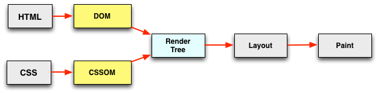

# 前端性能优化

[推荐文章](https://juejin.cn/post/6974565176427151397#heading-21)
[文章](https://www.jianshu.com/p/6f4e62a41f01)
[文章](https://alienzhou.com/projects/fe-performance-journey/5-subresources/javascript.html#_2-%E5%87%8F%E5%B0%91%E5%8C%85%E4%BD%93%E5%A4%A7%E5%B0%8F)

## 优化思路

前端性能优化主要按照从浏览器地址栏输入url，发生的整个过程展开的。

通过性能检测工具如Lighthouse、webpagetest、Performance 面板等性能分析工具页面指标的性能，并参考优化

## 性能指标和工具


### RAIL性能模型

RAIL 性能模型是一个用于衡量和优化 web 应用程序性能的框架，它由 Google 团队于2015年提出的性能模型。RAIL 模型将用户对 web 应用程序的交互分为四个主要阶段：`Response（响应）`，`Animation（动画）`，`Idle（空闲）` 和 `Load（加载）`，用于提升浏览器的用户体验和性能

**Response**

用户与网页交互时，应该尽可能快速的响应用户的操作，应在在100ms以内响应用户输入，以保持用户感觉到的流畅性和即时性。

`优化方案`

- 事件处理函数在50ms内完成，考虑到任务队列的情况，事件会排队，等待时间大概在50ms。适用于click，toggle，starting animations等，不适用于drag和scroll。
- 复杂的js计算尽可能放在后台线程，如web worker，避免对用户输入造成阻塞
- 超过50ms的响应，一定要提供反馈，比如倒计时，进度百分比等。

**Animation**

页面以每秒 60 帧的速度渲染动画，以保持流畅的视觉效果。也就是每一帧应该以16ms进行渲染。如果动画卡顿或掉帧，会给用户造成视觉上的不适和不良体验。

`优化方案`

- `requestAnimationFrame` 来优化动画和页面渲染的方法。通过将动画更新的代码放在 `requestAnimationFrame` 的回调函数中执行，可以确保动画在每次浏览器重绘之前进行更新。这样可以减少掉帧现象，使得动画更加流畅和自然。

`requestAnimationFrame` 会根据浏览器的刷新频率自动调节回调函数的执行时间。比如普通显示器60HZ它会自动对应16ms执行一次，比如高级显示器120HZ，它会自动对应9ms执行一次。它能保证回调函数在屏幕每一次的刷新间隔中只被执行一次，这样就不会引起丢帧现象。

- 避免使用 `JavaScript 定时器或频繁重绘页面，定时器时间不精准(因为任务队列的存在)

**Idle**

在用户无操作时，网页可以利用空闲时间来执行一些任务。这包括执行一些后台任务、资源的预加载、数据的预取等，以提高整体的性能和用户体验

要使网站响应迅速，动画流畅，通常都需要较长的处理时间，但以用户为中心来看待性能问题，就会发现并非所有工作都需要在响应和加载阶段完成，完全可以利用浏览器的空闲时间处理可延迟的任务，只要让用户感受不到延迟即可。

`优化方案`

- 使用 `requestIdleCallback` 空闲时间来完成一些延后的工作

```js
// 定义回调函数
function myIdleCallback(deadline) {
  while (deadline.timeRemaining() > 0) {
    // 在空闲时间内执行一些任务
    // 注意：要确保在空闲时间内尽量快速地完成任务，避免占用过多时间导致影响用户交互
  }
  // 如果任务还没有完成，可以再次请求下一个空闲时间段
  requestIdleCallback(myIdleCallback);
}
// 请求浏览器在空闲时调用回调函数
requestIdleCallback(myIdleCallback)
```

- 在空闲时间内执行的任务尽量控制在50ms以内，如果更长的话，会影响input handle的pending时间
- 如果用户在空闲时间任务进行时进行交互，必须以此为最高优先级，并暂停空闲时间的任务

**Load**

应该`5s`内内加载完成你的网站，并可以进行用户交互。根据网络条件和硬件的不同，用户对性能延迟的理解也有所不同，在3G网络需要花费更多的时间，5s是一个更现实的目标。

`方案`

- 缓存策略：合理使用浏览器缓存、CDN 缓存和 HTTP 缓存，减少资源重复加载的次数
- 静态资源：使用代码分割、按需加载、压缩合并等方式来减少初始加载的资源量
- 延迟加载：对于非关键内容或屏幕外的元素，使用懒加载或虚拟滚动等技术来延迟加载，减少初始页面的负载。
- 首次渲染优化：通过优化关键渲染路径，减少页面首次渲染的时间，提高用户感知的加载速度。

### RAIL性能指标

基于RAIL性能模型用户体验的性能指标其中包括一下几个比较重要的性能指标。

**1. FP(First Contentful Paint)**

首次像素绘制，指页面首次有像素渲染到屏幕上的时间点。它可以用来衡量用户首次感知到页面内容的时间。`（0-2S 绿色）`

**2. FCP (First Contentful Paint)**

首次内容绘制，浏览器首次绘制来自DOM的内容的时间，内容必须包括文本，图片，非白色的canvas或svg，也包括带有正在加载中的web字体文本。这是用户第一次看到的内容。`（0-2S 绿色）`

**3.FMP First Meaningful Paint** (首次有意义绘制) 页面有意义的内容渲染的时间，需要在dom元素上指定`elementtiming`属性，FMP才会有值。

```js
h1.setAttribute('elementtiming', 'meaningful')
```

**3. LCP (Largest Contentful Paint)**

最大内容绘制，可视区域中最大的内容元素呈现到屏幕上的时间，用以估算页面的主要内容对用户的可见时间。`（0-2.5S 绿色）`

**4. FID (First Input Delay)**

首次输入延迟，从用户第一次与页面进行交互（例如点击按钮、选择下拉菜单等）到页面实际响应用户输入的延迟时间，输入延迟是因为浏览器的主线程正忙于做其他事情，所以不能响应用户，发生这种情况的一个常见原因是浏览器正忙于解析和执行应用程序加载的大量计算的JavaScript。`(0- 100ms 绿色)`

**5. TTI (Time to Interactive)**

持续可交互时间，指页面加载完成并且主线程空闲时的时间点 浏览器已经可以持续的响应用户的输入，完全达到可交互的状态的时间是在最后一个长任务完成的时间，并且在随后的5s内网络和主线程是空闲的。从定义上来看，中文名称叫持续可交互时间或可流畅交互时间更合适。`(0-3.8s 绿色)`

**6. TBT (Total Block Time)**

总阻塞时间，度量了FCP和TTI之间的总时间，在该时间范围内，主线程被阻塞足够长的时间以防止输入响应。只要存在长任务，该主线程就会被视为阻塞，该任务在主线程上运行超过50毫秒。`（0 - 300ms 绿色）`

**7. CLS (Cumulative Layout Shift)**

累计布局位移，CLS会测量在页面整个生命周期中发生的每个意外的布局移位的所有单独布局移位分数的总和，他是一种保证页面的视觉稳定性从而提升用户体验的指标方案。`(0 - 0.1ms) 绿色`

用人话来说就是当点击页面中的某个元素的时候，突然布局变了，手指点到了其它位置。比如想点击页面的链接，突然出现了一个banner。这种情况可能是因为尺寸未知的图像或者视频。

  - 指定图片和媒体元素的大小： 在加载图片和媒体元素之前，为它们指定固定的大小，可以避免页面加载时元素大小变化导致的布局位移。
  - 避免动态添加内容： 动态添加内容（例如广告、用户评论等）可能导致页面布局发生变化，从而增加 CLS。尽量在页面加载时就预留足够的空间，避免在加载过程中再动态添加内容。
  - 使用占位符或者 Skeleton 屏： 在页面加载过程中，可以使用占位符或者 Skeleton 屏来预先占据页面布局空间，以防止页面加载过程中元素位置变化导致的布局位移。

**DCL (DomContentLoaded)** (DOM加载完成) 当 HTML 文档被完全加载和解析完成之后,DOMContentLoaded 事件被触发，无需等待样式表、图像和子框架的完成加载

**L (onLoad)** 当依赖的资源全部加载完毕之后才会触发

### Web Vitals性能指标

这也是谷歌指定的web性能指标标准, 谷歌认为之前的标准太复杂，指标太多了，在2020年重新进行了梳理，简化到了三个。加载性能`LCP`，交互性`FID`，视觉稳定性`CLS`。只需要做好这三个，网站的性能基本上就可以了。

### 性能分析工具

`Chrome 开发者工具` Network 面板可以查看网络请求的时间线和性能指标，Performance 面板可以捕获页面加载和执行过程的性能剖析，Memory 面板可以检查内存使用情况等。

`Lighthouse`: 由 Google 开发的开源工具，用于评估网页的性能、易用性、最佳实践、SEO、PWA支持程度。它提供了综合的性能报告，包括性能指标、最佳实践建议和优化建议。

`webpagetest网站`:  是一个开源的性能测试工具，用于评估网页加载速度和性能。它可以模拟真实用户的浏览器环境，并提供丰富的性能指标和报告，帮助开发者分析和优化网页的性能表现。你可以选择全球各地的测试服务器和不同的浏览器（如 Chrome、Firefox、Safari 等）。你可以配置其他测试选项，如测试的带宽、连接类型、测试次数、用户脚本等。测试完成后，你将获得一个详细的性能报告，其中包含各种性能指标、加载时间线、资源分析、建议优化等。

`performance面板`： 可以记录和分析页面的性能数据。它提供了时间线视图，展示了页面加载过程中的各个事件和活动，如网络请求、渲染、脚本执行等。你可以使用 Performance 面板来分析整体性能，发现性能瓶颈，并查看每个活动的耗时和资源消耗情况。

`插件Web-Vitals`: 谷歌浏览器可以直接在插件市场中查找并且安装web vitals。安装完成之后浏览器的右上角会多出插件标志，点击就会显示页面的性能指标。

`window.performance`:  是浏览器提供的一个 API，用于访问和测量与页面性能相关的信息。它提供了一组方法和属性，可用于获取各种性能指标和计时信息

`制定性能监控方案`

### 包分析工具

`Webpack Bundle Analyzer`: 一个用于分析和可视化 Webpack 打包文件的工具。它可以帮助你了解打包文件的大小、依赖关系和潜在的性能问题，从而优化应用程序的打包体积和加载速度。

## 性能优化路径

性能优化基本是围绕当浏览器地址栏输入url，发生的整个过程展开的。

前端性能优化的基本原则：介绍前端性能优化的基本原则，如减少网络请求、优化资源加载、缓存策略、优化渲染性能等。这些原则可以作为你回答后续问题的基础。

### DNS解析优化

`DNS` 解析是将域名转换为对应的 `IP` 地址的过程，当浏览器从第三方服务器请求资源时，必须先将该跨域域名解析为IP地址，才能进行TCP连接。DNS 解析方案是 先查DNS缓存，再递归解析

一般来说，在前端优化中与DNS有关的有两点：

- 减少DNS的请求次数(缓存DNS地址)：现在浏览器做了DNS缓存处理，将多个小文件合并成一个文件，减少 DNS 的请求次数
- 进行DNS的预解析DNS Prefetch：可以对常用的第三方资源域名进行预解析。

```html
<!-- 1. 用meta信息来告知浏览器, 当前页面要做DNS预解析 -->
<meta http-equiv="x-dns-prefetch-control" content="on">
<!-- 2. 使用HTML的DNS预解析标签：在页面 header 中使用 link 标签来强制对 DNS 预解析 -->
<link rel="dns-prefetch" href="//ha.aa.bb">
```

1. DNS-prefetch仅对跨域的DNS查找有效。
2. dns-prefetch要谨慎使用，多页面重复DNS预解析会增加DNS查询次数。
3. 默认情况下浏览器会对页面中和当前域名不在同一个域的域名进行预获取，并且缓存结果，这就是隐式的DNS Prefetch。如果想对页面中没有出现的域进行获取，那么就要使用显示的DNS Prefetch了。
4. 虽然使用DNS Prefetch能够加快页面的解析速度，但是也不能滥用，因为有开发者指出禁用DNS预获取能节省每月100亿的DNS查询。

### 缓存

缓存可以说是性能优化中最简单高效的一种优化方式了。一个优秀的缓存策略可以缩短网页请求资源的距离、减少延迟，并且由于避免了相同资源的重复传输，还可以减少带宽、降低网络负荷。缓存策略：讨论如何使用浏览器缓存、CDN 缓存和 HTTP 缓存来减少资源的重复加载，通过设置正确的缓存头、使用版本控制和缓存清除策略来实现更好的缓存效果。

- 一是让用户在服务端资源未更新时直接使用客户端缓存，避免重复获取带来的带宽浪费。
- 二是客户端缓存失效的情况下，发送请求从服务端缓存中直接获取资源，从而减少源服务器计算量。服务端缓存包括反向代理服务器(Nginx)、CDN 缓存。源服务器自身还有数据库缓存，只是不在我们讨论的范畴。

微观上可以分为：CDN缓存、代理服务器缓存、客户端缓存


### CDN 缓存

CDN 全称 Content Delivery Network，即内容分发网络。也叫 CDN 加速服务器。通俗地讲，CDN 就是一些缓存服务器的承包商。比如某网站托管的服务器在北京，且采用 CDN 了技术服务。那么 CDN 就会把北京服务器的数据分发到很多其他部署 CDN 技术 的服务器上。这样一来，用户在浏览网站的时候，CDN 会选择一个离用户最近的 CDN 边缘节点来响应用户的请求，海南移动用户的请求就不会千里迢迢跑到北京电信机房的服务器上了。

不仅让用户在最短的请求时间拿到资源，降低了访问延时；还分流了来自四面八方的海量请求，大大减轻了源服务器的负载压力。

本地缓存失效后，浏览器会向 CDN 边缘节点(异地节点)发起请求。CDN 缓存策略因服务商不同而不同，但一般都会遵循 HTTP 标准协议，通过 HTTP 响应头中的Cache-control: max-age字段来设置 CDN 边缘节点数据缓存时间。如果 CDN 节点的缓存也过期了，节点就会向源服务器发出回源请求，从服务器拉取最新数据来更新节点本地缓存，并将最新数据返回给客户端。

CDN 服务商一般会提供基于文件后缀、目录多个维度来指定 CDN 缓存时间，为用户提供更精细化的缓存管理。

### 代理服务器缓存

代理服务器是浏览器和源服务器之间的中间服务，如Nginx反向代理服务器。浏览器先向这个中间服务器发起 web 请求，经过权限验证、缓存匹配等处理后，再将请求转发到源服务器。代理服务器缓存的运作原理与浏览器缓存原理类似，只是规模更大、面向群体更广。
它属于共享缓存，很多地方都可以使用其缓存资源，对于节省流量有很大作用。

### 浏览器/HTTP缓存优化

**什么资源会被缓存**

- 用 HTTP 协议 GET 方法请求的资源默认都会被缓存，譬如html文档、图片、文件等；
- 服务器响应中，包含 `Cache-Control` 头的资源，根据具体指令确定是否要缓存。

缓存位置：Service Worker -> Memory Cache -> Disk Cache -> Push Cache。当以上都没有命中资源的时候才去做网络请求。

**常用的缓存策略**

1. 我们经常说的强缓存和协商缓存，那么想一想在项目上，什么文件用强缓存？什么文件用协商缓存呢？那么我这里就来说一说。

就拿前端SPA部署来说，打包过后的文件为 index.html、css、js、img 文件等，

- `index.html` 应该不缓存，或者是设置 `no-cache` 的强缓存（即资源被缓存，但立即失效，下次请求会验证资源是否过期）+ 协商缓存`ETag/Last-Modified` 来验证资源缓存是否最新，保证 index.html 每次都从服务器获取最新的；
- `js、css、img` 等静态资源文件会在`webpack`打包后生成对应的 `hash` 标识，所以这些文件可以设置一个比较长的缓存时间，比如1年；

2. 那么 index.html 为什么不该缓存呢？

　　因为他是应用的入口，只有加载它之后才会加载它引用的资源文件，所有要保证 index.html 不被缓存，这样你才能保证本地资源版本跟服务器一致。

　　至于css、img、js等资源文件如果重新打包，那么他们的文件名也会根据内容发生变化（`contentHash`），都是不同的文件了也就不担心缓存带来的副作用了。

　　也就是说 index.html，切记不要设置强缓存！！！其他资源采用强缓存 + 协商缓存。

3. 为什么是强缓存 + 协商缓存呢？

　　有这么一句话：“协商缓存需要配合强缓存使用”。

　　因为我们经常看到的协商缓存中，除了Last-Modified这个header，还有强缓存的相关header，因为如果不启用强缓存的话，协商缓存根本没有意义。

　　其实很好理解的哈，如果不开启强缓存，本地都没任何缓存，还“协商”个P啊，只能服务器读取了

🍀 html：no-cache

🍀 js文件：max-age=2592000(一个月),s-maxage=86400；文件命名带版本号或指纹信息，方便及时更新。

🍀 CSS文件：max-age=2592000,s-maxage=3600；文件命名带版本号或指纹信息，方便及时更新。

图片：max-age=15552000；文件命名带版本号或指纹信息，方便及时更新。

🍀 XHR请求： no-cache（s-maxage的优先级比max-age高。s-maxage是代理服务器的缓存时间）

### http请求优化

一个完整的 HTTP 请求需要经历 DNS 查找，TCP 连接，浏览器发出 HTTP 请求，服务器接收请求，服务器处理请求并发回响应，浏览器接收响应等过程

- 减少请求数量： 合并多个小资源请求为一个大的请求，减少网络请求的次数。可以使用构建工具对 CSS、JavaScript 文件进行合并，或者使用雪碧图（CSS Sprites）来减少图片请求。
- 减少请求资源的体积：主要通过 webpack中代码压缩、`tree shaking`、按需加载、Gzip等技术优化资源体积
- 请求优化：使用 HTTP/2 或 HTTP/3 协议，利用其多路复用和头部压缩等特性，减少请求的延迟和带宽消耗
- HTTP 预连接（HTTP Preconnect）：用于在浏览器发起实际请求之前，提前建立与服务器的连接，以减少连接建立的延迟。它可以预先解析域名、建立 TCP 连接和执行 TLS 握手等操作，使后续的请求能够更快地完成。

  ```html
  <link rel="preconnect" href="https://example.com">
  ```

  需要注意的是，预连接并不适用于所有的资源和所有的情况。它主要适用于延迟敏感的资源请求，例如从不同域名加载的资源、跨域资源、第三方资源等。对于同域名下的资源请求，浏览器会自动进行连接复用，因此预连接的效果会有所减弱。

### 关键渲染路径优化

浏览器收到服务器响应的资源后，进入页面渲染阶段，进行构建DOM，生成CSSOM，构建render tree、布局、绘制一系列过程，对这一路径进行优化

这一阶段浏览器需要处理的东西很多，为了更好地理解性能优化，我们主要将其分为几个部分：

- 页面 DOM 的解析；
- 页面静态资源的加载，包括了页面引用的 JavaScript/CSS/图片/字体等；
- 静态资源的解析与处理，像是 JavaScript 的执行、CSSOM 的构建与样式合成等

**注意资源在页面文档中的位置**

我们的目标是收到内容就尽快解析处理，页面有依赖的资源就尽快发送请求，收到响应则尽快处理。然而，这个美好的目标也有可能会被我们不小心破坏。

JavaScript 脚本和 CSS 样式表在关于 DOM 元素的属性，尤其是样式属性上都有操作的权利。现在也是两方在竞争同一个资源，显然也是会有互斥的问题。这就带来了 DOM 解析、JavaScript 加载与执行、CSS 加载与使用之间的一些互斥关系。

仅仅看 DOM 与 CSS 的关系，则如下图所示：



HTML 解析为 DOM Tree，CSS 解析为 CSSOM，两者再合成 Render Tree，并行执行，非常完美。然而，当 JavaScript 入场之后，局面就变了：


根据标准规范，在 JavaScript 中可以访问 DOM。因此当遇到 JavaScript 后会阻塞 DOM 的解析。于此同时，为避免 CSS 与 JavaScript 之间的竞态，CSSOM 的构建会阻塞 JavaScript 的脚本执行。

总结起来就是: JavaScript 会阻塞 DOM 构建，而 CSSOM 的构建又回阻塞 JavaScript 的执行。

**针对JavaScript优化**

- 尽量将JavaScript文件放在 `body` 的最后，或者通过 `defer` 和 `async` 异步加载。`webpack` 打包会自动处理
- 减小JS文件加载耗时： 使用 `webpack` 通过 webpack中代码压缩、`tree shaking`、按需加载等技术优化js文件体积，从而减少下载耗时
- 减小JS文件解析执行耗时：避免 Long Task

**针对CSS优化**

由于很多时候，关键 CSS 不会太大，因此有一种常见的优化措施是，将关键 CSS 的内容通过 `<style>` 标签内联到 `<head>` 中，然后异步加载其他非关键 CSS。这样对于关键路径的渲染可以减少一次 RTT (Round-Trip Time)。用户可以更快看到一些页面初始的渲染结果。

经典的骨架屏可以算是这种思路的一个延展。我们会生成一个不包含实际功能的静态页面，将必要的脚本、样式、甚至图片（base64）资源都内联到其中，当用户访问时直接先返回该页面，就可以很快让用户看到页面结果，之后在异步渐进加载预渲染，就会让用户感觉“很快”。

使用CSS有三种方式：使用link、@import、style内联样式

- link：浏览器会派发一个新等线程(HTTP线程)去加载资源文件，与此同时GUI渲染线程会继续向下渲染代码
- @import：GUI渲染线程会暂时停止渲染，去服务器加载资源文件，资源文件没有返回之前不会继续渲染(阻碍浏览器渲染)
- style：GUI渲染线程直接渲染

`优化`

- 外部样式如果长时间没有加载完毕，浏览器为了用户体验，会使用浏览器会默认样式，确保首次渲染的速度。所以CSS一般写在headr中，让浏览器尽快发送请求去获取css样式。所以，在开发过程中，导入外部样式使用link，而不用@import。如果css少，尽可能采用内嵌样式，直接写在style标签中。
- CSS 压缩，相应的 CSS uglify 工具
- 简化CSS选择器的层级，尤其是使用 SASS、LESS 这样的工具时，因为选择器是从左向右进行解析的
- 分离CSS文件：Css 文件默认被打包到 js 文件中，当 js 文件加载时，会创建一个 style 标签来生成样式。这样对于网站来说，会出现闪屏现象，用户体验不好。 使用 mini-css-extract-plugin 将css抽离成单独的文件，通过 link 标签加载性能才好

## Vue 代码优化

- `组件缓存`
  
  keep-alive是Vue提供的组件缓存功能，可以缓存动态组件或者路由组件。合理使用keep-alive可以减少组件的重复渲染，提高页面的性能

- `computed 和 watch 区分使用`
  
  当我们需要进行计算时，并且依赖于其它数据时，应该使用 computed，因为可以利用 computed 的缓存特性，避免每次获取值时，都要重新计算；当我们需要在数据变化时执行异步或开销较大的操作时，应该使用 watch

- `v-if 和 v-show 区分使用`
  
  v-if 适用于在运行时很少改变条件，不需要频繁切换条件的场景；v-show 则适用于需要非常频繁切换条件的场景

- `v-for使用key`
  
  v-for 遍历必须为item添加唯一的key， 提高 diff 计算准确性和快速性

- `v-for避免同时使用 v-if`
  
  v-for 比 v-if 优先级高，如果每一次都需要遍历整个数组，将会影响速度，尤其是当之需要渲染很小一部分的时候，必要情况下应该替换成 computed 属性

- `v-once`
  使用 v-once 的场景通常是那些不频繁改变的静态内容，如标题、说明文本等。通过将这些内容标记为一次性渲染，可以避免不必要的虚拟 DOM 比对和重绘，提高性能和渲染效率。

- `冻结不需要响应式变化的数据`
  
  初始化时Vue 会通过 Object.defineProperty 对数据进行劫持，来实现响应数据，然而有些时候我们的组件就是纯粹的数据展示，不会有任何改变，我们就不需要 Vue 来劫持我们的数据，在大量数据展示的情况下，这能够很明显的减少组件初始化的时间，那如何禁止 Vue 劫持我们的数据呢？可以通过 Object.freeze 方法来冻结一个对象，一旦被冻结的对象就再也不能被修改了。也就是将其configurable属性（可配置）设置为false。defineReactive函数中有段代码，检测数据上某个key对应的值的configurable属性是否为false，若是就直接返回，若不是继续配置getter/setter属性。

- `提前过滤掉非必须数据`

  接收服务端传来的数据，都会有一些渲染页面时用不到的数据。服务端的惯例，宁可多传也不会少传。

  所以要先把服务端传来的数据中那些渲染页面用不到的数据先过滤掉。然后再赋值到data选项中。可以避免多余的响应式处理。去劫持那些非渲染页面需要的数据，减少循环和递归调用，从而提高渲染速度。

- `事件的销毁，定时器清除`

  Vue 组件销毁时，会自动清理它与其它实例的连接，解绑它的全部指令及事件监听器，但是仅限于组件本身的事件。 如果在 js 内使用 addEventListene 等方式是不会自动销毁的，我们需要在组件销毁时手动移除这些事件的监听，以免造成内存泄露

- `子组件分割合理`
  
  状态逻辑较重组件适合拆分，render 时内容较少。但也不适合过度拆分，尤其是一些不会重新 render 的部分，拆分成组件，组件实例消耗远远大于纯 dom 渲染消耗。
  
  单一职责原则：每个子组件应该只关注一个特定的功能或视图展示，根据不同的功能模块将子组件进行分割。将相似的功能模块抽象为可复用的子组件，例如导航栏组件、列表组件、表单组件等。

- `防抖、节流运用`

## Webpack5优化

看webpack

## 其他优化

- 使用 requestAnimationFrame 来实现视觉变化
- Web Workers 适用于那些处理纯数据，或者与浏览器 UI 无关的长时间运行脚本。
- 减少 HTTP 请求，多个小文件合并为一个大文件（一个完整的 HTTP 请求需要经历 DNS 查找，TCP 握手，浏览器发出 HTTP 请求，服务器接收请求，服务器处理请求并发回响应，浏览器接收响应等过程）
- 减少 dom 操作,减少回流与重绘（可以不说，vue 不操作 dom）
- 骨架屏
- 使用http2

## 页面白屏优化

白屏时间节点指的是从用户进入网站（输入url、刷新、跳转等方式）的时刻开始计算，一直到页面有内容展示出来的时间节点。白屏时间既可以是 `FP` 也可以是 `FCP`，具体取决于定义白屏的标准和测量方法。

这个过程包括dns查询、建立tcp连接、发送首个http请求（如果使用https还要介入TLS的验证时间）、返回html文档、html文档head解析完毕。

### 如何检测白屏时间

1. **MutationObserver**

MutationObserver 是一个 JavaScript API，用于监视 DOM 树的变化。它可以异步地观察 DOM 的变动，并在变动发生时执行回调函数。MutationObserver 可以用于监测 DOM 元素的插入、删除、属性变化等情况，而且相比传统的事件监听（如 DOMSubtreeModified）具有更高的性能和更多的灵活性。

在 Vue 项目中通过 MutationObserver 检测首屏白屏时间

```js
// 在 main.js 或者入口文件中引入 MutationObserver
import Vue from 'vue';

// 创建一个 MutationObserver 实例
const observer = new MutationObserver((mutationsList, observer) => {
    // 遍历每一个 mutation 记录
    for(let mutation of mutationsList) {
        // 如果有新节点添加到了文档中
        if (mutation.type === 'childList') {
            // 判断文档是否完全加载完成
            if (document.readyState === 'complete') {
                // 计算并输出白屏时间
                const whiteScreenTime = performance.now();
                console.log('首屏白屏时间（ms）：', whiteScreenTime);
                // 停止 MutationObserver 监听
                observer.disconnect();
                break;
            }
        }
    }
})

// 配置观察选项
const config = { childList: true, subtree: true };

// 启动 MutationObserver 监听，监测文档的子节点变化
observer.observe(document, config);

// 在 Vue 实例化之前，初始化 MutationObserver
new Vue({
  render: h => h(App),
}).$mount('#app');

```

2. **window.performance API** 可以获取页面加载和渲染的性能指标
3. **Performance和Lighthouse**
4. **监听 DOMContentLoaded 事件**

DOMContentLoaded 事件在浏览器解析完所有的 HTML，并完成 DOM 树的构建后触发。可以在该事件回调中记录当前时间戳，作为白屏时间的起点

通过 DOMContentLoaded 事件检测首屏白屏时间的基本思路是在事件触发时记录当前时间，并与页面开始加载的时间进行比较，从而计算出首屏白屏时间。以下是一个示例代码，演示了如何在 Vue 项目中使用 DOMContentLoaded 事件检测首屏白屏时间：

```js
// 在 Vue 实例化之前，记录页面开始加载的时间戳
const startTime = window.performance.now();

// 添加 DOMContentLoaded 事件监听器
document.addEventListener('DOMContentLoaded', () => {
    // 计算白屏时间
    const whiteScreenTime = window.performance.now() - startTime;
    console.log('首屏白屏时间（ms）：', whiteScreenTime);
});

// Vue 实例化
new Vue({
  el: '#app',
  render: h => h(App)
});
```

在这个示例中，我们在 Vue 实例化之前记录了页面开始加载的时间戳 startTime。然后，通过 document.addEventListener 方法添加了一个 DOMContentLoaded 事件的监听器。当页面的 DOMContentLoaded 事件触发时，回调函数会被执行，我们在回调函数中计算了首屏白屏时间，并输出到控制台。

需要注意的是，DOMContentLoaded 事件表示页面的 HTML 结构已经完全加载并解析完成，但并不代表页面的所有资源都已经加载完成。因此，首屏白屏时间仅仅是一个页面加载性能的指标之一，应该结合其他性能指标综合评估页面的加载情况。

**白屏原因**

- 弱网条件下，网络延迟，js加载延迟等会阻塞页面
- 请求的资源文件体积是否过大
- css 阻塞不会阻塞dom解析 但是会阻塞渲染

### 优化白屏方案

- 优化打包体积
  1. 利用 webpack Scope Hoisting、Tree Shaking、代码压缩等方式优化打包体积
  2. 使用 `babel-plugin-component` 插件来按需引入所需的 `Element UI` 组件，仅加载所需的组件，而不是一次性加载整个组件库
- 减少请求的数量
  1. 使用异步组件或者 `import` 方式实现路由懒加载，将不同的路由对应的不同组件分割成不同的代码块，当路由被访问的时候才加载对应组件
  2. svg图标合成雪碧图
- Prefetch(预获取)首页js资源和图片资源
- 配置合理的强缓存和协商缓存字段
- dns预解析、CDN缓存

**其他解决方案**

- SSR
- 预渲染
- 骨架屏
- quicklink就是在浏览器空闲的时候去指定需要加载的数据,这个是谷歌开源的，可以去看看
- 服务端的处理优化： 会涉及到 Redis缓存、数据库存储优化，或是系统各个中间件以及Gzip压缩等

## 页面首屏优化

1. 代码层面的优化

Vue 项目的代码层面优化主要有以下几个方面：

- 尽可能地使用异步加载组件，可以使用 webpack 的代码分割功能来实现，以减少首屏加载时间。
- 对于一些不常用的第三方库或组件，可以使用按需加载，即在需要使用的时候再动态加载，以减少首屏加载的数据量。
- 对于大量数据的列表展示，可以使用虚拟滚动等技术进行优化，以减少首屏渲染的时间。

2. 图片和静态资源的优化

图片和静态资源的优化可以从以下几个方面入手：

- 使用 WebP 格式的图片，可以减小图片的体积，从而减少首屏加载时间。
- 对于较大的图片，可以使用图片懒加载的方式进行优化，即在用户滚动到图片位置时再进行加载。
- 使用 CDN 加速静态资源的加载，可以减少首屏加载时间。

3. 服务器端渲染（SSR）

使用服务器端渲染可以将页面的渲染工作从客户端转移到服务器端，从而提高首屏加载速度。SSR 可以减少客户端请求服务器的次数，以及客户端的渲染时间。

4. 数据层面的优化

对于后台管理系统中的大量数据的展示，可以从以下几个方面入手：

- 对于需要展示的数据进行分页处理，以减少首屏加载的数据量。
- 在后端进行数据缓存，以减少后端数据库的查询次数。
- 对于需要多次查询的数据，可以进行数据的预处理，以减少查询时间。

## 渲染十万条数据

对于大数据量来说，我们大部分的操作都是：`懒加载`、`分页`、`Object.freeze冻结数组取消响应式`，因为大多时候都是展示，`高清图替换成缩略图`，因为很多时候长列表的图尺寸都比较小，所以可以用小图来代替。 对于大量数据渲染的时候，JS运算并不是性能的瓶颈，性能的瓶颈主要在于渲染阶段

以上能解决大部分的长列表问题，在可以分页的情况下。但是，还有两个问题没有解决

1. 不能分页的时候怎么办
2. 当用户向下滑动加载了很多很多的内容时，可能是 1000 个 10000 个的时候。这个时候浏览器就会变得卡顿，特别是在手机上。原因就是因为浏览器渲染了太多的 div，消耗了很多的资源（重绘和回流都是需要浏览器资源的）

### 分片渲染（分页）

[参考](https://juejin.cn/post/6844903938894872589)

一次性渲染大量数据的时候浏览器容易卡死，这种方法只适合渲染简单数据。对于复杂DOM的情况，一般会用到虚拟列表的方式来实现

setTimeout 会出现白屏现象，使用 requestAnimationFrame 解决

```js
mounted() {
  for(let i = 0 ;i <10000; i++){
    this.allList.push('我是第'+i+"条数据")
  }
  this.load()
},
methods: {
  load( ){
    let tempList = this.allList.slice(this.start, this.start + this.size);
    if(tempList && tempList.length > 0){
      setTimeout(() => {
        this.dealList = [...this.dealList,...tempList]
        this.start =this.start+this.size;
        this.load()
      }，100);
    }
  },
```

`缺点`

- 效率低时间分片相当于代码替用户去触发懒加载，伴随着 事件循环 逐次的渲染DOM，渲染消耗的总时间肯定比一次渲染所有DOM多不少。
- 不直观因为页面是逐渐渲染的，如果用户直接把滚动条拖到底部看到的并不是最后的数据，需要等待整体渲染完成。
- 性能差实际开发出的代码不是一个`<tr>` or `<li>`标签加数据绑定这么简单，随着 dom 结构的复杂（事件监听、样式、子节点...）和 dom 数量的增加，占用的内存也会更多，不可避免的影响页面性能。

### 虚拟列表

`虚拟列表`是指在大数据量的情况下，只对可见区域渲染，对非可见区域不渲染或部分渲染，从而减少性能消耗

使用 overflow: auto 来创建一个滚动容器，然后通过设置容器的高度和宽度，以及 scroll 事件监听器，来实现虚拟滚动。当用户滚动容器时，计算出滚动的距离并计算出应该显示哪些数据，只渲染这些数据。

虚拟列表将完整的列表分为三个区域：虚拟区 / 缓冲区 / 可视区

  - 虚拟区为非可见区域不进行渲染
  - 缓冲区为后续优化滚动白屏使用，暂不渲染
  - 可视区为用户视窗内的数据，需要渲染对应的列表项


**定高实现** [文章](https://juejin.cn/post/7138070983381876749#heading-1)

- 给外层的容器设置`固定高度`，并设置 `overflow-y: auto`来创建滚动容器
- 容器滚动绑定监听事件，当滚动后，我们要获取距离顶部的高度scrollTop ，然后计算 开始索引start 和 结束索引end ，根据他们截取数据，并计算 当前偏移量currentOffset 用于将渲染区域偏移至可见区域中 。

  ```html
  <template>
    <!-- 可视区域的容器 -->
    <div class="container" ref="virtualList">
      <!-- 占位，用于形成滚动条 -->
      <div class="phantom" :style="{ height: listHeight + 'px' }"></div>
      <!-- 列表项的渲染区域 -->
      <div 
        class="content" 
        :style="{ transform: `translate3d(0, ${currentOffset}px, 0)` }">
        <div
          v-for="item in visibleData"
          :key="item.id"
          :style="{ height: itemSize + 'px', lineHeight: itemSize + 'px' }"
          class="list-item"
        >
          {{ item.value }}
        </div>
      </div>
    </div>
  </template>
  <script>
  export default {
    data() {
      return {
        listData: [], // 数据
        itemSize: 50, // 每一项高度
        screenHeight: 0, // 可视区域高度
        currentOffset: 0, // 偏移距离
        start: 0, // 起始索引
        end: 0, // 结束索引
      };
    },
    mounted() {
      for (let i = 1; i <= 1000; i++) {
        this.listData.push({id: i, value: '字符内容' + i})
      }
      this.screenHeight = this.$el.clientHeight;
      this.start = 0;
      this.end = this.start + this.visibleCount;
      // this.$refs.virtualList.addEventListener("scroll", (event) =>
      //  this.scrollEvent(event.target)
      // );
       // 绑定滚动事件
      let target = this.$refs.virtualList
      let scrollFn = (event) => this.scrollEvent(event.target)
      let debounce_scroll = lodash.debounce(scrollFn, 320)
      let throttle_scroll = lodash.throttle(scrollFn, 160)
      target.addEventListener("scroll",  debounce_scroll);
      target.addEventListener("scroll",  throttle_scroll);

    },
    computed: {
      // 列表总高度
      listHeight() {
        return this.listData.length * this.itemSize;
      },
      // 渲染区域元素数量
      visibleCount() {
        return Math.ceil(this.screenHeight / this.itemSize);
      },
      // 获取真实显示列表数据
      visibleData() {
        return this.listData.slice(this.start, this.end);
      },
    },
    methods: {
      scrollEvent(target) {
        const scrollTop = target.scrollTop; //当前滚动位置
        this.start = ~~(scrollTop / this.itemSize);  //此时的开始索引
        this.end = this.start + this.visibleCount;  //此时的结束索引
        this.currentOffset = scrollTop - (scrollTop % this.itemSize); //此时的偏移量
      },
    },
  };
  </script>

  <style scoped>
  .container {
    position: relative;
    height: 90vh;
    overflow: auto;
  }
  .phantom {
    position: absolute;
    top: 0;
    right: 0;
    left: 0;
  }
  .content {
    position: absolute;
    top: 0;
    right: 0;
    left: 0;
    text-align: center;
  }
  .list-item {
    padding: 10px;
    border: 1px solid #999;
    box-sizing: border-box;
  }
  </style>
  ```

**不定高** [文章](https://juejin.cn/post/7168645862296879117#heading-11)

每项的高度由数据自动撑开，不要那种固定高度的。

首先咱们预估一下每个item 的高度（默认高度，如果没有这个高度的话，会导致滚动条只有一点点，看起来会很别扭），滚动到对应位置的时候，渲染并将高度记录到咱们的缓存对象中。随着滚动条的滚动，咱们会陆续更新每一个item的高度，使得滚动条的高度越来越真实。

```html
<template>
  <div class="container" ref="virtualList">
    <!-- 占位元素 -->
    <div class="phantom" :style="{ height: listHeight + 'px' }"></div>
    <!-- 渲染区域 -->
    <div class="content" :style="{ transform: `translate3d(0, ${currentOffset}px, 0)` }">
      <div ref="items" v-for="item in visibleData" :key="item.id" class="list-item">
        {{ item.value }}
      </div>
    </div>
  </div>
</template>

<script>
import lodash from 'lodash'
export default {
  data() {
    return {
      screenHeight: 0, // 可视区域高度
      listData: [],
      currentOffset: 0, // 偏移量
      start: 0,
      end: 10,
      preItemSize: 50, // 预估高度
      // 缓存列表
      positions: [
        // 列表项对象
        {
          index: 0,  // 对应listData的索引
          top: 0,  // 列表项顶部位置
          bottom: 50,  // 列表项底部位置
          height: 50,  // 列表项高度
        }
      ],
      bufferPercent: 0.5, // 即每个缓冲区只缓冲 0.5 * 最大可见列表项数 个元素
    };
  },
  computed: {
    // 列表总高度listHeight的计算方式改变为缓存列表positions最后一项的bottom：
    listHeight() {
      return this.positions[this.positions.length - 1].bottom;
    },
    // 可视区数据
    visibleData() {
      // return this.listData.slice(this.start, this.end);
       return this.listData.slice(this.start - this.aboveCount, this.end + this.belowCount); // 增加缓冲
    },
    // 可视区元素数量
    visibleCount() {
      return Math.ceil(this.screenHeight / this.preItemSize);
    },
    /*---------------缓冲-------------*/ 
    bufferCount() {
      return this.visibleCount * this.bufferPercent >> 0; // 向下取整
    },
    // 使用索引和缓冲数量的最小值 避免缓冲不存在或者过多的数据
    aboveCount() {
        return Math.min(this.start, this.bufferCount);
    },
    belowCount() {
        return Math.min(this.listData.length - this.end, this.bufferCount);
    },
  },
  created() {
    // 1. 创建1000个随机的文本
    for (let i = 1; i <= 1000; i++) {
      this.listData.push({ id: i, value: this.generateRandomString() })
    }
  },
  mounted() {
    // 2. 绑定滚动事件
    let target = this.$refs.virtualList
    let scrollFn = (event) => this.scrollEvent(event.target)
    let debounce_scroll = lodash.debounce(scrollFn, 100)
    let throttle_scroll = lodash.throttle(scrollFn, 100)
    target.addEventListener("scroll", debounce_scroll);
    target.addEventListener("scroll", throttle_scroll);

    this.initPositions(this.listData)
    this.screenHeight = this.$el.clientHeight;

  },
  updated() {
    //  this.updatePositions()
    this.currentOffset = this.getCurrentOffset()
  },
  methods: {
    // 3. 初始化缓存列表，在后续更新时再进行替换
    initPositions(listData) {
      this.positions = listData.map((item, index) => {
        return {
          index,
          top: index * this.preItemSize,
          bottom: (index + 1) * this.preItemSize,
          height: this.preItemSize,
        }
      })
    },
    // 4.1 当滚动时，获取列表数据开始索引start。计算方法修改为：遍历 缓存列表positions 匹配第一个大于当前滚动距离scrollTop的项，并返回该项的索引
    // 4.2 滚动后立即根据positions的预估值（此时数据还未更新）计算窗口偏移量currentOffset
    // 4.3 在每次渲染后，获取真实DOM的高度去替换positions里的预估高度
    // 4.4 更新完positions后，当前窗口偏移量currentOffset也要根据真实情况重新赋值
    scrollEvent(target) {
      const scrollTop = target.scrollTop;
      this.start = this.getStartIndex(scrollTop)
      this.end = this.start + this.visibleCount;
      // this.currentOffset = scrollTop - (scrollTop % this.itemSize);
      this.currentOffset = this.getCurrentOffset() // 每次滚动之后计算偏移量

      this.$nextTick(() => { // 每次渲染之后
        this.updatePositions()
      })

    },

    // 获取开始下标
    getStartIndex(scrollTop = 0) {
      let item = this.positions.find(item => item && item.bottom > scrollTop);
      return item.index;
    },
    // 根据真实元素大小，更新对应的缓存列表
    updatePositions() {
      let nodes = this.$refs.items;
      nodes.forEach((node) => {
        // 获取 真实DOM高度
        const { height } = node.getBoundingClientRect();
        // 根据 元素索引 获取 缓存列表对应的列表项
        const index = +node.id
        let oldHeight = this.positions[index].height;
        // dValue：真实高度与预估高度的差值 决定该列表项是否要更新
        let dValue = oldHeight - height;
        // 如果有高度差 !!dValue === true
        if (dValue) {
          // 更新对应列表项的 bottom 和 height
          this.positions[index].bottom = this.positions[index].bottom - dValue;
          this.positions[index].height = height;
          // 依次更新positions中后续元素的 top bottom
          for (let k = index + 1; k < this.positions.length; k++) {
            this.positions[k].top = this.positions[k - 1].bottom;
            this.positions[k].bottom = this.positions[k].bottom - dValue;
          }
        }
      })
    },
    // 获取偏移量
    getCurrentOffset() {
      if(this.start >= 1) {   
          // return this.positions[this.start - 1].bottom  
          let size = this.positions[this.start].top - (
          this.positions[this.start - this.aboveCount] ? 
          this.positions[this.start - this.aboveCount].top : 0);
          // 计算偏移量时包括上缓冲区的列表项
          return this.positions[this.start - 1].bottom - size;
      } else {
        return 0;
      }
    },


    // 随机生成文本
    generateRandomString() {
      const characters = 'abcdefghijklmnopqrstuvwxyzABCDEFGHIJKLMNOPQRSTUVWXYZ0123456789';
      const length = Math.floor(Math.random() * 301); // 生成 0-300 之间的随机长度
      let randomString = '';
      for (let i = 0; i < length; i++) {
        const randomIndex = Math.floor(Math.random() * characters.length);
        randomString += characters.charAt(randomIndex);
      }
      return randomString;
    },
  },
};
</script>

<style scoped>
.container {
  position: relative;
  height: 90vh;
  overflow: auto;
}
.phantom {
  position: absolute;
  top: 0;
  right: 0;
  left: 0;
}
.content {
  position: absolute;
  top: 0;
  right: 0;
  left: 0;
  text-align: center;
}
.list-item {
  padding: 10px;
  border: 1px solid #999;
  word-wrap: break-word;
}
</style>

```

**优化**

  - 滚动发生后，scroll回调会频繁触发，但并不是每一次回调都是有效的。很多时候会造成重复计算的问题，从性能上来说无疑存在浪费的情况。（滚动一下会触发几十次）。通过 节流函数 来限制触发频率，通过 防抖函数 保证最后一次滚动的回调正确的进行。
  - 滚动过快，出现白屏现象，是因为浏览器计算跟不上，这个问题没法解决，只能缓解一些。为了解决性能低时数据渲染不及时造成的白屏闪烁，我们创建上下缓冲区额外渲染数据，为可视区的渲染提供更多缓冲时间。为此要重写start/end和currentOffset的计算方式。
  - 异步加载：如果一定要处理列表异步加载不定高元素的场景，我们通过img.onload和ResizeObserver在加载完成后更新列表。

利用虚拟列表组件实现滚动：虚拟列表组件是一种专门用来实现虚拟滚动的组件，它的原理是只渲染可视区域内的数据，而不是渲染全部数据。这样可以大大提高页面的性能。常见的虚拟列表组件有 `vue-virtual-scroll-list`、`Vue-Virtual-Scroller` 等。

通过chrome performance查看普通列表和虚拟滚动的性能，在js生成2w条数据并渲染的情况下，普通列表需要接近5s的时间，而虚拟滚动仅需要500ms。

## 大量图片加载优化

- 图片懒加载： 页面中未出现在可视区内的图片先不做加载，等滚动到可视区（判断图片位置与浏览器顶端的距离与页面的距离）再加载（安装 vue-lazyload，将 img 标签的 src 属性直接改为 v-lazy）
- 图片预加载（如果为幻灯片，相册等，可以先加载前一张和后一张）
- 如果图片为css图片，可以使用精灵图(雪碧图)、字体图标、svg矢量图、base64编码等技术
- 缩略图：如果图片过大，可以使用特殊编码的图片，加载时会先加载一张压缩的特别厉害的缩略图

## Vue长列表优化

在大型企业级项目中经常需要渲染大量数据，此时很容易出现卡顿的情况。比如大数据表格、树。处理时要根据情况做不通处理:

- 避免大数据量:可以采取数据采用分页的方式获取
- 避免渲染大量数据:`vue-virtual-scroller`或者`vue-virtual-scroll-list`等虚拟滚动方案，只渲染视口范围内的数据
- 避免更新:可以使用`v-once`方式只渲染一次
- 优化更新:通过 `v-memo` 缓存子树，有条件更新，提高复用，避免不必要更新
- 按需加载数据:可以采用`懒加载`方式。在用户需要的时候再加载数据，比如`tree`组件子树的懒加载

## 动画性能优化

- 精简DOM，合理布局
- 使用transform代替left、top减少使用引起页面重排的属性
- 开启硬件加速
- 尽量避免浏览器创建不必要的图形层
- 尽量减少js动画，如需要，使用对性能友好的requestAnimationFrame

## 服务器端渲染

服务器端渲染和预渲染主要都是用来提升页面SEO和加载性能的

服务端渲染是指 Vue 在客户端将标签渲染成的整个 html 片段的工作在服务端完成，服务端形成的 html 片段直接返回给客户端这个过程就叫做服务端渲染。

## 预渲染

原理是在构建过程中生成静态 HTML 文件，以便服务器直接提供给客户端。这样可以在首次加载时提供完整的渲染页面，减少客户端的渲染工作，提高首屏加载速度和搜索引擎的可索引性。

- 构建过程：在项目的构建过程中，通过工具（如 Prerender SPA Plugin）将路由路径映射到对应的组件，并执行预渲染操作。
- 预渲染操作：对于每个预定义的路由路径，预渲染工具会创建一个虚拟浏览器环境，通过模拟浏览器访问应用程序的每个路由，并执行页面的渲染过程。
- 页面渲染：在虚拟浏览器环境中，应用程序的组件会被实例化，并进行数据加载、状态更新和模板渲染等操作。这样，每个页面的 HTML 内容将会在虚拟浏览器环境中生成。
- 生成静态文件：完成页面渲染后，预渲染工具将从虚拟浏览器环境中提取渲染后的 HTML 内容，并将其保存为静态 HTML 文件。
- 服务器提供静态文件：生成的静态 HTML 文件可以部署到服务器上，并由服务器直接提供给客户端。当用户访问预渲染的路由时，服务器会返回相应的静态 HTML 文件，而不需要客户端执行渲染操作。

通过预渲染，可以减少客户端的渲染工作量，加快首屏加载速度，并提高搜索引擎的可索引性。预渲染适用于那些内容相对静态、不经常更新或不依赖动态数据的页面，如公司主页、产品页面等。对于包含动态内容或需要频繁更新的部分，可以使用客户端渲染（如 SPA）或服务器端渲染（如 SSR）来满足需求。

后台管理系统的首页，通常包含了各种动态数据、权限验证和用户交互等复杂的业务逻辑，这些动态内容可能会频繁变化，并且可能需要用户登录后才能访问。

以下是在 Vue 项目中使用 `Prerender SPA Plugin` 实现预渲染的步骤：

运行`npm run build` 命令后，`Prerender SPA Plugin` 将会在打包过程中根据配置生成静态 HTML 文件，并将其输出到指定的目录中。

```js
// 在 Vue 项目的 vue.config.js 文件中添加配置：
const PrerenderSPAPlugin = require('prerender-spa-plugin');
const path = require('path');
module.exports = {
  // ...其他配置项

  configureWebpack: {
    plugins: [
      new PrerenderSPAPlugin({
        staticDir: path.join(__dirname, 'dist'), // 静态文件输出目录
        routes: ['/', '/about', '/contact'], // 需要预渲染的路由路径
      }),
    ],
  },
}
```

## Preload(预加载) Prefetch(预获取)

虽然进行了路由懒加载，但是加载速度还不够好，比如：是用户点击按钮时才加载这个资源的，如果资源体积很大，那么用户会感觉到明显卡顿效果。我们想在浏览器空闲时间，加载后续需要使用的资源。我们就需要用上 Preload 或 Prefetch 技术。

`<link>` 标签的 `preload` 和 `prefetch` 属性来实现资源的预加载和预获取。这些属性可用于提前加载所需的资源，以加快页面的加载速度。，以减少后续请求的延迟并提高用户体验

**preload**: 适用于关键资源，它们是当前页面必需的资源，例如关键的 CSS 文件、JavaScript 文件和图片等。通过预加载这些资源，浏览器可以在加载页面的同时提前获取它们，并在需要时立即使用。

**Prefetch**: 目标资源在当前页面加载完成后提前获取，以备将来的导航使用。适用于当前页面不是必需的资源，但可能在将来的页面导航中使用到的资源。浏览器会在空闲时获取和处理预获取资源。

```html
<!DOCTYPE html>
<html>
  <head>
    <!-- 预加载资源 -->
    <!-- href 属性为资源的路径，as 属性为资源的类型 -->
    <link rel="preload" href="/path/to/resource.css" as="style">
    <link rel="preload" href="/path/to/resource.js" as="script">
    <link rel="preload" href="/path/to/resource.jpg" as="image">

    <!-- 预获取资源 -->
    <link rel="prefetch" href="/path/to/resource.js">
    <link rel="prefetch" href="/path/to/resource.jpg">

    <meta charset="utf-8">
    <title>My Vue App</title>
  </head>
  <body>
    <div id="app"></div>
    <script src="/path/to/main.js"></script>
  </body>
</html>
```

`Vue cli使用`

- 默认情况下，一个 Vue CLI 应用会为所有初始化渲染需要的文件自动生成 preload 提示。
- 默认情况下，一个 Vue CLI 应用会为所有作为 async chunk 生成的 JavaScript 文件 (通过动态 import() 按需 code splitting 的产物) 自动生成 prefetch 提示。

`webpack使用`

1. 统一配置

```js
npm install -D prefetch-webpack-plugin preload-webpack-plugin

module.exports = {
  plugins: [
    new PreloadWebpackPlugin({
      rel: 'preload',
       // 指定要包括在预加载的资源。我们使用 'asyncChunks' 来只包括异步加载的代码块。
      include: 'asyncChunks',
      // 指定要排除的文件，可以使用正则表达式进行匹配。在示例中，我们排除了 .map 文件和 hot-update.js 文件。
      fileBlacklist: [/\.map$/, /hot-update\.js$/],
    }),
    new PrefetchWebpackPlugin({
      rel: 'prefetch',
      include: 'asyncChunks',
      fileBlacklist: [/\.map$/, /hot-update\.js$/],
    }),
  ],
};
```

2. 指定资源

预加载用于指定需要在当前页面加载时立即获取的关键资源。您可以使用 Webpack 中的 import() 语法并添加 `/* webpackPreload: true */` 注释来进行预加载。也可以设置图片

```js
import(/* webpackPreload: true */ './module.js');
import(/* webpackPrefetch: true */ './module.js');

```

使用 Preload 和 Prefetch 可以帮助加速 Vue 项目的加载速度，但请注意不要过度使用，只预加载或预获取必要的资源，以避免额外的网络请求和带宽占用。根据您的项目需求和性能优化的目标，选择适当的资源进行预加载和预获取。

## DOMContentLoaded

DOMContentLoaded 是一个浏览器事件，它在 HTML 文档被完全加载和解析后触发，即当 DOM（文档对象模型）被构建并可以被 JavaScript 操作时触发。

当浏览器解析 HTML 文档时，会按照从上到下的顺序逐步构建 DOM 树。在这个过程中，浏览器会解析 HTML 元素、构建 DOM 元素，并加载外部资源（如样式表和图像）。当整个 HTML 文档被解析并且 DOM 树构建完成后，浏览器将触发 DOMContentLoaded 事件。
