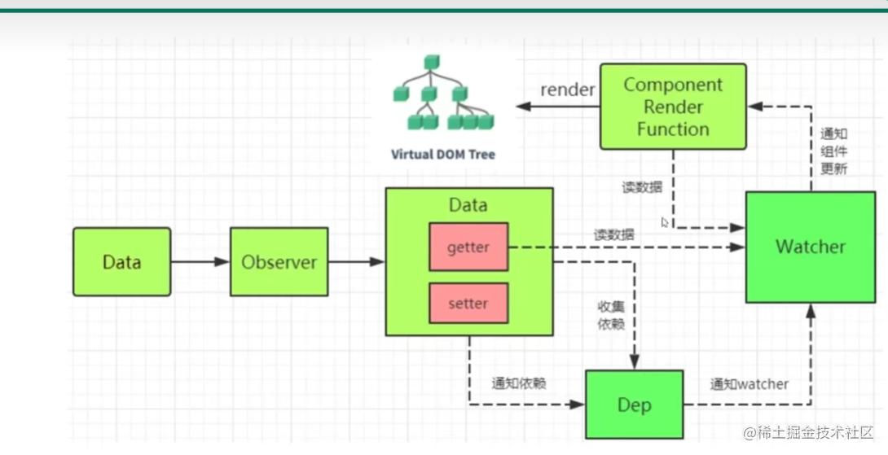

## 一、Vue 基础

### Vue 单页应用与多页应用的区别

**概念：**

- SPA 单页面应用（SinglePage Web Application），指只有一个主页面的应用，一开始只需要加载一次 js、css 等资源。所有内容都包含在主页面，对每一个功能模块组件化。页面跳转，就是切换相关组件，仅仅刷新局部资源。

优点: 页面切换快,体验好
缺点：首屏加载慢， SEO不好

- MPA 多页面应用 （MultiPage Application），指有多个独立页面的应用，每个页面必须重复加载 js、css 等相关资源。页面跳转，需要整个页面资源刷新。


### MVC、MVP、MVVM 的区别

[b 站视频讲解](https://www.bilibili.com/video/BV137411N7aB/?spm_id_from=333.337.search-card.all.click&vd_source=020d5331c0980b1e753ec724b75e1c89)
[参考文章](https://juejin.cn/post/7291837510119702563?searchId=20240428162742E55ED45E5785230D9303)

**定义**

MVC、MVP 和 MVVM 是三种软件架构设计模式，主要通过分离关注点的方式来组织代码结构，以提高代码的可维护性、可扩展性和可重用性

它们设计的目标都是为了`解决 Model 和 View 的耦合问题`

早期 web1.0 没有前端的时候，web 应用都是由后端开发，所有的代码(html,css,js,java 等)都混合在一个文件，jsp 代码难以维护。后来衍生出后端 MVC，对代码进行了分层处理，典型的框架就是 Spring、Struts。web2.0，出现了 ajax，前后端开始慢慢分离，前端的 MVC 也随之而来，如 backbon.js

**（1）MVC**

MVC模式的重点是将应用程序分离成不同的层，从而实现更好的可维护性和可扩展性。


- Model: 负责业务数据管理和处理，包括增删改查，Model必须提供外部可以操作模型数据的接口，同时在数据发生变化后能够通知外部
- view: View需要感知`Model`的变化，数据变化时，更新用户界面
- Controller：负责响应view的用户指令，并调用Model的接口对数据进行操作

最简单的MVC通信方式

1. View传递信息给Controller。
2. Controller完成逻辑后，传递信息给Model改变数据。
3. Model将新的数据发送给View，修改界面。

`缺点`

- View的更新由 Model 处理，Model 和 View 的耦合在一起，应用复杂的时候变得代码混乱难以维护

**（2）MVP**

因为 AngulaJs 早早的将 MVVM 框架模式带入了前端，所以 MVP 模式在前端开发并不常见，但是在安卓等原生开发中，开发者还是会考虑到它

MVP 模式与 MVC 唯一不同的在于 `Presenter` 和 Controller。Presenter 可以理解为一个中间人，它负责 View 和 Model 之间的数据流动，防止 View 和 Model 之间直接交流，导致代码混乱。Presenter 负责和 Model 进行双向交互，还和 View 进行双向交互。


MVP的工作流程

1. 用户对界面进行操作，触发View的相关事件；
2. View感知这些事件，通知Presenter进行处理；
3. Presenter处理相关业务，并通过Model的接口对业务数据进行更新；
4. Model数据变化会通知Presenter；
5. Presenter收到Model数据变化通知后，调用View暴露的接口更新用户界面。

`缺点`

- presenter 作为中间层负责 MV 通信，虽然它分离了 View 和 Model，但是应用逐渐变大之后，导致 Presenter 的体积增大，难以维护。

**（3）MVVM**

MVVM 分为 Model、View、ViewModel：

- Model 代表数据模型，数据和业务逻辑都在 Model 层中定义
- View 负责数据的展示，不包含任何业务逻辑
- ViewModel 负责监听 Model 中数据的改变并且控制视图的更新，处理用户交互操作


- `viewModel` 通过响应式机制来实现 `Model` 中数据变化触发视图更新，通过事件监听响应 View 中用户交互修改 Model 中数据。
- 它不仅解决 MV 耦合问题，还解决了维护两者映射关系的大量繁杂代码和 DOM 操作代码，提高开发效率和性能

**Vue 是不是 MVVM 框架？**

Vue 是借鉴了 MVVM 的思想，但是不是严格符合 MVVM，因为 MVVM 规定 Model 和 View 不能直接通信，而 Vue 的`ref`可以做到这点

### Vue 的优缺点

- 轻量级框架：大小只有几十 `kb`
- 组件化：保留了 `react` 的优点，在构建单页面应用方面有着独特的优势；
- MVVM思想：视图，数据，结构分离，使数据的更改更为简单，只需要操作数据就能完成相关操作；
- 虚拟 DOM：`dom` 操作是非常耗费性能的，不再使用原生的 `dom` 操作节点，极大解放 `dom` 操作

缺点：单页面不利于 seo，不支持 IE8 以下，首屏加载时间长

### Vue 跟 React 的区别

**相似之处：**

- 都将注意力集中保持在核心库，而将其他功能如路由和全局状态管理交给相关的库；
- 都使用了 Virtual DOM（虚拟 DOM）提高重绘性能；vue编译template，React编译jsx
- 组件化，并都有 props 的概念，允许组件间的数据传递；

**不同之处 ：**

**1）数据流**

Vue 默认支持数据双向绑定，而 React 一直提倡单向数据流

**2）虚拟 DOM**

Vue2.x 开始引入"Virtual DOM"，消除了和 React 在这方面的差异，但是在具体的细节还是有各自的特点。

- Vue 宣称可以更快地计算出 Virtual DOM 的差异，这是由于它在渲染过程中，会跟踪每一个组件的依赖关系，不需要重新渲染整个组件树。
- 对于 React 而言，每当应用的状态被改变时，全部子组件都会重新渲染。当然，这可以通过 PureComponent/shouldComponentUpdate 这个生命周期方法来进行控制，但 Vue 将此视为默认的优化。

**3）组件化**

React 与 Vue 最大的不同是模板的编写。

- Vue 鼓励写近似常规 HTML 的模板。写起来很接近标准 HTML 元素，只是多了一些属性。
- React 推荐你所有的模板通用 JavaScript 的语法扩展——JSX 书写。

具体来讲：React 中 render 函数是支持闭包特性的，所以 import 的组件在 render 中可以直接调用。但是在 Vue 中，由于模板中使用的数据都必须挂在 this 上进行一次中转，所以 import 一个组件完了之后，还需要在 components 中再声明下。

**4）监听数据变化的实现原理不同**

- Vue 通过 getter/setter 以及一些函数的劫持，能精确知道数据变化，不需要特别的优化就能达到很好的性能
- React 默认是通过比较引用的方式进行的，如果不优化（PureComponent/shouldComponentUpdate）可能导致大量不必要的 vDOM 的重新渲染。这是因为 Vue 使用的是可变数据，而 React 更强调数据的不可变。

**5）高阶组件**

react 可以通过高阶组件（HOC）来扩展，而 Vue 需要通过 mixins 来扩展。

高阶组件就是高阶函数，而 React 的组件本身就是纯粹的函数，所以高阶函数对 React 来说易如反掌。相反 Vue.js 使用 HTML 模板创建视图组件，这时模板无法有效的编译，因此 Vue 不能采用 HOC 来实现。

**6）构建工具**

两者都有自己的构建工具：

- React ==> Create React APP
- Vue ==> vue-cli

**7）跨平台**

- React ==> React Native
- Vue ==> Weex

### 响应式数据原理

[参考 1](https://juejin.cn/post/6932659815424458760)
[参考 2](https://zhuanlan.zhihu.com/p/351145163)
[参考 3](https://juejin.cn/post/6844903527907590152)
[视频](https://www.bilibili.com/video/BV1G54y1s7xV?p=1&vd_source=020d5331c0980b1e753ec724b75e1c89)

**定义**：使用`Vue`时，我们只需要修改数据(`state`)，视图就能够获得相应的更新，这就是响应式系统

**思想**： 数据劫持 + 观察则者模式

- [ ] 数据劫持：当数据变化时，我们可以做一些特定的事情
- [ ] 依赖收集：我们要知道那些视图层的内容(`DOM`)依赖了哪些数据(`state`)
- [ ] 派发更新：数据变化后，如何通知依赖这些数据的`DOM`





**数据劫持过程**

- initData 初始化 data 的时候拿到 data 数据，传给 observe 进行观测
- observe 判断数据有没有`__ob__`，如果有，说明已经进行过观测(响应式处理)，return。如果没有，会 new 一个 observer 类进行数据观测
- observer 中给每个数据都增加了`Observer实例`，通过`value.__ob__`来访问 Observer 的实例

```js
export function observe(data) {
  // data必须是个对象
  if (typeof data !== 'object' || data === null) {
    return
  }
  if (data.__ob__) {
    // 说明已经进行过观测 处理了响应式
    return data
  }
  return new Observer(data)
}
```

`观测的是对象`

- observer (观察者) 调用`this.walk()`方法，对对象的第一层 key 进行遍历，循环调用`defineReactive闭包函数`
- `defineReactive中使用object.defineProperty`来对对象的属性进行劫持，当读取属性值的时候会触发 getter 进行依赖收集，当设置对象属性值的时候会触发 setter 进行向相关依赖发送通知
- 这边会进行递归，如果对象属性的值还是对象，会继续调用 observe 观测。setter 中如果设置的值还是对象，还是用会调用 observe，`形成递归`
- 通过循环调用`observe函数=》Observer=》defineReactive函数=>observe函数`，从而将 data 中的数据设置为响应式

正常情况下，只要在`setter`中调用一下渲染函数来重新渲染页面，就能完成在数据变化时更新页面，但是这样做的代价就是：任何一个数据的变化，都会导致这个页面的重新渲染。我们想做的效果是：数据变化时，只更新与这个数据有关的`DOM`结构，那就涉及`依赖`

```js
class Observer {
  constructor(value) {
    this.dep = new Dep() //这样的话数组/对象($set)也会有一个dep属性

    // 使用defineProperty 重新定义属性,定义成不可枚举,walk中就不能被取出来
    // 这边不能这样写 value.__ob__ = this 会导致再次观测, 进入死循环
    // __ob__ 用来描述一个对象是否被观测过
    // Object.defineProperty(value, '__ob__', {
    //     enumerable: false, // 不可枚举
    //     configurable: false,// 不能删除
    //     value: this // 值设置为this 就是当前Observer实例
    // })
    // 封装成公共方法
    defineProperty(value, '__ob__', this)

    if (Array.isArray(value)) {
      // 如果是数组不进行defineReactive
      // 我希望调用push shift unshift splice sort reverse pop
      // 函数劫持, 数组的原型指向arrayMethods
      // 如果是数组，要非常强行的蛮干：将这个数组的原型，指向arrayMethods
      // Object.setPrototypeOf(value, arrayMethods);
      value.__proto__ = arrayMethods

      // 数组中可能还有对象, 也要对数组中的对象进行观测
      this.observeArray(value)
    } else {
      this.walk(value)
    }
  }
  walk(data) {
    let keys = Object.keys(data) // 获取data对象第一层的key
    keys.forEach((key) => {
      defineReactive(data, key, data[key]) // 给数据定义成响应式 vue中有个api   vue.util.defineReactive
    })
  }
  observeArray(value) {
    value.forEach((item) => observe(item)) // 再对数组中的对象进行观测
  }
}

function defineReactive(data, key, value) {
  // 返回值是obsever实例,上面有dep属性, 可以使数组获取到dep
  let childDep = observe(value) // 递归 如果值还是对象在进行观测
  let dep = new Dep() // 每个属性都有一个dep
  //当页面取值的时候,说明这个值用来渲染了,将这个watcher和这个属性对应起来
  Object.defineProperty(data, key, {
    get() {
      if (Dep.target) {
        // 说明正在渲染, 让属性记住watcher
        dep.depend()
        if (childDep) {
          // childDep可能是数组 可能是对象
          childDep.dep.depend() // 数组存起来了这个渲染watcher
        }
      }
      return value
    },
    set(newValue) {
      console.log('设置值了')
      if (newValue === value) return
      observe(newValue) // 递归 如果用户设置值为对象 还要进行观测
      value = newValue

      dep.notify()
    },
  })
}
```

`如果数据是数组`

- 使用`函数劫持`的方法(可以通知视图更新)
- 使用`Object.create()`方法以`Array`的原型为原型创建一个arrayMethods对象
- 将 7 个方法定义为 arrayMethods 的属性方法
- 当我们调用 7 个方法中的方法时，就会执行 arrayMethods 的属性方法，属性方法内部去借用`Array`的原方法，再添加一些劫持的操作，如`push\unshift\splice` 能够插入新值，会继续进行oberve观测，然后再调用 `notify` 去更新

```js
//拿到数组原型的方法
const oldArrayProtoMethods = Array.prototype

// 继承一下   以Array.prototype为原型创建arrayMethods对象，并暴露
// arrayMethods._proto_ = oldArrayProtoMethods
export const arrayMethods = Object.create(oldArrayProtoMethods)

// 要被改写的7个数组方法
const methods = ['push', 'pop', 'shift', 'unshift', 'splice', 'sort', 'reverse']

// 将七个方法定义成arrayMethods的属性
// 如果用户调用7个方法 就会调用arrayMethods中7个方法
// 如果用户调用不是7个方法中的,比如concat, 那么就会调用arrayMethods._proto_.concat
methods.forEach((method) => {
  arrayMethods[method] = function () {
    console.log('调用饿了')
    // 再要调用原来的方法
    const result = oldArrayProtoMethods[method].apply(this, arguments) // this就是value数组

    // 有三种方法push\unshift\splice能够插入新项，新项可能为对象,要再次观测
    // 把类数组对象变为数组
    const args = [...arguments]
    let inserted = []
    let ob = this.__ob__
    switch (method) {
      case 'push':
      case 'unshift':
        inserted = args
        break
      case 'splice':
        // splice格式是splice(下标, 数量, 插入的新项)
        inserted = args.slice(2) // 把开始下标为2的后面元素截取到新数组中
        break
    }
    // 数组新增的值也要进行观测
    // observeArray这个方法在Observer实例上,如何拿到呢???
    // 再observer实例使用Object.defineProperty定义在value的自定义属性__ob__身上
    if (inserted) ob.observeArray(inserted)

    ob.dep.notify()
    return result
  }
})
```

**依赖收集和派发更新过程：**

- 组件挂载过程中会实例化一个`观察者对象watcher`，来订阅数据。实例化 watcher 时会执行`get`方法，get 方法会调用解析 ast 树生成的渲染函数`vm._update(vm._render())`渲染页面，渲染页面会触发 getter，`getter`中调用`dep.depend()`把当前的`watcher`添加到`dep`数组中，完成依赖收集
- 在`defineReactive`给每一个响应式数据添加一个`dep`（调度中心）来管理订阅此数据的 watcher。Dep 中创建`subs`数组存放所有 watcher，当读取属性的时候，在 getter 中调用`dep.depend()`将当前的 watcher 进行去重后添加 subs 列表，当属性变化后会在 setter 中调用`Dep.notify`循环 subs 列表，通知所有的的 watcher 去更新(派发更新）

```js
// watcher.js
import { popTarget, pushTarget } from './dep'

let id = 0
class Watcher {
  // 因为watcher有很多种渲染watch, user-watcher, computed-watcher,所以封装成一个类
  // exprOrFn: vm._update(vm._render())
  constructor(vm, exprOrFn, cb, options) {
    this.vm = vm
    this.exprOrFn = exprOrFn
    this.cb = cb
    this.options = options
    this.id = id++ // watcher的唯一标识, 每次new的时候都是不同的watcher
    this.deps = [] // watcher记录有多少dep依赖它
    this.depsId = new Set()
    if (typeof exprOrFn === 'function') {
      this.getter = exprOrFn
    }
    this.get() // new Watcher就会调用get方法
  }
  addDep(dep) {
    // 去重 相同的watcher只存一个
    let id = dep.id
    if (!this.depsId.has(id)) {
      this.deps.push(dep)
      this.depsId.add(id)
      dep.addSub(this)
    }
  }
  get() {
    pushTarget(this) // 当前watcher实例
    this.getter() // 调用exprOrFn => vm._update(vm._render()) => 渲染页面 => 取值(get被调用)
    popTarget() // 渲染完之后把watcher清掉
  }
  update() {
    this.get()
  }
}
export default Watcher
```

```js
// dep.js
let id = 0
class Dep {
  constructor() {
    this.subs = []
    this.id = id++
  }
  depend() {
    Dep.target.addDep(this) // 双向记忆  我们希望watcher也可以存放dep
    // this.subs.push(Dep.target) // 原来
  }
  addSub(watcher) {
    this.subs.push(watcher)
  }
  notify() {
    this.subs.forEach((watcher) => watcher.update())
  }
}
Dep.target = null // Dep的静态属性  就一份
export function pushTarget(watcher) {
  Dep.target = watcher // 保留watcher
}
export function popTarget() {
  Dep.target = null // 将变量删除
}
export default Dep
// 多对多的关系,一个属性有一个dep,用来收集watcher的
// dep可以存多个watcher,可以是不同的watcher
// 一个watcher可以对应多个dep
```

`数组的依赖收集与更新`

- 不仅每个属性身上存了 `dep`，还在 Obsever 类中 new 一个 dep，这样不管是数组和对象的 observer 实例上都会有一个 dep 属性
- 当获取数组类型属性的时候，observer 实例上拿到 dep，用 childDep.dep.depend()完成依赖收集
- 当更新数组时，push 等，就可以在改写的方法中调用 ob.dep.notify()完成更新

**最后两步**

- 实现一个解析器 Compile：解析 Vue 模板指令，将模板中的变量都替换成数据，然后初始化渲染页面视图，并将每个指令对应的节点绑定更新函数，添加监听数据的订阅者，一旦数据有变动，收到通知，调用更新函数进行数据更新。

- 实现一个调度器`Scheduler`，此时 vue 响应式已经基本完成，但仍然存在一些问题。当 render 中用到了许多响应式数据，如果这些响应式数据都发生了变化，那么记录 render 的 Watcher 会被重复调用多次，浪费了许多性能。这显然是不合理的。实际上 Watcher 并不会立即执行而是会把自己交给 Scheduler ，Scheduler 会维护一个队列，队列中同一个 Watcher 只能存在一次，vue 内部提供了 nextTick 方法，可以把这些 watcher 放入到事件循环中的微队列中，所以 Watcher 的执行都是异步的

### 为什么对象和数组要分开处理响应式

- `对象`的属性通常比较少，对每一个属性都劫持`set和get`，并不会消耗很多性能
- `数组`有可能有成千上万个元素，如果每一个元素都劫持`set和get`，性能消耗太大
- 所以`对象`通过`defineProperty`进行正常的劫持`set和get`
- `数组`则通过`修改数组原型指向`，来实现`修改数组触发响应式`

### Object.defineProperty() 数据劫持缺点？

- `Object.defineProperty` 只能对属性进⾏劫持，需要遍历对象的每个属性，对象层级深的话，非常消耗性能。对数组劫持还要进行函数劫持处理。
- 由于 `Object.defineProperty` 劫持的是对象的属性，所以新增属性时，对其新增属性再进⾏劫持。 也正是因为这个原因，使⽤ Vue 给 `data`中的数组或对象新增属性时，需要使⽤ `vm.$set`才能保证新增的属性也是响应式的。

**正是因为它无法监听对象或数组新增、删除的元素，所以 vue3 改为了 proxy**

- proxy 可以直接监听数组的变化
- proxy 可以监听对象而非属性，它在目标对象之前架设一层“拦截”，外界对该对象的访问，都必须先通过这层拦截，因此提供了一种机制，可以对外界的访问进行过滤和改写。 Proxy 直接可以劫持整个对象,并返回一个新对象
- Proxy 作为新标准，⻓远来看，JS 引擎会继续优化 `Proxy` ，但 `getter` 和 `setter` 基本不会再有针对性优化。
- `Proxy` 兼容性差 ⽬前并没有⼀个完整⽀持 `Proxy` 所有拦截⽅法的 Polyfill ⽅案

### 说一下$set的作用

**定义**

在 Vue 初始化时，data 中的数据都会进行响应式处理，动态给data的数据添加/删除属性是无法触发视图更新的。所以用`$set` 给 data 中的数据添加属性，使用`$delete`删除属性，底层会进行响应式处理

`数组下标修改无法更新视图`

- 原因：Vue 没有对数组进行`Object.defineProperty`的元素劫持，所以直接 arr[index] = xxx 是无法更新视图的
- 使用数组的 splice 方法，`arr.splice(index, 1, item)`
- 使用`Vue.$set(arr, index, value)`

**set 原理:**

- 如果目标是数组，直接使用数组的 splice 方法触发响应式；
- 如果目标是对象，通过调用 defineReactive 方法进行响应式处理（ defineReactive 方法就是 Vue 在初始化对象时，给对象属性采用 Object.defineProperty 动态添加 getter 和 setter 的功能所调用的方法）,然后再调用 dep.notify()手动触发通知

```js
// 首先判断`target`是否是数组，是数组的话第二个参数就是长度了，设置数组的长度，
// 然后使用`splice`这个异变方法插入`val`。
// 然后是判断`key`是否属于`target`，属于的话就是赋值操作了，这个会触发`set`去派发更新。
// 接下来如果`target`并不是响应式数据，那就是普通对象，那就设置一个对应`key`吧。
// 最后以上情况都不满足，说明是在响应式数据上新增了一个属性，
// 把新增的属性转为响应式数据，然后通知手动依赖管理器派发更新。

function set(target, key, val) {
  if (Array.isArray(target)) {
    // 数组
    target.length = Math.max(target.length, key) // 最大值为长度
    target.splice(key, 1, val) // 移除一位，异变方法派发更新
    return val
  }

  // 会先判读属性是否存在、对象是否是响应式，最终如果要对属性进行响应式处理
  if (key in target && !(key in Object.prototype)) {
    // key属于target
    target[key] = val // 赋值操作触发set
    return val
  }

  if (!target.__ob__) {
    // 普通对象赋值操作
    target[key] = val
    return val
  }

  defineReactive(target.__ob__.value, key, val) // 将新值包装为响应式

  target.__ob__.dep.notify() // 手动触发通知

  return val
}
```

**delete 原理：**

`this.$delete`就更加简单了，如果是数组就使用异变方法`splice`移除指定下标值。如果是对象使用 delete 删除指定`key`的值，调用 dep.notify()手动触发通知。

```js
function del(target, key) {
  if (Array.isArray(target)) {
    // 数组
    target.splice(key, 1) // 移除指定下标
    return
  }
  // 如果`target`是对象但`key`不属于它，return。
  if (!hasOwn(target, key)) {
    return
  }

  delete target[key] // 删除对象指定key

  // 如果`target`不是响应式对象，删除的就是普通对象一个值，删了就删了
  if (!target.__ob__) {
    // 普通对象，再见
    return
  }
  target.__ob__.dep.notify() // 手动派发更新
}
```

### data 为什么是一个函数而不是对象

JS 中的对象是引用数据类型，当多个实例引用同一个对象时，只要一个实例对这个对象进行操作，其他实例中的数据也会发生变化。

而在 Vue 中，我们主要想要复用组件，那就需要每个组件都有自己的数据，这样组件之间才不会相互干扰。

所以 data 不能写成对象的形式，而是要以函数的返回值形式定义，这样当每次复用组件的时候，就会返回一个新的对象，也就是说每个组件各自维护自己的数据，不会相互干扰

根实例只有一个，不需要担心这种情况

### Vue 的修饰符有哪些

[「百毒不侵」面试官最喜欢问的 13 种 Vue 修饰符](https://juejin.cn/post/6981628129089421326)


### Vue 的内部指令有哪些


### 自定义指令 5 个钩子函数

[8 个非常实用的 Vue 自定义指令](https://juejin.cn/post/6906028995133833230)

- 复制粘贴指令  `v-copy`
- 长按指令  `v-longpress`
- 输入框防抖指令  `v-debounce`
- 权限校验指令  `v-premission`
- 禁止表情及特殊字符  `v-emoji`
- 图片懒加载  `v-LazyLoad`
- 实现页面水印  `v-waterMarker`
- 拖拽指令  `v-draggable`
- 处理图片失败 `v-imgerror`


```js
Vue.directive('focus',{
    bind（el,binding,vnode）：{
        //只调用一次，指令第一次绑定到元素时调用，
        //可以定义一个在绑定时执行一次的初始化动作

        //每个钩子函数都有el（当前元素） 和 binding参数
        //el: 绑定的dom元素
        //binding参数是一个对象 {
        //    name:指令名称 不带v-
        //    value：指令对应值
        //    oldValue: 指令绑定的前一个值，只在update和componentUpdate调用。无论值是否改变都可用
        //    arg：指令参数
        //    modifiers：指令修饰符，可以有多个
        //}
        // vnode: 组件编译生成的虚拟节点
        // oldvnode: 只在update和componentUpdate调用
    }，
    inserted（el, binding,vnode）:{
        //指令被绑定元素，插入到父元素中时调用
        //这一步才能拿到el的父元素
    }，
    update(el, binding,vnode,oldvonode) :{
        // 组件更新时
        //所在组件的vnode更新时调用，但是可能发生在其子vnode更新之前。
        // 指令的值可能发生了改变，也可能没有。但是可能通过比较更新前后的值，来忽略不必要的模板更新
    }，
    componentUpdate（el, binding, vnode,oldvnode）:{
        //组件更新完成时
        //指令所在组件的vnode及其子vnode全部更新完成时调用
    }，
    unbind（el, binding, vnode）：{
         //只调用一次,指令与元素解绑时
    }

})
```

### v-show 和 v-if 区别

定义： 都是控制元素的显示与隐藏

- **展示形式**：v-if 是动态的向 DOM 树内添加或者删除 DOM 元素，每一次显隐都会使组件重新跑一遍生命周期。v-show 是通过设置 DOM 元素的 display 样式属性控制显隐；

- **编译过程**：v-if 切换有一个局部编译/卸载的过程，切换过程中合适地销毁和重建内部的事件监听和子组件；v-show 只是简单的基于 css 切换；

- **编译条件**：v-if 是惰性的，如果初始条件为假，则什么也不做；只有在条件第一次变为真时才开始局部编译; v-show 是在任何条件下，无论首次条件是否为真，都被编译，然后被缓存，而且 DOM 元素保留；

- **性能消耗**：v-if 有更高的切换消耗；v-show 有更高的初始渲染消耗；

- **使用场景**：v-if 适合运行条件不大可能改变；v-show 适合频繁切换。

### v-if、v-show、v-html 的原理

- v-if 生成 vnode 的时候会忽略对应节点，render 的时候就不会渲染；
- v-show 会生成 vnode，render 的时候也会渲染成真实节点，只是在 render 过程中会在节点的属性中修改 show 属性值，也就是常说的 display；
- v-html 会先移除节点下的所有节点，调用 html 方法，通过 addProp 添加 innerHTML 属性，归根结底还是设置 innerHTML 为 v-html 的值。

### v-if 和 v-for 哪个优先级高

**概念**

- Vue2 中 v-for 的优先级高于 v-if，所以写代码时不应该将 v-for 和 v-if 放在一起
- 如果 v-for 和 v-if 放在同一元素中，生成的 render 函数会先执行循环再判断条件，即使只渲染列表中的一个元素，也会在每次重新渲染的时候遍历整个列表，消耗性能
- Vue3 中完全相反，v-if 的优先级高于 v-for

**解决**

- 在外层嵌套 template，在这一层进行 v-if 判断，在内部进行 v-for 循环
- 使用 computed 对数据进行过滤来解决

```js
<div v-for="item in list">
    {{item}}
</div>

computed() {
    list() {
        return [1, 2, 3, 4, 5, 6, 7].filter(item => item !== 3)
    }
  }
```

### 设置动态 class，动态 style

vue 对 v-bind 用于 class 和 style 做了增强，表达式结果可以是个对象，字符串，数组

- 动态 class 对象：`<div :class="{ 'is-active': true, 'red': isRed }"></div>`
- 动态 class 数组：`<div :class="['is-active', isRed ? 'red' : '' ]"></div>`
- 动态 style 对象：`<div :style="{ color: textColor, fontSize: '18px' }"></div>`
- 动态 style 数组：`<div :style="[{ color: textColor, fontSize: '18px' }, { fontWeight: '300' }]"></div>`

### v-model 双向数据绑定

**概念**

vue2 中双向绑定是一个指令`v-model`，可以绑定一个响应式数据到视图。使用 v-model 可以减少大量繁琐的事件处理代码，提高开发效率

```js
<input v-model="message"/>
// 等同于
<input
    :value="message"
    @input="message=$event.target.value"
>
// $event 指代当前触发的事件对象;
// $event.target 指代当前触发的事件对象的dom;
// $event.target.value 就是当前dom的value值;
```

**表单元素中**

- `checkbox` 和 `radio` 语法糖 `:checked` +`@change`
- `select` 语法糖 `:value` + `@change`
- 其余的都是`:value` + `@input`

**自定义组件标签中**

```vue
<NumberInput v-model="number"></NumberInput>

<!-- 等同于 -->

<NumberInput :value="number" @input="number=$event"></NumberInput>
<!-- 注意： -->
<!-- 对于原生事件，$event就是事件对象=====>能.target -->
<!-- 对于自定义事件，$event事件就是触发事件时，所传递的数据==>不能.target -->

<script>
import NumberInput from './NumberInput'

export default {
  components: { NumberInput },
  data() {
    return {
      number: 10,
    }
  },
}
</script>
```

```vue
<template>
  <div>
    <button @click="increase(-1)">-1</button>
    <input type="number" :value="currentValue" @input="changeValue" />
    <button @click="increase(1)">+1</button>
  </div>
</template>

<script>
export default {
  name: 'NumberInput',
  props: {
    value: {
      type: Number,
      default: 0,
      require: true,
    },
  },
  data() {
    return {
      currentValue: this.value,
    }
  },
  watch: {
    value(newVal) {
      this.currentValue = newVal
    },
  },
  methods: {
    changeValue(e) {
      this.currentValue = parseInt(e.target.value)
      this.$emit('input', this.currentValue)
    },
    increase(value) {
      this.currentValue += value
      this.$emit('input', this.currentValue)
    },
  },
}
</script>
```

无论是任何组件，都可以实现 `v-model`。

而实现 `v-model` 的要点，主要就是以下几点：

- `props:value`

  用来控制 `v-model` 所绑定的值。

- `currentValue`

  由于 `单向数据流` 的原因，需要使用 `currentValue` 避免子组件对于 `props` 的直接操作。

- `$emit('input')`

  用来控制 `v-model` 值的修改操作,所有对于 `props` 值的修改，都要通知父组件。

- `watch` 监听

  当组件初始化时从 `value` 获取一次值，并且当父组件直接修改 `v-model` 绑定值的时候，对于 `value` 的及时监听。

**自定义组件可以改变事件名和属性名**

比方有些人说我就是不想用 `props:value` 以及 `$emit('input')` ，我想换一个名字，那么此时， `model` 可以帮你实现。

因为这两个名字在一些原生表单元素里，有其它用处。

```js
export default {
  model: {
    prop: 'number',
    event: 'change',
  },
}
```

这种情况下，那就是使用 `props:number` 以及 `$emit('change')`。

### .sync 语法糖

**作用**： 父子组件的双向通信

**使用**

- 一般的父向子传值:`<Child :a="num" :b="num2"></Child>` 子组件中 props 接收
- 使用.sync 父向子传值: `<Child :a.sync="num" :b.sync="num2"></Child>`

**sync 传值原理:**

```html

<Child :a.sync="num" :b.sync="num2"></Child>

<!-- 等同于 -->

<Child :a="num" @update:a="num = $event" :b="num2" @update:b="num2 = $event"> </Child>
```

相当于多了一个事件监听，事件名是 `update:a`，回调函数中，会把接收到的值赋值给属性绑定的数据项中。

子组件使用`this.$emit('update:a',22)`修改接收的值 父子组件双向变化

**和 v-model 区别？**

- 相同点：都是语法糖，都可以实现父子组件中的数据的双向通信。

- 区别点：

  - 格式不同 `v-model="num", :num.sync="num"`
  - `v-model`语法糖：  `:value + @input`
  - `:msg.sync`语法糖: `:msg + @update:msg`
  - v-model 只能用一次；.sync 可以有多个。

### Vue3中 v-model

用在表单元素中和vue2中的v-model的语法糖相同

但是v-model用在自定义组件中，是`:modelValue`+ `@update：modelValue`的语法糖， 像是将 v-model 和.sync 修饰符结合起来。也可以用参数的形式指定多个不同的绑定，如`v-model：name` `v-model：age`，非常强大

```vue
<!-- 父组件中 -->
<child v-model="userName"></child>

<!-- 等同于 -->

<Father :modelValue="userName" @update:modelValue="userName = $event"></Father>
```

```vue
<!-- 子组件中 -->
<template>
  <input type="text" 
    :value="modelValue" 
    @input="emit('update:modelValue',$event.target.value)"
  />
</template>
<script setup>
  defineProps(['modelValue'])
  const emit = defineEmits(['update:modelValue'])
</script>
```

value名称可以更改，所以可以传多个

```vue
<!-- 父组件中 -->
<child v-model:name="userName" v-model:age="userAge"></child>

<!-- 等同于 -->

<Father 
  :name="userName" @update:name="userName = $event"
  :age="userAge" @update:age="userAge = $event"
></Father>
```

```vue
<!-- 子组件中 -->
<template>
  <input type="text" 
    :value="name" 
    @input="emit('update:name',$event.target.value)"
  />
  <input type="text" 
    :value="age" 
    @input="emit('update:age',$event.target.value)"
  />
</template>
<script setup>
  defineProps(['name', 'age'])
  const emit = defineEmits(['update:name','update:age'])
</script>
```

### Vue 的单向数据流

**概念**

单向数据流：数据向下，事件向上。

数据总是从父组件传到子组件，子组件没有权利修改父组件传过来的数据，只能请求父组件进行修改。这样会防止从子组件意外改变父级组件的状态，从而导致应用的数据流向难以理解。所以在子组件直接用 v-model 绑定父组件传过来的 prop 这样是不规范的写法 开发环境会报警告

如果想要对父组件传递过来的数据进行转换，可以定义一个计算属性依赖 prop 的数据

### 插值表达式

- 不能写语句（js 关键字不能用）
- 不能再属性中使用
- 只能在标签的内容中使用
- 可以写表达式 {{ msg + 10 }}

### watch 事件监听

**定义：** 用于监听 data 中的数据变化

- 监听数据必须是 data 中声明过或者父组件传递过来的 props 中的数据，当数据变化时，触发相应操作
- 监听的函数接收两个参数，第一个参数是新值，第二个参数旧值
- 不支持缓存，数据变了，直接会触发相应的操作
- 支持异步监听
- 当需要在数据变化时执行异步或开销较大的操作时，这个方式是最有用的。

```js
// 监听简单数据
watch：{
    msg:function(new,old) {}
}
// 监听复杂数据类型，需要用watch完整形态
watch：{
    msg:{
        handler:function(value) {
            console.log('监听到了')
        }，
        immediate：true //页面加载先监听一次
        sync: true // 同步更新，不需要进入nextTick
        deep：true，
        //监听器会一层层的往下遍历，给对象的所有
        //属性都加上这个监听器，但是这样性能开销就会非常大了，
        //任何修改obj里面任何一个属性都会触发这个监听器里的 handler
    }
}

// 优化：我们可以使用字符串的形式监听
watch: {
  'obj.a': {
    handler(newName, oldName) {
      console.log('obj.a changed');
    },
    immediate: true,
    // deep: true
  }
}
```

**原理** [阅读](https://blog.csdn.net/m0_52544128/article/details/124644990)

首先 watch 是用来监听响应式数据变化，来触发相应的操作的，而我们响应式系统中的 watcher 就是来订阅数据变化，所以 watch 也是 watcher 类的实现

`watch`是`this.$watch`的封装，实现是一致的，它的原理就是为需要观察的数据创建并收集`user-watcher`，第一次创建 user-watcher 会执行 get 拿到老值并保存下来，当数据改变重新执行get方法时再拿到新值，然后将新值和旧值传递给用户传进 watch 的回调函数。

**三个参数：`sync`、`immediate`、`deep`它们的实现原理**

- 定义了`deep`，会执行 traverse 方法，在 traverse 这个函数的中深度遍历这个对象，访问到对象上的所有属性，访问到属性的过程中，会触发属性的 getter 函数，以收集这个 user Watcher 订阅者。这样，当深层次对象变化的时候，就会通知这个 user Watcher 做更新。
- 定义了`sync`，在属性值变化触发 user Watcher 更新的时候，直接同步执行定义 handler 函数，不会放入 nextTick 中去执行；
- 定义了`immediate`，实例化 Watcher 之后，立即调用定义的 handler 函数

```js
Vue.prototype.$watch = function(vm, exprOrFn, cb, options) {
    // 数据应该依赖这个watcher  数据变化后应该让watcher重新执行
    let watcher = new Watcher(vm, exprOrFn, cb, {...options, user: true})
    // 如果immediate 立刻执行后
    if(options.immediate) {
        cb()
    }
}
```

### 计算属性 computed

**定义**

计算属性的值是根据其他属性计算而来，给组件添加一个新的数据

- 计算属性不能与`data和props`中的属性重名
- 计算属性依赖缓存设计的，当依赖的属性发生变化时，计算属性才会重新计算，并把结果缓存起来
- 不支持异步，当 computed 内有异步操作时无效，无法监听数据的变化
- 模板插值中最好不要写复杂的逻辑，交给计算属性
- 如果 computed 属性的属性值是函数，那么默认使用 get 方法。如果是一个对象，可以提供set 方法，当数据发生变化时，会调用 set 方法。

```js
// 计算属性完整形态，计算属性默认只有getter，不允许设置修改，
//如果需要时，可以提供一个setter
computed：{
    fullName: {
        get:(){}
        set:(){}
    }
}
```

**原理** [阅读](https://juejin.cn/post/6974293549135167495)

```js
function defineComputed(target, key, userDef) { // 这样写是没有缓存的
    // 每次调用都执行get 所以需要加缓存 dirty 用来控制是否调用userDef
    if(typeof userDef == 'function') {
        sharedPropertyDefinition.get = createComputedGetter(key)
        // sharedPropertyDefinition.get = userDef // get需要处理缓存逻辑 封装成高阶函数
    }else {
        sharedPropertyDefinition.get = createComputedGetter(key)
        // sharedPropertyDefinition.get = userDef.get
        sharedPropertyDefinition.set = userDef.set
    }

    // 给vm定义属性
    Object.defineProperty(target, key, sharedPropertyDefinition)
}

function createComputedGetter (key) { // 高阶函数
  return function () {  // 返回函数
    const watcher = this._computedWatchers && this._computedWatchers[key]
    // 原来this还可以这样用，得到key对应的computed-watcher

    if (watcher) {
      if (watcher.dirty) {  // 在实例化watcher时为true，表示需要计算
        watcher.evaluate()  // 进行计算属性的求值
      }
      if (Dep.target) {  // 当前的watcher，这里是页面渲染触发的这个方法，所以为render-watcher
        watcher.depend()  // 收集当前watcher
      }
      return watcher.value  // 返回求到的值或之前缓存的值
    }
  }
}

------------------------------------------------------------------------------------

class Watcher {
  ...

  evaluate () {
    this.value = this.get()  //  计算属性求值
    this.dirty = false  // 表示计算属性已经计算，不需要再计算
  }

  depend () {
    let i = this.deps.length  // deps内是计算属性内能访问到的响应式数据的dep的数组集合
    while (i--) {
      this.deps[i].depend()  // 让每个dep收集当前的render-watcher
    }
  }
}

```

首先我们知道 computed 有几个特性

- 1.computed 定义的属性也是响应式的，而且还支持get和set方法。说明内部也是用了 defineproperty 定义了了 getter 和 setter
- 2.它不是每次都执行的，有缓存，说明内部有个变量 dirty 在控制函数是否执行
- 3.然后我们知道 computed 只有依赖的数据改变，他才会改变， 说明它还要依赖的数据还要收集 watcher，所以它还是一个 watcher

清楚这个几点，我们就能知道 computed 的实现原理

`为什么计算属性有缓存功能？`

- 在 initComputed 的时候，拿到所有的 computed 属性，给每一个 computed 属性实例化一个 watcher(computed-watcher)
- 然后用`Object.defineproperty`给每个 computed 属性定义了`getter`和`setter`
- 在 computed 执行`evaluate`方法进行求值的过程中，触发 watcher 的 get 方法，get方法触发getter，会将当前的 computed-watcher 作为依赖收集到自己的 dep 里（双向记忆 watcher 里也有 dep）
- 同时在 wacher 里定义`dirty`来控制是否进行求值，求值完毕之后将`dirty`置为`false`，表示已经计算过了，下次不会再进行计算。

`再访问时会直接读取计算后的值；为什么计算属性内的响应式数据发生变更后，计算属性会重新计算？(computed 依赖收集）`

- 首先用 dep.target 栈型结构存储了当前 watcher，开始渲染的时候先存储了渲染 watcher，然后又存储了计算属性 watcher，计算属性求值完毕后，会弹出计算属性
- 计算属性执行完毕后，会判断 dep.target，如果还存在渲染 watcher，调用 computed-watcher 中的 depend 方法，因为 watcher 和 dep 是双向记忆的，所以在 depend 方法里可以拿到计算属性所依赖属性的所有 dep，再调用 dep.depend 去存储渲染 watcher。
- 这个时候计算属性所依赖属性的 dep 里面 存储了 computed-watcher 和渲染 watcher
- 当属性发生变化时，触发 setter，调用 dep.notify 循环 watcher 列表，先通知 computed-watcher 把 dirty 改为 true 表示需要进行重新计算，然后再通知渲染 watcher 执行渲染，在渲染中会访问到 computed 计算后的值，最后渲染到页面。

### Computed 和 Watch 的区别

相同点： 底层都是Watcher类的实现

不同点：

- computed 计算属性 : 依赖其它属性值，并且 computed 的值有缓存，只有它依赖的属性值发生改变，才会重新计算。不能使用异步
- watch 侦听器 : 更多的是观察的作用，无缓存性，每当监听的数据变化时都会执行回调进行后续操作。可以进行异步监听

**运用场景：**

当需要在数据变化时执行异步或开销较大的操作时，应该使用 watch，其他情况下，正常应该使用 computed，因为可以利用 computed 的缓存特性，避免每次获取值时都要重新计算，减少性能的开销

### slot 是什么？原理是什么？

slot 又名插槽，是 Vue 的内容分发机制，子组件使用 slot 元素作为分发内容的出口。而这一个标签元素如何去显示是由父组件决定的。slot 又分三类，默认插槽，具名插槽和作用域插槽。

在 2.6.0 中，**具名插槽**  和  **作用域插槽**  引入了一个新的统一的语法 (即`v-slot`  指令)。它取代了  `slot`  和  `slot-scope`

- `默认插槽`：又名匿名插槽，slot 标签没有指定 name 属性值，一个组件内只有有一个匿名插槽。
- `具名插槽`：带有具体名字的插槽，也就是带有 name 属性的 slot，一个组件可以出现多个具名插槽。

```html
<---子组件->
<header>
  <slot name="header"></slot>
</header>

<---父组件-> // v2.6.0后 改成v-slot 必须写在template里
<template v-slot:header>
  <h1>Here might be a page title</h1>
</template>
// 之前
<div slot="header"></div>
```

- `作用域插槽`：可以是匿名插槽，也可以是具名插槽，该插槽的不同点是在子组件`渲染作用域插槽时，可以将子组件内部的数据传递给父组件，让父组件根据子组件的传递过来的数据决定如何渲染该插槽。`

```html
<!-- 子组件 -->
<slot :user="user"> {{ user.name }} </slot>

data() { return { user: { name: '张三', age: 18 } } }

<!-- 父组件 -->
<child>
  <template v-slot:default="{ user }"> {{ user.age }} </template>
</child>
```

**原理** [文章](https://juejin.cn/post/6844903880027799560)

插槽的原理主要涉及到组件的模板编译和渲染过程如何对slot进行解析

`默认插槽和具名插槽`

- 插槽的内容是在父组件中生成  `vNode`信息，父组件在 `patch` 的时候解析到子组件标签，发现没有这种标签，会被把它当做组件去解析。
- 子组件解析时会传递过来的插槽内容解析成 `vm.$slot` 的属性(经过过两个函数，不说了)，
- 子组件构建渲染函数时候，`slot` 作为一个占位标签，会被解析成一个函数`_t('default')`
- `_t`就是`renderslot`方法，根据传入的名字，返回 `vm.$slot` 保存的对应的 【插槽节点】，这样 slot 内容就插入到子组件的渲染函数中了


`作用域插槽：`

- 父组件解析时将子组件的插槽内容包装成函数，保存在子组件的外壳节点`scopeSlots`中。
- 子组件会创建自身实例，在初始化的过程中，会把外壳节点上的 `$scopedSlots` 另存为到本实例上`vm.$scopedSlots`，方便后面子组件解析内部模板直接调用。
- slot 作为一个占位标签，会被解析成一个函数`_t('default'，null, child:child)`
- `_t` 就是 `renderSlot`，函数会根据 【插槽名字】 找到对应的 【作用域 Slot 包装成的函数】，然后执行它，把子组件内的数据 【 { child:child } 】子传进去，于是，作用域 Slot 生成的函数，就接收到了子组件传入的数据啦，所以 作用域 Slot 就可以拿传入的参数进行解析了
- `_t` 执行完毕，拿到返回的节点，继续返回，就替换了 slot 占位标签

### 过滤器的作用(Vue3 废除)

在 Vue 中使用`filters`来过滤数据，`filters`不会修改原数据，而是过滤数据，改变用户看到的输出。过滤器是一个函数，它会把表达式中的值始终当作函数的第一个参数，经过内部处理，返回一个新值

过滤器用在**插值表达式** `{{ }}` 和 `v-bind` **表达式** 中，然后放在操作符“ `**|**` ”后面进行指示。

**使用场景：**

- 需要格式化数据的情况，比如需要处理时间、价格等数据格式的输出 / 显示。

```js
<li>商品价格：{{item.price | filterPrice}}</li>

 filters: {
    filterPrice (price) {
      return price ? ('￥' + price) : '--'
    }
  }
```

### 为何 vue 采用异步批量更新？原理是什么？

[源码视频](https://www.bilibili.com/video/BV1wS4y1V7QZ/?spm_id_from=333.337.search-card.all.click&vd_source=020d5331c0980b1e753ec724b75e1c89)

**定义**：

批量更新是 vue 组件的一种更新机制，他使用批量更新的原因是：如果是同步更新，则多次对一个或多个属性赋值，会频繁触发 DOM 的渲染，虽然底层使用了虚拟 dom，但是 diff 计算依然会消耗大量的性能，所以 vue 采用批量更新机制，多次修改一个数据，只触发一次更新，来防止用户多次修改数据导致 dom 频繁渲染

**原理**：

- 正常情况下，当数据变化之后在 setter 中会调用 Dep.notify()，通知 watcher 进行更新，watcher 会调用`update()`方法进行更新。但是并不是立即执行，而是将需要更新的 watcher 放进队列中`（queueWatcher队列）`， 用异步方法 nextTick 清空 watcher 队列。
- 进行宏任务或微任务的环境判断，因为宏任务耗费的时间是大于微任务的，所以优先使用微任务，判断顺序如下
- `Promise.then` 微任务 => `MutationObserver` 微任务 => `setImmediate` 宏任务 => `setTimeout` 宏任务
- Vue3 里的 nextTick 方法原理就是 promise.resolve().then()

`如果是用户调用vue的原型方法$nexttick`

nextTick 中会将用户调用`$nextTick`时的传入的回调函数 push 到`flushSchedulerQueue`刷新函数的后面，这样就会先执行完所有的 watcher，再执行用户传入的回调函数，自然能够获取到最新的 DOM 值，这也是为什么我们修改完数据要调用`$nexttick`，就能拿到最新 dom 的原因

```js
// watch.js
update() {
  queueWatcher(this) // 暂存的概念
  // 这里不会每次都调用get方法，get方法会重新渲染页面
  // this.get()
}
run() {
  this.get()
}
let queue = [] // 将需要批量更新的watcher 存放到一个队列中 稍后执行
let has = {}
let pending = false

// flushSchedulerQueue作用
// 1.将队列根据id大小进行排序
// 2.遍历队列，执行队列的每个watcher的run方法（在开发版本中，会检查是否进行死循环）
// 3.重置状态
// 4.调用组件updated和activated钩子
function flushSchedulerQueue() {
  queue.forEach(watcher => {
    watcher.run()
    if(!this.user) watcher.cb() // 只有渲染watcher才调用
  })
  queue = [] // 清空watcher队列为了下次使用
  has = {} // 清空标识的id
  pending = false
}

function queueWatcher(watcher) {
  const id = watcher.id // 对watcher进行去重
  if(has[id] == null) {
    queue.push(watcher) // 将watcher存到队列中
    has[id] = true
    // 等待同步代码执行完毕后再执行
    if(!pending) { // 如果还没清空队列，就不要再开定时器了 防抖处理

      // 1. setTimeout模拟
      // setTimeout(() => {
      //     queue.forEach(watcher => watcher.run())
      //     queue = [] // 清空watcher队列为了下次使用
      //     has = {} // 清空标识的id
      //     pending = false
      //   },0)

      // 2.实际源码
      nextTick(flushSchedulerQueue) // flushSchedulerQueue: 作用刷新队列
      pending = true
    }
  }
}
```

```js
// util.js 中封装nextick
const callbacks = [] // 存放调用 nextTick 时传入的回调函数
let pending = false // 标个任务，如果已经添加了就不能再添加记是否已经向任务队列中添加了一了
function flushCallbacks() {
  while (callbacks.length) {
    let cb = callbacks.shift() // 一个一个弹出来执行
    cb()
  }
  pending = false
}

let timerFunc
// 判断当前环境优先支持的异步方法，优先选择微任务
// 优先级：Promise---> MutationObserver---> setImmediate---> setTimeout
// setTimeout 可能产生一个 4ms 的延迟，而 setImmediate 会在主线程执行完后立刻执行
// setImmediate 在 IE10 和 node 中支持

// 判断当前环境是否原生支持 promise
if (promise) {
  timerFunc = () => {
    promise.resolve().then(flushCallbacks)
  }
  // 如果不支持 promise，就判断是否支持 MutationObserver
  // 不是IE环境，并且原生支持 MutationObserver，那也是一个微任务
} else if (MutationObserver) {
  // 可以监控dom的变化
  let observe = new MutationObserver(flushCallbacks)
  let textNode = document.createTextNode(1)
  observe.observe(textNode, { characterData: true })
  timerFunc = () => {
    textNode.textContent = 2
  }
  // 判断当前环境是否原生支持 setImmediate
} else if (setImmediate) {
  timerFunc = () => {
    setImmediate(flushCallbacks)
  }
  // 以上三种都不支持就选择 setTimeout
} else {
  setTimeout(flushCallbacks)
}

// 内部会调用nextTick，用户也会调用nextTick，但是异步只需要一次
function nextTick(cb) {
  callbacks.push(cb)
  // Vue3 里的nextTick方法原理就是promise.resolve().then()
  //没有做兼容性处理
  if (!pending) {
    timerfunc() //Vue2  这是个异步方法 做了兼容性处理
  }
}
```

### $nextTick 使用

**作用**： 等待页面更新好后再获取最新 dom

**原理**：把批量更新说一遍

**场景**：有两个场景我们会用到 neXtTick

- created 中想要获取 DOM 时
- 响应式数据变化后获取 OOM 更新后的状态，比如希望获取列表更新后的高度

**使用：**

- function nextTick ( callback ? : () => void ):promise < void >
- await nextTick()方法返回的 Promise 之后做这件事。

### keep-alive 是什么？原理？

**定义：** Vue 内置的组件，作用：缓存组件，包裹`动态组件`，能在组件切换过程中，将组件状态保存在内存中，再次访问组件的时候就能直接从缓存中提取，避免组件重复渲染，从而提升性能。

**场景：** 列表页跳转详情页，返回列表的当前位置，不会清空筛选条件

**生命周期**

- `deactivated：`当组件被停用缓存时，会自动触发
- `activated：`当组件被激活时，会自动触发

**三个属性：**

- `include` 可传字符串、正则表达式、数组，名称匹配成功的组件会被缓存
- `exclude` 可传字符串、正则表达式、数组，名称匹配成功的组件不会被缓存
- `max` 数字，限制缓存组件的最大数量，超过`max`则按照`LRU算法`进行置换
- 传数组情况居多

Vue3 使用变化，现在反过来 router-view 包裹 keep-alive

```html
<router-view v-slot="{Component}>"
    <keep-alive>
        <component :is="Component"></component>
    </keep-alive>
</router-view>
```

**原理** [原理](https://juejin.cn/post/7043401297302650917)

- 在 created 时候初始化一个`cache、keys`，前者用来缓存组件的 vnode 集合，后者用来存缓存组件的 key 集合
- 在 render 时进行 include 和 exclude 判断，不符合和条件就直接返回 vnode。符合条件就根据`组件ID、tag`生成`缓存key`，并在缓存集合中查找是否已缓存过此组件。
- 如果没有缓存过，分别在`cache、keys`中保存`此组件vnode`以及他的`缓存key`，并检查数量是否超过`max`，超过则根据`LRU算法`进行删除
- 将此组件实例的`keepAlive`属性设置为 true
- 再次访问包裹组件时，会执行`insert(parentElm, vnode.elm, refElm)`逻辑，把上一次的 DOM 插入到了父元素中

`keep-alive`在各个生命周期里都做了啥：

- `created`：初始化一个`cache、keys`，前者用来缓存组件的 vnode 集合，后者用来存缓存组件的 key 集合
- `mounted`：实时监听`include、exclude`这两个的变化，并执行相应操作
- `destroyed`：遍历 cache，删除掉所有缓存相关的东西

**LRU （least recently used）缓存策略**

LRU 缓存策略 ∶ 从内存中找出最久未使用的数据并置换新的数据。

LRU（Least rencently used）算法根据数据的历史访问记录来进行淘汰数据，其核心思想是`如果数据最近被访问过，那么将来被访问的几率也更高`。 最常见的实现是使用一个链表保存缓存数据，详细算法实现如下 ∶

- 新数据插入到链表头部
- 每当缓存命中（即缓存数据被访问），则将数据移到链表头部
- 链表满的时候，将链表尾部的数据丢弃。

### 如何保存页面的当前的状态

既然是要保持页面的状态（其实也就是组件的状态），那么会出现以下两种情况：

- 前组件会被卸载
- 前组件不会被卸载

**组件会被卸载：**

- 将状态存储在 LocalStorage / SessionStorage

`优点`

兼容性好，不需要额外库或工具。

`缺点`

状态通过 JSON 方法储存（相当于深拷贝），如果状态中有特殊情况（比如 Date 对象、Regexp 对象等）的时候会得到字符串而不是原来的值。（具体参考用 JSON 深拷贝的缺点）

- 路由传值

`优点`

不会污染 LocalStorage / SessionStorage。
可以传递 Date、RegExp 等特殊对象（不用担心 JSON.stringify / parse 的不足）

`缺点`

如果 A 组件可以跳转至多个组件，那么在每一个跳转组件内都要写相同的逻辑。

**组件不会被卸载：**

- keep-alive

### vue 组件渲染流程

- 获取`template`
- 生成`AST`
- 生成`render函数`
- 生成`VNode`：render 函数执行后会生成`VNode`虚拟节点
- 设置`patch`：此函数在初次渲染时会直接渲染根据拿到的`VNode`直接渲染成`真实DOM`，第二次渲染开始就会拿`VNode`会跟`旧VNode`对比，打补丁（diff 算法对比发生在此阶段），
- 渲染`真实DOM`


### template 模板编译原理(template 到 render 的过程)

[源码解析视频](https://www.bilibili.com/video/BV1Rf4y1S7RN?p=2&vd_source=020d5331c0980b1e753ec724b75e1c89)
[掘金文章](https://juejin.cn/post/6863241580753616903#heading-10)

**定义**

Vue 中的模板`template无法被浏览器解析`，因为这不属于浏览器的标准，不是正确的 HTML 语法。所以需要将`template转化成一个JS函数`，这样浏览器就可以执行这个 JS 函数并渲染出对应的 HTML 元素，这一个转化的过程，就成为模板编译。

AST： `Abstract syntax tree 抽象语法树(源代码的抽象语法结构的树状描述，用 JS对象的形式来描述整个模板)`
ts => js、eslint、webpack(import => require)等都是转成 AST 树再解析

**原理**

- 模版编译过程：`template -> AST语法树 -> render函数`
- 模板编译分三个阶段，`解析parse生成ast树`，`优化阶段`，`gennerate生成render`，最终生成可执行函数 render

```js
function compileToFunctions(html) {
  const ast = parseHTML(html) // 生成ast树
  const code = gennerate(ast) // render函数需要的code
  render = new Function(`with(this) {return ${code}}`)
}
```

`解析阶段`

- 在 Vue 的原型方法`$mount`中，获取需要解析的模板`(options.template/el)`
- 拿到模板，调用`compileToFunctions`方法，这个方法里面执行两个逻辑`parseHTML`(模板转为 AST)，`generate`(AST 生成 render)
- parseHTML 主要是利用`while`  循环中每次截取一段 html 文本，然后通过正则匹配  `html`  字符串，分别处理遇到的开始标签、结束标签、文本等一些情况  ，并建立相应的父子关联，不断的  `advance`  截取剩余的字符串，直到  `html`  全部解析完毕，解析完毕之后生成对应的  `ast`
- AST 元素节点总共三种类型：type 为 1 表示普通元素、2 为表达式、3 为纯文本

`优化阶段`

- 深度遍历 AST，查看每个子树的节点元素是否为静态节点或者静态节点根。如果为静态节点，将 static 属性设置为 true。后续diff比对时，但对于静态节点，由于其内容不会改变，Vue 2 不会进一步递归对比其子节点，从而节省了一些不必要的比较和渲染操作。

```js
optimize(ast, options)
```

`生成阶段`

- 拿到 AST 树之后调用 generate 函数将 AST 树形结构拼接成 render 字符串，并将静态部分放到 staticRenderFns 中
- 使用 new Function(`with(this){return ${code}}`)将字符串转为 render 函数

```js
_c() => createElement()
_v() => createTextNode()
_s() => {{name}} => _s(name)

// 例如：
_c('div',{
    id: 'app',
    style:{'color': 'red', 'font-size': '12px'}},
    _v('文本', +_s(name))
)
```

### 虚拟 DOM

**概念**

虚拟 Dom 是 DOM结构的抽象，通过`JavaScrip对象`的方式来表示 DOM 结构。由于直接操作真实DOM非常消耗性能。所以采用虚拟dom结合difff算法，配合 vue 批量更新机制，提高页面渲染性能。

`snabbdom`（瑞典单词：速度的意思）是著名的虚拟 dom 库，是 diff 算法的鼻祖，vue 源码借鉴了 snabbdom。

将页面的状态抽象为 JS 对象的形式，配合不同的渲染工具，使跨平台渲染成为可能。它设计的最初目的，就是更好的跨平台，比如 Node.js 就没有 DOM，如果想实现 SSR，那么一个方式就是借助虚拟 DOM，因为虚拟 DOM 本身是 js 对象。 在每次数据发生变化前，虚拟 DOM 都会缓存一份，变化之时，现在的虚拟 DOM 会与缓存的虚拟 DOM 进行比较。在 vue 内部封装了 diff 算法，通过这个算法来进行比较，渲染时修改改变的变化，原先没有发生改变的通过原先的数据进行渲染。

**虚拟 dom 比真实 dom 快吗？**


由上图，一看便知，肯定是第 2 种方式比较快，因为第 1 种方式中间还夹着一个`虚拟DOM`的步骤，所以`虚拟DOM比真实DOM快`这句话其实是错的，或者说是不严谨的。那正确的说法是什么呢？`虚拟DOM算法操作真实DOM，性能高于直接操作真实DOM`，`虚拟DOM`和`虚拟DOM算法`是两种概念。`虚拟DOM算法 = 虚拟DOM + Diff算法`

**原理流程**


`流程：` 拿到 render => render 函数转为 vnode 节点 => pacth 转为真实节点(虚核心的部分)

- 在组件挂载时拿到 render 函数之后，调用`mountComponent`函数生成 vnode 虚拟节点
- 函数调用`vm._render`通过`createElement`、`createTextVnode`等方法能将 render 函数转成`vnode`虚拟节点
- vnode 虚拟节点使用 js 对象表示,包含 tag、key、data、text 和 Children 等属性
- 如果更新渲染，还要进行 diff 比对流程
- 拿到 vnode 后，执行`patch`先创建标签元素，保存在`vnode.el`上,然后将属性、文本、子节点(存在 children 节点则会递归调用 createElement)关联到 vnode.el，完成真实 dom 创建
- 最后在老的 dom 后面插入新的 dom，删除老的 dom，完成 dom 更新

**优点**

- `提高效率`： 因为 DOM 操作的执行速度远不如 Javascript 的运算速度快，因此，把大量的 DOM 操作搬运到 Javascript 中，运用 patch 算法来计算出真正需要更新的节点，最大限度地减少 DOM 操作，从而显著提高性能。
- `无需手动操作 DOM`： 我们不再需要手动去操作 DOM，只需要写好 View-Model 的代码逻辑，框架会根据虚拟 DOM 和 数据双向绑定，帮我们以可预期的方式更新视图，极大提高我们的开发效率；
- `跨平台`： 虚拟 DOM 本质上是 JavaScript 对象,而 DOM 与平台强相关，相比之下虚拟 DOM 可以进行更方便地跨平台操作，例如服务器渲染、weex 开发等等。

**缺点:**

- 无法进行极致优化： 虽然虚拟 DOM + 合理的优化，足以应对绝大部分应用的性能需求，但在一些性能要求极高的应用中虚拟 DOM 无法进行针对性的极致优化。
- 首次渲染大量 DOM 时，由于多了一层虚拟 DOM 的计算，会比 innerHTML 插入慢。

### diff 算法

[掘金文章](https://juejin.cn/post/6994959998283907102)

**定义**

Diff算法是一种`对比算法`。通过对比新旧虚拟节点，对比出是哪个虚拟节点更改了，只更新这个虚拟节点所对应的真实节点，进而提高效率。

**对比策略**

Diff 过程遵循深度优先，同层比较的策略。比较只会在同层级进行, 不会跨层级比较。 所以 Diff 算法是:`深度优先算法`。  时间复杂度:`O(n)`

`深度优先`： 两个节点进行比较的时候，先会判断他们是否都拥有子节点或者文本节点等其他情况


当数据改变时，会触发`setter`，并且通过`Dep.notify`去通知所有`订阅者Watcher`，watcher 会执行更新函数就会调用`patch方法`，给真实 DOM 打补丁，更新相应的视图。
 bv


**对比流程**

**`patch方法`**

对比当前同层的虚拟节点是否为同一种类型的标签

- 否：没必要比对了，直接整个节点替换成`新虚拟节点`
- 是：继续执行`patchVnode方法`进行深层比对

```js
function patch(oldVnode, newVnode) {
  // 比较是否为一个类型的节点
  if (sameVnode(oldVnode, newVnode)) {
    // 是：继续进行深层比较
    patchVnode(oldVnode, newVnode)
  } else {
    // 否
    const oldEl = oldVnode.el // 旧虚拟节点的真实DOM节点
    const parentEle = api.parentNode(oldEl) // 获取父节点
    createEle(newVnode) // 创建新虚拟节点对应的真实DOM节点
    if (parentEle !== null) {
      api.insertBefore(parentEle, vnode.el, api.nextSibling(oEl)) // 将新元素添加进父元素
      api.removeChild(parentEle, oldVnode.el) // 移除以前的旧元素节点
      // 设置null，释放内存
      oldVnode = null
    }
  }
  return newVnode
}
```

patch 关键的一步就是`sameVnode方法判断是否为同一类型节点`，这个`类型`的标准是什么呢？

```js
function sameVnode(oldVnode, newVnode) {
  return (
    oldVnode.key === newVnode.key && // key值是否一样
    oldVnode.tagName === newVnode.tagName && // 标签名是否一样
    oldVnode.isComment === newVnode.isComment && // 是否都为注释节点
    isDef(oldVnode.data) === isDef(newVnode.data) && // 是否都定义了data
    sameInputType(oldVnode, newVnode) // 当标签为input时，type必须是否相同
  )
}
```

**`patchVnode方法`**

- 找到对应的`真实DOM`，称为`el`
- 判断`newVnode`和`oldVnode`是否指向同一个对象，如果是，那么直接`return`
- `比较文本`：都有文本节点并且不相等，那么将`el`的文本节点设置为`newVnode`的文本节点。
- `比较属性`：`oldVnode`有，`newVnode`没有，需要删除 el 属性。`newVnode`有就直接用`newVnode`的属性去更新 el
- `比较子节点`：
  - 如果`oldVnode`有子节点而`newVnode`没有，则删除`el`的子节点
  - 如果`oldVnode`没有子节点而`newVnode`有，则将`newVnode`的子节点转为真实节点之后添加到`el`
  - 如果两者都有子节点，则执行`updateChildren`函数比较子节点(diff 核心)

```js
function patchVnode(oldVnode, newVnode) {
  const el = (newVnode.el = oldVnode.el) // 获取真实DOM对象
  // 获取新旧虚拟节点的子节点数组
  const oldCh = oldVnode.children,
    newCh = newVnode.children
  // 如果新旧虚拟节点是同一个对象，则终止
  if (oldVnode === newVnode) return
  // 如果新旧虚拟节点是文本节点，且文本不一样
  if (oldVnode.text !== null && newVnode.text !== null && oldVnode.text !== newVnode.text) {
    // 则直接将真实DOM中文本更新为新虚拟节点的文本
    api.setTextContent(el, newVnode.text)
  } else {
    // 否则
    if (oldCh && newCh && oldCh !== newCh) {
      // 递归
      // 新旧虚拟节点都有子节点，且子节点不一样
      // 对比子节点，并更新
      updateChildren(el, oldCh, newCh)
    } else if (newCh) {
      // 新虚拟节点有子节点，旧虚拟节点没有
      // 创建新虚拟节点的子节点，并更新到真实DOM上去
      createEle(newVnode)
    } else if (oldCh) {
      // 旧虚拟节点有子节点，新虚拟节点没有
      //直接删除真实DOM里对应的子节点
      api.removeChild(el)
    }
  }
}
```

**`updateChildren方法`**

核心思想：`递归+首尾指针法`

这是`patchVnode`里最重要的一个方法（`diff核心`），对比方法就是`首尾指针法`，新的子节点集合和旧的子节点集合，各有首尾两个指针，开始两两对比，如果相同的话，首尾指针向中间移动继续对比。大多数情况首尾都可以找到相同的元素，因为正常情况下都是在列表前面和后面插入新的数据。如果没有找到相同的节点，进行一个兜底逻辑的判断，按照传统的方式遍历查找。用旧子节点的 key 和 index 做一个映射 key -> index 表，然后通过 key 值判断新的节点的 key 是否在旧节点 key 集合中，若是存在则复用，若是不存在则创建


- 若是新旧开始节点相同，则都向后面移动指针。
- 若是新旧尾节点相匹配，则都前移指针。
- 若是新开始节点和旧尾节点匹配上了，则会将旧的尾节点移动到 el 的前面。
- 若是旧开始节点和新的尾节点相匹配，则会将旧开始节点移动到 el 的后面。
- 若是首尾逻辑没配有匹配上，则会进行一个兜底逻辑的判断。
  - 1. 旧子节点的 key 和 index 做一个映射 key -> index 表
  - 2. 判断`新的开始节点`是否在表中，若是不存在,将新的开始节点插入到旧的开始指针的前面
  - 3. 若是存在则`复用旧节点`,将复用的旧节点移到旧的开始指针的前面, 并将复用的位置置空
  - 4. 最终跳出循环，进行裁剪或者新增，若是旧的开始节点小于旧的结束节点，则会删除之间的节点，反之则是新增新的开始节点到新的结束节点。

### Vue 中 key 的作用

作用：key 是为 Vue 中 vnode 的唯一标记，通过这个 key，diff 操作可以更准确、更快速

vue 中 key 有两个地方用到

`v-for`

新旧虚拟子节点在进行 diff 比对的时候，会调用 issameNode 方法对新旧虚拟节点两两比较，判断是否为相同的节点。
如果标签名、key 值等条件都相同的情况下， 会被认定为相同的节点，就会复用老的虚拟节点。

这时候在节点没有 key 或者 key 值相同的情况下，如果数据项的顺序发生改变，比如在数据项前插入一项，diff 进行新旧节点头部两两比较相同，就会导致就地复用老的开始节点作为了第一项，这样比对结束，可能导致所有的虚拟节点属性和文本也可能不一样了，所以每一项都会进行 pacth 更新属性文本，最后一项会被当做新的插入，diff 的性能消耗比较高。 而如果指定了唯一的 key 值，diff 进行头部两两比较不一样，就会进行尾部两两比较，这时候尾部的 key 是相同的，就会复用老节点，而这时老节点和新节点的属性文本等都是一样的，直接把比对之后新增的节点插入前面就行，使 diff 的比对更加准确

在首尾比对的时候 如果没有匹配上，会把旧节点的 key -> index 做一个映射 map 表，然后用新的开始节点查找。如果没有 key，就会就地复用相同标签的节点，然后循环更新文本和子节点。相比于没有 key 会更加快速。

- 更准确：因为带 key 就不是就地复用了，在 sameNode 函数`a.key === b.key`对比中可以避免就地复用的情况。所以会更加准确。
- 更快速：利用 key 的唯一性生成 map 对象来获取对应节点，比遍历方式更快

`v-if`

当使用 v-if 来实现元素切换的时候，如果是两个相同的 input 元素并且没有设置两个不同的key值的话，会被判断成相同的节点，会直接复用，那么切换前后用户的输入不会被清除掉，这样是不符合需求的。因此可以通过使用 key 来唯一的标识一个元素，这个情况下，使用 key 的元素不会被复用。这个时候 key 的作用是用来标识一个独立的元素。

### Vue2 为什么只能有一个根节点

`vue2`中组件确实只能有一个根，但 vue3 中组件已经可以多根节点了。

之所以需要这样是因为`vdom`是一颗单根树形结构，`patch`方法在遍历的时候从根节点开始遍历，它要求只有一个根节点。组件也会转换为一个`vdom`，自然应该满足这个要求。

`vue3`中之所以可以写多个根节点，是因为引入了 Fragment 的概念，这是一个抽象的节点，如果发现组件是多根的，就创建一个 Fragment 节点，把多个根节点作为它的 children。将来 patch 的时候，如果发现是一个 Fragment 节点，则直接遍历 childrent 创建或更新

### 为什么不建议用 index 做 key？

```js
list: [
  { title: 'a', id: '100' },
  { title: 'b', id: '101' },
  { title: 'c', id: '102' },
]
list.unshift({ title: '林三心', id: '99' })
```


在进行子节点的  `diff算法`  过程中，会进行旧首节点和新首节点的`sameNode`对比，这一步命中了逻辑，因为现在`新旧两次首部节点`  的  `key`  都是  `0`了，同理，key 为 1 和 2 的也是命中了逻辑，导致`相同key的节点`会去进行`patchVnode`更新文本，而原本就有的`c节点`，却因为之前没有 key 为 4 的节点，而被当做了新节点，所以很搞笑，使用 index 做 key，最后新增的居然是本来就已有的 c 节点。所以前三个都进行`patchVnode`更新文本，最后一个进行了`新增`，那就解释了为什么所有 li 标签都更新了。

如果是静态渲染可以用 index,因为数据项不会变动.用`index`和用`随机数`都是同理，`随机数`每次都在变，做不到专一性，也很消耗性能。

### template 和 jsx 的有什么分别？

对于 runtime 来说，只需要保证组件存在 render 函数即可，而有了预编译之后，只需要保证构建过程中生成 render 函数就可以。在 webpack 中，使用`vue-loader`编译.vue 文件，内部依赖的`vue-template-compiler`模块，在 webpack 构建过程中，将 template 预编译成 render 函数。与 react 类似，在添加了 jsx 的语法糖解析器`babel-plugin-transform-vue-jsx`之后，就可以直接手写 render 函数。

所以，template 和 jsx 的都是 render 的一种表现形式，不同的是：JSX 相对于 template 而言，具有更高的灵活性，在复杂的组件中，更具有优势，而 template 虽然显得有些呆滞。但是 template 在代码结构上更符合视图与逻辑分离的习惯，更简单、更直观、更好维护。

### Vue 中如何扩展一个组件

- 逻辑扩展有： mixins、extends、composition api
- 内容扩展：slots

### Vue.extend 有什么作用？

`Vue3 移除了`，这个 API 很少用到，作用是扩展组件生成一个构造器，通常会与 `$mount` 一起使用。

Vue.extend 是 Vue.js 中的一个全局API，用于创建可复用的组件构造器。它的作用是通过一个基础 Vue 实例，创建一个“子类”，使得这个子类可以继承基础实例的所有选项、指令、过滤器、生命周期钩子等，从而方便地创建一个可以复用的组件
通过 Vue.extend() 创建的组件构造器可以像普通的 Vue.js 组件一样使用，可以传入组件选项、数据、事件等，以创建一个实例化的组件对象

```js
// 创建组件构造器
// Vue.extend 内部会继承Vue的构造函数，
// 我们可以自己进行实例化操作，并手动挂载到指定的位置

// 弹窗组件用得多
let Component = Vue.extend({ // 是vue构造函数的子类
   // 组件选项
  props: {
    title: String
  },
  data() {
    return {
      message: 'Hello, Vue.js!'
    };
  },
  methods: {
    handleClick() {
      console.log('Button clicked!');
    }
  },
  template: `
    <div>
      <h1>{{ title }}</h1>
      <p>{{ message }}</p >
      <button @click="handleClick">Click me</button>
    </div>
  `
})
// 可以挂载到 #app 上
new Component({
  // 传递组件选项、数据、事件等
  propsData: {
    title: 'My Component'
  }
}).$mount('#app')

// // 除了上面的方式，还可以用来扩展已有的组件
// let SuperComponent = Vue.extend(Component)
// new SuperComponent({
//     created() {
//         console.log(1)
//     }
// })
// new SuperComponent().$mount('#app')
```

**原理**

创建子类构造器，调用 Vue 的`_init` 初始化方法，然后通过 `Object.create()`将子类的原型执行父类的原型（继承父类的原型），合并自己的 options 和父类的 options

```js
export default function initExtend(Vue) {
  let cid = 0 //组件的唯一标识
  // 创建子类继承Vue父类 便于属性扩展
  Vue.extend = function (extendOptions) {
    // 创建子类的构造函数 并且调用初始化方法
    const Sub = function VueComponent(options) {
      this._init(options) //调用Vue初始化方法
    }
    Sub.cid = cid++
    Sub.prototype = Object.create(this.prototype) // 子类原型指向父类
    Sub.prototype.constructor = Sub //constructor指向自己
    Sub.options = mergeOptions(this.options, extendOptions) //合并自己的options和父类的options
    return Sub
  }
}
```

### mixin 有什么作用？

**定义**

`mixins` 应该是最常使用的扩展组件的方式了。将组件的`公共逻辑或者配置`(公共数据、方法、生命周期等方法)提取出来，哪个组件需要用到时，直接将提取的这部分混入到组件的内部即可，增加代码的复用性。比如上拉下拉加载数据这种逻辑等等。

**特点**

- mixin 中的数据和方法都是独立的，一个组件修改了 mixin 中的数据，不会影响到其他组件
- mixins 混入的钩子函数会先于组件内的钩子函数执行，并且在遇到同名选项的时候也会有选择性的进行合并。

**选项合并**

- 默认规则如下，可以自定义修改规则，不建议
- 生命周期函数： 不会重名，先执行 mixin 中的生命周期函数，再执行组件中的
- data 中数据冲突：组件 data 中数据覆盖 mixin 中的
- method 中方法冲突： 组件 method 的方法覆盖 mixin 中的

**优缺点**

`优点`

- 提高代码复用性
- 无需传递状态
- 维护方便，只需要修改一个地方即可

`缺点`

- 命名冲突
- 滥用后期很难维护
- 不好追溯源，排查问题稍显麻烦

**局部混入**

```js
// src/mixin/index.js
export const mixin = {
  data() {
    return {}
  },
  computed() {},
  created() {},
  mounted() {},
  metheds() {},
}
```

**全局混入**

`Vue.mixin` 用于全局混入，会影响到每个组件实例，通常插件都是这样做初始化的。

```js
Vue.mixin({
  beforeCreate() {
    // ...逻辑
    // 这种方式会影响到每个组件的 beforeCreate 钩子函数
  },
})
```

虽然文档不建议在应用中直接使用 `mixin`，但是如果不滥用的话也是很有帮助的，比如可以全局混入封装好的 `ajax` 或者一些工具函数等等。

**原理**

```js
export default function initMixin(Vue){
  Vue.mixin = function (mixin) {
    //   合并对象
      this.options=mergeOptions(this.options,mixin)
  };
}

// src/util/index.js
// 定义生命周期
export const LIFECYCLE_HOOKS = [
  "beforeCreate",
  "created",
  "beforeMount",
  "mounted",
  "beforeUpdate",
  "updated",
  "beforeDestroy",
  "destroyed",
];

// 合并策略
const strats = {};
// mixin核心方法
export function mergeOptions(parent, child) {
  const options = {};
  // 遍历父亲
  for (let k in parent) {
    mergeFiled(k);
  }
  // 父亲没有 儿子有
  for (let k in child) {
    if (!parent.hasOwnProperty(k)) {
      mergeFiled(k);
    }
  }

  //真正合并字段方法
  function mergeFiled(k) {
    if (strats[k]) {
      options[k] = strats[k](parent[k], child[k]);
    } else {
      // 默认策略
      options[k] = child[k] ? child[k] : parent[k];
    }
  }
  return options;
}
```

### mixin、extends 的覆盖逻辑

**（1）mixin 和 extends**

mixin 和 extends 均是用于合并、拓展组件的，两者均通过 mergeOptions 方法实现合并。

- mixins 接收一个混入对象的数组，其中混入对象可以像正常的实例对象一样包含实例选项，这些选项会被合并到最终的选项中。Mixin 钩子按照传入顺序依次调用，并在调用组件自身的钩子之前被调用。
- extends 主要是为了便于扩展单文件组件，接收一个对象或构造函数。


**（2）mergeOptions 的执行过程**

- 规范化选项（normalizeProps、normalizelnject、normalizeDirectives)
- 对未合并的选项，进行判断

```js
if (!child._base) {
  if (child.extends) {
    parent = mergeOptions(parent, child.extends, vm)
  }
  if (child.mixins) {
    for (let i = 0, l = child.mixins.length; i < l; i++) {
      parent = mergeOptions(parent, child.mixins[i], vm)
    }
  }
}
```

- 合并处理。根据一个通用 Vue 实例所包含的选项进行分类逐一判断合并，如 props、data、 methods、watch、computed、生命周期等，将合并结果存储在新定义的 options 对象里。
- 返回合并结果 options。

### Vue.use 的实现原理

- 给 Vue 注册插件
- 该方法需要再调用 new Vue 之前被调用
- 注册全局配置属性、全局引用方法

**原理**

- 首先对插件进行检查
- 插件是否已经存在，如果存在则直接返回，阻止多次注册相同插件
- 如果插件是一个对象，插件必须提供 install 方法
- 如果插件是个函数，它会被作为 install 方法
- Vue 作为参数传入 install
- 将插件 push 到插件数组中

```js
// src/core/global-api/use.js
import { toArray } from '../util/index'

export function initUse(Vue: GlobalAPI) {
  // Vue.use()，传入一个function或object，
  // 首先会检查这个插件是否已经存在，如果存在则直接返回
  Vue.use = function (plugin: Function | Object) {
    const installedPlugins = this._installedPlugins || (this._installedPlugins = [])
    if (installedPlugins.indexOf(plugin) > -1) {
      return this
    }

    // 将类数组转化成数组，1是指从第一个参数开始
    const args = toArray(arguments, 1)
    args.unshift(this)
    //检查入参plugin的install属性是否为function，如果是，则通过apply调用plugin.install，此时plugin为object
    if (typeof plugin.install === 'function') {
      plugin.install.apply(plugin, args)
      //如果不是，则检查入参plugin是否为function，如果是，则通过apply调用plugin
    } else if (typeof plugin === 'function') {
      plugin.apply(null, args)
    }
    //最后把入参plugin存到数组installedPlugins，用于检查插件是否存在
    installedPlugins.push(plugin)
    return this
  }
}
```

```js
  Vue.use(Vuex)
  Vue.use(ElementUI)
  //...

  // 比如 Element-ui
  import 'Button' from './components/...'
  import 'Input' from './components/...'
  const components = [
    Button,
    Input
  ]

  // 插件是对象
  const ElementUi = {
    // 使用Vue.use() 会调用插件的install
    install(Vue) { // 传入Vue构造器
      // 1.注册组件
      components.forEach(component => {
        Vue.component(component.name, component)
      })
      // 2.自定义全局指令 => Vue.directive()
      // 3.在Vue.prototype新增属性或方法 => this.$message()
      // 4.定义全局过滤器 => Vue废除，被methods取代了
    }
  }
  // 插件是函数
```

### 动态组件

> 组件的内容会根据 js 对应的组件名字来变化

```html
<!-- 显示哪个组件 -->
<component is="组件名1"></component>
<component :is="组件名2"></component>
```

### vue 过度动画

- 把需要做动画的使用 transition 包裹

```html
<transition>
  <p v-show="ishow">hehe</p>
</transition>
```

- 指定每个状态的样式 (6 个状态看文档)
- 可以使用 animate.css

### EventBus

`EventBus`  又称为事件总线。在 Vue 中可以使用  `EventBus`  来作为组件之间通讯的桥梁，是所有组件共用相同的事件中心，所有组件都可以向该中心注册发送事件或接收事件

**使用**

1. 创建事件总线实例：

在你的项目中的某个文件（通常是 src/event-bus.js）中创建一个全局的 Vue 实例，用作事件总线：

```js
import Vue from 'vue';
export const eventBus = new Vue();
```

2. 在发送组件中触发事件：

在需要发送事件的组件中，通过事件总线实例触发一个事件：

```js
import { eventBus } from '@/event-bus.js';

export default {
  methods: {
    sendData() {
      eventBus.$emit('data-sent', this.data);
    }
  }
}
```

3. 在接收组件中监听事件：

在需要接收事件的组件中，通过事件总线实例监听该事件：

```js
import { eventBus } from '@/event-bus.js';

export default {
  created() {
    eventBus.$on('data-sent', this.handleData);
  },
  methods: {
    handleData(data) {
      // 处理接收到的数据
    }
  }
}
```

4. 记得清除事件监听：

在组件销毁时，记得清除对事件的监听，以防止内存泄漏：

```js
export default {
  destroyed() {
    eventBus.$off('data-sent', this.handleData);
  }
}
```

通过事件总线，你可以在 Vue.js 应用程序中方便地进行组件间的通信，而无需手动在父子组件之间传递 props 或者使用回调函数。但要注意，过度使用事件总线可能会导致组件之间的耦合性增加，因此需要谨慎使用。

**缺点**

- 多个 eventbus,多个组件实时交互,处理逻辑复杂
- 页面刷新了之后，与之相关的`EventBus`会被移除，这样就导致业务走不下去
- 除非非常简单逻辑,否则不建议使用 eventbus

`手写EventBus`

$on、$emit 是基于发布订阅模式的，维护一个事件中心，on 的时候将事件按名称存在事件中心里，称之为订阅者，然后 emit 将对应的事件进行发布，去执行事件中心里的对应的监听器

```js
class EventBus {
  constructor() {
    this.handleMaps = {} // 初始化一个存放订阅回调方法的执行栈
  }

  // 订阅方法，接收两个参数
  // type: 类型名称
  // handler：订阅待执行的方法
  on(type, handler) {
    if (!(handler instanceof Function)) {
      throw new Error('别闹了，给函数类型') // handler 必须是可执行的函数
    }
    // 如果类型名不存在，则新建对应类型名的数组
    if (!(type in this.handleMaps)) {
      this.handleMaps[type] = []
    }
    // 将待执行方法塞入对应类型名数组
    this.handleMaps[type].push(handler)
  }
  // 发布方法，接收两个参数
  // type：类型名称
  // params：传入待执行方法的参数
  emit(type, params) {
    if (type in this.handleMaps) {
      this.handleMaps[type].forEach(handler => {
        // 执行订阅时，塞入的待执行方法，并且带入 params 参数
       handler(params)
      })
    }
  }
  // 销毁方法
  off(type) {
    if (type in this.handleMaps) {
      delete this.handleMap[type]
    }
  }

  // 只执行一次订阅事件
  once(type, callBack) {
      function fn() {
          callBack();
          this.off(type, fn);
      }
      this.on(type, fn);
  }
export default new EventBus()
```

### Vue 的 SSR 服务端渲染

- 基于`nodejs serve`服务环境开发，将 Vue 在客户端把标签渲染成 HTML 的工作放在服务端完成，然后再把 html 直接返回给客户端

SSR 的优势：

- 有更好的 seo 优化，因为爬虫能看到整个页面的内容，如果是 vue 项目，由于数据还要经过解析，这就造成爬虫并不会等待你的数据加载完成，所以其实 Vue 项目的 seo 体验并不是很好
- 首屏加载速度更快

SSR 的缺点：

- 开发条件会受到限制，服务器端渲染只支持 beforeCreate 和 created 两个钩子；
- 当需要一些外部扩展库时需要特殊处理，服务端渲染应用程序也需要处于 Node.js 的运行环境；
- 更多的服务端负载。

## 二、生命周期

### Vue 的生命周期

**概念**

创建-挂载-更新-销毁过程，这边可能要说下路由的生命周期

每个 Vue 组件实例都会从开始创建 -> 初始化数据 -> 编译模版 -> 挂载实例到 Dom -> 渲染、更新 -> 卸载 等⼀系列过程，称这是 Vue 的⽣命周期。

生命周期的过程中会运行生命周期钩子函数，以便用户在特定的阶段去添加功能代码。Vue 的生命周期可以分为 8 个阶段： 创建前后、挂载前后、更新前后、销毁前后，以及一些特殊场景的生命周期

**钩子函数**

1. `beforeCreate（创建前）`：响应式数据处理和初始化事件还未开始，不能访问到 data、computed、watch、methods 上的方法和数据。通常用于插件开发中执行一些初始化任务。
2. `created（创建后）` ：实例创建完成，响应式数据完成，实例上配置的 options 包括 data、computed 等都配置完成，但是此时模板编译还没有开始，所以不能访问到 $el 属性。通常用于访问数据，获取接口数据等
3. `beforeMount（挂载前）`：模板编译完成，相关的 render 函数首次被调用，生成虚拟 DOM，但是还没有转成真正 DOM 并替换到 el。
4. `mounted（挂载后）`：el 被新创建的 vm.$el 替换，真实 DOM 挂载完毕。这一步可进行 DOM 操作。
5. `beforeUpdate（更新前）`：数据更新前，新的虚拟 DOM 生成，但是还没跟旧的虚拟 DOM 对比打补丁。
6. `updated（更新后）`：新旧虚拟 DOM 对比打补丁之后，进行真实的 DOM 更新。应该避免在此期间更改状态，因为这可能会导致更新无限循环。
7. `beforeDestroy（销毁前）`：实例销毁之前调用。这一步，实例仍然完全可用，可以访问数据。通常用于一些定时器或订阅的取消
8. `destroyed（销毁后）`：实例销毁后调用，调用后，Vue 实例指示的所有东西都会解绑定，所有的事件监听器会被移除，所有的子实例也会被销毁。


### 异步请求放在哪个生命周期

可以在钩子函数 created、beforeMount、mounted 中进行异步请求，因为在这三个钩子函数中，data 已经创建，可以将服务端端返回的数据进行赋值。

如果异步请求不需要依赖 Dom 推荐在 created 钩子函数中调用异步请求，因为在 created 钩子函数中调用异步请求有以下优点：

- 能更快获取到服务端数据，减少页面 loading 时间；
- ssr 不支持 beforeMount 、mounted 钩子函数，所以放在 created 中有助于一致性；

### Vue 子组件和父组件执行顺序

**渲染过程：**

⽗组件挂载完成⼀定是等⼦组件都挂载完成后，才算是⽗组件挂载完，所以⽗组件的 mounted 在⼦组件 mouted 之后

⽗ beforeCreate -> ⽗ created -> ⽗ beforeMount -> ⼦ beforeCreate -> ⼦ created -> ⼦ beforeMount -> ⼦ mounted -> ⽗ mounted

**⼦组件更新过程：**

1. 影响到⽗组件： ⽗ beforeUpdate -> ⼦ beforeUpdate->⼦ updated -> ⽗ updted
1. 不影响⽗组件： ⼦ beforeUpdate -> ⼦ updated

**⽗组件更新过程：**

1. 影响到⼦组件： ⽗ beforeUpdate -> ⼦ beforeUpdate->⼦ updated -> ⽗ updted
1. 不影响⼦组件： ⽗ beforeUpdate -> ⽗ updated

**销毁过程：**

⽗ beforeDestroy -> ⼦ beforeDestroy -> ⼦ destroyed -> ⽗ destroyed

看起来很多好像很难记忆，其实只要理解了，不管是哪种情况，都⼀定是⽗组件等待⼦组件完成后，才会执⾏⾃⼰对应完成的钩⼦，就可以很容易记住

**原理**

之所以会这样是因为 Vue 组件创建过程是一个递归过程，先创建父组件，有子组件就会创建子组件，因此创建时先有父组件再有子组件；子组件首次创建时会添加 mounted 钩子到队列，等到 patch 结束再执行它们，可见子组
件的 mounted 钩子是先进入到队列中的，因此等到 patch 结束执行这些钩子时也先执行。

### keep-alive 中的生命周期哪些

keep-alive 是 Vue 提供的一个内置组件，用来对组件进行缓存——在组件切换过程中将状态保留在内存中，防止重复渲染 DOM。

如果为一个组件包裹了 keep-alive，那么它会多出两个生命周期：deactivated、activated。同时，beforeDestroy 和 destroyed 就不会再被触发了，因为组件不会被真正销毁。

当组件被换掉时，会被缓存到内存中、触发 deactivated 生命周期；当组件被切回来时，再去缓存里找这个组件、触发 activated 钩子函数。

## 三、组件通信

组件通信的方式如下：

- 父组件传值给子组件，子组件使用`props`进行接收(props 属性时只读)
- 子组件传值给父组件，子组件使用`$emit+事件`对父组件进行传值
- 组件中可以使用`$parent`和`$children`获取到父组件实例和子组件实例，进而获取数据
- 使用`$refs`获取组件实例，进而获取数据
- `$attrs`与`$listeners`  是两个对象，`$attrs`  里存放的是父组件中绑定的非 Props 属性，`$listeners`里存放的是父组件中绑定的非原生事件。
- 使用 `provide/inject`，在父组件中通过 provide 提供变量，在子组件中通过 inject 来将变量注入到组件中。不论子组件有多深，只要调用了 inject 那么就可以注入 provide 中的数据。
- `slot插槽`
- 引入`Vuex`插件进行状态管理（vue3中使用的mite插件）
- 使用`eventBus`进行跨组件触发事件，进而传递数据(const bus = new Vue())

父子组件通信: `props`/`emit+事件`; `$parent` / `$children`; `provide` / `inject` ; `ref` ; `$attrs` / `$listeners`

兄弟组件通信: `eventBus` ; vuex

跨级通信: `eventBus`；Vuex；`provide` / `inject` 、`$attrs` / `$listeners`

### v-model

### props / $emit

父组件通过`props`向子组件传递数据，子组件通过`$emit`和父组件通信

> 父组件向子组件传值

- `props`只能是父组件向子组件进行传值，`props`使得父子组件之间形成了一个单向下行绑定。子组件的数据会随着父组件不断更新。
- `props` 可以显示定义一个或一个以上的数据，对于接收的数据，可以是各种数据类型，同样也可以传递一个函数。
- `props`属性名规则：若在`props`中使用驼峰形式，模板中需要使用短横线的形式

```vue
// 父组件
<template>
  <div id="father">
    <son :msg="msgData" :fn="myFunction"></son>
  </div>
</template>

<script>
import son from './son.vue'
export default {
  name: father,
  data() {
    msgData: '父组件数据'
  },
  methods: {
    myFunction() {
      console.log('vue')
    },
  },
  components: {
    son,
  },
}
</script>
```

```vue
// 子组件
<template>
  <div id="son">
    <p>{{ msg }}</p>
    <button @click="fn">按钮</button>
  </div>
</template>
<script>
export default {
  name: 'son',
  props: ['msg', 'fn'],
}
</script>
```

> 子组件向父组件传值

- `$emit`绑定一个自定义事件，当这个事件被执行的时就会将参数传递给父组件，而父组件通过`v-on`监听并接收参数。

```vue
// 父组件
<template>
  <div class="section">
    <com-article :articles="articleList" @onEmitIndex="onEmitIndex"></com-article>
    <p>{{ currentIndex }}</p>
  </div>
</template>

<script>
import comArticle from './test/article.vue'
export default {
  name: 'comArticle',
  components: { comArticle },
  data() {
    return {
      currentIndex: -1,
      articleList: ['红楼梦', '西游记', '三国演义'],
    }
  },
  methods: {
    onEmitIndex(idx) {
      this.currentIndex = idx
    },
  },
}
</script>
```

```vue
// 父组件
<template>
  <div class="section">
    <com-article :articles="articleList" @onEmitIndex="onEmitIndex"></com-article>
    <p>{{ currentIndex }}</p>
  </div>
</template>

<script>
import comArticle from './test/article.vue'
export default {
  name: 'comArticle',
  components: { comArticle },
  data() {
    return {
      currentIndex: -1,
      articleList: ['红楼梦', '西游记', '三国演义'],
    }
  },
  methods: {
    onEmitIndex(idx) {
      this.currentIndex = idx
    },
  },
}
</script>
```

```vue
// 子组件
<template>
  <div>
    <div v-for="(item, index) in articles" :key="index" @click="emitIndex(index)">{{ item }}</div>
  </div>
</template>

<script>
export default {
  props: ['articles'],
  methods: {
    emitIndex(index) {
      this.$emit('onEmitIndex', index) // 触发父组件的方法，并传递参数index
    },
  },
}
</script>
```

### 依赖注入（provide / inject）

这种方式就是 Vue 中的**依赖注入**，该方法用于**父子组件之间的通信**。当然这里所说的父子不一定是真正的父子，也可以是祖孙组件，在层数很深的情况下，可以使用这种方法来进行传值。就不用一层一层的传递了。

`provide / inject`是 Vue 提供的两个钩子，和`data`、`methods`是同级的。并且`provide`的书写形式和`data`一样。

- `provide` 钩子用来发送数据或方法
- `inject`钩子用来接收数据或方法

在父组件中：

```js
provide() {
 return {
    num: this.num
  };
}
```

在子组件中：

```js
inject: ['num']
```

<!-- 还可以这样写，这样写就可以访问父组件中的所有属性： -->

```js
provide() {
 return {
    app: this
  };
}
data() {
 return {
    num: 1
  };
}

inject: ['app']
```

**注意：** 依赖注入所提供的属性是非响应式的。

### ref / $refs

这种方式也是实现父子组件之间的通信。

`ref`： 这个属性用在子组件上，它的引用就指向了子组件的实例。可以通过实例来访问组件的数据和方法。

在子组件中：

```js
export default {
  data() {
    return {
      name: 'JavaScript',
    }
  },
  methods: {
    sayHello() {
      console.log('hello')
    },
  },
}
```

在父组件中：

```js
<template>
  <child ref="child"></component-a>
</template>
<script>
  import child from './child.vue'
  export default {
    components: { child },
    mounted () {
      console.log(this.$refs.child.name);  // JavaScript
      this.$refs.child.sayHello();  // hello
    }
  }
</script>
```

### $parent / $children

- 使用`$parent`可以让组件访问父组件的实例（访问的是上一级父组件的属性和方法）
- 使用`$children`可以让组件访问子组件的实例，但是，`$children`并不能保证顺序，并且访问的数据也不是响应式的。

在子组件中：

```vue
<template>
  <div>
    <span>{{ message }}</span>
    <p>获取父组件的值为: {{ parentVal }}</p>
  </div>
</template>

<script>
export default {
  data() {
    return {
      message: 'Vue',
    }
  },
  computed: {
    parentVal() {
      return this.$parent.msg
    },
  },
}
</script>
```

在父组件中：

```vue
// 父组件中
<template>
  <div class="hello_world">
    <div>{{ msg }}</div>
    <child></child>
    <button @click="change">点击改变子组件值</button>
  </div>
</template>

<script>
import child from './child.vue'
export default {
  components: { child },
  data() {
    return {
      msg: 'Welcome',
    }
  },
  methods: {
    change() {
      // 获取到子组件
      this.$children[0].message = 'JavaScript'
    },
  },
}
</script>
```

在上面的代码中，子组件获取到了父组件的`parentVal`值，父组件改变了子组件中`message`的值。

**需要注意：**

- 通过`$parent`访问到的是上一级父组件的实例，可以使用`$root`来访问根组件的实例
- 在组件中使用`$children`拿到的是所有的子组件的实例，它是一个数组，并且是无序的
- 在根组件`#app`上拿`$parent`得到的是`new Vue()`的实例，在这实例上再拿`$parent`得到的是`undefined`，而在最底层的子组件拿`$children`是个空数组
- `$children` 的值是**数组**，而`$parent`是个**对象**

### $attrs / $listeners

考虑一种场景，如果 A 是 B 组件的父组件，B 是 C 组件的父组件。如果想要组件 A 给组件 C 传递数据，这种隔代的数据，该使用哪种方式呢？

如果是用`props/$emit`来一级一级的传递，确实可以完成，但是比较复杂；如果使用事件总线，在多人开发或者项目较大的时候，维护起来很麻烦；如果使用 Vuex，的确也可以，但是如果仅仅是传递数据，那可能就有点浪费了。

针对上述情况，Vue 引入了`$attrs / $listeners`，实现组件之间的跨代通信。

先来看一下`inheritAttrs`，它的默认值 true，继承所有的父组件属性除`props`之外的所有属性；`inheritAttrs：false` 只继承 class 属性 。

- `$attrs`：继承所有的父组件属性（除了 prop 传递的属性、class 和 style ），一般用在子组件的子元素上
- `$listeners`：该属性是一个对象，里面包含了作用在这个组件上的所有监听器，可以配合 `v-on="$listeners"` 将所有的事件监听器指向这个组件的某个特定的子元素。（相当于子组件继承父组件的事件）

A 组件（`APP.vue`）：

```vue
<template>
  <div id="app">
    //此处监听了两个事件，可以在B组件或者C组件中直接触发
    <child1 :p-child1="child1" :p-child2="child2" @test1="onTest1" @test2="onTest2"></child1>
  </div>
</template>
<script>
import Child1 from './Child1.vue'
export default {
  components: { Child1 },
  methods: {
    onTest1() {
      console.log('test1 running')
    },
    onTest2() {
      console.log('test2 running')
    },
  },
}
</script>
```

B 组件（`Child1.vue`）：

```vue
<template>
  <div class="child-1">
    <p>props: {{ pChild1 }}</p>
    <p>$attrs: {{ $attrs }}</p>
    <child2 v-bind="$attrs" v-on="$listeners"></child2>
  </div>
</template>
<script>
import Child2 from './Child2.vue'
export default {
  props: ['pChild1'],
  components: { Child2 },
  inheritAttrs: false,
  mounted() {
    this.$emit('test1') // 触发APP.vue中的test1方法
  },
}
</script>
```

C 组件 (`Child2.vue`)：

```vue
<template>
  <div class="child-2">
    <p>props: {{ pChild2 }}</p>
    <p>$attrs: {{ $attrs }}</p>
  </div>
</template>
<script>
export default {
  props: ['pChild2'],
  inheritAttrs: false,
  mounted() {
    this.$emit('test2') // 触发APP.vue中的test2方法
  },
}
</script>
```

在上述代码中：

- C 组件中能直接触发 test 的原因在于 B 组件调用 C 组件时 使用 v-on 绑定了`$listeners` 属性
- 在 B 组件中通过 v-bind 绑定`$attrs`属性，C 组件可以直接获取到 A 组件中传递下来的 props（除了 B 组件中 props 声明的）
- vue3 移除了

### Slot

### eventBus 事件总线（$emit / $on）

`eventBus`事件总线适用于**父子组件**、**非父子组件**等之间的通信，使用步骤如下：

**（1）创建事件中心管理组件之间的通信**

```js
// event-bus.js

import Vue from 'vue'
export const EventBus = new Vue()
```

**（2）发送事件**

假设有两个兄弟组件`firstCom`和`secondCom`：

```vue
<template>
  <div>
    <first-com></first-com>
    <second-com></second-com>
  </div>
</template>

<script>
import firstCom from './firstCom.vue'
import secondCom from './secondCom.vue'
export default {
  components: { firstCom, secondCom },
}
</script>
```

在`firstCom`组件中发送事件：

```vue
<template>
  <div>
    <button @click="add">加法</button>
  </div>
</template>

<script>
import { EventBus } from './event-bus.js' // 引入事件中心

export default {
  data() {
    return {
      num: 0,
    }
  },
  methods: {
    add() {
      EventBus.$emit('addition', {
        num: this.num++,
      })
    },
  },
}
</script>
```

**（3）接收事件**

在`secondCom`组件中发送事件：

```vue
<template>
  <div>求和: {{ count }}</div>
</template>

<script>
import { EventBus } from './event-bus.js'
export default {
  data() {
    return {
      count: 0,
    }
  },
  mounted() {
    EventBus.$on('addition', (param) => {
      this.count = this.count + param.num
    })
  },
}
</script>
```

在上述代码中，这就相当于将`num`值存贮在了事件总线中，在其他组件中可以直接访问。事件总线就相当于一个桥梁，不同组件通过它来通信。

虽然看起来比较简单，但是这种方法也有不便之处，如果项目过大，使用这种方式进行通信，后期维护起来会很困难。

### 总结

**（1）父子组件间通信**

- 子组件通过 `props` 属性来接受父组件的数据，然后父组件在子组件上注册监听事件，子组件通过 `emit` 触发事件来向父组件发送数据。
- 通过 `ref` 属性给子组件设置一个名字。父组件通过 `$refs` 组件名来获得子组件。
- 父组件通过`$children`获取子组件数组，子组件通过 `$parent` 获得父组件，这样也可以实现通信。
- 使用 `provide/inject`，在父组件中通过 provide 提供变量，在子组件中通过 inject 来将变量注入到组件中。不论子组件有多深，只要调用了 inject 那么就可以注入 provide 中的数据。
- 多级组件传值`$attrs / $listeners`

**（2）兄弟组件间通信**

- 使用 `eventBus` 的方法，它的本质是通过创建一个空的 Vue 实例来作为消息传递的对象，通信的组件引入这个实例，通信的组件通过在这个实例上监听和触发事件，来实现消息的传递。
- 通过 $parent/$refs 来获取到兄弟组件，也可以进行通信。

**（3）任意组件之间**

- 使用 eventBus ，其实就是创建一个事件中心，相当于中转站，可以用它来传递事件和接收事件。

- 如果业务逻辑复杂，很多组件之间需要同时处理一些公共的数据，这个时候采用上面这一些方法可能不利于项目的维护。这个时候可以使用 vuex ，vuex 的思想就是将这一些公共的数据抽离出来，将它作为一个全局的变量来管理，然后其他组件就可以对这个公共数据进行读写操作，这样达到了解耦的目的。

## 四、vue-router

### 路由基础

**定义：**

在前端技术早期，一个 url 对应一个页面，如果要从 A 页面切换到 B 页面，那么必然伴随着页面的刷新。这个体验并不好，不过在最初也是无奈之举——用户只有在刷新页面的情况下，才可以重新去请求数据。

后来，改变发生了——Ajax 出现了，它允许人们在不刷新页面的情况下发起请求；与之共生的，还有“不刷新页面即可更新页面内容”这种需求。在这样的背景下，出现了 **SPA（单页面应用**）。

前端路由出现了。路由是一套映射的规则，地址栏路径和 component 的对应关系

**基本步骤**

1. 引入 vue 和 vue-router
2. 准备几个组件
3. 创建路由对象
4. 绑定 vue 实例和路由对象
5. 配置路由的出口

```js
<router-view></router-view> //匹配的组件渲染在这里
```

6.指定路由的入口

```js
// 最终会渲染成a标签
<router-link to="/home">首页</router-link>
```

`跳转路由`

- `<router-link to='/home'>`声明式导航
- vm.$router.push('/home')编程式导航

`路由传参`

```js
<!-- query传参和接收参数 -->
this.$router.push({
    path:'xxx',
    query:{
        id:id
    }
})

// params传参和接收参数
this.$router.push({
    name:'xxx',
    params:{
        id:id
    }
})
```

### vue-router 3 种路由模式

vue-router 有 3 种路由模式：hash、history、abstract，对应的源码如下所示：

```js
switch (mode) {
  case 'history':
    this.history = new HTML5History(this, options.base)
    break
  case 'hash':
    this.history = new HashHistory(this, options.base, this.fallback)
    break
  case 'abstract':
    this.history = new AbstractHistory(this, options.base)
    break
  default:
    if (process.env.NODE_ENV !== 'production') {
      assert(false, `invalid mode: ${mode}`)
    }
}
```

其中，3 种路由模式的说明如下：

- hash: 使用 URL hash 值来作路由。支持所有浏览器
- history : 依赖 window的History 对象的API 和服务器配置。由于修改了地址，刷新时会按照修改后的地址请求后端，需要后端配置处理，将地址做映射，否则会 404
- abstract : 支持所有 JavaScript 运行环境，如 Node.js 服务器端。如果发现没有浏览器的 API，路由会自动强制进入这个模式.

### hash 和 history 路由模式原理

**（1）hash 模式的实现原理**

hash模式使用的是浏览器的锚点机制，当URL的hash发生变化时，浏览器不会向服务器发送请求，而是触发hashchange事件，根据 hash 值从 routes 表中匹配对应的 component 并渲染

- `hash`的值就是`url`中`#`后面的内容，向服务器端发出请求时，hash 部分不会被发送
- 通过更改`loaction.hash`来改变的 hash 值；
- 使用 `hashchange` 事件来监听 hash 值的变化，从而匹配组件的切换

**（2）history 模式的实现原理**

history路由依赖全局对象 history 实现的

- history.back(); // 返回上一页，和浏览器回退功能一样
- history.forward();// 前进一页，和浏览器前进功能一样
- history.go();// 跳转到历史记录中的某一页,eg: history.go(-1); history.go(1)
- history.pushState(); // 添加新的历史记录
- history.replaceState();// 修改当前的记录项

history对象提供了`pushState()` 和 `repalceState()`两个api，这两个 API 可以在页面不刷新的情况下，向浏览器的历史栈中添加纪录和替换当前的历史记录，不会发送请求。使用 `popstate` 事件来监听 url 变化，根据 state 值从 routes 表中匹配对应的 component 并渲染.

仅仅调用`pushState`方法或`replaceState`方法 ，并不会触发该事件，只有用户点击浏览器`倒退按钮`和`前进按钮`，或者调用history的`back`、`forward`、`go`方法时才会触发。另外，该事件只针对同一个文档，如果浏览历史的切换，导致加载不同的文档，该事件也不会触发。

```js
window.history.pushState(null, null, path)
window.history.replaceState(null, null, path)

// 跳转到指定路径
router.push('/path')
// 监听popstate事件
window.addEventListener('popstate', function () {
  // 更新页面内容
  router.go(0)
})
```

当真正需要通过URL向后端发送HTTP请求的时候，比如常见的用户手动输入URL后回车，或者是刷新(重启)浏览器，这时候history模式需要后端的支持。因为history模式下，前端的URL必须和实际向后端发送请求的URL一致，例如有一个URL是带有路径path的(例如www.libai.wang/blogs/id)，如果后端没有对这个路径做处理的话，就会返回404错误。所以需要后端增加一个覆盖所有情况的候选资源，一般会配合前端给出的一个404页面

### params 和 query 的区别

- query 在 name 和 path 两种传递方式下都是有效的，params 只有 name 传参是有效的
- params 传参，不会显示在地址栏上，会保存在内存中，刷新会丢失，可以配合本地存储进行使用
- query 的参数会显示在地址栏上，不会丢失

### 自己实现一个 Vue 路由思路

首先思考 Vue 路由要解决的问题，用户点击跳转内容切换，页面不刷新

- 借助 hash 或者 history api 实现 url 跳转页面不刷新
- 同时监听 hashchange 事件或 popstate 事件处理跳转
- 根据 hash 值或者 state 值从 routes 表中匹配对应的 component 并渲染

**回答**

一个 SPA 应用的路由需要解决的问题是页面跳转内容改变同时不刷新，同时路由还需要以插件形式存在，所以：

1.首先我会定义一个`createRouter`函数，返回路由器实例，实例内部做几件事：

- 保存用户传入的配置项
- 监听 hash 或者 popstate 事件
- 回调里根据 path 匹配对应路由

  2.将 router 定义成一个 Vue 插件，即实现`install`方法，内部做两件事：

- 实现两个全局组件：`router-link`和`router-view`,分别实现页面跳转和内容显示
- 定义两个全局变量：`$route`和`$router`,.组件内可以访问当前路由和路由器实例

### 路由懒加载的方式

**定义**

webpack 打包时会把所有的 js 文件都打包成一个文件（bundle.js），会导致首屏加载的文件太大，所以有了路由懒加载，将不同的路由对应的不同组件分割成不同的代码块，当路由被访问的时候才加载对应组件。因此可以缩短首屏加载时间，减少白屏时间

**1. import（）方法和原理**

- 分离单独模块：正常情况下，组件会被打包到一个文件中，`import()`引用的模块会被单独分离出来，打包成一个单独的文件，配合webpack配置中的`output.chunkFilename`，我们可以设置打包生成的文件（chunk）的名字。
- 借助函数实现延迟加载：只要将需要进行懒加载的子模块文件的引入语句（本文特指import（））放到一个函数内部。然后再需要加载的时候执行该函数。这样就可以实现懒加载（按需加载）。

```js
// 将组件加载语句封装到一个function中，将function赋给component
{ path: '/list', component: () => import(/*webpackChunkName: list*/'@/components/list.vue') }
```

**2. Vue异步组件**

```js
//  vue-router配置路由，使用vue的异步组件技术，可以实现懒加载，此时一个组件会生成一个js文件。
component: resolve => require(['放入需要加载的路由地址'], resolve)
```

**3. webpack提供的require.ensure()**

```text
 1：vue-router配置路由，使用webpack的require.ensure技术，也可以实现按需加载。
 2：这种情况下，多个路由指定相同的chunkName，会合并打包成一个js文件。
 3：require.ensure可实现按需加载资源，包括js,css等。他会给里面require的文件单独打包，不会和主文件打包在一起。
 4：第一个参数是数组，表明第二个参数里需要依赖的模块，这些会提前加载。
 5：第二个是回调函数,在这个回调函数里面require的文件会被单独打包成一个chunk,不会和主文件打包在一起，这样就生成了两个chunk,第一次加载时只加载主文件。
 6：第三个参数是错误回调。
 7：第四个参数是单独打包的chunk的文件名
```

```js
import Vue from 'vue';
import Router from 'vue-router';
const HelloWorld=resolve=>{
  require.ensure(['@/components/HelloWorld'],()=>{
   resolve(require('@/components/HelloWorld'))
  })
 }
Vue.use('Router')
export default new Router({
 routes:[{
 {path:'./',
 name:'HelloWorld',
 component:HelloWorld
 }
 }]
})
```

**import和require的比较**

1：import 是解构过程并且是编译时执行
2：require 是赋值过程并且是运行时才执行，也就是异步加载
3：require的性能相对于import稍低，因为require是在运行时才引入模块并且还赋值给某个变量

**注意**

如果您使用的是 Babel，你将需要添加 syntax-dynamic-import 插件，在 babel.config.js 配置文件中申明，才能使 Babel 可以正确地解析语法。

### route 和 router 的区别

- router 为 VueRouter 的实例对象，相当于一个全局的路由器对象，里面含有很多属性，包含路由的跳转方法，钩子函数等
- route 相当于当前正在跳转的路由信息对象。可以从里面获取 name,path,params,query 等

### 动态路由匹配

**定义**

我们经常需要把某种模式匹配到的所有路由，全都映射到同个组件。例如，我们有一个  `User`  组件，对于所有 ID 各不相同的用户，都要使用这个组件来渲染。那么，我们可以在  `vue-router`  的路由路径中使用“动态路径参数”(dynamic segment) 来达到这个效果

**param 方式**

- 配置路由格式：`/router/:id`
- 传递的方式：在 path 后面跟上对应的值
- 传递后形成的路径：`/router/123`

1）路由定义

```js
//在APP.vue中
<router-link :to="'/user/'+userId" replace>用户</router-link>

// 在index.js
{
   path: '/user/:userid',
   component: User,
},
```

2）路由跳转

```js
// 方法1：
<router-link :to="{ name: 'users', params: { uname: wade }}">按钮</router-link>

// 方法2：
this.$router.push({name:'users',params:{uname:wade}})

// 方法3：
this.$router.push('/user/' + wade)
```

3）参数获取

通过 `$route.params.userid` 获取传递的值

### Vue-router 路由钩子的生命周期

**定义**

用于在路由导航过程中进行拦截、验证、跳转等操作，有很多种方法可以植入路由的导航过程：全局的，单个路由独享的，或者组件级的

**全局守卫**： 路由实例上定义的钩子函数，只要触发路由就会触发这些钩子函数

- `beforeEach（to，from， next）`： 进入路由跳转开始前被调用，可以访问当前路由和之前的路由，常用于进行用户身份验证、权限验证等操作
- `beforeResolve（to，from， next）`：在路由跳转完成前执行，可以用来加载数据等操作
- `afterEach（to，from）`：在路由跳转完成后触发，可以用来进行页面统计等操作

**单个路由守卫**： 是指在单个路由配置的时候也可以设置的钩子函数

- `beforeEnter（to，from， next）`： 和beforeEach完全相同，如果两个都设置了，beforeEnter则在beforeEach之后紧随执行。

**组件守卫**： 是指在组件内执行的钩子函数，类似于组件内的生命周期

- `beforeRouteEnter（to，from， next）`：在路由进入前被调用。可以在这个守卫中访问组件实例 this，但是不能保证组件已经被加载。因此，这个守卫不能用来获取组件实例中的数据，但是可以通过回调函数的方式访问组件实例。
- `beforeRouteUpdate（to，from， next）`：当前地址改变并且该组件被复用时触发，举例来说，带有动态参数的路径 foo/∶id，在 /foo/1 和 /foo/2 之间跳转的时候，由于会渲染同样的 fo 组件，这个钩子在这种情况下就会被调用
- `beforeRouteLeave（to，from， next）`：在路由离开前被调用。可以用来提示用户保存数据、清除定时器等操作。

**完整的路由导航解析流程（不包括其他生命周期）**

- 触发进入其他路由。
- 调用要离开路由的组件守卫 beforeRouteLeave
- 调用局前置守卫 ∶ beforeEach
- 在重用的组件里调用 beforeRouteUpdate
- 调用路由独享守卫 beforeEnter。
- 解析异步路由组件。
- 在将要进入的路由组件中调用 beforeRouteEnter
- 调用全局解析守卫 beforeResolve
- 导航被确认。
- 调用全局后置钩子的 afterEach 钩子。
- 触发 DOM 更新（mounted）。
- 执行 beforeRouteEnter 守卫中传给 next 的回调函数

**完整的路由导航解析流程（包括其他生命周期）**

路由导航、keep-alive、和组件生命周期钩子结合起来的，触发顺序，假设是从 a 组件离开，第一次进入 b 组件 ∶

- beforeRouteLeave：路由组件的组件离开路由前钩子，可取消路由离开。
- beforeEach：路由全局前置守卫，可用于登录验证、全局路由 loading 等。
- beforeEnter：路由独享守卫
- beforeRouteEnter：路由组件的组件进入路由前钩子。
- beforeResolve：路由全局解析守卫
- afterEach：路由全局后置钩子
- beforeCreate：组件生命周期，不能访问 tAis。
- created;组件生命周期，可以访问 tAis，不能访问 dom。
- beforeMount：组件生命周期
- deactivated：离开缓存组件 a，或者触发 a 的 beforeDestroy 和 destroyed 组件销毁钩子。
- mounted：访问/操作 dom。
- activated：进入缓存组件，进入 a 的嵌套子组件（如果有的话）。
- 执行 beforeRouteEnter 回调函数 next。

## 五、Vuex

### Vuex 概念

Vuex 是一个专为 Vue.js 应用开发的状态管理模式+库。它采用集中式存储，管理应用的所有组件的状态，并以相应的规则保证状态以一种可预测的方式发生变化。

当我们的应用遇到多个组件共享状态时，此时单向数据流的简洁性很容易被破坏。因此，我们有必要把组件的共享状态抽取出来，以一个全局单例模式管理，我们的代码将会变得更结构化且易维护。这是 vuex 存在的必要性。


**（1）核心流程中的主要功能：**

- Vue Components 是 vue 组件，组件会触发（dispatch）一些事件或动作，也就是图中的 Actions;
- 在组件中发出的动作，肯定是想获取或者改变数据的，但是在 vuex 中，数据是集中管理的，不能直接去更改数据，所以会把这个动作提交（Commit）到 Mutations 中;
- 然后 Mutations 就去改变（Mutate）State 中的数据;
- 当 State 中的数据被改变之后，就会重新渲染（Render）到 Vue Components 中去，组件展示更新后的数据，完成一个流程。

### Vuex 的五大核心属性

- `state` 包含了所有组件共享的数据，状态存储是响应式的 (mapState 辅助函数)
- `getters` 用于从 Store 中获取数据的计算属性，依赖 state (mapGetters）
- `mutations` 修改 State 的唯一途径，且必须是同步的,这是为了确保状态更改是可追踪的。（mapMutations）
- `actions` 类似于 Mutations，但是可以进行异步操作，Actions 接收一个上下文对象作为第一个参数，其中包含了与 Store 实例具有相同方法和属性的对象。正常会将登录，获取用户信息等异步操作放入 action 中执行。通过 dispatch 操作 action，action 在提交 mutation（mapAction）
- `modules` 允许将状态拆分为多个单独的模块。这些模块可以具有自己的 State，Getter，Mutation 和 Action。

### vuex 刷新数据丢失

**定义**

Vuex 只是在内存中保存状态，刷新之后就会丢失，如果要持久化就要存起来，一般使用本地存储的方案来保存数据，可以自己设计存储方案 也可以使用第三方插件

**方案**

`localStorage` 和 `sessionstorage`

由于 vue 是单页面应用，操作都是在一个页面跳转路由，因此 sessionStorage 较为合适，原因如下：sessionStorage 可以保证打开页面时 sessionStorage 的数据为空；每次打开页面 localStorage 存储着上一次打开页面的数据，因此需要清空之前的数据。

- 1. 提交 `mutation` 的时候同时存入 `localStorage`，如果保存的状态很多，每个提交的地方都要单独做保存处理，编写的代码就不够优雅
- 2. 监听页面刷新，在 `beforeunload` 方法中将 `state` 存储到 `sessionstorage` 中，在 app.vue 的 `created` 方法中读取 `sessionstorage` 中的数据，然后用 `store` 的 `replaceState` 方法，替换 store 的根状态

  ```js
  export default {
    name: 'App',
    created() {
      //在页面加载时读取sessionStorage里的状态信息
      if (sessionStorage.getItem('store')) {
        this.$store.replaceState(Object.assign({}, this.$store.state, JSON.parse(sessionStorage.getItem('store'))))
      }

      //在页面刷新时将vuex里的信息保存到sessionStorage里
      window.addEventListener('beforeunload', () => {
        sessionStorage.setItem('store', JSON.stringify(this.$store.state))
      })
    },
  }
  ```

- 3. 利用 Vuex 提供的 `subscribe` 方法统一的处理，`subscribe`可以监听store状态变化，这样就可以在状态发生变化时将状态数据持久化到本地存储中。类似的插件有 `vuex-persist`、`vuex-persistedstate`，内部的实现就是通过 `subscribe` 订阅 `mutation` 变化做统一处理。然后在页面加载时从本地存储中恢复数据。

### Vuex的subscribe

在Vuex中，`subscribe`可以监听store状态变化，这样就可以再状态发生变化时执行自定义操作，例如将状态数据持久化到本地存储中。subscribe方法接收一个回调函数作为参数，这个回调函数会在每次mutation被提交时被调用。回调函数的参数是mutation对象和当前的state状态。

```js
import Vuex from 'vuex';

const store = new Vuex.Store({
  state: {
    count: 0
  },
  mutations: {
    increment(state) {
      state.count++;
    }
  }
});

store.subscribe((mutation, state) => {
  console.log(mutation.type); // 打印mutation类型
  console.log(mutation.payload); // 打印mutation的参数
  console.log(state.count); // 打印当前的state状态
});

store.commit('increment'); // 控制台会输出：increment，undefined，1

```

需要注意的是，subscribe方法返回一个函数，调用这个函数可以取消监听。例如：

```js
const unsubscribe = store.subscribe((mutation, state) => {
  // 处理逻辑
});

// 取消监听
unsubscribe();
```

### 如何监听 Vuex 中状态的变化

- 通过`watch`选项或者`watch`方法监听状态,以字符串形式监听`$store.state.xx`
- 使用 vuex 提供的 API:`store.subscribe()`

`store.subscribe(cb)`,回调函数接收 mutation 对象和 state 对象，这样可以进一步判断 mutation.type 是否是期待的那个，从而进一步做后续处理。

```js
store.subscribe((mutation, state) → {
    if(mutation.type=='add'){
        console.log('counter changE in subscribe()!');
    }
})
```

`watch`方式简单好用，且能获取变化前后值，首选;`subscribe`方法会被所有 commit 行为触发，因此还需要判断 mutation.type，用起来略繁琐，一般用于 vuex 插件中。

## 六、其他

### scoped 作用

**作用：** 解决全局样式污染，保证样式在当前组件生效，使用之后父组件的样式不会渗透到子组件中

**渲染规则**

- 会自动给组件的根元素加一个不重复的`data-v-xxx`哈希值作为属性，表示唯一性
- css通过这个属性选择器来私有化样式
- 如果组件内部有其他组件，只会给其他组件的最外层标签加上当前组件的 `data-v-xxx` 属性

**解决**

动态生成的 dom 样式不生效

- less 和 scss 用 /deep/深度作用选择器
- stylus 用 /deep/ 或者 >>>
- 可以使用 2 个 style 标签
- 不用 scope，给根组件加个类名包起来

### assets 和 static 的区别

**相同点：** `assets` 和 `static` 两个都是存放静态资源文件。项目中所需要的资源文件图片，字体图标，样式文件等都可以放在这两个文件下，这是相同点

**不相同点：**

- `assets` 中存放的静态资源文件在项目打包时会进行打包压缩再上传。而压缩后的静态资源文件最终也都会放置在 `static` 文件中跟着 `index.html` 一同上传至服务器
- `static` 中放置的静态资源文件就不会要走打包压缩格式化等流程，而是直接进入打包好的目录，上传至服务器。因为避免了压缩直接进行上传，在打包时会提高一定的效率，但是 `static` 中的资源文件由于没有进行压缩等操作，所以文件的体积也就相对于 `assets` 中打包后的文件提交较大点。在服务器中就会占据更大的空间。

**建议：** 将项目自己用到的静态资源放置在 `assets` 中，走打包这一流程。而项目中引入的第三方的资源文件如`iconfoont.css` 等文件可以放置在 `static` 中，因为这些引入的第三方文件已经经过处理，不再需要处理，直接上传。

### vue 初始化页面闪动问题

当Vue实例加载时，Vue会首先执行JavaScript，然后再渲染DOM。如果Vue实例需要从API中获取数据并更新DOM，这个过程可能需要一些时间。在这段时间内，如果DOM元素是静态的，用户可能会看到不必要的花屏、闪烁和加载动画，这会影响用户的体验。

v-cloak指令可以用来解决这个问题。它会在Vue实例渲染完成之前保持DOM隐藏，直到Vue实例完成渲染。这样就可以避免出现闪烁和花屏等问题。

v-cloak指令可以通过CSS来实现。在CSS中，给需要隐藏的元素添加样式"[v-cloak]{ display: none; }"，这样在Vue实例加载完成之前，这些元素就会被隐藏。当Vue实例完成渲染后，这些元素就会被显示出来。

```html
<div class="#app" v-cloak>
  <p>{{value.name}}</p>
</div>
```

然后，在 css 里面要添加

```css
[v-cloak] {
  display: none;
}
```

如果没有解决问题，v-cloak 的 display 属性被层级更高的给覆盖掉了，所以要提高层级

```css
[v-cloak] {
  display: none !important;
}
```

### Vue-loader 有什么作用

`vue-loader` 是一个 `Webpack` 加载器，用于在 `Vue.js` 应用程序中加载 `.vue` 单文件组件。它通过整合`vue-template-compiler`，`vue-style-loader` 和其他相关加载器来实现 `Vue` 单文件组件的解析和处理。
`vue-loader` 的主要作用是将 `.vue` 文件中的模板、脚本和样式拆分成单独的部分，然后将它们交给相应的加载器进行处理：

- 模板部分交给vue-template-compiler进行编译，生成渲染函数。
- 脚本部分交给Webpack的js加载器进行处理，通常是通过Babel进行转译。
- 样式部分可以使用vue-style-loader和其他样式加载器进行处理，支持CSS预处理器和CSS模块化。

### Vue 刷新页面的方法

- `this.$router.go(0)`和`location.reload()`

强制浏览器重新加载当前页面，这种方法页面会一瞬间的白屏，体验不是很好

- `provide / inject`组合控制的显示（推荐）

在`App.vue`组件中声明一个`reload`方法，控制`router-view`的显示或隐藏，然后在需要刷新的页面中注入 reload 依赖，并调用`this.reload()`方法

- 给路由添加唯一的`key`

如果想强制刷新，可以在根路由上为其分配一个唯一 key。采用$route.fullpath 作为其唯一 key。这样 vue 就回认为内部路由每个都是不同的路由，在跳转时便会强制刷新组件

```js
this.$router.push({
  path: '/mk_gsui',
  query: { id: Math.ceil(Math.random() * 100) },
})
```

### vue 中使用了哪些设计模式

`设计模式`设计模式是解决问题的一种思想，和语言无关。是在软件设计、开发过程中，针对特定问题、场景的更优解决方案。使用设计模式是为了`可复用代码、让代码更容易被他人理解、保证代码可靠性`

**1. 观察者模式-响应式数据原理**

观察者模式定义了对象之间的一对多依赖关系，使得当一个对象的状态发生变化时，所有依赖它的对象都会得到通知并自动更新。

- 主题（Subject）：在Vue中，主题是被观察的数据对象，通常是Vue实例中的data对象。主题对象维护了一个依赖项（Dep）列表，并提供了注册、删除和通知观察者的方法。

- 观察者（Observer）：在Vue中，观察者是Watcher对象。它负责观察主题的状态变化，并在主题发生变化时被通知，然后执行相应的更新操作。

- 依赖项（Dep）：在Vue中，依赖项是与主题相关联的对象。每个依赖项维护了一个Watcher对象列表，它们是观察者的集合。当主题发生变化时，会通知所有关联的Watcher对象进行更新。

具体实现上，Vue利用Object.defineProperty或Proxy来追踪数据变化，并在变化时通知相关的观察者对象。当访问被观察的数据时，会创建一个Watcher对象，并将其添加到当前依赖项（Dep）上。当依赖项发生变化时，会通过依赖项的notify方法通知所有关联的Watcher对象进行更新。

**2. 发布-订阅模式-EventBus事件总线**

`观察者模式`和`发布-订阅模式`类似

- 观察者模式：主题对象直接将状态变化通知给观察者对象。观察者对象被动地等待通知。

- 发布-订阅模式：发布者和订阅者之间通过一个`消息/事件中心`进行通信。发布者将消息发布到中心，而订阅者通过订阅相应的消息来接收通知。发布者和订阅者之间相互解耦，不直接知道彼此的存在。

总结起来，`观察者模式`和`发布-订阅模式`差别在于`有没有一个中央的事件总线`。观察者模式更侧重于主题对象和观察者对象之间的一对多通信，而发布-订阅模式更侧重于发布者和订阅者之间通过消息/事件中心进行解耦的通信方式。

**3. 工厂模式-Watcher**

工厂模式是用来创建对象的一种最常用的设计模式。我们不暴露创建对象的具体逻辑，而是将将逻辑封装在一个函数中，那么这个函数就可以被视为一个工厂。目的是用于实现解耦，将对象的创建和使用分开。提高代码复用性。

`应用:`

- 通过watcher类，创建不同类型的watcher
- 组件注册: 通过将一个返回组件定义的工厂函数传递给Vue.component方法，可以动态注册组件。每当需要创建my-component组件的实例时，Vue会调用工厂函数来生成新的组件实例。

```js
// 使用工厂函数创建组件
const MyComponent = {
  template: '<div>My Component</div>',
  // ...
};
// 注册组件
Vue.component('my-component', () => {
  return MyComponent;
});
```

- 注册插件： 通过将返回插件定义的工厂函数传递给Vue.use方法，可以创建插件的实例。Vue会调用工厂函数来生成插件实例，并将其注入到Vue实例中。

```js
// 定义插件
const myPlugin = {
  install(Vue, options) {
    // 插件逻辑...
  }
};
// 使用工厂函数创建插件实例
Vue.use(() => {
  return myPlugin;
});
```

- 创建路由实例

**4. 单例模式**

如果一个类只允许创建一个对象（或者实例），并且提供一个访问它的全局访问点，那这个类就是一个单例类

`应用`

- Vue.use注册插件，插件注册方法 install会判断如果系统存在实例就直接返回掉,不存在则创建，全局唯一的插件实例
- vuex 全局状态管理： 全局唯一的store实例
- EventBus： 全局唯一的事件总线实例

`优点：`只有一个实例避免了重复的创建销毁占用内存

**5. 组合模式**

在Vue框架中，并没有直接使用到组合模式。组合模式是一种结构型设计模式，用于将对象组织成树形结构，并以一致的方式处理单个对象和组合对象。然而，Vue的组件系统本身具有一些特性和机制，可以与组合模式的概念相关联，实现组件的嵌套和组合

组件嵌套：Vue组件可以通过嵌套的方式创建层级结构。一个组件可以包含其他组件作为其子组件，形成组件的树形结构。这种嵌套的方式可以实现组件的组合，以构建复杂的应用程序界面

### 运行时和编译时

在Vue.js中，有运行时版本（Runtime-only）和编译时版本（Runtime + Compiler）两种不同的构建版本。它们之间的主要区别在于模板的处理方式和体积大小。

**运行时版本（Runtime-only）：**

运行时版本是Vue.js默认导出的版本，也是最常用的版本。在这个版本中，Vue.js不包含模板编译器，所以无法在运行时动态编译模板。这意味着你只能使用已经编译好的模板，例如在单文件组件的template选项中使用静态模板，或在template标签中写已经编译好的HTML。
优点：

相比编译时版本，运行时版本体积更小，对于前端项目来说更轻量，可以减少加载时间。
性能较好，因为在构建过程中已经将模板编译为渲染函数，运行时不需要再进行模板编译。

**编译时版本（Runtime + Compiler）：**

编译时版本是包含Vue.js模板编译器的版本。它允许你在运行时动态编译模板，将模板字符串转换为渲染函数。如果你需要在代码中动态编译模板，或者使用template选项中的动态模板字符串，就需要使用编译时版本。
优点：

可以在运行时动态编译模板，更灵活地控制模板的生成。
可以在template选项中使用动态的、基于数据的模板。
