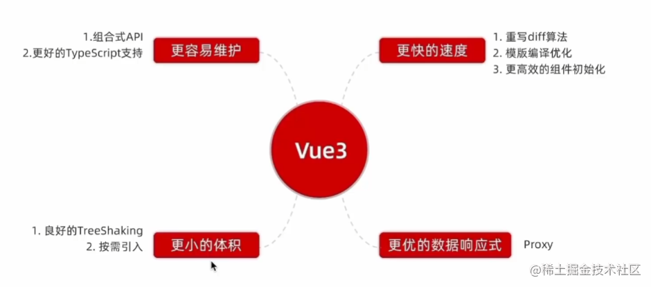

## 非兼容性改变

[看迁移文档](https://v3-migration.vuejs.org/zh/breaking-changes/)

## 为什么要升级 Vue3

- `代码维护问题`： options Api 新增或者修改一个需求，需要分别在 data，methods，computed 里修改，当应用变大之后，造成代码以维护
- `逻辑复用问题`： options Api 通过 Mixins 复用逻辑代码，容易发生命名冲突的问题，且不清楚暴露出来的变量的作用
- `响应式处理问题`： defineProperty 只能劫持对象的属性，对于新增的属性，还要再次手动劫持，监听数组的缺陷

Vue3.x 就推出了 Composition API 主要就是为了解决`代码维护`和`逻辑复用`问题，将零散分布的逻辑组合在一起来维护。并使用`proxy`解决响应式的问题

## Vue 3.0 新特性

[新特性](https://juejin.cn/post/7098575243240800286)



- Performance：性能比 vue2.x 块 1.2 ～ 2 倍
- Tree shaking support：支持按需编译，体积更小
- Composition API：组合 API，类似 React Hooks
- Custom Renderer API：暴露了自定义渲染 API
- Fragment，Teleport（Protal），Suspense：新增三个组件
- 源码优化: 使用`monorepo`和`TypeScript`管理和开发源码，提升自身代码可维护性

### 源码优化

**Monorepo 管理源码**

[文章](https://juejin.cn/post/6943869666381004836#heading-1)

`Monorepo` 是工程项目的一种管理方式, 它将关联性较强的项目或者软件包放在一个 `repository` 中共同管理。vue3的源码`packages`下的每个目录都是独立的一个项目，他们都通过这个共同的仓库进行统一管理。而我们平时多项目的的管理方式是将每一个项目都单独设置一个 `git repository`，这种方式也被称为`multirepo`

>优点

**统一的依赖管理**

所有相关的模块和库都位于同一个代码库中，可以统一管理它们的依赖关系。可以借助工具很方便的进行统一的依赖升级，在前端开发中也不用安装多次 node_modules，大大减少了磁盘占用空间和安装时间

**更方便共享和复用代码**

在 monorepo 模式下，如果在开发过程中想抽取可复用的代码，只需要抽离公共代码到shared-utils模块中。而对于 multirepo 来说，跨项目的公共代码实现是比较麻烦的，虽然可以通过发布包安装依赖的方式解决这个问题，但是始终没有 monorepo 来的方便

**可以统一构建和发布**

相比于单独维护多个独立的仓库，Monorepo可以提供一个统一的构建系统，使得构建、测试和部署变得更加一致。并且模块之间是独立的，用户如果只想使用 Vue3.x 的响应式能力，可单独依赖`reactivity`这个响应式库而不用去依赖整个 Vue，减小了引用包的体积大小。

```js
// 2.x的源码目录
├── src/                   // 源代码目录
│   ├── compiler/          // 编译器相关的代码
│   ├── core/              // Vue 核心代码
│   ├── platforms/         // 平台相关的代码
│   ├── server/            // 服务端渲染相关的代码
│   ├── sfc/               // 单文件组件解析相关的代码
│   ├── shared/            // 共享的工具函数和常量
```

```js
// 3.x源码目录
├── packages/              // Vue 相关的核心包和插件
│   ├── compiler-core/     // 编译器核心相关的代码
│   ├── compiler-dom/      // 编译器与 DOM 相关的代码
│   ├── compiler-sfc/      // 编译器与单文件相关的代码
│   ├── compiler-ssr/      // 编译器与服务端渲染相关的代码
│   ├── reactivity/        // 响应式系统相关的代码
│   ├── runtime-core/      // 运行时核心相关的代码
│   ├── runtime-dom/       // 运行时与 DOM 相关的代码
│   ├── server-renderer/   // 服务端渲染相关的代码
│   ├── shared/            // 共享的工具函数和常量
```

**TypeScript 支持**

Vue2 使用`Flow`进行静态类型检查，但是对复杂场景类型的检查，支持并不好。Vue 3 使用 TypeScript，内置了更多的类型声明，使得在使用 TypeScript 时的开发体验更好。Vue 3 的源码也完全使用 TypeScript 编写，这使得开发者能够更好地使用 TypeScript 进行 Vue 3 的开发。

- 在编码期间帮你做类型检查
- 避免一些因类型问题导致的错误
- 有利于它去定义接口的类型，利于 IDE 对变量类型的推导

### Composition API

更灵活的组织代码结构：`Composition API` 允许开发者根据功能或逻辑相关性将代码组织成可复用的逻辑代码块，而不是按照`options API` 的方式分散在不同的选项（data，methods，computed，钩子函数等）中，提高了代码的可读性和可维护性

更简单的逻辑复用和组合：可以导出逻辑代码块，然后在组件中根据需要进行组合，提高代码的复用性。也就解决了options Api 通过 Mixins 复用逻辑代码，容易发生命名冲突的问题，且不清楚暴露出来的变量的作用

**自定义 hooks**

使用 Vue2.x 写了一个实现加减的例子， 这里可以将其封装成一个 hook, 我们约定这些「自定义 Hook」以 use 作为前缀，和普通的函数加以区分。 useCount.ts 实现：

```js
import { ref, Ref, computed } from 'vue'

type CountResultProps = {
  count: Ref<number>,
  multiple: Ref<number>,
  increase: (delta?: number) => void,
  decrease: (delta?: number) => void,
}

export default function useCount(initValue = 1): CountResultProps {
  const count = ref(initValue)

  const increase = (delta?: number): void => {
    if (typeof delta !== 'undefined') {
      count.value += delta
    } else {
      count.value += 1
    }
  }
  const multiple = computed(() => count.value * 2)

  const decrease = (delta?: number): void => {
    if (typeof delta !== 'undefined') {
      count.value -= delta
    } else {
      count.value -= 1
    }
  }

  return {
    count,
    multiple,
    increase,
    decrease,
  }
}
```

接下来看一下在组件中使用 useCount 这个 hook:

```vue
<template>
  <p>count: {{ count }}</p>
  <p>倍数： {{ multiple }}</p>
  <div>
    <button @click="increase()">加1</button>
    <button @click="decrease()">减一</button>
  </div>
</template>

<script lang="ts">
import useCount from "../hooks/useCount";
 setup() {
    const { count, multiple, increase, decrease } = useCount(10);
        return {
            count,
            multiple,
            increase,
            decrease,
        };
    },
</script>
```

开篇 Vue2.x 实现，分散在 data,method,computed 等， 如果刚接手项目，实在无法快速将 data 字段和 method 关联起来，而 Vue3 的方式可以很明确的看出，将 count 相关的逻辑聚合在一起， 看起来舒服多了， 而且 useCount 还可以扩展更多的功能。

### 3 个内置组件

#### Fragment

Fragment主要是添加一个抽象节点

2.x 中，vue template 只允许有一个根节点，之所以需要这样是因为vnode是一颗单根树形结构，patch方法在遍历的时候从根节点开始遍历，它要求只有一个根节点。

3.x 编译时，如果发现组件是多根的，就创建一个 Fragment 节点作为根节点，将来 patch 的时候，如果发现是一个 Fragment 节点，则直接遍历 children 创建或更新，所以该节点不会出现在 dom 树中

```js
_createElementBlock('div', null, []) => _createElementBlock(_Fragment, null, [])
```

#### Teleport

背景：使用position：fixed定位的时候不一定会定位准确，比如存在滤镜filter：saturate（）等属性的时候

Teleport 组件的作用主要将组件的内容渲染到DOM树中的任意位置，Teleport 其实就是 React 中的 Portal

我们可以使用 `teleport`  组件，通过 `to`  属性，将弹出框、tooltip 等组件渲染的位置与`<div id="app"></div>`  同级，也就是在  `body` 下。这在处理弹出框、模态框等场景时非常有用。

```html
 <teleport to="body">
    <ModalComponent />
  </teleport>
```

#### Suspense

Suspense的主要作用是优化组件的加载体验，可以使用它在页面在加载过程中展示一个加载中状态，避免出现空白或加载闪烁的情况。

使用`<Suspense>`标签将要异步加载的组件包裹起来，通过v-slot指令分别设置了默认插槽和回退插槽。在回退插槽中，你可以自定义展示的回退内容，例如显示一个加载中的提示。

`<Suspense>` 接受两个插槽：#default 和 #fallback。它将在内存中渲染默认插槽的同时展示后备插槽内容。

Suspense还在实验性中，后期随时可能变化

或者在 vue2.x 中使用`vue-async-manager`

```html
<Suspense>
  <!-- v-slot:default -->
  <template #default>
    <Suspended-component />
  </template>
  <!--  v-slot:fallback -->
  <template #fallback> Loading... </template>
</Suspense>
```

### 性能提升

我分别从代码、编译、打包三方面介绍 vue3 性能方面的提升

- 代码层面性能优化主要体现在全新响应式 APl，基于 Proxy 实现，提供了更高效和灵活的数据劫持机制，减少了属性访问的性能开销。
- 编译层面做了更多编译优化处理，比如静态提升、动态内容标记、事件缓存，区块等，可以有效跳过大量 dif 过程
- 打包时更好的支持 tree-shaking，因此整体体积更小，加载更快

## 性能提升方面

### 构建包体积优化

**去除不常用的 api**

去除了一些不常用的特性如：`filter`、`$children`、`Vue.extends`等，减小了库的体积。

**优化 tree-shaking**

Tree shaking（摇树） 是一种优化技术，用于减小构建包的体积大小。它依赖 ESM 的静态结构，通过编译阶段的静态分析，这样就可以识别并移除项目中未使用的模块、函数和变量

Vue3.x 中的核心 API 都支持 tree-shaking，这些 API 都是通过引包的方式而不是vue2中直接在实例化时就注入，只会对使用到的功能或特性进行打包（按需打包），这意味着更多的功能和更小的体积。

实现 Tree-Shaking 条件，模块必须是 ESM(ES Module)，因为它依赖 ESM 的静态结构。因为 rollup 而普及，不过现在无论是 rollup 还是 webpack 都已经支持此功能

### 响应式机制优化

[b站视频](https://www.bilibili.com/video/BV17G41157E6/?spm_id_from=333.999.0.0)

**2.x 响应式机制的缺陷**

1. Object.defineProperty 只能劫持对象属性，需要遍历对象的每一个属性，如果属性值也是对象，就需要递归进行深度遍历，性能消耗高
2. Object.defineProperty 对新增/删除属性是无法监听的，所以vue2中需要使⽤ `$set /$delete` 方法，在底层进行响应式处理，并触发更新
3. 数组索引和 length 属性的修改无法触发更新的，Object.defineProperty处理数组非常消耗性能，所以数组还要使用函数劫持的方式来实现数据劫持的

**3.x 响应式机制**

1. 不需要初始化的时候遍历每一个属性，减小了初始化性能消耗
2. 可以监听到动态新增的属性、删除的属性、还可以监听数字索引的修改和 length 属性的修改
3. Proxy 并不能监听到内部深层次的对象变化，因此 Vue3.0 的处理方式是在 getter 中去递归进行代理，这样的好处是真正访问到的内部对象才会变成响应式，而不是无脑递归。这样也在很大程度上提升了性能

- 数据劫持

使用 `proxy` 创建一个代理对象，对代理对象进行操作。当访问代理对象属性时触发代理对象的`getter`，在 getter 中收集依赖(副作用函数)，然后通过`key`返回源对象的属性值。当修改代理对象的属性时，触发`setter`，在`setter`中触发依赖更新，再修改源对象的值

- 依赖收集`track`

1. 先通过`effect`函数注册副作用函数，它的作用将当前的副作用函数用全局变量`activeEffect`保存起来，并执行副作用函数，会访问到副作用函数中的取值操作，就会触发代理对象的`getter`，执行`track`收集依赖（当前的副作用函数），执行完毕后将全局变量清空
2. `track`收集依赖是通过 Set 集合存储当前的副作用函数，并用`key`和`Set集合`映射 Map 表，再将这个 Map 表和 target 源对象进行弱映射`wekMap`，这样的话，不同的对象不同的 key 值就存储了与之对应的副作用函数集合，完成了依赖收集

  `副作用函数`：如果一个函数引用了外部的资源，这个函数会受到外部资源改变的影响，我们就说这个函数存在副作用。因此，也把该函数叫做副作用函数，就是引用了数据的函数。

- 派发更新`trigger`

1. 使用`trigger`函数封装了派发更新功能
2. 当修改代理对象属性值的时候，通过`target`和`key`值拿到对应得副作用函数`Set`集合，循环执行集合中的副作用函数，完成更新

```js
// 定义一个副作用函数桶，存放所有的副作用函数。每个元素都是一个副作用函数
// 修改 [state -> Map[name: Set(fn,fn), age: Set(fn, fn)], statel -> Map]
const bucket = new WeakMap()

// 1 定义一个全局变量，保存当前正在执行的副作用函数
let activeeffect = null
function is0bject(value) {
  return typeof value === 'object' && value !== null
}

// 收集依赖
function track(target, key) {
  // activeEffect无值意味着没有执行effect函数，无法收集依赖，直接return掉
  if (!activeEffect) return
  // 每个target在bucket中都是一个Map类型： key => effects
  let depsMap = bucket.get(target)
  // 第一次拦截，depsMap不存在，先创建联系
  if(!depsMap){
    depsMap = new Map()
    bucket.set(target, depsMap)
  }
  // 根据当前读取的key，尝试读取key的effects函数
  let depSet = depsMap.get(key)
  if(!depSet){
    depSet = new Set()
    depsMap.set(key, depSet)
  }
  // 只有activeEffect有值时(保存的副作用函数)，才添加到桶中
  depSet.add(activeEffect)
}

// 触发依赖
function trigger(target, key) {
  let depsMap = bucket.get(target)
  if(!depsMap) return
  // 从副作用函数桶中依次取出每一个元素(副作用函数)执行
  let depSet = depsMap.get(key)
  if(depset){
    depSet.forEach((fn) => fn())
  }
}

/**
  * 创建响应式数据
  * @param [object]:普通对象
  * @return [Proxy]:代理对象
*/
function reactive(data) {
  if (!is0bject(data)) return
  return new Proxy(data, {
    get(target, key) {
      // 在get操作时，收集依赖
      track(target, key)
      // return target[key]
      return Reflect.get(target, key);
    }，
    set(target, key, value) {
      // target[key] = value
      Reflect.set(target, key, value);
      // 在set操作时，触发副作用重新执行
      trigger(target, key)
      return true
    }，
  })
}

/**
* 注册副作用函数
* @param [function]:需要注册的 副作用函数
*/
function effect(fn) {
  if (typeof fn !== 'function') return
  // 记录正在执行的副作用函数
  activeEffect =fn
  // 调用副作用函数
  fn()
  // 重置全局变量
  activeEffect = null
}
```

使用

```js
  // 1.创建响应式对象
  const state = reactive({ name: 'xiaopang'})
  const state1 = reactive({ name: 'xxp'})

  // 2.注册副作用函数
  effect(function e1() {
  console.log('e1执行...'， state.name)
  })
  effect(function e2() {
  console.log('e2执行...'， state1.name)
  })
  setTimeout(() => {
    state.name = 'xiaoming
  }，1000)
```

### 编译/diff优化

[Vue-template-explorer（Vue3 在线编译）](https://template-explorer.vuejs.org/)

除了响应式处理部分的优化，还在耗时较多的编译和 diff 阶段进行了优化。优化方向尽可能的区分动态内容和静态内容，针对不同的内容，采用不同的优化策略。

2.x 的数据更新触发重新渲染的粒度是组件级的，所以当数据发生变化，在单个组件内部，是需要遍历该组件的整个 vnode 节点的。这时如果一个组件中只有少量动态动态节点时，其他都是静态节点，对静态节点的遍历和 diff 就是多余的性能消耗，理想状态是只对这个绑定了动态数据的节点进行比对即可，vue3.0 做到了。

3.0 通过编译阶段对静态模板的分析，编译生成了 block tree。`Block tree`是一个将模版基于动态节点指令切割的嵌套区块，每个区块内部的节点结构是固定的,每个区块只需要以一个 Array 来追踪自身包含的动态节点

借助 Blocktree，Vuejs 将 vnode 更新性能由与`模版整体大小相关`提升为与`动态内容的数量相关`

#### 动态内容标记patchFlag

**patchFlag**

在 Vue2 新旧 Vnode 进行 diff 比对，这种比对是全量 Vnode 比对，包括静态节点和动态节点

Vue3 在编译成 render 函数时，会在动态元素地方添加一个标记，如`（1 /* TEXT */表示文本内容动态绑定 ）`，生成的 Vnode 对象时就会带有 `patchFalg` 属性，将来执行 diff 的时候，只会对 `patchFalg` 大于 `1` 的节点进行比对，来减小性能消耗。

按照正常的思维，既然要比较两个事物是否有差异，就得看两个事物的各组成部分是否有差异，我们知道 Vnode 有标签名、类型名、事件名等各种属性名，同时还有有子节点，子节点又可能有子节点。那么要比较新旧 Vnode 的差异，就得遍历全部节点，逐个属性逐级进行比较，性能不可避免的低下。

Vue3 不仅标记某个 Vnode 是否动态，而且精准的标记具体 是哪个属性是动态的，这样在进行更新的时候只需要定向查找相应属性的状态，比如 patchflag 的值如果包含的状态是 `CLASS` 对应的值 `1<<1`，则直接比对新旧虚拟 Node 的 class 属性的值的变化，来减小性能消耗。

虽然对虚拟 Node 已经精准的标记了动态节点，甚至标识到了具体什么属性的维度。但是还是无法避免递归整颗 vNode 树。于是利用`Block`的机制来规避全量对 vNode 树进行递归。

```js
//  编译为 render 的代码
<div>{{ count }}</div>
_createElementVNode("div", null, _toDisplayString(_ctx.count), 1 /* TEXT */),
```

`patchFlag` 使用二进制进行存储，每一位存储一个信息。除了`HOISTED`和`BAIL`，其他所有的值都代表着虚拟 Node 所代表的节点是动态的

```js
// 代码片段3
export const enum PatchFlags {
  TEXT = 1,
  CLASS = 1 << 1,
  STYLE = 1 << 2,
  PROPS = 1 << 3,
  FULL_PROPS = 1 << 4,
  HYDRATE_EVENTS = 1 << 5,
  STABLE_FRAGMENT = 1 << 6,
  KEYED_FRAGMENT = 1 << 7,
  UNKEYED_FRAGMENT = 1 << 8,
  NEED_PATCH = 1 << 9,
  DYNAMIC_SLOTS = 1 << 10,
  DEV_ROOT_FRAGMENT = 1 << 11,
  HOISTED = -1,
  BAIL = -2 
}
```

**Block机制**

如何规避全量比较虚拟Node？ `Block机制`就是把这些动态的节点放到某一个独立的地方进行维护，这样新旧 `Vnode` 可以在一个地方进行比较

根节点会作为顶级block，在根节点 VNode 上添加一个属性 `dynamicChildren` ，用来收集根节点内部所有的动态节点。在执行 `patchElemenet` 函数的时候，会判断如果属性 `dynamicChildren` 有值，有值的话，则不会执行`patchChildren`函数进行比较新旧 Vnode 比对。而是执行 `patchBlockChildren` ，由于新旧 Vnode 的根节点下都有 `dynamicChildren` 属性，而且保存的动态节点的顺序是一一对应的，所以不再需要深度递归去寻找节点间的差异，而是简单的线性遍历并执行 patch 函数就完成了节点的更新。

```js
// 代码片段5
if (dynamicChildren) {
  patchBlockChildren(
    n1.dynamicChildren!,
    dynamicChildren,
    el,
    parentComponent,
    parentSuspense,
    areChildrenSVG,
    slotScopeIds
  )
  if (__DEV__ && parentComponent && parentComponent.type.__hmrId) {
    traverseStaticChildren(n1, n2)
  }
} else if (!optimized) {
  // full diff
  patchChildren(
    n1,
    n2,
    el,
    null,
    parentComponent,
    parentSuspense,
    areChildrenSVG,
    slotScopeIds,
    false
  )
}
```

```js
// 代码片段6
// The fast path for blocks.
const patchBlockChildren: PatchBlockChildrenFn = (
  oldChildren,
  newChildren,
  fallbackContainer,
  parentComponent,
  parentSuspense,
  isSVG,
  slotScopeIds
) => {
  for (let i = 0; i < newChildren.length; i++) {
    const oldVNode = oldChildren[i]
    const newVNode = newChildren[i]
    // Determine the container (parent element) for the patch.
    const container =
      // oldVNode may be an errored async setup() component inside Suspense
      // which will not have a mounted element
      oldVNode.el &&
      // - In the case of a Fragment, we need to provide the actual parent
      // of the Fragment itself so it can move its children.
      (oldVNode.type === Fragment ||
        // - In the case of different nodes, there is going to be a replacement
        // which also requires the correct parent container
        !isSameVNodeType(oldVNode, newVNode) ||
        // - In the case of a component, it could contain anything.
        oldVNode.shapeFlag & (ShapeFlags.COMPONENT | ShapeFlags.TELEPORT))
        ? hostParentNode(oldVNode.el)!
        : // In other cases, the parent container is not actually used so we
          // just pass the block element here to avoid a DOM parentNode call.
          fallbackContainer
    patch(
      oldVNode,
      newVNode,
      container,
      null,
      parentComponent,
      parentSuspense,
      isSVG,
      slotScopeIds,
      true
    )
  }
}

```

**block tree**

`dynamicChildren` 能按顺序进行比较的前提条件，是要新旧 VNode 中， `dynamicChildren` 的元素必须能够一一对应，因为只有新旧Vnode是同一个元素进行调用patch依次更新才有意义，但是也会存在不一一对应的情况

当DOM结构不稳定的时候，比如我们的程序中包含了大量的v-if、v-else、v-else-if、v-for等可能改变DOM树结构的指令。比如下面的模版：

```html
<div>
  <div v-if="flag">
    <div>{{name}}</div>
    <div>{{age}}</div>
  </div>
  <div v-else>
      <div>{{city}}</div>
  </div>
  <div v-for="item in arr">{{item}}</div>
</div>
```

当flag的值不同的时候，收集的动态节点个数是不相同的，就无法通过一一对应的方式进行遍历比较。

举个例子，flag为true的时候，动态节点中包含{{name}}所在的div和{{age}}所在的div，而当条件发生改变后，新的虚拟Node收集的动态节点是{{city}}所在的div，当进行遍历比较的时候，会用{{city}}所在div对应的虚拟Node去和{{name}}所在的div所在的虚拟Node进行比较和更新。但是{{name}}所在div的虚拟Node的el属性是节点`<div>{{name}}</div>`，然而该节点已经因为条件变化而消失。所以即使对该节点进行更新，浏览器页面也不会发生任何变化。

为了解决这个问题，`Block Tree`产生了。其实就是把那些`v-if`这类DOM结构可能发生改变的地方也作为一个`block`进行收集，这样就会得到一颗 Block 树。

这样做有以下好处：保证稳定外层 Block 能继续使用优化的更新策略，在不稳定的内层 Block 中实施降级策略，只进行全量更新比对，节省性能

**dynamicChildren 赋值过程**

只需要把有 patchFlag 的元素收集到 dynamicChildren 数组中即可，但如何确定 VNode 收集到哪一个 Block 中呢？

因为 Block 可以发生嵌套，因此要用栈存起来。openBlock 的时候初始化并推入栈，closeBlock 的时候恢复上一层的 dynamicChildren。

```js
// block 可能会嵌套，当发生嵌套时，用栈保存上一层收集的内容
// 然后 closeBlock 时恢复上一层的内容
const dynamicChildrenStack = []

// 用于存储当前范围中的动态元素的 VNode
let currentDynamicChildren = null

function openBlock(){
    currentDynamicChildren = []
    dynamicChildrenStack.push(currentDynamicChildren)
}

// 在 createBlock 中被调用
function closeBlock(){``
    currentDynamicChildren = dynamicChildrenStack.pop()
}
```

#### 静态节点提升

Vue3 中对不参与更新的静态节点，会做静态提升。没做静态提升之前，静态节点在 render 函数内部，会被重复创建。做了静态提升后，静态节点被放置在 render 函数外，会被打上静态标记值为-1，只会被创建一次，每次render函数树执行直接引用提升了的静态节点即可。特殊标志是负整数表示永远不会用于 Diff。免去了重复的创建操作，优化内存。

```js
const _hoisted_1 = /*#__PURE__*/ _createElementVNode('div', null, '我是静态节点1', -1 /* HOISTED */)
const _hoisted_2 = /*#__PURE__*/ _createElementVNode('div', null, '我是静态节点1', -1 /* HOISTED */)
function render(_ctx, _cache) {
  return (
    _openBlock(),
    _createElementBlock(
      _Fragment,
      null,
      [
        _hoisted_1,
        _hoisted_2,
        _createElementVNode('h1', null, _toDisplayString(_ctx.msg), 1 /* TEXT */),
        _withDirectives(
          _createElementVNode(
            'input',
            {
              'onUpdate:modelValue': _cache[0] || (_cache[0] = ($event) => (_ctx.msg = $event)),
            },
            null,
            512 /* NEED_PATCH */
          ),
          [[_vModelText, _ctx.msg]]
        ),
      ],
      64 /* STABLE_FRAGMENT */
    )
  )
}
```

#### 事件监听缓存

在Vue 3中，事件监听函数会进行缓存，以提高性能和减少不必要的函数创建。Vue 3使用了一种称为事件懒绑定（event patching）的机制来实现事件监听缓存。

事件懒绑定的基本原理是，Vue 3会为每个组件实例创建一个内部的事件跟踪器，它会缓存事件监听函数。当事件监听器首次被绑定到元素时，Vue 3会将其缓存到事件跟踪器中。当同一事件监听器再次被绑定到相同类型的元素上时，Vue 3会直接从缓存中获取监听函数，而不需要再次创建新的函数。这样可以有效地减少重复的函数创建和内存占用，特别适用于那些在组件中多次使用相同事件监听器的场景。

以下是一个示例，展示了事件监听缓存的使用：

```html
<template>
  <div>
    <button @click="handleClick">点击按钮</button>
  </div>
</template>
<script>
export default {
  methods: {
    handleClick() {
      console.log('按钮点击事件');
    }
  }
};
</script>
```

在上述示例中，通过在模板中使用@click指令绑定事件监听器handleClick，Vue 3会对该事件监听器进行缓存。当按钮被点击时，Vue 3会直接从缓存中获取已缓存的事件监听器函数，而不需要重新创建。

通过事件监听缓存，Vue 3能够提高事件处理的性能，并减少不必要的函数创建。这对于那些需要频繁使用相同事件监听器的场景特别有益，如列表渲染或循环组件中的事件处理。

#### SSR 优化

在 Vue2 中也有 SSR 渲染，，但是 Vue3 中的 SSR 渲染相对于 Vue2 也有了很大的性能提升。

当你在开发中使用  SSR  开发时，Vue 3.0  会将静态标签直接转化为文本，被直接 innerHtml，就不需要创建 vnode 对象，再去根据对象渲染。相比  React  先将  jsx  转化为虚拟  DOM，再将虚拟  DOM  转化为  HTML，Vue 3.0  已经赢了。


## 新的 Composition Api

### setup

`setup` 函数是组件选项中的一个新添加的函数，用于替代 `Vue2` 中的 data、methods等选项。它是组合式 API 的入口，它提供了组件的初始化逻辑、响应式数据的创建等功能

- **执行时机**: 从生命周期的角度来看，它会在 `beforeCreate` 之前执行
- **this指向**: 在 `setup` 中你应该避免使用 `this`，因为它不会找到组件实例
- **接收参数**：

  - `props` 参数是父组件传递给子组件响应式数据；
  - `context`参数是一个包含组件实例上下文的对象，包括attrs、slots、emit、expose等属性。例如可以通过context.attrs访问组件的非响应式属性，通过context.slots访问插槽内容，通过context.emit触发自定义事件，铜通过context.expose暴露公共 property (函数)等。

  > 当组件没定义expose暴露内容的时候，通过ref获取到的就是组件自身的内容，也就是setup函数return的内容和props属性的内容。当定义了expose暴露内容的时候，通过ref获取到的就只是组件expose暴露内容，并且setup函数return的内容会失效，也就是会被覆盖。

**返回值**：setup 返回的所有内容都暴露给组件的其余部分 (计算属性、方法、生命周期钩子等等) 以及组件的模板。所以我们在模板中需要使用到的数据都需要通过setup方法return出来。

### 单文件setup（vue3.2支持）

### reactive 和 Ref 的区别

**reactive**

- `reactive` 用于处理引用类型的数据，返回响应式代理对象，操作代理对象的属性即进行访问和修改
- `reactive` 内部使用 `Proxyt` 代理传入对象并拦截该对象各种操作，从而实现响应式
- 对对象进行重新赋值会丢失响应式，不可以解构、展开运算符(...) 解构后的属性丢失响应式

**ref**

- `ref` 基础数据类型和引用数据类型都可以，返回响应式 `Ref` 对象，访问和修改值需要通过 `.value` 属性，在模板中使用会自动解包，不需要`.value`
- `Ref` 内部封装一个 `Reflmpl` 类，使用访问器属性 `get/set` 进行数据劫持和更新，从而实现响应式
- 基本数据类型的值会被 `RefImpl` 直接包装，而对象和数组会被 `reactive` 转换为响应式代理，最后也会被 RefImpl 包装。
- reactive中的 `ref` 不用使用 `.value`，reactive会自动解包

```js
let obj = {
  a:1,
  b:2,
  c: ref(3)
}
obj.c = 4 // 不用写.value
```

### toRef 和 toRefs

`toRef`

- 根据一个响应式对象中的一个属性,创建一个响应式的 ref。
- 同时这个 `ref` 和原对象中的属性保持同步,改变原对象属性的值这个 `ref` 会跟着改变,反之改变这个 `ref` 的值原对象属性值也会改变
- 它接收两个参数,一个是响应式对应,另一个则是属性值,例如下面代码

```js
const count = ref({
    a: 1,
    b: 2
})
const a = toRef(count.value, 'a')
const addCount = () => {
    a.value++
}
```

原理

```js
function toRef(obj,key){
 const wrapper = {
 // 通过访问 obj 对象中的访问器属性 value，当读取 value 值，其实是读取 obj 下的属性值，这样就可以保留对象的按引用传递，保留响应性；
  get value(){
   return obj[key]
  }
 }
 return wrapper
}
```

`toRefs`它可以将一个响应式对象转成普通对象,而这个普通对象的每个属性都是响应式的 `ref`

```js
let person = reactive({
  name:'张三',
  age:18
})
let{name,age}= toRefs(person)

function changeName(){name.value += ~}
function changeAge(){age.value += 1}
```

在经过处理后就可以进行解构赋值的操作，避免在模板中频繁使用 .value 进行访问。

### watch 和 watchEffect 异同

- 3.x 和 2.x 的`watch`一样，支持`immediate`和`deep`选项，但 3.x 不再支持`'obj.key1.key2'`的"点分隔"写法
- 3.x 中`watch`支持监听单个属性，也支持监听多个属性，相比 2.x 的`watch`更灵活

**相同点**

1. 都是监听响应式数据的变化
2. 都可以手动停止监听
3. 都有清除副作用，刷新时机和调试

**不同点**

1. watch 只追监听确定义的数据源; watchEffect 会自动收集依赖（函数中用到哪些属性，就监听哪些属性）
2. watch 可以在回调函数中访问到新值和旧值; watchEffect 只能获取变化后的值
3. watch 首次不会默认自动监听，需要配置`immediate`; watchEffect 首次可以自动执行回调函类
4. watch 可以监听对象类型的数据; watchEffect 不行

如果我们不关心响应式数据变化前后的值，只是想拿这些数据做些事情，那么`watchEffect`就是我们需要的。watch 更底层，可以接收多种数据源，包括用于依赖收集的 getter 函数，因此它完全可以实现 watchEffect 的功能，同时由于可以指定 getter 函数，依赖可以控制的更精确，还能获取数据变化前后的值，因此如果需要这些时我们会使用 watch。

```js
const stopWatch = watch(countRef, (newVal, oldVal, onClear) => {
  onClear(() => {
    console.log('清理函数')
  })
})

const stopWatchEffect = watchEffect((onClear) => {
  console.log(countRef.value)
  onClear(() => {
    console.log('清理函数')
  })
})
```

### computed

```js
import { defineComponent, reactive, computed } from 'vue'
export default defineComponent({
  setup() {
    const user1 = reactive({ name: 'randy1', age: 24 })
    // 接受一个 getter 函数，并根据 getter 的返回值返回一个不可变的响应式 ref 对象
    // 这里的fullName1是不能修改的
    const fullName1 = computed(() => {
      return `${user1.name}今年${user1.age}岁啦`
    })
    const updateUser1Name = () => {
      user1.name += '!'
    }
  },
})
```

## 老语法变化

### Vue3 生命周期改动

- vue2相较于vue3少了renderTracked、renderTriggered两个生命周期方法。这两个钩子函数是 Vue 3 提供的调试工具，用于跟踪和记录响应式数据的访问和触发渲染的过程，以帮助开发者更好地理解组件的渲染行为。
- 销毁生命周期方法名也发生了变化，由beforeDestroy、destroyed变为beforeUnmount、unmounted，这样是为了更好的与beforeMount、mounted 相对应。
- vue3写在setup函数中生命周期方法名就是前面多加了on。

vue3虽然提倡把生命周期函数都放到setup中，但是vue2那种选项式写法还是支持的。

| vue2          | vue3选项式      | vue3(setup)       |
| ------------- | --------------- | ----------------- |
| created       | created         | 无                |
| beforeMount   | beforeMount     | onBeforeMount     |
| mounted       | mounted         | onMounted         |
| beforeUpdate  | beforeUpdate    | onBeforeUpdate    |
| updated       | updated         | onUpdated         |
| beforeDestroy | beforeUnmount   | onBeforeUnmount   |
| destroyed     | unmounted       | onUnmounted       |
| errorCaptured | errorCaptured   | onErrorCaptured   |
| 无            | renderTracked   | onRenderTracked   |
| 无            | renderTriggered | onRenderTriggered |
| activated     | activated       | onActivated       |
| deactivated   | deactivated     | onDeactivated     |

`renderTracked`： 是一个渲染追踪钩子函数，它会在响应式对象被追踪时触发。

`renderTriggered`： 是一个渲染触发钩子函数，它会在响应式对象导致重新渲染时触发。

```js
    onRenderTracked(({ key, target, type }) => {
      console.log("onRenderTracked", { key, target, type });
    });
    onRenderTriggered(({ key, target, type }) => {
      console.log("onRenderTriggered", { key, target, type });
    });
```

### v-model 的变化

vue3 中的 v-model 将 v-model 和.sync 修饰符结合起来，去除了原来的.sync 修饰符，是 `:modelValue + @update：modelValue`的语法糖。也可以用参数的形式指定多个不同的绑定，如 v-model：name v-mdoel：age，非常强大

### key支持在template使用

在vue2中，key是不能定义在template节点上的。但是在vue3中支持了。

```html
<!-- Vue 2.x -->
<template v-for="item in list">
  <div :key="'heading-' + item.id">...</div>
  <span :key="'content-' + item.id">...</span>
</template>

<!-- Vue 3.x -->
<template v-for="item in list" :key="item.id">
  <div>...</div>
  <span>...</span>
</template>
```

### 修改v-if和v-for优先级

在vue2中v-for的优先级是比v-if高的，在vue3中v-if的优先级比v-for更高

### keep-alive 的变化

和 vue2 不同点,vue2 直接包裹`<router-view>`,vue3 在路由切换时需要借助插槽实现

```js
<router-view v-slot="{ Component }">
    <keep-alive>
        <component :is="Component" />
    </keep-alive>
</router-view>
```

### 自定以指令变化

在 Vue 3 中，主要对这些生命周期方法进行了调整

```js
Vue.directive('highlight', {
  beforeMount(el, binding, vnode) {
    // 对应 bind
    el.style.background = binding.value
  },
  mounted() {}, // 对应 inserted
  beforeUpdate() {}, // 新增
  updated() {}, // 对应 update
  beforeUnmount() {}, // 新增
  unmounted() {}, // 对应 unbind
})
```

### 组件传值变化

```ts
// 子组件接收
<script lang="ts" setup name="Person">
  import {withDefaults} from 'vue'
  import {type Persons} from '@/types'

  // 只接收list
  // defineProps(['list'])

  // 接收list + 限制类型
  // defineProps<{list:Persons}>()

  //  接收list + 限制类型 + 限制必要性 + 指定默认值
  withDefaults(defineProps<{list?:Persons}>(),{
    list:()=> [{id:'ausydgyu01',name:'康师傅·王麻子·特仑苏',age:19}]
  })
  // 接收list，同时将props保存起来
  /* let x = defineProps(['list'])
  console.log(x.list) */
</script>

// 之前的方式
export default {
  props: ["test"],
  emits: ["updateTest"],
  setup(props,ctx) {
    console.log(props,ctx)
    const handleClick = () => {
      ctx.emit("updateTest"，Math.random() * 100)
    }
    return {
      handleClick
    }
  }，
}
```

### 使用路由变化

```js
import { useRoute, useRouter } from 'vue-router'
export default {
  setup() {
    const route = useRoute()
    const router = useRouter()
    console.log(route, router)
  },
}
```

### 全局 API 转移到应用对象

在 Vue 2.x 中，大部分全局 API 都是通过 Vue.xxx 或者 Vue.abc() 方式调用，而在 Vue 3 中，这些方式将会改变，取而代之的是如下

```js
import { createApp } from 'vue'
const app = createApp({})
app.mixin()
app.use() // 注册插件
app.components()
app.mount() // 注册应用
app.unmount() // 卸载应用
app.directive()
app.config
...
```

同时，可以只引入一些需要的 API，不需要的不用引入，这样也符合 Three Shaking 的要求，例如：

```js
import { nextTick, reactive, onMounted } from 'vue'
nextTick(() => {})
onMounted(() => {})
```

由于 Vue 3 中全局 API 都会通过 app.xxx 的方法调用，所以vue2中通过 Vue.prototype.xxx 绑定的全局方法和变量将无法使用，可以采用如下方式来代替：

```js
app.config.globalProperties.http = function () {}
```

### 根实例初始化

在 Vue 2.x 中通过 new Vue() 的方法来初始化：

```js
import App from './App.vue'
new Vue({
  store,
  render: (h) => h(App),
}).$mount('#app')
```

在 Vue 3.x 中 Vue 不再是一个构造函数，通过 createApp 方法初始化：

```js
import App from './App.vue'
createApp(App).use(store).mount('#app')
```

### 新的异步组件创建方式

在 Vue 2.x 中，尤其是在 Vue Router 中，会经常使用到异步组件，借助 webpack 的打包方式，可以将一个组件的代码进行异步获取，例如：

```js
const asyncPage = () => import('./NextPage.vue')

const asyncPage = {
  component: () => import('./NextPage.vue'),
  delay: 200,
  timeout: 3000,
  error: ErrorComponent,
  loading: LoadingComponent,
}
```

在 Vue 3 中，提供了 defineAsyncComponent() 方法创建异步组件，同时可以返回一个 Promise 对象来自己控制加载完成时机，如下：

```js
import { defineAsyncComponent } from 'vue'

const asyncPageWithOptions = defineAsyncComponent({
  loader: () => import('./NextPage.vue'),
  delay: 200,
  timeout: 3000,
  error: ErrorComponent,
  loading: LoadingComponent,
})

const asyncComponent = defineAsyncComponent(
  () =>
    new Promise((resolve, reject) => {
      /* ... */
    })
)
```

### data 属性只支持 function

在 Vue 2.x 中，根组件的 data 可以直接配置一个对象，子组件的 data 可以配置 function，然后返回一个对象

在 Vue 3 中，所有组件都只支持配置 function 返回一个对象的方式

## 去除的 api

### 按键修饰符

不再支持使用数字 (即键码) 作为 v-on 修饰符
在 Vue 2.x 中，绑定键盘事件会用到如下代码：

```js
<!-- keyCode version -->
<input v-on:keyup.13="submit" />
```

```js
<!-- alias version -->
<input v-on:keyup.enter="submit" />
```

在事件中，给 keyup 配置一个指定按钮的 keyCode 在 Vue 3 中将不会生效，但是依然可以使用别名

### $on、$off 和 $once 方法

在 Vue2.x 中可以通过 EventBus 的方法来实现组件通信：

```js
var EventBus = new Vue()
Vue.prototype.$EventBus = EventBus
...
this.$EventBus.$on()
this.$EventBus.$emit()m
```

这种用法在 Vue 3 中就不行了，在 Vue 3 中 移除了 `$on`、`$off` 等方法（参考 rfc），事件总线模式可以被替换为使用外部的、实现了事件触发器接口的库，例如 mitt 或 tiny-emitter。

```js
import mitt from 'mitt'
const emitter = mitt()
// listen to an event
emitter.on('foo', (e) => console.log('foo', e))
// fire an event
emitter.emit('foo', { a: 'b' })
```

### filters

移除了组件的 filters 选项，可以使用 methods 的或者 computed 来进行替代

### inline-template

在 2.x 中，Vue 为子组件提供了 inline-template attribute，以便将其内部内容作为模板使用，而不是作为分发内容。

```html
<my-component inline-template>
  <div>
    <p>它们将被编译为组件自己的模板，</p>
    <p>而不是父级所包含的内容。</p>
  </div>
</my-component>
```

### $children

在 3.x 中，$children property 已被移除，且不再支持。如果你需要访问子组件实例，我们建议使用模板引用。

## Pinia

- state
- getters
- action

Pinia 是 Vue 的专属的最新状态管理库，是 Vuex 状态管理工具的替代品

1. 提供更加简单的 API(去掉了 mutation) ，组件中可直接修改store的数据，无需再提交mutation

```ts
// 组件中修改store数据
import {useCountStore} from '@/store/count'

const countStore = useCountStore()
// 直接修改
function add() {
  // 1. 第一种修改方式
  countStore.sum += 1

  // 2. 第二种修改方式，修改多个数据
  countStore.$patch({
    sum: 222,
    address: '北京'
  })

  // 3.第三种修改方式，调用对应action
  countStore.incrementOdd(n.value)
}

```

```ts
// Pinia

import { defineStore } from 'pinia'

export const useCountStore = defineStore('count', {
  actions: {
    //加
    increment(value:number) {
      if (this.sum < 10) {
        //操作countStore中的sum
        this.sum += value
      }
    },
  }, 
  state() {
    return {
      sum: 1,
      address: '苏州'
    }
  }
})

```

2. 提供符合组合式风格的 API(和 Vue3 新语法统一)
4. 去掉了 modules 的概念，每一个 store 都是一个独立的模块
5. 搭配 TypeScript 一起使用提供可靠的类型推断

## setup 中能不能访问到data和methods中的数据

setup执行时机在beforecreate之前

在setup中是不能使用data和methods，因为还没初始化好

由于不能再setup函数中使用data和methods，所以Vue为了避免我们错误的使用，它直接将setup函数中的this修改成undefined.

setup只能同步，不能异步

## 宏函数在vue3中不用引入直接使用

- defineExpose()
- defineProps()
