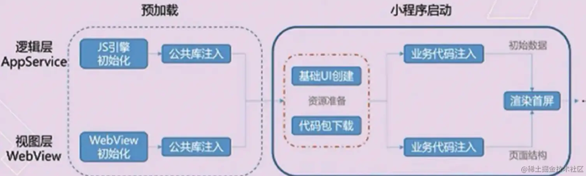
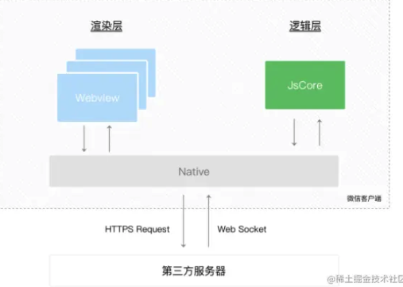
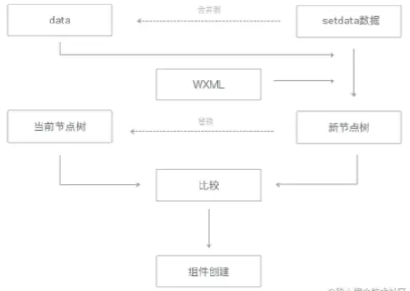
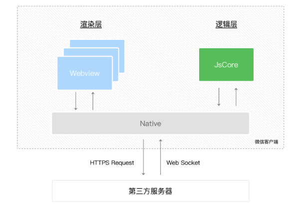
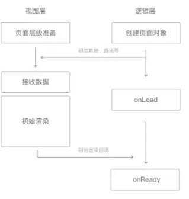
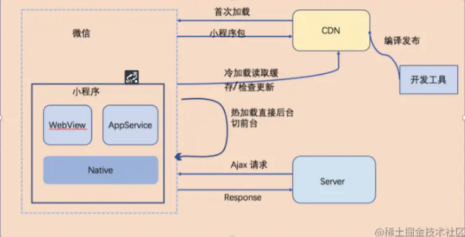

### 小程序如何注册的

App()来注册一个小程序

Page()来注册一个页面

### 微信小程序的相关文件类型

- project.config.json 项目配置文件，用得最多的就是配置是否开启https校验；
- App.json 必须要有这个文件，如果没有这个文件，项目无法运行，因为微信框架把这个作为配置文件入口，整个小程序的全局配置。包括页面注册，网络设置，以及小程序的 window 背景色，配置导航条样式，配置默认标题
- App.js 必须要有这个文件，没有也是会报错！但是这个文件创建一下就行 什么都不需要写以后我们可以在这个文件中监听并处理小程序的生命周期函数、声明全局变量
- App.wxss 公共样式，引入iconfont等；
- pages 里面包含一个个具体的页面；

### 请谈谈wxml与标准的html的异同

- 都是用来描述页面的结构；
- 都由标签、属性等构成；
- 标签名字不一样，且小程序标签更少，单一标签更多；
- 多了一些 wx:if 这样的属性以及 {{ }} 这样的表达式
- WXML仅能在微信小程序开发者工具中预览，而HTML可以在浏览器内预览
- 组件封装不同， WXML对组件进行了重新封装，
- 小程序运行在JS Core内，没有DOM树和window对象，所以无法使用window对象和document对象

### 请谈谈WXSS和CSS的异同

- 都是用来描述页面的样子；
- WXSS 具有 CSS，大部分的特性，也做了一些扩充和修改；
- WXSS新增了尺寸单位，WXSS在底层支持新的尺寸单位 rpx；
- WXSS 仅支持部分 CSS 选择器；
- WXSS 提供全局样式与局部样式

### rpx、px、em、rem、%、vh、vw

- rpx 相当于把屏幕宽度分为750份，1份就是1rpx
- px 绝对单位，页面按精确像素展示
- em 相对单位，相对于它的父节点字体进行计算
- rem 相对单位，相对根节点html的字体大小来计算
- % 一般来说就是相对于父元素
- vh 视窗高度，1vh等于视窗高度的1%
- vw 视窗宽度，1vw等于视窗宽度的1%

### Mustache 语法（双大括号{{}}）

- 想用data中的数据，就用{{}},无论是标签，属性，还是表达式
- 和vue不同：可以出现方法调用（join（）），可以写在属性中
  
```html
<!-- 内容 -->
<view> {{ message }} </view>
<!-- 组件属性 -->
<view id="item-{{id}}"> </view>
<!-- 控制属性 -->
<view wx:if="{{condition}}"> </view>
<!-- 关键字(需要在双引号之内) -->
<checkbox checked="{{false}}"> </checkbox>

<!-- 三元运算 -->
<view hidden="{{flag ? true : false}}"> Hidden </view>
<!-- 算数运算 -->
<view> {{a + b}} + {{c}} + d </view>
<!-- 逻辑判断 -->
<view wx:if="{{length > 5}}"> </view>
<!-- 字符串运算 -->
<view>{{"hello" + name}}</view>

<!-- 组合：数组 -->
<view wx:for="{{[zero, 1, 2, 3, 4]}}"> {{item}} </view>
<!-- 组合：对象 -->
<template is="objectCombine" data="{{for: a, bar: b}}"></template>
```

### wx:if和hidden

- 当 wx:if 的条件值切换时，框架有一个局部渲染的过程，因为它会确保条件块在切换时销毁或重新渲染。
- 同时 wx:if 也是惰性的，如果在初始渲染条件为 false，框架什么也不做，在条件第一次变成真的时候才开始局部渲染。
- hidden 就简单的多，组件始终会被渲染，只是简单的控制显示与隐藏。
- 一般来说，wx:if 有更高的切换消耗而 hidden 有更高的初始渲染消耗。因此，如果需要频繁切换的情景下，用 hidden 更好，如果在运行时条件不大可能改变则 wx:if 较好。

### setData()更新数据

- 说明：将数据从逻辑层发送到视图层（异步），同时改变对应的 this.data 的值（同步）
- 1 修改 data 中的数据
- 2 更新视图，也就是说：视图中使用该数据的地方会重新渲染

### bindtap和catchtap 的区别

- 绑定事件：1 `bindtap` 2 `catchtap`
- 说明：bind 事件绑定不会阻止冒泡事件向上冒泡，catch 事件绑定可以阻止冒泡事件向上冒泡
- 说明：通过标签的自定义属性`data-*`，实现给事件“传递”参数

```js
<button bindtap="sayHi" data-msg="test">
  点我吧
</button>

Page({
  sayHi(event) {
    console.log("单击事件触发了~", event.currentTarget.dataset.msg)
  }
})
```

### 小程序页面传值

- 通过小程序示例getApp()

```js
const app = getApp()
app.globalData.user = 'name1'
```

- 通过页面路由传参
- 通过本地存储传参

### 应用生命周期

```js
App({
    onLaunch() // 初始化执行，全局触发一次，比如登录，获取用户信息
    onShow() // 监听小程序启动或切前台。
    onHide()// 监听小程序切后台，小程序隐藏式触发
    onError() // 小程序脚本发生错误（可以把错误的信息放进数据库）
    onPageNotFound() // 页面不存在触发
    onUnhandledRejection() // 未处理的 Promise 拒绝事件监听函数
    onThemeChange() // 监听系统主题变化
})
```

### 页面的生命周期

```js
page({
    data: {} // 初始化数据
    // 生命周期回调
    onLoad(query) // 页面加载时触发。一个页面只会调用一次，可以在 onLoad 的参数中获取打开当前页面路径中的参数
    onshow() // 页面显示/切入前台时触发
    onReady() // 页面初次渲染完成时触发。一个页面只会调用一次，代表页面已经准备妥当，可以和视图层进行交互。
    // 注意：对界面内容进行设置的 API 如wx.setNavigationBarTitle，请在onReady之后进行。详见生命周期
    onHide() //页面隐藏/切入后台时触发。 如 wx.navigateTo 或底部 tab 切换到其他页面，小程序切入后台等
    onunload() // 页面卸载时触发。如wx.redirectTo或wx.navigateBack到其他页面时。
    onRouteDone() // 监听路由动画完成 如 wx.navigateTo 页面完全推入后 或 wx.navigateBack 页面完全恢复时

    // 页面事件的处理函数
    onPullDownRefresh() // 触发下拉刷新时执行
    onReachBottom() // 页面触底时执行
    onShareAppMessage() // 用户点击右上角转发
    onShareTimeline() // 用户点击右上角转发到朋友圈
    onAddToFavorites() // 用户点击右上角收藏
    onPageScroll() // 页面滚动时执行
    onResize() // 页面尺寸变化时执行
    onTabItemTap(item) // 当前是 tab 页时，点击 tab 时触发
    onSaveExitState() // 页面销毁前保留状态回调

})
```

### 组件的生命周期

- created 生命周期回调—监听页面加载
- attached生命周期回调—监听页面显示
- ready生命周期回调—监听页面初次渲染完成
- moved生命周期回调—监听页面隐藏
- detached生命周期回调—监听页面卸载
- error每当组件方法抛出错误时执行

**注意的是：**

- 组件实例刚刚被创建好时， created 生命周期被触发，此时，组件数据 this.data 就是在 Component  构造器中定义的数据 data ， 此时不能调用 setData
- 在组件完全初始化完毕、进入页面节点树后， attached 生命周期被触发。此时， this.data 已被初始化为组件的当前值。这个生命周期很有用，绝大多数初始化工作可以在这个时机进行
- 在组件离开页面节点树后， detached 生命周期被触发。退出一个页面时，如果组件还在页面节点树中，则  detached 会被触发

还有一些特殊的生命周期，它们并非与组件有很强的关联，但有时组件需要获知，以便组件内部处理，这样的生命周期称为“组件所在页面的生命周期”，在 pageLifetimes 定义段中定义，如下：

生命周期说明show组件所在的页面被展示时执行hide组件所在的页面被隐藏时执行
代码如下：

```js
Component({
  pageLifetimes: {
    show: function() {
      // 页面被展示
    },
    hide: function() {
      // 页面被隐藏
    },
  }
})
```

### 常用的小程序请求接口的方式

- HTTPS 请求（wx.request）
- 上传文件（wx.uploadFile）
- 下载文件（wx.downloadFile)
- WebSocket 通信（wx.connectSocket）

### 小程序路由跳转的方式

- `wx.navigateTo`: 保留当前页面，跳转到其他页面，不能跳转到`tabbar`页面
- `wx.redirectT`: 关闭当前页面，跳转到其他页面，不能跳转到`tabbar`页面
- `wx.switchTab`: 跳转到`tabBar`页面，并关闭其他所有的非`tabBar`页面
- `wx.navigateBack`: 关闭当前页面，返回上一页或则多级页面。可以通过`getCurrentPages()`获取当前的页面栈
- `wx.reLaunch`: 关闭所有页面，打开某个页面

### 封装微信小程序的数据请求

- 在根目录下创建utils目录及api.js文件和apiConfig.js文件；
- 在apiConfig.js 封装基础的get, post 和 put， upload等请求方法，设置请求体，带上token和异常处理等；
- 在api中引入apiConfig.js封装好的请求方法，根据页面数据请求的urls,设置对应的方法并导出；
- 在具体的页面中导入；

```js
// 封装一个通用的fetch函数，用于发送微信小程序的ajax请求
// 要求：支持promise
function fetch (options) {
  // 判断参数的类型， 如果options如果是字符串，把当成url来处理
  // 如果是options是对象，当成参数对象来处理即可
  if (typeof options === 'string') {
    let url = options
    options = {
      url: url
    }
  }
  //1. 能够支持promise
  //2. 发送ajax请求
  return new Promise( (resolve, reject) => {
    wx.request({
      url: `https://locally.uieee.com/${options.url}`,
      method: options.method,
      dataType: options.dataType,
      success: function(res) {
        resolve(res)
      },
      fail: function(err) {
        reject(err)
      }
    })
  })
}
export default fetch;
// 然后再github上下载regenerrator，使用asyn，await
```

### Appid、openId、UnionID是什么

**AppID（小程序 AppID）：**

每一个微信小程序都会被分配一个唯一的AppID（应用标识符）。AppID用于唯一标识一个小程序，类似于其他应用程序中的应用ID。它是在创建小程序时由微信开放平台分配的，用于识别和管理小程序。

**OpenID（用户唯一标识）：**

OpenID是用户在使用微信登录授权的过程中，微信分配给用户的唯一标识符。每个用户在每个小程序中的OpenID都是唯一的，用于区分不同用户。通过OpenID，小程序可以获取到用户的基本信息，比如昵称、头像等。

**UnionID（用户在开放平台的唯一标识）：**

如果开发者拥有多个移动应用、网站应用、和公众账号（包括小程序），可通过 UnionID 来区分用户的唯一性，因为只要是同一个微信开放平台账号下的移动应用、网站应用和公众账号（包括小程序），用户的 UnionID 是唯一的。换句话说，同一用户，对同一个微信开放平台下的不同应用，UnionID是相同的。

总的来说，AppID是标识一个小程序的，OpenID是标识一个用户在某个小程序中的，而UnionID是标识同一个用户在微信开放平台下不同应用的。

### 小程序登录流程

小程序可以通过微信官方提供的登录能力方便地获取微信提供的用户身份标识，快速建立小程序内的用户体系。


1. 调用 wx.login() 获取 临时登录凭证code ，并回传到开发者服务器。
2. 后台服务器调用 auth.code2Session 接口，换取 用户唯一标识 OpenID 、 用户在微信开放平台账号下的唯一标识UnionID（若当前小程序已绑定到微信开放平台账号） 和 会话密钥 session_key。
3. 之后开发者服务器可以根据用户标识来生成自定义登录态，用于后续业务逻辑中前后端交互时识别用户身份。

**注意事项**

1. 会话密钥 session_key 是对用户数据进行 加密签名 的密钥。为了应用自身的数据安全，开发者服务器不应该把会话密钥下发到小程序，也不应该对外提供这个密钥。
2. 临时登录凭证 code 只能使用一次

### 手机号授权登录流程

1. 小程序端发起授权请求：小程序中提供一个按钮或者其他交互元素，当用户点击时触发登录操作

```html
<button open-type="getPhoneNumber" @getphonenumber="handleLogin">一键登陆</button>
```

2. 用户确认授权或拒绝：当小程序发起登录请求后，微信客户端会弹出授权提示框，询问用户是否同意授权该小程序获取其基本信息
3. `wx.login`获取code：用户点击确认授权后，调用`wx.login`，会返回一个临时登录凭证（code）给小程序
4. 请求后台服务器：将临时登录凭证（code）发送给后台服务器
5. 后台服务器请求微信服务器: 使用`appId+appSecret+code`换回会话密钥`session_key`与 用户的唯一标识`openid`(appid 和 appsecret 都是微信提供的，可以在管理员后台找到)
6. 后台服务器将`session_key`与`openid`重新换算为自家的登录信息(如token)，返回给小程序
7. 小程序在后续请求自家服务器的过程中都携带该token,自家服务器就知道小程序端已经登录过了

```js
    handleLogin(eventHandle) {
      const eventData = eventHandle.detail
      const that = this
      // 如果确认授权会拿到手机号code
      if (eventData.code) {
        // 然后调用wx.login获取临时的登录凭证code
        wx.login({
          async success(loginData) {
            try {
              const { data } = await loginWx({
                code: loginData.code,
                phoneCode: eventData.code,
              })
              that.token = data
            } catch (error) {
              console.error('await:', error)
            } finally {
              uni.hideLoading()
            }
          },
          fail(failData) {}
        })
      } else {
        uni.showToast({ icon: 'none', title: '已取消', mask: true })
      }
    },
```

### 检查登录状态过期

- 通常的做法是在登录态（临时令牌）中保存有效期数据，该有效期数据应该在服务端校验登录态时和约定的时间（如服务端本地的系统时间或时间服务器上的标准时间）做对比
- wx.checkSession检查微信登陆态是否过期，这种方式的好处是不需要小程序服务端来参与校验

### 用户头像昵称获取规则调整公告官方

[公告]([https://](https://developers.weixin.qq.com/community/develop/doc/00022c683e8a80b29bed2142b56c01))

### 小程序支付流程

- 在下单时，小程序需要将购买的商品Id，商品数量传送到服务器
- 服务器在接收到商品Id、商品数量、用户openId后，生成服务期订单数据，同时经过一定的签名算法，向微信支付发送请求，获取预付单信息(prepay_id)，同时将获取的数据再次进行相应规则的签名，向小程序端响应必要的信息
- 小程序端在获取对应的参数后，调用wx.requestPayment()发起微信支付，唤醒支付工作台，进行支付(如果是uniapp，在调用uni.requestPayment()前，需要调用uni.getProvider获取服务供应商)
- 接下来的一些列操作都是由用户来操作的包括了微信支付密码，指纹等验证，确认支付之后执行鉴权调起支付
- 鉴权调起支付：在微信后台进行鉴权，微信后台直接返回给前端支付的结果，前端收到返回数据后对支付结果进行展示
- 推送支付结果：微信后台在给前端返回支付的结果后，也会向后台也返回一个支付结果，后台通过这个支付结果来更新订单的状态

```js
wx.requestPayment({
  // 时间戳
  timeStamp: '',
  // 随机字符串
  nonceStr: '',
  // 统一下单接口返回的 prepay_id 参数值
  package: '',
  // 签名类型
  signType: '',
  // 签名
  paySign: '',
  // 调用成功回调
  success () {},
  // 失败回调
  fail () {},
  // 接口调用结束回调
  complete () {}
})

```

### uniapp进行条件编译的两种方法

通过 #ifdef、#ifndef 的方式 H5 ： H5 MP-WEIXIN ： 微信小程序

### 提升小程序的性能



**加载**

提升体验最直接的方法是控制小程序包的大小，常见手段有如下：

- 代码包的体积压缩可以通过勾选开发者工具中“上传代码时，压缩代码”选项
- 及时清理无用的代码和资源文件
- 处理静态资源:
  预先对图片、视频等静态资源进行物理压缩，推荐大家一个在线压缩图片的网站 TinyPNG；
 （理论上除了小icon，其他图片资源从CDN下载），图片资源压缩率有限，能使用CDN服务的图片视频等就尽量不要打到代码包中
- 分包加载
  将用户访问率高的页面放在主包里，将访问率低的页面放入子包里，按需加载
  当用户点击到子包的目录时，还是有一个代码包下载的过程，这会感觉到明显的卡顿，所以子包也不建议拆的太大，当然我们可以采用子包预加载技术，并不需要等到用户点击到子包页面后在下载子包

**渲染**

- 请求可以在页面onLoad就加载，不需要等页面ready后在异步请求数据
- 尽量减少不必要的https请求，可使用 getStorageSync() 及 setStorageSync() 方法将数据存储在本地
- 骨架屏
- 不要过于频繁调用setData，应考虑将多次setData合并成一次setData调用
- 数据通信的性能与数据量正相关，因而如果有一些数据字段不在界面中展示且数据结构比较复杂或包含长字符串，则不应使用setData来设置这些数据
与界面渲染无关的数据最好不要设置在data中，可以考虑设置在page对象的其他字段下

### 小程序发布流程

- 在uni-app端完成微信小程序的打包；
- 在微信开发者工具中将代码上传到微信公众平台，形成体验版；
- 测试人员根据扫描体验版二维码进行最后的测试工作；
- 测试通过后，点击提交审核，进入审核流程，通常24小时就能出结果；
- 审核通过后，用户即可通过维系小程序搜索到我们的小程序；同时我们还可以在微信公众平台生成小程序的葵花码，交给推广人员进行推广；

### 调试

### 小程序的实现原理

**一、背景**

网页开发，渲染线程和脚本是互斥的，这也是为什么长时间的脚本运行可能会导致页面失去响应的原因，本质就是我们常说的 JS 是单线程的

而在小程序中，选择了 Hybrid 的渲染方式，将视图层和逻辑层是分开的，双线程同时运行，视图层的界面使用 WebView 进行渲染，逻辑层运行在 JSCore 中



- 渲染层：界面渲染相关的任务全都在 WebView 线程里执行。一个小程序存在多个界面，所以渲染层存在多个 WebView 线程

- 逻辑层：采用 JsCore 线程运行 JS 脚本，在这个环境下执行的都是有关小程序业务逻辑的代码

**二、通信**

小程序在渲染层，宿主环境会把`wxml`转化成对应的`JS`对象

在逻辑层发生数据变更的时候，通过宿主环境提供的setData方法把数据从逻辑层传递到渲染层，再经过对比前后差异，把差异应用在原来的Dom树上，渲染出正确的视图



当视图存在交互的时候，例如用户点击你界面上某个按钮，这类反馈应该通知给开发者的逻辑层，需要将对应的处理状态呈现给用户

对于事件的分发处理，微信进行了特殊的处理，将所有的事件拦截后，丢到逻辑层交给JavaScript进行处理



由于小程序是基于双线程的，也就是任何在视图层和逻辑层之间的数据传递都是线程间的通信，会有一定的延时，因此在小程序中，页面更新成了异步操作

异步会使得各部分的运行时序变得复杂一些，比如在渲染首屏的时候，逻辑层与渲染层会同时开始初始化工作，但是渲染层需要有逻辑层的数据才能把界面渲染出来

如果渲染层初始化工作较快完成，就要等逻辑层的指令才能进行下一步工作

因此逻辑层与渲染层需要有一定的机制保证时序正确，在每个小程序页面的生命周期中，存在着若干次页面数据通信



**三、运行机制**

小程序启动运行两种情况：

- 冷启动（重新开始）：用户首次打开或者小程序被微信主动销毁后再次打开的情况，此时小程序需要重新加载启动，即为冷启动
- 热启动：用户已经打开过小程序，然后在一定时间内再次打开该小程序，此时无需重新启动，只需要将后台态的小程序切换到前台，这个过程就是热启动

**注意**

1. 小程序没有重启的概念
2. 当小程序进入后台，客户端会维持一段时间的运行状态，超过一定时间后会被微信主动销毁
3. 短时间内收到系统两次以上内存警告，也会对小程序进行销毁，这也就为什么一旦页面内存溢出，页面会奔溃的本质原因了



开发者在后台发布新版本之后，无法立刻影响到所有现网用户，但最差情况下，也在发布之后 24 小时之内下发新版本信息到用户

每次冷启动时，都会检查是否有更新版本，如果发现有新版本，将会异步下载新版本的代码包，并同时用客户端本地的包进行启动，即新版本的小程序需要等下一次冷启动才会应用上

### 微信小程序`input`双向绑定原理详解

[text]([https://](https://juejin.cn/post/6844904029626040334))

### 微信小程序父子组件之间的通信

[text]([https://](https://juejin.cn/post/6844904016481091597))

### 小程序的模板`template`的使用以及传参

[text](https://juejin.cn/post/6844904030125162503)

### 小程序分包

目前小程序分包大小有以下限制：

- 整个小程序所有分包大小不超过 20M（开通虚拟支付后的小游戏不超过30M）
- 单个分包/主包大小不能超过 2M

**打包原则**

- 声明 subpackages 后，将按 subpackages 配置路径进行打包，subpackages 配置路径外的目录将被打包到主包中
- 主包也可以有自己的 pages，即最外层的 pages 字段。
- subpackage 的根目录不能是另外一个 subpackage 内的子目录
- tabBar 页面必须在主包内

**引用原则**

- packageA 无法 require packageB JS 文件，但可以 require 主包、packageA 内的 JS 文件；使用 分包异步化 时不受此条限制
- packageA 无法 import packageB 的 template，但可以 require 主包、packageA 内的 template
- packageA 无法使用 packageB 的资源，但可以使用主包、packageA 内的资源

如果主包和分包同时使用了一个依赖，那么这个依赖会被打到哪里去？

**主包** 比如分包和主包同时使用了dayjs，那么这个依赖会被打入到主包中

如果两个子包同时使用同一个资源呢？那资源会被打进哪里。

**主包**，因为两个子包的资源不能互相引用，所以与其给每一个子包都打入一个独立资源。小程序则会直接把资源打到主包中，这样，两个子包就都可以使用了。

如果某一个依赖只在分包中使用呢？

**分包**如果某一个资源只在某一个分包中使用，那就会被打入到当前分包。

分包需要担心低版本的兼容问题吗

**不用**

由微信后台编译来处理旧版本客户端的兼容，后台会编译两份代码包，一份是分包后代码，另外一份是整包的兼容代码。 新客户端用分包，老客户端还是用的整包，完整包会把各个 subpackage 里面的路径放到 pages 中。

**流程**

1. 在app.json 中添加 `subpackages`字段

```json
{
  "pages":[
    "pages/index",
    "pages/logs"
  ],
  "subpackages": [
    {
      "root": "packageA",
      "pages": [
        "pages/cat",
        "pages/dog"
      ]
    }, {
      "root": "packageB",
      "name": "pack2",
      "pages": [
        "pages/apple",
        "pages/banana"
      ]
    }
  ]
}
```

#### 分包进行预加载

首先我们需要了解，分包是基本功能是，在下程序打包的时候不去加载分包，然后在进入当前分包页面的时候才开始下载分包。一方面目的是为了加快小程序的响应速度。另一方面的原因是避开微信小程序本身只能上传2M的限制。

这里有一个问题，就是我在首次跳转某个分包的某个页面的时候，出现短暂的白屏怎么办？（下载分包的时间+运行接口的时间+渲染视图的时间）。

后两者没法彻底避免，只能优化代码，第一个下载分包的时间可以使用分包预下载功能解决。

我们可以通过分包预下载在进入分包页面之前就开始下载分包，来减少进入分包页面的时间

##### 如何配置分包预下载

首先，在微信小程序的项目配置文件 app.json 中，设置 preloadRule 字段来定义需要预加载的分包。preloadRule 中，key 是页面路径，value 是进入此页面的预下载配置，每个配置有以下几项：

```json
{
  "pages": ["pages/index"],
  "subpackages": [
    {
      "root": "important",
      "pages": ["index"],
    },
    {
      "root": "sub1",
      "pages": ["index"],
    },
    {
      "name": "hello",
      "root": "path/to",
      "pages": ["index"]
    },
    {
      "root": "sub3",
      "pages": ["index"]
    },
    {
      "root": "indep",
      "pages": ["index"],
      "independent": true
    }
  ],
  "preloadRule": {
    "pages/index": {
      "network": "all",
      "packages": ["important"]
    },
    "sub1/index": {
      "packages": ["hello", "sub3"]
    },
    "sub3/index": {
      "packages": ["path/to"]
    },
    "indep/index": {
      "packages": ["__APP__"]
    }
  }
}
```

#### 独立分包

顾名思义，独立分包就是可以独立运行的分包。

举个例子，如果你的小程序启动页面是分包（普通分包）中的一个页面，那么小程序需要优先下载主包，然后再加载普通分包，因为普通分包依赖主包运行。但是如果小程序从独立分包进入进入小程序，则不需要下载主包，独立分包自己就可以运行。

普通分包所有的限制对独立分包都有效。

##### 为什么要有独立分包，普通分包不够吗

因为独立分包不需要依赖主包，如果有作为打开小程序的的入口的必要，加载速度会比普通分包快，给客户的体验感更好。毕竟谁也不想打开一个页面等半天。

举个例子，如果小程序启动的时候是打开一个普通分包页面。则加载顺序是：加载主包 => 再加载当前分包

但如果小程序启动的时候是打开一个独立分包页面，则加载顺序是：直接加载独立分包，无需加载主包。

独立分包相对于普通分包，就是省去了加载主包的时间和消耗。

##### 独立分包如何配置

配置和普通分包一样，加一个independent属性设为true即可。

独立分包的缺点

既然独立分包可以不依赖主包，那我把每个分包都打成独立分包可以吗。

最好别那么干

理由有四点

1. 独立分包因为不依赖主包，所以他不一定能获取到小程序层面的全局状态，比如getApp().也不是完全获取不到，主包被加载的时候还是可以获取到的。概率性出问题，最好别用。
2. 独立分包不支持使用插件
3. 小程序的公共文件不适用独立分包。比如Taro的app.less或小程序的app.wxss

上述三个，我觉的都挺麻烦的。所以不是作为入口包这种必要的情况下，确实没有使用独立分包的需求。
PS:一个小程序里可以有多个独立分包

独立分包有版本兼容问题吗

有滴，但你不用这个兼容问题直接让你报错，

在低于 6.7.2 版本的微信中运行时，独立分包视为普通分包处理，不具备独立运行的特性。

所以，即使在低版本的微信中，也只是会编译成普通分包而已。

注意！！！ 这里有一个可能会遇到的坑，就是如果你在独立分包中使用了app.wxss或者app.less这些小程序层面的公共css文件，那么在低版本（<6.7.2）进行兼容的时候，你就会发现，独立分包的页面会被这些全局的CSS影响。因为那时候独立分包被编译成了普通分包。而普通分包是适用全局公共文件的。

### 小程序与H5的区别

[参考文章](https://juejin.cn/post/6844904105882697741?searchId=202403131148486A62A433434A28BFF683)

**运行环境**

从运行环境方面开看，H5 的宿主环境是浏览器，只要有浏览器，就可以使用，包括APP中和小程序中的 web-view 组件

小程序就不一样了，它运行于特定的移动软件平台 (Wechat / 支付宝 / 字节跳动 / 百度 / QQ 等)

拿微信小程序来说，它是基于浏览器内核重构的内置解析器，它并不是一个完整的浏览器，官方文档中重点强调了脚本内无法使用浏览器中常用的 window 对象和 document 对象，就是没有 DOM 和 BOM 的相关的 API，这一条就干掉了 JQ 和一些依赖于 BOM 和 DOM 的NPM包

**运行机制**

H5 的运行就是一个网页的运行，这里不过多叙述，小程序还是以微信小程序举例

启动

- 如果用户已经打开过某小程序，在一定时间内再次打开该小程序，此时无需重新启动，只需将后台态的小程序切换到前台，整个过程就是所谓的 热启动
- 如果用户首次打开或小程序被微信主动销毁后再次打开的情况，此时小程序需要重新加载启动，就是 冷启动

销毁

- 当小程序进入后台一定时间，或系统资源占用过高，或者是你手动销毁，才算真正的销毁

**系统权限方面**

H5最被诟病的地方在哪？系统权限不够，比如网络通信状态、数据缓存能力、通讯录、或调用硬件的，如蓝牙功能等等一些APP有的功能，H5就没有这些系统权限，因为它重度依赖浏览器能力

依旧是微信小程序举例，微信客户端的这些系统级权限都可以和微信小程序无缝衔接，官方宣称拥有 Native App 的流畅性能

**开发语言**

H5 开发大家都知道，标准的 HTML、CSS、JavaScript ，万变不离其三剑客

小程序不同， (Wechat / 支付宝 / 字节跳动 / 百度 / QQ 等)不同的小程序都有自己定义独特的语言

**开发成本**

还是先说 H5，开发一个 H5 ，我们要考虑什么，首先开发工具 ( vscode/webstorm/atom/sublim等 )，其次是开发框架 ( Vue/React/Angular等 )， 接着考虑模块化工具 ( Webpack/Gulp/Parcel等 )，再然后UI库、各种包的选择，更是数不胜数，还要考虑兼容问题，成本还是比较高的

这块小程序的话不用再去考虑浏览器兼容性，拿微信小程序举例子，没有兼容性问题后，只需要看着文档在微信开发工具里写就行了，小程序独还立出来了很多原生APP的组件，在H5需要模拟才能实现的功能，小程序里可以直接调用组件，都是封装好的，你也可以使用转译框架来写小程序，也有很多UI库选择，单论开发成本的话，小程序应该是胜出的

不过小程序再简单也是需要学习过程的，坑肯定也多，因为它还在逐步变强的过程中嘛，毕竟是和H5不一样的东西

**更新机制**

H5 的话想怎么更新就怎么更新，更新后抛开CDN/浏览器缓存啥的，基本上更新结束刷新就可以看到效果

小程序不同，还是微信举例，嘿嘿，微信小程序更新啥的是需要通过审核的

而且开发者在发布新版本之后，无法立刻影响到所有现网用户，要在发布之后 24 小时之内才下发新版本信息到用户

小程序每次 冷启动 时，都会检查有无更新版本，如果发现有新版本，会异步下载新版本代码包，并同时用客户端本地包进行启动，所以新版本的小程序需要等下一次 冷启动 才会应用上，当然微信也有 wx.getUpdateManager 可以做检查更新

**渲染机制**

H5就是 web 渲染，浏览器渲染

微信小程序的宿主环境是微信，宿主环境为了执行小程序的各种文件：wxml文件、wxss文件、js文件，提供了双线模型 ，什么是双线程模型呢，先看一张官方图


小程序的渲染层和逻辑层分别由2个线程管理

- 渲染层：界面渲染相关的任务全都在 WebView 线程里执行，一个小程序存在多个界面，所以渲染层存在多个 WebView线程
- 逻辑层：一个单独的线程执行 JavaScript，在这个环境下执行的都是有关小程序业务逻辑的代码，就是通过图中的 JsCore 线程来运行 JS 脚本
- 这两个线程都会经过微信客户端( Native )中的 WeixinJsBridage 进行中转通信，逻辑层把数据变化通知到视图层，触发视图层页面更新，视图层把触发的事件通知到逻辑层进行业务处理

小程序的渲染逻辑

- 在渲染层将 WXML 先转换为 js 对象也就是虚拟 DOM
- 在逻辑层将虚拟 DOM 对象生成真实 DOM 树，交给渲染层渲染
- 当视图有数据需更新时，逻辑层调用小程序宿主环境提供的 setData 方法将数据从逻辑层传递到渲染层
- 经过对比前后差异 ( diff算法 )，把差异应用在真实的 Dom 树上，渲染出正确的 UI 界面完成视图更新

虽然小程序是通过 Native 原生渲染的，但是小程序也支持web渲染，就是 web-view 组件，在 web-view 中加载 H5 页面，而我们开发小程序时，通常会使用 hybrid 的方式，根据具体情况选择部分功能用小程序原生的代码来开发，部分功能通过 web-view 加载 H5 页面来实现，Native 与 Web 渲染 混合使用，实现项目最优解

### 不同机型的兼容性问题

[安卓/ios兼容问题及处理（小程序/H5）](https://juejin.cn/post/7230683405544194107#heading-0)
[自定义导航栏和fixed失效及各机型兼容问题](https://juejin.cn/post/7112836838909280292#heading-2)

#### 自定义导航栏、状态栏在不同机型的适配

因为不同机型的导航栏和胶囊距上下间距不同，导致自定义的导航栏的高度不能固定。需求是导航栏的文字要和胶囊对齐。

**解绝方案**

```js
/* 获取胶囊的位置和手机状态栏的信息 */
  async getMenuInfo() {
    let { top, height } = wx.getMenuButtonBoundingClientRect();
    let statusBarHeight = "";
    wx.getSystemInfo({
      success(res) {
        statusBarHeight = res.statusBarHeight
      }
    })
    this.setData({
      topParams: {
        top,
        height,
        statusBarHeight
      },
    })
  },
```

通过 wx.getMenuButtonBoundingClientRect() 获取菜单按钮（右上角胶囊按钮）的布局位置信息。坐标信息以屏幕左上角为原点。

获取的参数解释：

- top 是上边界坐标，也就是胶囊距离屏幕顶部的距离，单位：px
- height  是胶囊高度，单位：px
- 然后通过 wx.getSystemInfo() 获取状态栏的高度statusBarHeight，单位px;
- 综上所述可知 胶囊距离状态栏的距离 = 胶囊距离屏幕顶部的距离(top) - 状态栏的高度(statusBarHeight)

#### iOS中new Date() 时间格式不兼容

比如newDate(“2018-08-08”)，在ios会出现NaN的情况，ios只支持newDate(“2018/08/08”) 我这里写了一个封装方法，来处理这个问题

原因： IOS系统及 Safari 不支持YYYY-DD-MM时间格式

解决办法： var d = new Date(TokenEndDate.replace(/-/g, “/”)) // 格式化时间

#### 键盘弹出异常

问题： ios上键盘弹出会将页面往上顶 安卓显示正常

原因： ios上的软键盘会使页面的fixed定位失效。

解决办法： 可以监听resize事件（浏览器窗口大小调整时触发），当键盘弹出的时候，更改页面的position属性值。

```js
let myFunction 
let isIos = true 
if (isIos) { 
// 既是微信浏览器 又是ios============（因为查到只有在微信环境下，ios手机上才会出现input失去焦点的时候页面被顶起）
document.body.addEventListener('focusin', () => { // 软键盘弹起事件 clearTimeout(myFunction)
}) 
document.body.addEventListener('focusout', () => { // 软键盘关闭事件 clearTimeout(myFunction) myFunction = setTimeout(function() { window.scrollTo({top: 0, left: 0, behavior: 'smooth'})// 重点 =======当键盘收起的时候让页面回到原始位置 }, 200) }) }

```

#### android存在的问题

input：限制了输入的最大长度，达到最大长度后再次输入是没有显示的，但是input的value值包含最大长度后面的输入。

```html
<input bindinput='phoneChange' maxlength="4" type="number" />
```

```js
phoneChange: function(e){
    console.log('e.detail.value) 
    //小键盘输入12345，实际获取到的ios的值为1234，android是12345，虽然input组件显示的是1234
}
```

### 用原生还是选框架（wepy/mpvue/taro/uni-app）

[参考文章](https://ask.dcloud.net.cn/article/35947)

- wepy：
开发者：腾讯。

特点：基于微信小程序原生开发，对原生组件进行了封装，拥有类似Vue的开发体验。支持组件化开发，并提供了丰富的API和插件生态。

- mpvue：
开发者：美团。

特点：mpvue是一个使用Vue.js开发小程序的前端框架，通过Vue.js开发规范编写代码，编译成小程序可运行的代码。它充分利用了Vue.js的组件化和状态管理优势，使得小程序开发更加高效和便捷。

- taro：
开发者：京东。

特点：Taro是一个多端统一开发框架，支持使用React语法编写一次代码，生成多端应用。它解决了不同端之间的适配问题，使得开发者能够更高效地开发跨平台应用。Taro的核心团队由多位经验丰富的开发者组成，他们负责设计和实现Taro的核心功能，把控模块的功能规划、特性引入和实现进度。

- uni-app：
开发者：DCloud（北京数字天堂信息科技有限公司）

特点：uni-app是一个使用Vue.js开发所有前端应用的框架，可以编译到iOS、Android、H5、以及各种小程序等多个平台。它提供了丰富的组件库和插件生态，支持云开发功能实现数据的共享和管理，同时提供了完善的调试工具和发布管理功能。

### 微信小程序虚拟列表

[参考文章](https://juejin.cn/post/6984992069592809480?from=search-suggest)
[参考文章](https://juejin.cn/post/7287604581013946429?searchId=202403181432040B6176AD6CC212181064)

### 点餐页

[参考文章](https://juejin.cn/post/7269786623813074996?searchId=202403181442586E19D6FB90B1351A0ECC)
